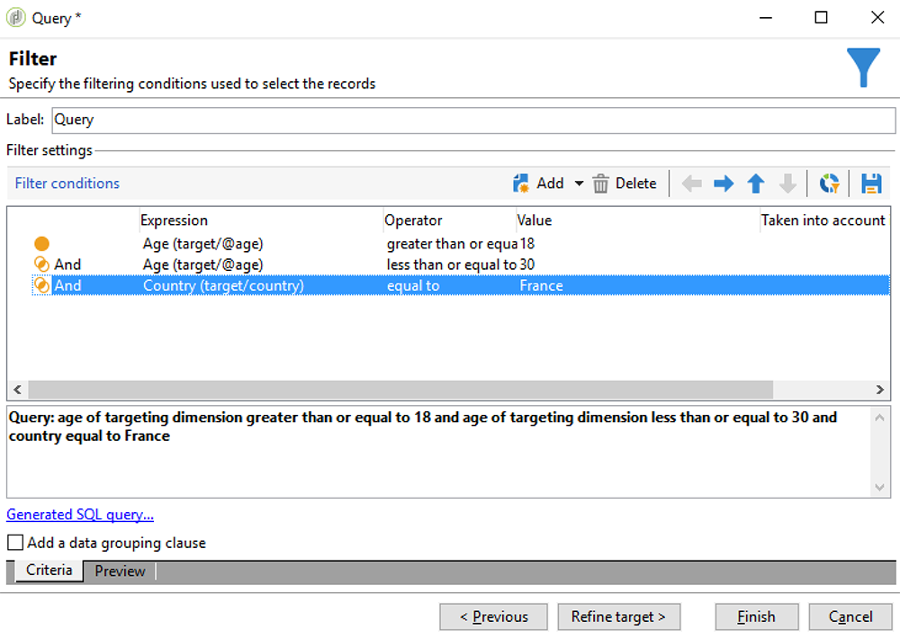

# Synkronisera målgrupper{#synchronizing-audiences}

Ni kan skapa en avancerad lista med de avancerade funktionerna i Campaign v7 och dela den som en målgrupp direkt och i realtid med Campaign Standard (inklusive ytterligare data) på ett smidigt sätt. Din Campaign Standard kan sedan konsumera publiken i Adobe Campaign Standard.

Komplex målinriktning med ytterligare data som inte replikeras i Campaign Standard kan bara uppnås med Campaign v7.

Du kan också dela listor med mottagare eller data som kommer via en anslutning som Microsoft Dynamics med Campaign Standard.

Det här användningsexemplet visar hur du förbereder målet för leveransen i Campaign v7 och hur du återanvänder målet och dess ytterligare data i en leverans som skapas och skickas med Adobe Campaign Standard.

>[!NOTE]
>
>Du kan också utöka data med aggregat och samlingar i Adobe Campaign Standard om alla data du behöver redan har replikerats.

## Förhandskrav {#prerequisites}

För att uppnå detta behöver du:

* Mottagare lagrade i Campaign v7-databasen och synkroniserade med Campaign Standard. Se [Synkronisera profiler](../../integrations/using/synchronizing-profiles.md) -avsnitt.
* Ytterligare data, som prenumerationer eller transaktioner, lagras i tabeller som är relaterade till nms:mottagare i Campaign v7-databasen. Dessa data kan komma från OOB-scheman i Campaign v7 eller anpassade tabeller. De är som standard inte tillgängliga i Campaign Standarden eftersom de inte är synkroniserade.
* Rätt att köra arbetsflöden i både Campaign v7 och Campaign Standard.
* Rätt att skapa och köra en leverans i Campaign Standard.

## Skapa ett arbetsflöde för målinriktning med ytterligare data i Campaign v7 {#create-a-targeting-workflow-with-additional-data-in-campaign-v7}

Komplex målinriktning med ytterligare data som inte replikeras i Campaign Standard kan bara uppnås med Campaign v7.

När målet och dess ytterligare data har definierats kan du spara det som en lista som kan delas med Campaign Standard.

>[!NOTE]
>
>Detta är ett exempel. Beroende på dina behov kan du enkelt ställa frågor till en lista över mottagare och dela den med ACS utan vidare bearbetning. Du kan också använda andra datahanteringsaktiviteter för att förbereda det slutliga målet.

Så här får du den slutliga målgruppen och dess ytterligare data:

1. Skapa ett nytt arbetsflöde från **[!UICONTROL Profiles and Targets]** > **[!UICONTROL Jobs]** > **[!UICONTROL Targeting workflows]**.
1. Lägg till en **[!UICONTROL Query]** och välj de mottagare som du vill skicka det slutliga e-postmeddelandet till. Exempel: alla mottagare mellan 18 och 30 år och bor i Frankrike.

   

1. Lägg till ytterligare data från frågan. Mer information finns i [Lägga till data](../../workflow/using/query.md#adding-data) -avsnitt.

   I det här exemplet visas hur du lägger till en mängd för att räkna antalet leveranser som en mottagare har fått under ett år.

   I **[!UICONTROL Query]**, markera **[!UICONTROL Add data...]**.

   

1. Markera **[!UICONTROL Data linked to the filtering dimension]** och klicka på **[!UICONTROL Next]**.

   

1. Välj **[!UICONTROL Data linked to the filtering dimension]** och sedan väljer **[!UICONTROL Recipient delivery logs]** nod och klicka **[!UICONTROL Next]**.

   

1. Välj **[!UICONTROL Aggregates]** i **[!UICONTROL Data collected]** fält och klicka **[!UICONTROL Next]**.

   

1. Lägg till ett filtreringsvillkor om du bara vill ta hänsyn till loggar som skapats under de senaste 365 dagarna och klicka på **[!UICONTROL Next]**.

   

1. Definiera utdatakolumner. Här är den enda kolumn som behövs en som räknar antalet leveranser. Så här gör du:

   * Välj **[!UICONTROL Add]** till höger om fönstret.
   * Från **[!UICONTROL Select field]** fönster, klicka **[!UICONTROL Advanced selection]**.
   * Välj **[!UICONTROL Aggregate]** sedan **[!UICONTROL Count]**. Kontrollera **[!UICONTROL Distinct]** och klicka **[!UICONTROL Next]**.
   * I listan med fält väljer du det fält som används för **Antal** funktion. Välj ett fält som alltid ska fyllas i, till exempel **[!UICONTROL Primary key]** och klicka **[!UICONTROL Finish]**.
   * Ändra uttrycket i **[!UICONTROL Alias]** kolumn. Med det här aliaset kan du enkelt hämta den nya kolumnen i den slutliga leveransen. Till exempel **NBdeliver**.
   * Klicka **[!UICONTROL Finish]** och spara **[!UICONTROL Query]** aktivitetskonfiguration.

   

1. Spara arbetsflödet. I nästa avsnitt visas hur du delar populationen med ACS.

## Dela målet med Campaign Standard {#share-the-target-with-campaign-standard}

När målpopulationen har definierats kan du dela den med ACS via en **[!UICONTROL List update]** aktivitet.

1. Lägg till en **[!UICONTROL List update]** och ange den lista som du vill uppdatera eller skapa.

   Ange i vilken mapp du vill spara listan i Campaign v7. Listor omfattas av mappmappmappningen som definieras under implementeringen, vilket kan påverka deras synlighet när de delas i Campaign Standard. Se [Rättighetskonvertering](../../integrations/using/acs-connector-principles-and-data-cycle.md#rights-conversion) -avsnitt.

1. Se till att **[!UICONTROL Share with ACS]** alternativet är markerat. Den är markerad som standard.

   

1. Spara och kör arbetsflödet.

   Målet och dess ytterligare data sparas i en lista i Campaign v7 och delas omedelbart som en listmålgrupp i Campaign Standard. Endast de profiler som har replikerats delas med ACS.

Om ett fel inträffar på **[!UICONTROL List update]** -aktiviteten, vilket innebär att synkroniseringen med Campaign Standarden kan ha misslyckats. Om du vill se mer information om vad som gick fel går du till **[!UICONTROL Administration]** > **[!UICONTROL ACS Connector]** > **[!UICONTROL Process]** > **[!UICONTROL Diagnosis]**. Den här mappen innehåller synkroniseringsarbetsflöden som utlöses av **[!UICONTROL List update]** aktivitetskörning. Se [Felsöka ACS Connector](../../integrations/using/troubleshooting-the-acs-connector.md) -avsnitt.

## Hämta data i Campaign Standard och använd dem i en leverans {#retrieve-the-data-in-campaign-standard-and-use-it-in-a-delivery}

När målarbetsflödet körs i Campaign v7 kan du hitta målgruppen i skrivskyddat läge från **[!UICONTROL Audiences]** Campaign Standardens meny.

Genom att skapa ett leveransarbetsflöde i Campaign Standard är det sedan möjligt att använda den här målgruppen samt de ytterligare data som den innehåller i en leverans.

1. Skapa ett nytt arbetsflöde från **[!UICONTROL Marketing activities]** -menyn.
1. Lägg till en **[!UICONTROL Read audience]** och välj den målgrupp du tidigare delat från Campaign v7.

   Den här aktiviteten används för att hämta data för den valda målgruppen. Du kan också lägga till ytterligare **[!UICONTROL Source Filtering]** vid behov med hjälp av aktivitetens flik enligt.

1. Lägg till en **[!UICONTROL Email delivery]** -aktivitet och konfigurera den som andra [e-postleveransaktivitet](https://experienceleague.adobe.com/docs/campaign-standard/using/managing-processes-and-data/channel-activities/email-delivery.html).
1. Öppna leveransinnehållet.
1. Lägg till ett personaliseringsfält.  Leta upp **[!UICONTROL Additional data (targetData)]** nod. Den här noden innehåller ytterligare data om målgruppen som beräknades i det inledande målarbetsflödet. Du kan använda dem som vilket annat personaliseringsfält som helst.

   I det här exemplet är de ytterligare data som kommer från det ursprungliga arbetsflödet för målinriktning antalet leveranser som skickats till varje mottagare under de senaste 365 dagarna. Det NBdeliver-alias som anges i målarbetsflödet visas här.

   

1. Spara leverans och arbetsflöde.

   Arbetsflödet är nu klart att köras. Leveransen analyseras och kan skickas.

   

## Skicka och övervaka leveransen {#send-and-monitor-your-delivery}

När leveransen och innehållet är klara skickar du leveransen:

1. Kör leveransarbetsflödet. I det här steget förbereds e-postmeddelandet för att skickas.
1. Bekräfta manuellt att leveransen kan skickas från kontrollpanelen för leverans.
1. Övervaka rapporter och loggar för leveransen:

   * **I Campaign Standard**: Åtkomst [rapporter](https://experienceleague.adobe.com/docs/campaign-standard/using/reporting/about-reporting/about-dynamic-reports.html) och [loggar](https://experienceleague.adobe.com/docs/campaign-standard/using/testing-and-sending/monitoring-messages/monitoring-a-delivery.html) för leveransen som för alla leveranser.
   * **i Campaign v7 och Campaign Standard**: Leverans-ID, breda e-postloggar och loggar för e-postspårning synkroniseras med Campaign v7. Sedan kan ni få en helhetsbild av era marknadsföringskampanjer från Campaign v7.

      Kvartalanger synkroniseras automatiskt tillbaka till Campaign v7. På så sätt kan information som inte kan levereras beaktas vid nästa målgruppsanpassning som utförs i Campaign v7.

      Mer information om karantänhantering finns i Campaign Standard i [det här avsnittet](https://experienceleague.adobe.com/docs/campaign-standard/using/testing-and-sending/monitoring-messages/understanding-quarantine-management.html?lang=en).
