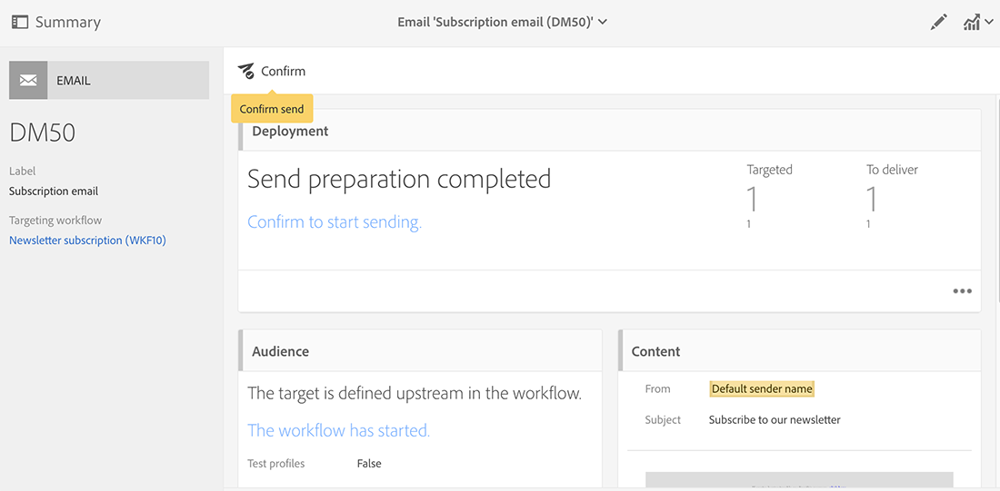
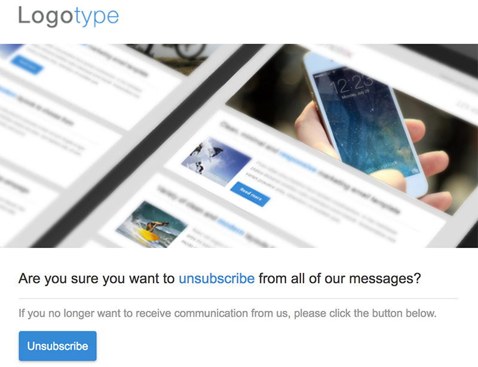

# Synkronisera profiler{#synchronizing-profiles}

ACS Connector replikerar data från Campaign v7 till Campaign Standard. Data som tas emot från Campaign v7 kan användas i Campaign Standard för att skapa leveranser. Du kan se hur profiler synkroniseras genom att utföra de åtgärder som listas nedan.

* **Lägg till nya mottagare**: Skapa en ny mottagare i Campaign v7 och bekräfta att en motsvarande profil har replikerats till Campaign Standard. Se [Skapa en ny mottagare](#creating-a-new-recipient).
* **Uppdatera mottagare**: Redigera en ny mottagare i Campaign v7 och visa motsvarande profil i Campaign Standard för att bekräfta att uppdateringen har replikerats. Se [Redigera en mottagare](#editing-a-recipient).
* **Bygg ett arbetsflöde i Campaign Standard**: Skapa ett arbetsflöde i Campaign Standard som innehåller en fråga med en eller flera målgrupper som replikerats från Campaign v7. Se [Skapa ett arbetsflöde](#creating-a-workflow).
* **Skapa en leverans i Campaign Standard**: Följ arbetsflödet för att slutföra leveransen. Se [Skapa en leverans](#creating-a-delivery).
* **Verifiera avprenumerationslänken**: Använd ett Campaign v7-webbprogram för att kontrollera att mottagarens val att avbryta prenumerationen på en tjänst skickas till Campaign v7-databasen. Alternativet att sluta ta emot tjänsten replikeras till Campaign Standard. Se [Ändra avprenumerationslänken](#changing-the-unsubscription-link).

## Förutsättningar {#prerequisites}

I följande avsnitt beskrivs hur ACS Connector hjälper dig att lägga till och redigera mottagare i Campaign v7 och sedan använda dem i en Campaign Standard-leverans. ACS Connector kräver följande:

* Mottagare i Campaign v7 har replikerats till Campaign Standard.
* Användarrättigheter för att köra arbetsflöden i både Campaign v7 och Campaign Standard.
* Användarrättigheter för att skapa och köra en leverans i Campaign Standard.

## Ändra avprenumerationslänken {#changing-the-unsubscription-link}

När en mottagare klickar på länken för att avbryta prenumerationen i ett e-postmeddelande som skickas av Campaign Standard uppdateras motsvarande profil i Campaign Standard. För att vara säker på att en replikerad profil innehåller en användares val att avbryta prenumerationen på en tjänst måste informationen skickas till Campaign v7 i stället för Campaign Standard. För att kunna utföra ändringen är den avbrutna prenumerationstjänsten kopplad till ett Campaign v7-webbprogram i stället för Campaign Standard.

>[!NOTE]
>
>Be din konsult konfigurera webbprogrammet för avprenumerationstjänsten innan du följer stegen nedan.

## Skapa en ny mottagare {#creating-a-new-recipient}

1. Skapa en ny mottagare i Campaign v7 för replikering till Campaign Standard. Ange så mycket information som möjligt, inklusive mottagarens efternamn, förnamn, e-postadress och postadress. Välj emellertid inte ett **[!UICONTROL Salutation]** eftersom det läggs till i nästa avsnitt, [Redigera en mottagare](#editing-a-recipient). Mer information finns i [Lägga till mottagare](../../platform/using/adding-profiles.md).

   

1. Bekräfta att den nya mottagaren har lagts till i Campaign Standard. När du granskar profilen bör du kontrollera att de data du angav i Campaign v7 också är tillgängliga i Campaign Standard. Mer information om var du hittar profiler i Campaign Standard finns i [Navigeringsgrunder](https://docs.adobe.com/content/help/en/campaign-standard/using/getting-started/discovering-the-interface/interface-description.html).

   

   Som standard är den periodiska replikeringen för ACS Connector en gång var 15:e minut. Mer information finns i [Datareplikering](../../integrations/using/acs-connector-principles-and-data-cycle.md#data-replication).

## Redigera en mottagare {#editing-a-recipient}

Stegen nedan för att ändra en enda datapunkt ger ett enkelt exempel på hur Campaign v7 blir huvuddatabasen för Campaign Standard när datareplikering används. Att ändra eller ta bort replikerade data i Campaign v7 har samma effekt på motsvarande data i Campaign Standard.

1. Välj den nya mottagaren i [Skapa en ny mottagare](#creating-a-new-recipient) och redigera mottagarens namn. Välj t.ex. en **[!UICONTROL Salutation]** för mottagaren (t.ex. herr eller fru). Mer information finns i [Redigera en profil](../../platform/using/editing-a-profile.md).

   

1. Bekräfta att mottagarens namn har uppdaterats i Campaign Standard. Mer information om var du hittar profiler i Campaign Standard finns i [Navigeringsgrunder](https://docs.adobe.com/content/help/en/campaign-standard/using/getting-started/discovering-the-interface/interface-description.html).

   

   Som standard är den periodiska replikeringen för ACS Connector en gång var 15:e minut. Mer information finns i [Datareplikering](../../integrations/using/acs-connector-principles-and-data-cycle.md#data-replication).

## Skapa ett arbetsflöde {#creating-a-workflow}

Profiler och tjänster som replikerats från Campaign v7 är tillgängliga för digitala marknadsförare så att de kan utnyttja de omfattande data som finns i Campaign Standard. Instruktionerna nedan visar hur du lägger till en fråga i ett Campaign Standard-arbetsflöde och sedan använder den med den replikerade databasen.

Mer information och fullständiga anvisningar om arbetsflöden i Campaign Standard finns i [Arbetsflöden](https://docs.adobe.com/content/help/en/campaign-standard/using/managing-processes-and-data/about-workflows-and-data-management/workflow-data-and-processes.html).

1. Gå till Campaign Standard och klicka **[!UICONTROL Marketing Activities]**.
1. Klicka **[!UICONTROL Create]** uppe till höger.
1. Klicka **[!UICONTROL Workflow]**.
1. Klicka **[!UICONTROL New workflow]** och **[!UICONTROL Next]**.
1. Ange ett namn för arbetsflödet i **[!UICONTROL Label]** fältet och ytterligare information om det behövs. Klicka **[!UICONTROL Next]**.
1. Dra ett **[!UICONTROL Targeting]** mål från vänster **[!UICONTROL Query]** till arbetsytan.

   

1. Dubbelklicka på **[!UICONTROL Query]** aktiviteten och välj en parameter som kan användas med den replikerade databasen. Du kan till exempel:

   * Dra **[!UICONTROL Profiles]** till arbetsytan. Använd den nedrullningsbara menyn för att välja **[!UICONTROL Is external resource]** att hitta profiler som replikerats från Campaign v7.
   * Dra andra frågeparametrar om du vill ange de replikerade profilerna som mål ytterligare.

## Skapa en leverans {#creating-a-delivery}

>[!NOTE]
>
>Instruktionerna för hur du skapar leveransen fortsätter arbetsflödet som påbörjats med [Skapa ett arbetsflöde](#creating-a-workflow).

Digitala marknadsförare kan utnyttja ett Campaign v7-webbprogram för att försäkra sig om att en mottagares val att avbryta prenumerationen på en tjänst skickas till Campaign v7-databasen. När mottagaren klickar på länken för att avbryta prenumerationen replikeras alternativet att sluta ta emot tjänsten från Campaign v7 till Campaign Standard. Mer information finns i [Ändra avprenumerationslänken](#changing-the-unsubscription-link).

Följ stegen nedan för att lägga till en e-postleverans i ett befintligt arbetsflöde med den tjänst för avprenumeration som skapades i Campaign v7. Mer information och fullständiga anvisningar om arbetsflöden i Campaign Standard finns i det här [dokumentet](https://docs.adobe.com/content/help/en/campaign-standard/using/managing-processes-and-data/about-workflows-and-data-management/workflow-data-and-processes.html).

>[!NOTE]
>
>Be din konsult konfigurera webbprogrammet för avprenumerationstjänsten innan du följer stegen nedan.

1. Klicka **[!UICONTROL Channels]** till vänster.
1. Dra **[!UICONTROL Email delivery]** till det befintliga arbetsflödet på arbetsytan.

   

1. Dubbelklicka på **[!UICONTROL Email delivery]** aktiviteten och välj **[!UICONTROL Single send email]** eller **[!UICONTROL Recurring email]**. Välj alternativ och klicka på **[!UICONTROL Next]**.
1. Klicka **[!UICONTROL Send via email]** och klicka **[!UICONTROL Next]**.

   

1. Ange ett namn för leveransen i **[!UICONTROL Label]** fältet och ytterligare information om det behövs. Klicka **[!UICONTROL Next]**.

   

1. I **[!UICONTROL Subject]** fältet anger du det ämne som ska visas i mottagarens e-postinkorg.
1. Klicka **[!UICONTROL Change content]** för att lägga till en HTML-mall.

   

1. Välj innehåll som innehåller länken för att avbryta prenumerationen på tjänsten. Klicka **[!UICONTROL Confirm]**.

   

1. Den aktuella länken för att avbryta prenumerationen måste ersättas av en ny som använder webbprogrammet som skapats av din konsult. Leta upp länken för att avbryta prenumerationen längst ned i e-postinnehållet och klicka en gång på den. Klicka på papperskorgsikonen för att ta bort länken.

   

1. Klicka i samma innehållsområde och skriv **Unsubscription link**.

   

1. Markera texten med markören och klicka på kedjeikonen.
1. Klicka **[!UICONTROL Link to a landing page]**.

   

1. Klicka på mappikonen för att välja landningssidan.

   

1. Välj webbprogrammet som skapats av konsulten och klicka på **[!UICONTROL Confirm]**.

   

1. Klicka **[!UICONTROL Create]**.
1. Återgå till arbetsflödet genom att klicka på leveransnamnet.

   

1. Klicka **[!UICONTROL Start]** för att skicka leveransen. Ikonen för e-postleverans blinkar för att visa att den förbereds för leverans.

   

1. Dubbelklicka på **[!UICONTROL Email delivery]** kanalen och välj **[!UICONTROL Confirm]** att skicka e-postmeddelandet. Klicka **[!UICONTROL OK]** för att skicka meddelandena.

   

## Verifiera avprenumerationstjänsten {#verifying-the-unsubscription-service}

Följ instruktionerna i [Skapa ett arbetsflöde](#creating-a-workflow) och [Skapa en leverans](#creating-a-delivery) innan du går vidare till stegen nedan.

1. Mottagaren klickar på länken för att avbryta prenumerationen i e-postleveransen.

   

1. Mottagaren bekräftar avbeställningen.

   

1. Mottagardata i Campaign v7 uppdateras för att återspegla att användaren har avbrutit prenumerationen. Bekräfta att rutan **[!UICONTROL No longer contact (by any channel)]** är markerad för mottagaren. Mer information om hur du visar en mottagare i Campaign v7 finns i [Redigera en profil](../../platform/using/editing-a-profile.md).

   

1. Gå till Campaign Standard och öppna profilinformationen för mottagaren. Bekräfta att en kryssruta visas bredvid **[!UICONTROL No longer contact (by any channel)]**. Mer information om var du hittar profiler i Campaign Standard finns i [Navigeringsgrunder](https://docs.adobe.com/content/help/en/campaign-standard/using/getting-started/discovering-the-interface/interface-description.html).

   

