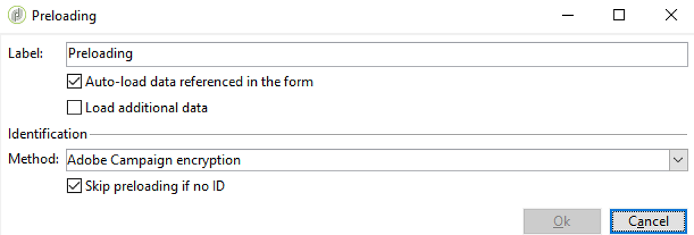
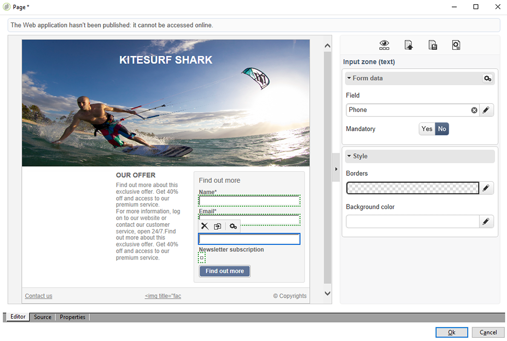
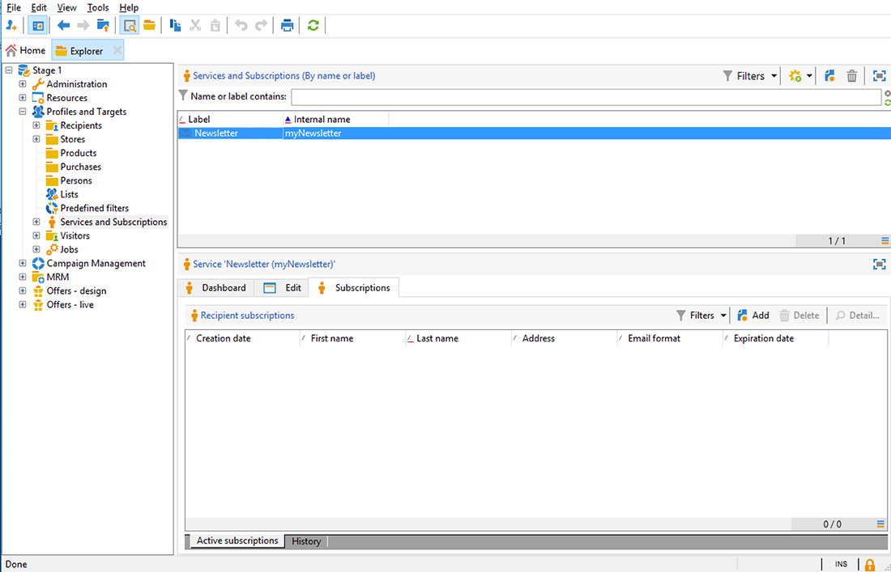

# Synkronisera webbprogram{#synchronizing-web-applications}

I det här fallet skickar vi ett meddelande, med Campaign Standard, som innehåller en länk till ett Campaign v7-webbprogram. När mottagaren klickar på länken i e-postmeddelandet visar webbprogrammet ett formulär som innehåller flera fält som är förinlästa med mottagarens data samt en prenumerationslänk till ett nyhetsbrev. Mottagaren kan uppdatera sina data och prenumerera på tjänsten. Hans profil uppdateras i Campaign v7 och informationen återges i Campaign Standard.

Om du har många tjänster och webbprogram i Campaign v7 kan du välja att inte återskapa dem alla i Campaign Standard. Med ACS Connector kan ni använda alla era befintliga webbprogram och tjänster i Campaign v7 och länka dem till en leverans som skickas av Campaign Standard.

## Förutsättningar {#prerequisites}

För att uppnå detta behöver du:

* Mottagare lagrade i Campaign v7-databasen och synkroniserade med Campaign Standard. Se avsnittet [Synkronisera profiler](../../integrations/using/synchronizing-profiles.md) .
* en tjänst och ett webbprogram som skapats och publicerats i Campaign v7.
* webbprogrammet måste innehålla en **[!UICONTROL Pre-loading]** aktivitet som använder **[!UICONTROL Adobe Campaign encryption]** identifieringsmetoden.

## Skapa webbprogrammet och tjänsten {#creating-the-web-application-and-service}

I Campaign v7 kan du skapa webbprogram där mottagarna kan prenumerera på en tjänst. Webbprogrammet och webbtjänsten är utformade och lagrade i Campaign v7 och du kan uppdatera den här tjänsten via en Campaign Standard-kommunikation. Mer information om webbprogram i Campaign v7 finns i [det här avsnittet](../../web/using/adding-fields-to-a-web-form.md#subscription-checkboxes).

I Campaign v7 har följande objekt skapats:

* en nyhetsbrevstjänst
* ett webbprogram som innehåller en **[!UICONTROL Pre-loading]**, en **[!UICONTROL Page]** och en **[!UICONTROL Storage]** aktivitet.

1. Gå till **[!UICONTROL Resources > Online > Web applications]** och välj ett befintligt webbprogram.

   

1. Redigera **[!UICONTROL Preloading]** aktiviteten. Kryssrutan är **[!UICONTROL Auto-load data referenced in the form]** markerad och **[!UICONTROL Adobe Campaign encryption]** identifieringsmetoden är markerad. Detta gör att webbprogrammet kan förhandsladda formulärfälten med data som lagras i Adobe Campaign-databasen. Se [det här dokumentet](../../web/using/publishing-a-web-form.md#pre-loading-the-form-data).

   

1. Redigera **[!UICONTROL Page]**. Tre fält (Namn, E-post och Telefon) har inkluderats, samt en kryssruta där mottagaren kan prenumerera på ett nyhetsbrev (**[!UICONTROL Newsletter]** tjänst).

   

1. Gå till **[!UICONTROL Profiles and Target > Services and subscriptions]** och öppna **[!UICONTROL Newsletter]** tjänsten. Det här är den tjänst som kommer att uppdateras från Campaign Standard-kommunikationen. Du kan se att ingen mottagare har prenumererat på den här tjänsten ännu.

   

1. Gå till **[!UICONTROL Profiles and Targets > Recipient]** och välj en mottagare. Ni kan se att han ännu inte har anmält sig till tjänsten.

   

## Replikera data {#replicating-the-data}

För att kunna replikera nödvändiga data mellan Campaign v7 och Campaign Standard finns flera arbetsflödesmallar för replikering tillgängliga. Arbetsflödet **[!UICONTROL Profiles replication]** replikerar automatiskt alla Campaign v7-mottagare till Campaign Standard. Se [Tekniska arbetsflöden och replikeringsarbetsflöden](../../integrations/using/acs-connector-principles-and-data-cycle.md#technical-and-replication-workflows). Arbetsflödet gör det möjligt att replikera de webbprogram som vi vill använda i Campaign Standard. **[!UICONTROL Landing pages replication]**

Följ de här stegen i Campaign Standard för att kontrollera att data har replikerats korrekt:

1. Klicka på på startskärmen **[!UICONTROL Customer profiles]**.

   

1. Sök efter Campaign v7-mottagaren och kontrollera att han/hon visas i Campaign Standard.

   

1. Klicka på det övre fältet **[!UICONTROL Marketing activities]** och sök efter webbprogrammet Campaign v7. Det visas som en landningssida i Campaign Standard.

   

1. Klicka på **[!UICONTROL Adobe Campaign]** logotypen i det övre vänstra hörnet, välj **Profiler och målgrupper > Tjänster** och kontrollera att nyhetsbrevstjänsten också finns där.

   

## Designa och skicka e-postmeddelanden {#designing-and-sending-the-email}

I den här delen får vi se hur vi kan inkludera en länk i ett e-postmeddelande om Campaign Standard till landningssidan som replikeras från en Campaign v7-webbapplikation.

Stegen för att skapa, utforma och skicka e-postmeddelanden är desamma som för klassiska e-postmeddelanden. Se dokumentationen för [Adobe Campaign Standard](https://helpx.adobe.com/support/campaign/standard.html) .

1. Skapa ett nytt e-postmeddelande och välj en eller flera replikerade profiler som målgrupp.
1. Redigera innehållet och infoga en **[!UICONTROL Link to a landing page]**.

   

1. Välj landningssidan som replikerades från webbprogrammet Campaign v7.

   

1. Förbered din e-post, skicka korrektur och skicka det slutliga e-postmeddelandet.
1. En av mottagarna öppnar e-postmeddelandet och klickar på länken till nyhetsbrevet.

   

1. Han lägger till ett telefonnummer och kontrollerar prenumerationsrutan för nyhetsbrevet.

   

## Hämtar uppdaterad information {#retrieving-the-updated-information}

När mottagaren uppdaterar sina data via webbprogrammet hämtar Adobe Campaign v7 synkront den uppdaterade informationen. Den replikeras sedan från Campaign v7 till Campaign Standard.

1. Gå till Campaign v7 **[!UICONTROL Profiles and Target > Services and subscriptions]** och öppna **[!UICONTROL Newsletter]** tjänsten. Du ser att mottagaren nu visas i prenumerationslistan.

   

1. Gå till **[!UICONTROL Profiles and Targets > Recipient]** och välj mottagare. Du ser att telefonnumret nu lagras.

   

1. På fliken **[!UICONTROL Subscriptions]** ser vi även att han har anmält sig till nyhetsbrevet.

   

1. Vänta några minuter tills arbetsflödet för profilreplikering körs.
1. I Campaign Standard kan du komma åt din mottagarprofil för att kontrollera att uppdaterade data har replikerats korrekt från Campaign v7.

   

1. Redigera profilen. Telefonnumret har uppdaterats.

   

1. Klicka på **[!UICONTROL Subscriptions]** fliken. Nyhetsbrevet visas nu.

   

