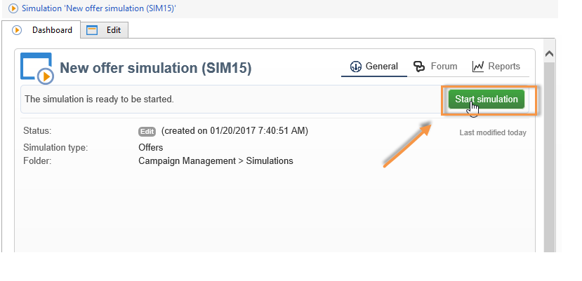

# Om erbjudandesimulering{#about-offers-simulation}

Med modulen **Simulering** kan du testa distributionen av erbjudanden som tillhör en kategori eller en miljö innan du skickar ditt förslag till mottagarna.

Simuleringen tar hänsyn till de kontexter och regler för behörighet som tidigare använts för erbjudanden (se [Översikt över](../../interaction/using/offer-catalog-overview.md)erbjudandekatalogen) samt deras presentationsregler (se [Hantera erbjudandepresentation](../../interaction/using/managing-offer-presentation.md)). Detta gör att ni kan testa och förfina olika versioner av ert erbjudande utan att faktiskt använda ett erbjudande eller över/under beställning av ett mål, eftersom simuleringen inte har någon effekt på de avsedda mottagarna.

Läs stegen nedan om du vill lära dig hur du simulerar ett erbjudande. Du kan också titta på den här [videon](https://helpx.adobe.com/campaign/classic/how-to/simulate-offer-in-acv6.html?playlist=/ccx/v1/collection/product/campaign/classic/segment/digital-marketers/explevel/intermediate/applaunch/introduction/collection.ccx.js&ref=helpx.adobe.com).

## Huvudsteg för att skapa en simulering {#main-steps-for-creating-a-simulation}

Så här kör du en simulering av dina erbjudanden:

1. Klicka på **[!UICONTROL Profiles and Targets]** länken i **[!UICONTROL Simulations]** universum och klicka sedan på **[!UICONTROL Create]** knappen.

   

1. Spara och redigera den simulering du just har skapat.
1. Gå till **[!UICONTROL Edit]** fliken och ange körningsinställningar.

   Mer information finns i [Körningsinställningar](../../interaction/using/execution-settings.md).

   

   >[!NOTE]
   >
   >Körningsinställningar är bara tillgängliga om du använder Interaktion med Campaign.

1. Ange simuleringsomfånget.

   Mer information finns i [Definition av omfånget](../../interaction/using/simulation-scope.md#definition-of-the-scope).

   

1. Lägg till rapportaxlar för att förbättra **[!UICONTROL Offer distribution by rank]** rapporten (valfritt).

   Mer information finns i [Lägga till rapportaxlar](../../interaction/using/simulation-scope.md#adding-reporting-axes).

   

1. Klicka **[!UICONTROL Save]** för att spela in simuleringsinställningarna.
1. Starta simuleringen via kontrollpanelen.

   

1. Kontrollera simuleringsresultatet och visa analysrapporten.

   Mer information finns i [Simuleringsspårning](../../interaction/using/simulation-tracking.md).

   
