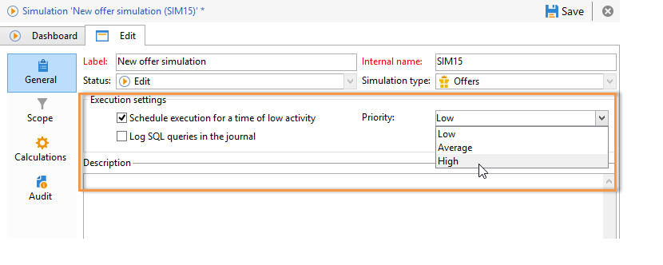

# Om att simulera erbjudanden{#about-offers-simulation}

The **Simulering** Med -modulen kan du testa fördelningen av erbjudanden som tillhör en kategori eller miljö innan du skickar ditt förslag till mottagarna.

Simuleringen tar hänsyn till kontexter och regler för behörighet som tidigare tillämpats på erbjudanden (se [Katalogöversikt](../../interaction/using/offer-catalog-overview.md)) och deras presentationsregler (se [Hantera presentation av erbjudanden](../../interaction/using/managing-offer-presentation.md)). Detta gör att ni kan testa och förfina olika versioner av ert erbjudande utan att faktiskt använda ett erbjudande eller över/under beställning av ett mål, eftersom simuleringen inte har någon effekt på de avsedda mottagarna.

Läs stegen nedan om du vill lära dig hur du simulerar ett erbjudande.

[ Du kan också titta på den här videon](https://helpx.adobe.com/campaign/classic/how-to/simulate-offer-in-acv6.html?playlist=/ccx/v1/collection/product/campaign/classic/segment/digital-marketers/explevel/intermediate/applaunch/introduction/collection.ccx.js&amp;ref=helpx.adobe.com).

## Huvudsteg för att skapa en simulering {#main-steps-for-creating-a-simulation}

Så här kör du en simulering av dina erbjudanden:

1. I **[!UICONTROL Profiles and Targets]** klickar du på **[!UICONTROL Simulations]** klicka på **[!UICONTROL Create]** -knappen.

   

1. Spara och redigera den simulering du just har skapat.
1. Gå till **[!UICONTROL Edit]** och ange körningsinställningar.

   Mer information finns i [Körningsinställningar](../../interaction/using/execution-settings.md).

   

   >[!NOTE]
   >
   >Körningsinställningar är bara tillgängliga om du använder Interaktion med Campaign.

1. Ange simuleringsomfånget.

   Mer information finns i [Definition av omfattningen](../../interaction/using/simulation-scope.md#definition-of-the-scope).

   

1. Lägg till rapporteringsaxlar för att förbättra **[!UICONTROL Offer distribution by rank]** rapport (valfri).

   Mer information finns i [Lägga till rapporteringsaxlar](../../interaction/using/simulation-scope.md#adding-reporting-axes).

   

1. Klicka **[!UICONTROL Save]** för att registrera simuleringsinställningarna.
1. Starta simuleringen via kontrollpanelen.

   

1. Kontrollera simuleringsresultatet och visa analysrapporten.

   Mer information finns i [Simuleringsspårning](../../interaction/using/simulation-tracking.md).

   
