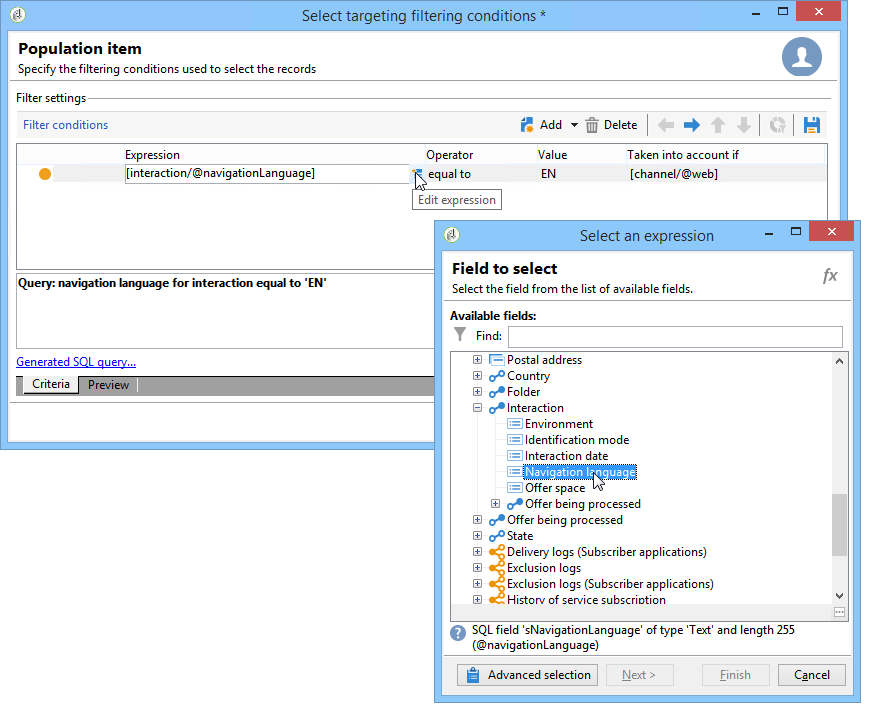

# Ytterligare data{#additional-data}

Under ett anrop till interaktionsmotorn kan du överföra sammanhangsberoende ytterligare information. Dessa data kan komma från måldata som lagras i arbetsflödets arbetstabell (utgående kanal) eller de anropsdata som skickas av webbplatsen under anropet (inkommande kanal). Du kan använda dessa ytterligare data i reglerna för behörighet, i personalisering av erbjudanden, och du kan även lagra dem i en förslagstabell.

För den inkommande kanalen kan det vara användbart att återställa information som webbläsarspråk för personer som konsulterar erbjudandet, eller namnet på callcenter-agenten, till exempel. Du kan sedan använda dessa samtalsdata i reglerna för behörighet för att visa ett erbjudande endast för dem som tittar på webbsidan på franska eller engelska.

I ett målarbetsflöde (utgående kanal) kan du använda måldata under ett anrop till motorn. Du kan till exempel utöka målet med data från en mottagarlänkad transaktion eller en extern databas via FDA.

## Ytterligare datakonfiguration {#additional-data-configuration}

Du måste utöka det **nms:interaction**-schema som är länkat till miljön och deklarera listan med ytterligare fält som ska användas under ett anrop till interaktionsmotorn. När du skapar berättiganderegeln eller anpassar ett erbjudande blir dessa fält tillgängliga från noden **Interaction** (se [Använda ytterligare data](#using-additional-data)).

För den inkommande kanalen måste du lägga till anropsdatafälten i noden **Interaction**.

```
<element label="Interactions" labelSingular="Interaction" name="interaction">
  <attribute label="Navigation language" name="navigationLanguage" type="string"/>
</element>
```

>[!NOTE]
>
>XML-samlingar stöds på den inkommande kanalen, men länkarna till andra scheman stöds inte.

För den utgående kanalen måste du lägga till ett **targetData**-element som innehåller ytterligare fält i **Interaction**-noden.

```
<element label="Interactions" labelSingular="Interaction" name="interaction">
  <element name="targetData">
    <attribute label="Date of last transaction" name="lastTransactionDate" type="datetime"/>
  </element>
</element>
```

>[!NOTE]
>
>Samlingar stöds inte för den utgående kanalen. Du kan dock skapa länkar till andra scheman.

Om du vill lagra dessa data i förslagstabellen måste du också utöka schemat **nms:propositionRcp** och deklarera dessa fält.

```
<element label="Recipient offer propositions" labelSingular="Recipient offer proposition" name="propositionRcp">
  <attribute label="Last transaction date" name="lastTransactionDate" type="datetime"/>
  <attribute label="Navigation language" name="navigationLanguage" type="string"/>
</element>
```

## Ytterligare dataimplementering {#additional-data-implementation}

### Indatakanal (webbsida) {#input-channel--web-page-}

Om du vill överföra ytterligare data när du anropar motorn måste du lägga till variabeln **interactionGlobalCtx** i webbsidans JavaScript-kod. Infoga noden **Interaction** som innehåller anropsdata i den här variabeln. Du måste respektera samma XML-struktur som finns i schemat **nms:interaction**. Se: [Ytterligare datakonfiguration](#additional-data-configuration).

```
interactionGlobalCtx = "<interaction navigationLanguage='"+myLanguage+"'/>";
```

### Utkanal {#output-channel}

Du måste skapa ett målarbetsflöde som läser in ytterligare data i arbetstabellen genom att respektera samma XML-struktur och samma interna namn som i schemat **nms:interaction**. Se: [Ytterligare datakonfiguration](#additional-data-configuration).

## Använda ytterligare data {#using-additional-data}

### Kvalifikationsregler {#eligibility-rules}

Du kan använda ytterligare data i reglerna för behörighet för erbjudanden, kategorier och vikter.

Du kan t.ex. välja att endast visa erbjudandet för personer som visar sidan på engelska.



>[!NOTE]
>
>Du måste begränsa regeln för de kanaler som data har definierats för. I vårt exempel begränsar vi regeln för den inkommande webbkanalen (**[!UICONTROL Taken into account if]** fält).

### Personalisering {#personalization}

Du kan också använda dessa ytterligare data när du personaliserar ett erbjudande. Du kan till exempel lägga till ett villkor för navigeringsspråket


>[!NOTE]
>
>Du måste begränsa personaliseringen för de kanaler som data definieras för. I vårt exempel begränsar vi regeln för den inkommande webbkanalen.

Om du har personaliserat ett erbjudande med ytterligare data visas dessa data inte som standard i förhandsgranskningen eftersom de inte är tillgängliga i databasen. På miljöns **[!UICONTROL Example of call data]**-flik måste du lägga till värdeexempel som ska användas i förhandsgranskningen. Respektera samma XML-struktur som finns i schematillägget **nms:interaction**. Mer information finns i [Ytterligare datakonfiguration](#additional-data-configuration).


När du förhandsgranskar klickar du på **[!UICONTROL Content personalization options for the preview]** och väljer ett värde i fältet **[!UICONTROL Call data]**.


### Lagring {#storage}

Under ett anrop till motorn kan du lagra ytterligare data i förslagstabellen för att utöka databasen. Dessa data kan användas, till exempel i rapporter, i ROI-beräkningar eller för senare processer.

>[!NOTE]
>
>Du måste ha utökat schemat **nms:propositionRcp** och deklarerat fälten som ska innehålla de data som ska lagras. Mer information: [Ytterligare datakonfiguration](#additional-data-configuration).

Gå till fliken **[!UICONTROL Storage]** i erbjudandeutrymmet och klicka på knappen **[!UICONTROL Add]**.

I kolumnen **[!UICONTROL Storage path]** markerar du lagringsfältet i förslagstabellen. I kolumnen **[!UICONTROL Expression]** markerar du det extra fältet i noden **[!UICONTROL Interaction]**.

Du kan hämta samtalsdata när förslaget genereras eller när det godkänns (när personen klickar på erbjudandet).


