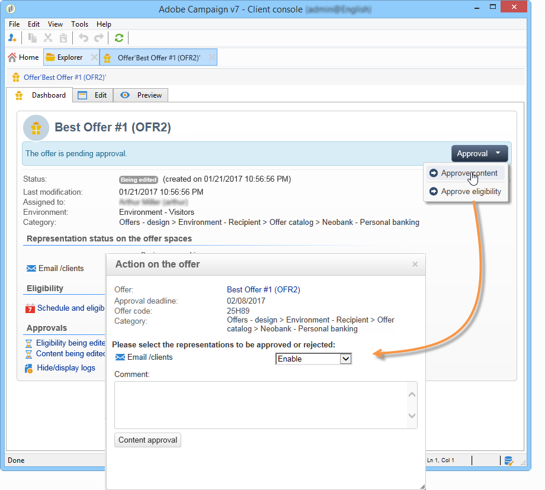

# Godkänna och aktivera ett erbjudande{#approving-and-activating-an-offer}

När innehållet i erbjudandet är klart måste du godkänna det för att det ska kunna dupliceras i den aktiva miljön och levereras. Godkännandet avser erbjudandeinnehållet och dess behörighet.

Banderollen på instrumentpanelen för erbjudanden anger om erbjudandet behöver gå igenom godkännandecykeln eller inte.

## Godkänna erbjudandeinnehåll {#approving-offer-content}

Att godkänna erbjudandeinnehåll innebär att välja den eller de representationer som du vill göra tillgängliga i den aktiva miljön.

Innehållet i ett erbjudande har en representation per space. Eftersom varje erbjudande har en egen struktur och sina egna återgivningsfunktioner kan erbjudanderepresentationen variera.

Du kan godkänna erbjudandeinnehållet på vissa tillgängliga platser och avvisa det på andra.

>[!CAUTION]
>
>När innehållet i och behörigheten för ett erbjudande har godkänts körs arbetsflödet för publicering (meddelande om erbjudande) automatiskt och erbjudandet görs tillgängligt på alla aktiverade platser.

Så här godkänner du erbjudandeinnehållet:

1. Klicka på **[!UICONTROL Approval]** knappen och välj **[!UICONTROL Approve content]** i popup-fönstret.

   

1. I listrutan väljer du de representationer du vill fortsätta redigera eller de du vill publicera i den aktiva miljön. Klicka sedan på **[!UICONTROL Content approval]**.

   

   När innehållet i erbjudandet har godkänts uppdateras informationen i tabellen för instrumentpanel för erbjudanden.

   

   >[!NOTE]
   >
   >Uppgiften **[!UICONTROL Content approved]** innebär inte att alla offertrepresentationer har aktiverats och godkänts. Det visar att processen för godkännande av innehåll har uppnåtts, oavsett om alla erbjudanden har aktiverats/godkänts eller inte.

## Godkänna anbudsberättigande {#approving-offer-eligibility}

Godkännande av berättigande för erbjudanden innebär att acceptera eller avvisa erbjudandevikter och att reglerna för behörighet också har konfigurerats i erbjudandet eller ärvts från reglerna som skapats i den överordnade kategorin.

>[!CAUTION]
>
>När innehållet i och behörigheten för ett erbjudande har godkänts körs arbetsflödet för publicering (meddelande om erbjudande) automatiskt och erbjudandet görs tillgängligt på alla aktiverade platser.

* Du kan visa den fullständiga listan med regler genom att klicka **[!UICONTROL Schedule and eligibility rules]**.

   

* Om du vill ändra reglerna för behörighet klickar du på **[!UICONTROL Reject]** och sedan på **[!UICONTROL Eligibility approval]**.

   

   De olika statusvärdena uppdateras på instrumentpanelen för erbjudanden.

   

* Klicka **[!UICONTROL Approve eligibility]** för att godkänna erbjudandet.

   

   Godkänn behörighet, lägg till en kommentar om det behövs och klicka sedan på **[!UICONTROL Eligibility approval]**.

   

   De olika statusvärdena uppdateras på instrumentpanelen för erbjudanden.

   

## Godkännandespårning {#approval-tracking}

Spårning av godkännande finns på kontrollpanelen för erbjudanden. Klicka **[!UICONTROL Hide/display logs]** för att komma åt den.

>[!NOTE]
>
>Spårning finns också på fliken **[!UICONTROL Audit]** i erbjudandet, med information om granskarnas kommentarer.

## Starta om godkännandet {#restart-the-approval}

När godkännandet har startats kan det startas om. Gör så här:

1. Klicka **[!UICONTROL Content approved]** på instrumentpanelen för erbjudandet.
1. I det **[!UICONTROL Edit]** fönster som visas väljer du det godkännande som ska startas om och klickar sedan på **[!UICONTROL Re-initialize approval to submit it again]**.
1. Bekräfta genom att klicka **[!UICONTROL Ok]**.

## Publicera erbjudandet {#publishing-the-offer}

När innehållet i och behörigheten för ett erbjudande har godkänts publiceras erbjudandet i ett arbetsflöde som automatiskt körs för varje erbjudande vars godkännandecykel har slutförts. Arbetsflödet körs också varje timme för att synkronisera (om det behövs) de utrymmen och kategorier som finns i erbjudandekatalogen, från designmiljön till den aktiva miljön. **[!UICONTROL Offer notification]**

Kontrollpanelen för det erbjudande som finns i designmiljön innehåller information om publicering, inklusive namnet på matchande erbjudande i livemiljön.

Klicka på erbjudandeetiketten för att visa erbjudandet som finns i den aktiva miljön: live-erbjudandet har en kontrollpanel som innehåller all relevant information.

## Inaktivera ett erbjudande {#disabling-an-offer}

När erbjudandet har godkänts kan du inaktivera det.

Om du vill göra det går du till instrumentpanelen för ett erbjudande online eller ett erbjudande som väntar på att bli online. Klicka sedan på **[!UICONTROL Disable offer]**.

Du kan även inaktivera en kategori direkt genom att gå till **[!UICONTROL Eligibility]** fliken och markera **[!UICONTROL Enabled]** rutan.

>[!NOTE]
>
>När ett erbjudande tas bort i en designmiljö inaktiveras det automatiskt i den länkade onlinemiljön. Efter en kvarhållningsperiod tas de inaktiverade erbjudandena bort från onlinemiljön.

