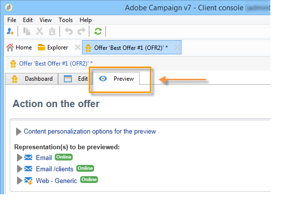

# Skapa ett erbjudande{#creating-an-offer}

## Skapa erbjudandet {#creating-the-offer}

Så här skapar du ett erbjudande:

1. Gå till fliken **[!UICONTROL Campaigns]** och klicka på länken **[!UICONTROL Offers]**.

   

1. Klicka på knappen **[!UICONTROL Create]**.

   

1. Ändra etiketten och välj den kategori som erbjudandet ska tillhöra.

   

1. Klicka på **[!UICONTROL Save]** för att skapa erbjudandet.

   

   Erbjudandet är tillgängligt på plattformen och dess innehåll kan konfigureras.

   

## Konfigurerar anbudsberättigande {#configuring-offer-eligibility}

På fliken **[!UICONTROL Eligibility]** definierar du den period som erbjudandet gäller för och kan visas, vilka filter som ska gälla för målet och erbjudandevikten.

### Definiera berättigandeperioden för ett erbjudande {#defining-the-eligibility-period-of-an-offer}

Använd listrutorna och välj ett start- och ett slutdatum i kalendern för att definiera berättigandeperioden för erbjudandet.


Utanför dessa datum kommer erbjudandet inte att väljas av interaktionsmotorn. Om du även har konfigurerat berättigandedatum för erbjudandekategorin gäller den mest restriktiva perioden.

### Filter på målet {#filters-on-the-target}

Du kan använda filter på erbjudandemålet.

Det gör du genom att klicka på länken **[!UICONTROL Edit query]** och välja det filter som du vill använda. (Se [det här avsnittet](../../platform/using/steps-to-create-a-query.md#step-4---filter-data)).


Om fördefinierade filter redan har skapats kan du välja dem i listan med användarfilter. Mer information finns i [Skapa fördefinierade filter](../../interaction/using/creating-predefined-filters.md).


### Erbjudandevikt {#offer-weight}

Om du vill att motorn ska kunna välja mellan flera erbjudanden som målet är kvalificerat för, måste du tilldela ett eller flera vikter till erbjudandet. Du kan också tillämpa filter på målet om det behövs eller begränsa det erbjudandeutrymme som vikten gäller för. Ett erbjudande med större vikt är att föredra framför ett erbjudande med mindre vikt.

Du kan konfigurera flera vikter för samma erbjudande, t.ex. för att skilja mellan delperioder, specifika mål eller till och med ett erbjudandeutrymme.

Ett erbjudande kan till exempel ha vikten A för kontakter mellan 18 och 25 år och vikten B för kontakter över detta intervall. Om ett erbjudande är giltigt hela sommaren kan det även ha A i juli och B i augusti.

>[!NOTE]
>
>Den tilldelade vikten kan ändras tillfälligt enligt parametrarna för den kategori som erbjudandet tillhör. Mer information finns i [Skapa erbjudandekategorier](../../interaction/using/creating-offer-categories.md).

Så här skapar du en vikt i ett erbjudande:

1. Klicka på **[!UICONTROL Add]**.

   

1. Ändra etiketten och tilldela en vikt. Som standard är det 1.

   

   >[!IMPORTANT]
   >
   >Om ingen vikt anges (0) anses målet inte vara berättigat till erbjudandet.

1. Om du vill att vikten ska gälla för en viss period definierar du datum för berättigande.

   

1. Begränsa vid behov vikten till ett visst erbjudandeutrymme.

   

1. Använd ett filter på ett mål.

   

1. Klicka på **[!UICONTROL OK]** för att spara vikten.

   

   >[!NOTE]
   >
   >Om ett mål kan få flera vikter för ett valt erbjudande behåller motorn den bästa (högsta) vikten. Vid anrop till erbjudandemotorn väljs ett erbjudande högst en gång per kontakt.

### Sammanfattning av regler för att välja erbjudande {#a-summary-of-offer-eligibility-rules}

När konfigurationen är klar finns en sammanfattning av berättigandereglerna på instrumentpanelen för erbjudanden.

Om du vill visa den klickar du på länken **[!UICONTROL Schedule and eligibility rules]**.


## Skapa erbjudandeinnehållet {#creating-the-offer-content}

1. Klicka på fliken **[!UICONTROL Edit]** och sedan på fliken **[!UICONTROL Content]**.

   

1. Fyll i de olika fälten i erbjudandeinnehållet.

   * **[!UICONTROL Title]** : Ange den titel som du vill ska visas i erbjudandet. Varning: detta avser inte erbjudandets etikett, som definieras på fliken **[!UICONTROL General]**.
   * **[!UICONTROL Destination URL]** : ange erbjudandets URL. För att behandlas på rätt sätt måste det börja med&quot;http://&quot; eller&quot;https://&quot;.
   * **[!UICONTROL Image URL]** : Ange en URL eller en åtkomstsökväg till bilden av erbjudandet.
   * **[!UICONTROL HTML content]** /  **[!UICONTROL Text content]** : Ange innehållet i erbjudandet på fliken som du vill ha. Om du vill generera spårning måste **[!UICONTROL HTML content]** bestå av HTML-element som kan omslutas av ett `<div>`-tytelement. Resultatet av ett `<table>`-element på HTML-sidan blir till exempel följande:

   ```
      <div> 
       <table>
        <tr>
         <th>Month</th>
         <th>Savings</th>   
        </tr>   
        <tr>    
         <td>January</td>
         <td>$100</td>   
        </tr> 
       </table> 
      </div>
   ```

   Definitionen av accepterings-URL:en visas i avsnittet [Konfigurera statusen när förslaget accepteras](../../interaction/using/creating-offer-spaces.md#configuring-the-status-when-the-proposition-is-accepted).

   

   Om du vill hitta de obligatoriska fälten så som de definierades under konfigurationen av erbjudandeutrymmet klickar du på länken **[!UICONTROL Content definitions]** för att visa listan. Mer information finns i [Skapa erbjudandemellanslag](../../interaction/using/creating-offer-spaces.md).

   

   I det här exemplet måste erbjudandet innehålla en titel, en bild, HTML-innehåll och en mål-URL.

## Förhandsgranska erbjudandet {#previewing-the-offer}

Så snart innehållet i erbjudandet har konfigurerats kan du förhandsgranska erbjudandet så som det kommer att visas för mottagaren. Så här gör du:

1. Klicka på fliken **[!UICONTROL Preview]**.

   

1. Välj den representation av erbjudandet som du vill visa.

   

1. Om du har personaliserat erbjudandeinnehållet väljer du erbjudandemålet för att visa personalisering.

   

## Skapa en hypotes om ett erbjudande {#creating-a-hypothesis-on-an-offer}

Du kan skapa hypoteser om dina erbjudanden. På så sätt kan du avgöra hur era erbjudanden påverkar de inköp som görs för den berörda produkten.

>[!NOTE]
>
>Dessa hypoteser utförs via Response Manager. Kontrollera licensavtalet.

Hypoeser som utförs på ett erbjudande refereras på fliken **[!UICONTROL Measure]**.

Skapa hypoteser beskrivs i [den här sidan](../../campaign/using/about-response-manager.md).


