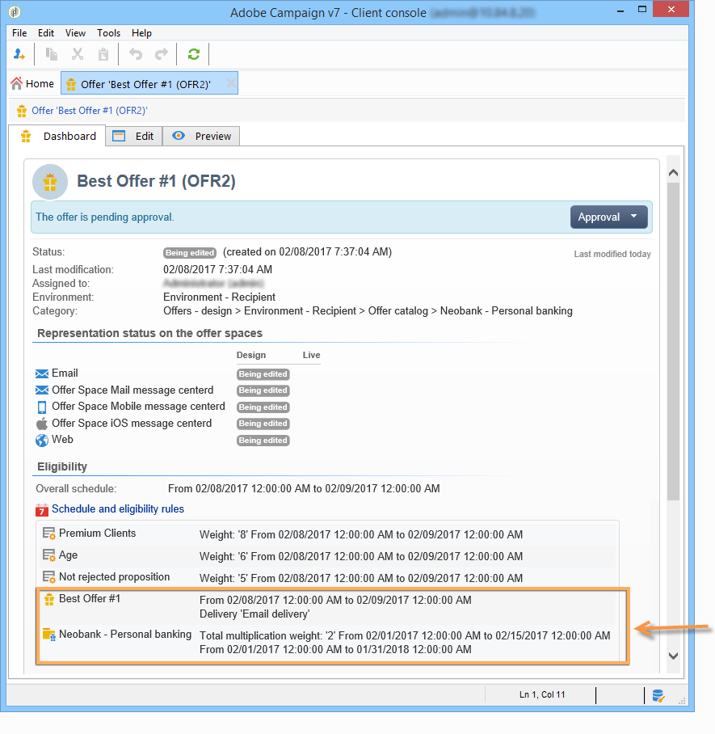

# Skapa erbjudandekategorier{#creating-offer-categories}

Det går endast att skapa erbjudandekategorier i **[!UICONTROL Design]**-miljön. De distribueras automatiskt i **[!UICONTROL Live]**-miljön (d.v.s. görs tillgänglig) när de erbjudanden som de innehåller har skapats/ändrats godkänns. Som standard innehåller **[!UICONTROL Design]**-miljön en kategori för att ta emot alla erbjudanden. Underkategorier kan skapas för att lägga till hierarki i katalogerbjudandena.

För varje kategori kan du definiera datum för behörighet, dvs. en period efter vilken erbjudandena i kategorin inte längre kan presenteras för deras mål. Om du vill att erbjudandena från en viss kategori ska väljas som en prioritet av erbjudandemotorn, ska visa en produkt bättre, till exempel, kan du öka deras vikt för en viss period genom att lägga till en multipliceringsvikt i kategorin.

Om du vill skapa ytterligare en kategori gör du så här:

1. Gå till mappen **[!UICONTROL Offer catalog]**.

   

1. Högerklicka och välj **[!UICONTROL Create a new "Offer category" folder]** i listrutan.

   

1. Ge kategorin ett nytt namn. Du kan redigera etiketten senare på fliken **[!UICONTROL General]**.

   

   >[!NOTE]
   >
   >Upprepa dessa steg om du vill skapa så många kategorier som behövs.

   Därefter kan du, efter behov,

   * Tilldela berättigandedatum från fliken **[!UICONTROL Eligibility]**.

      

   * Ange nyckelord som kan användas för att välja erbjudanden i den här kategorin med hjälp av fältet **[!UICONTROL Themes]**.

      

      >[!NOTE]
      >
      >När du anropar erbjudandemotorn väljs bara den del av katalogen där teman eller kategorierna matchar parametrarna.

   * Tillfälligt&quot;öka&quot; erbjudandevikten för en kategori för en viss period via fältet **[!UICONTROL Multiplier weight]**.

      

En sammanfattning av reglerna för behörighet finns på kontrollpanelen för de erbjudanden som ingår i kategorin. Om du vill visa dem klickar du på länken **[!UICONTROL Schedule and eligibility rules of the offer]**.

