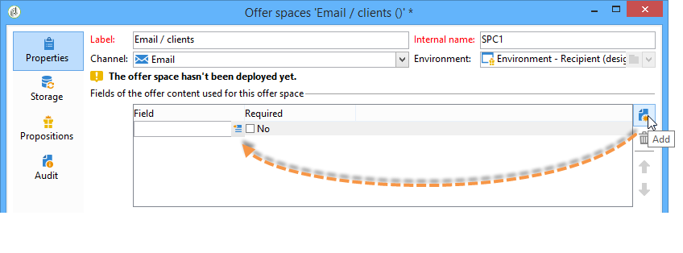

# Skapa erbjudandemellanslag{#creating-offer-spaces}


Skapande av erbjudandeutrymme får endast utföras av en **teknisk administratör** med tillgång till undermappen för erbjudandeutrymme. Utrymmen kan bara skapas i designmiljön och dupliceras automatiskt till den aktiva miljön när erbjudandet godkänns.

Innehållet i katalogerbjudandena konfigureras i erbjudandeutrymmena. Som standard kan innehållet innehålla följande fält: **[!UICONTROL Title]**, **[!UICONTROL Destination URL]**, **[!UICONTROL Image URL]**, **[!UICONTROL HTML content]** och **[!UICONTROL Text content]**. Fältsekvensen är konfigurerad i erbjudandeutrymmet.

Med avancerade parametrar kan du ange en kontaktidentifieringsnyckel (som kan bestå av olika element, till exempel namn- och e-postfältet, samtidigt). Mer information finns i avsnittet [Presentera ett identifierat erbjudande](../../interaction/using/integration-via-javascript-client-side.md#presenting-an-identified-offer).

Återgivningen av HTML eller XML skapas via en återgivningsfunktion. Sekvensen för fälten som definieras i återgivningsfunktionen måste vara identisk med sekvensen som konfigurerats i innehållet.


Gör så här för att skapa ett nytt erbjudande:

1. Gå till listan med erbjudanden och klicka på **[!UICONTROL New]**.

   

1. Markera den kanal som du vill använda och ändra etiketten för erbjudandeutrymmet.

   

1. Markera rutan **[!UICONTROL Enable unitary mode]** om något av följande gäller dig:

   * Du använder Interaktion med Message Center
   * Du använder Unikt läge för interaktion (inkommande interaktioner)

1. Gå till fönstret **[!UICONTROL Content field]** och klicka på **[!UICONTROL Add]**.

   

1. Gå till noden **[!UICONTROL Content]** och markera fälten i följande ordning: **[!UICONTROL Title]**, sedan **[!UICONTROL Image URL]**, sedan **[!UICONTROL HTML content]** och sedan **[!UICONTROL Destination URL]**.

   

1. Markera rutan **[!UICONTROL Required]** om du vill göra varje fält obligatoriskt.

   >[!NOTE]
   >
   >Den här konfigurationen används vid förhandsgranskningen och gör att erbjudanden blir ogiltiga vid publicering om något av de obligatoriska elementen saknas i erbjudandet. Om ett erbjudande redan finns på en plats i ett erbjudande beaktas dock inte dessa kriterier.

   

1. Klicka på **[!UICONTROL Edit functions]** för att skapa en återgivningsfunktion.

   Dessa funktioner används för att generera offertrepresentationer på ett visst erbjudandeutrymme. Det finns flera möjliga format: HTML eller text för utgående interaktioner och XML för inkommande interaktioner.

   

1. Gå till fliken **[!UICONTROL HTML rendering]** och välj **[!UICONTROL Overload the HTML rendering function]**.
1. Infoga återgivningsfunktionen.

   

Om det behövs kan du överlagra XML-återgivningsfunktionerna för inkommande interaktioner. Du kan också överlagra återgivningsfunktionerna HTML och text för utgående interaktioner. Mer information finns i [Om inkommande kanaler](../../interaction/using/about-inbound-channels.md).

## Erbjud förslagsstatus {#offer-proposition-statuses}

Ett erbjudande kan ha olika status beroende på interaktionen med målpopulationen. Interaktionen innehåller en uppsättning värden som kan tillämpas på erbjudandet under hela dess livscykel. Du måste dock konfigurera plattformen så att statusen ändras när offertförslaget skapas och godkänns.

>[!NOTE]
>
>Status för erbjudandeförslaget uppdateras inte omedelbart. Den utförs av spårningsarbetsflödet som aktiveras varje timme.

### Statuslista {#status-list}

Interaktionen innehåller följande värden som kan användas för att kvalificera status för ett erbjudande:

* **[!UICONTROL Accepted]**.
* **[!UICONTROL Scheduled]**.
* **[!UICONTROL Generated]**.
* **[!UICONTROL Interested]**.
* **[!UICONTROL Presented]**.
* **[!UICONTROL Rejected]**.

De här värdena används inte som standard: de måste konfigureras.

>[!NOTE]
>
>Status för ett erbjudande ändras automatiskt till Presenterat om erbjudandet är kopplat till en leverans med statusen Skickat.

### Konfigurera status när förslaget skapas {#configuring-the-status-when-the-proposition-is-created}

När ett erbjudande skapas av interaktionsmotorn ändras dess status, oavsett om det är en inkommande eller en utgående interaktion. Valet mellan dessa två värden beror på hur erbjudandeutrymmet konfigurerades i **[!UICONTROL Design]**-miljön

För varje space kan du konfigurera den status som du vill använda när ett förslag skapas, beroende på vilken information som ska visas i erbjudanderapporten.

Gör så här:

1. Gå till fliken **[!UICONTROL Storage]** för önskat utrymme.
1. Välj den status som du vill tillämpa på utkastet när det skapas.

   

### Konfigurera status när förslaget godkänns {#configuring-the-status-when-the-proposition-is-accepted}

När ett offertförslag har godkänts kan du använda ett av de värden som anges som standard för att konfigurera förslagets nya status. Uppdateringen gäller när en mottagare klickar på en länk i erbjudandet som anropar interaktionsmotorn.

Gör så här:

1. Gå till fliken **[!UICONTROL Storage]** för önskat utrymme.
1. Välj den status som du vill tillämpa på förslaget när det godkänns.

   

**Inkommande interaktion**

På fliken **[!UICONTROL Storage]** kan du bara definiera status för **föreslagen** och **accepterad** erbjudandeförslag. För inkommande interaktion ska status för erbjudandeförslag anges direkt i URL:en för anrop av erbjudandemotorn, i stället för via gränssnittet. På så sätt kan du ange vilken status som ska gälla i andra fall, t.ex. om ett erbjudande avvisas.

```
<BASE_URL>?a=UpdateStatus&p=<PRIMARY_KEY_OF_THE_PROPOSITION>&st=<NEW_STATUS_OF_THE_PROPOSITION>&r=<REDIRECT_URL>
```

Det erbjudande (identifierare **40004**) som matchar erbjudandet om **hemförsäkring** som visas på webbplatsen **Neobank** innehåller följande URL:

```
<BASE_URL>?a=UpdateStatus&p=<40004>&st=<3>&r=<"http://www.neobank.com/insurance/subscribe.html">
```

Så snart en besökare klickar på erbjudandet, och därmed URL:en, tillämpas statusen **[!UICONTROL Accepted]** (värdet **3**) på erbjudandet och besökaren omdirigeras till en ny sida på webbplatsen **Neobank** för att teckna försäkringsavtalet.

>[!NOTE]
>
>Om du vill ange en annan status på URL:en (till exempel om ett erbjudande avvisas) använder du värdet som motsvarar önskad status. Exempel: **[!UICONTROL Rejected]** = &quot;5&quot;, **[!UICONTROL Presented]** = &quot;1&quot; och så vidare.
>
>Statuser och deras värden kan hämtas i databasschemat **[!UICONTROL Offer propositions (nms)]**. Mer information finns på [den här sidan](../../configuration/using/data-schemas.md).

**Utgående interaktion**

Om det gäller en utgående interaktion kan du automatiskt tillämpa statusen **[!UICONTROL Interested]** på ett erbjudande när leveransen innehåller en länk. Lägg bara till värdet **_urlType=&quot;11&quot;** till länken:

```
<a _urlType="11" href="<DEST_URL>">Link inserted into the delivery</a>
```

## Förhandsgranska per utrymme {#offer-preview-per-space}

På den här fliken kan du visa de erbjudanden som mottagaren är berättigad till via en vald metod. I exemplet nedan är mottagaren berättigad till tre offertförslag via post.


Om en mottagare inte är berättigad till något erbjudande visas detta i förhandsgranskningen.


Förhandsvisningen kan ignorera kontexter när de är begränsade till ett mellanslag. Detta är fallet när interaktionsschemat har utökats för att lägga till fält som refereras i ett utrymme med en inkommande kanal (mer information finns i [Exempel på tillägg](../../interaction/using/extension-example.md)).
