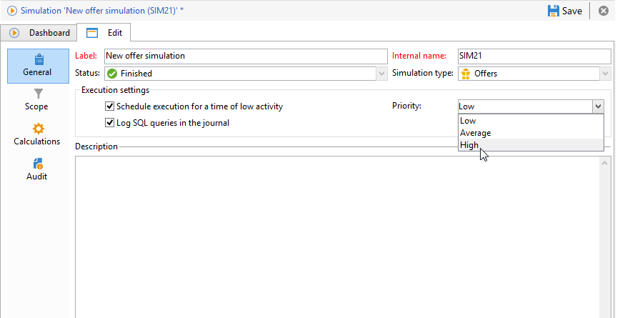

# Körningsinställningar{#execution-settings}

När du skapar en simulering kan du ange körningsinställningar om det behövs. Med de här inställningarna kan du köra simuleringen under en tid med låg aktivitet beroende på dess prioritet, eller spela in SQL-frågor i loggen. Det här steget är valfritt.

Dessa inställningar kan ändras senare på fliken **[!UICONTROL General]** i simuleringsfönstret.

* **[!UICONTROL Schedule execution for a time of low activity]** : Med kan du schemalägga simuleringen baserat på vald prioritet (Låg, Medel eller Hög) för att optimera Adobe Campaign prestanda.
* **[!UICONTROL Priority]** : detta är den nivå som används för simuleringen för att schemalägga den. När alternativet **[!UICONTROL Schedule execution for a time of low activity]** är markerat väljer kampanjbearbetningsarbetsflödet en tid med låg aktivitet för att starta kampanjen.
* **[!UICONTROL Log SQL queries in the journal]** : den här funktionen är endast avsedd för expertanvändare. Du kan lägga till en flik i loggen med SQL-frågor för att upptäcka eventuella felfunktioner om simuleringen avslutas med fel.

