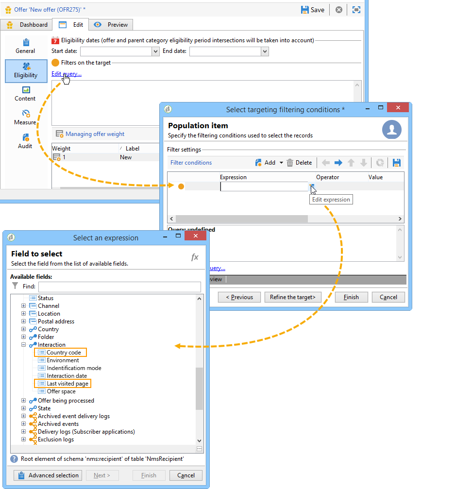

# Exempel på tillägg{#extension-example}

Vid inkommande kontakt (kundtjänst eller webbplats) föreslås de mest relevanta erbjudandena till en viss kontakt med hjälp av en uppsättning regler för behörighet. Utöka **nms:interaction** -schemat om du vill förbättra kriterierna för dina erbjudanden.

* Om du vill lägga till en ny interaktionskontext utökar du schemat **nms:interaction** och skapar så många **attributelement** som behövs i schemat.

   I följande exempel är de villkor som lagts till landskoden och den senast besökta sidan.

   

* Du kan sedan använda de attribut som tidigare skapats när du definierar definitionen av kriterierna.

   I följande exempel kan vi skapa behörighetskriterier för att visa ett erbjudande baserat på användarens land eller den senaste webbsidan som de visade.

   

* När du konfigurerar SOAP-anrop infogar du XML-elementet **context** i den kontextinformation som läggs till i interaktionsschemat. Mer information finns i [Integrering via SOAP (serversidan)](../../interaction/using/integration-via-soap--server-side-.md).

