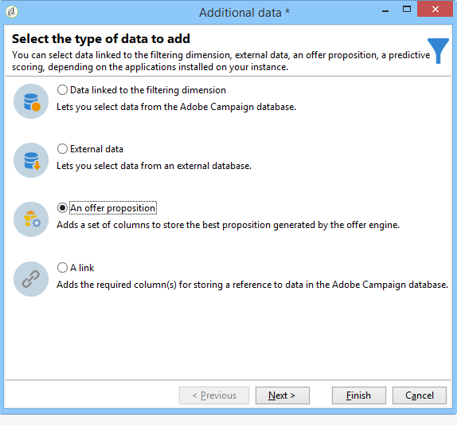

# Integrera ett erbjudande via ett arbetsflöde{#integrating-an-offer-via-a-workflow}

Förutom själva leveransaktiviteten kan du definiera hur erbjudandena presenteras i flera arbetsflödesaktiviteter:

* Leveransöversikt
* Berikning
* Erbjudandemotor
* Erbjudanden per cell

## Leveransöversikt {#delivery-outline}

Med aktiviteten för leveransdisposition, som är tillgänglig i kampanjarbetsflödena, kan du presentera erbjudanden som refereras i en leveransdisposition från den pågående kampanjen.

1. Lägg till en dispositionsaktivitet för leverans i ett arbetsflöde innan du lägger till en leveransaktivitet.
1. I dispositionsaktiviteten för leverans anger du den disposition du vill använda.

   Mer information om hur du anger leveransdispositioner finns i guiden [Campaign - MRM](../../campaign/using/marketing-campaign-deliveries.md#associating-and-structuring-resources-linked-via-a-delivery-outline) .

1. Fyll i de tillgängliga fälten efter leverans.
1. Det finns två möjliga fall:

   * Markera **[!UICONTROL Restrict the number of propositions selected]** rutan om du vill ringa erbjudandemotorn. Ange erbjudandeutrymme och antalet offerter som ska presenteras i leveransen.

      Anbudsvikterna och reglerna för rätt till uppgradering kommer att beaktas av erbjudandemotorn.

   * Om du inte markerar kryssrutan visas alla erbjudanden i leveransdispositionen utan att du behöver ringa till erbjudandemotorn.
   >[!NOTE]
   >
   >Förhandsgranskningen tar hänsyn till antalet erbjudanden som anges i leveransen. När du kör ett arbetsflöde är det numret som anges i leveransdispositionen som beaktas.

   

## Berikning {#enrichment}

Med anrikningsaktiviteten kan du lägga till erbjudanden eller länkar till erbjudanden för mottagare.

>[!NOTE]
>
>Mer information om anrikningsaktiviteten finns i den dedikerade dokumentationen i handboken [för](../../workflow/using/enrichment.md)arbetsflöden.

Du kan till exempel förbättra data för en mottagarfråga före en leverans.

Det finns två metoder för att ange erbjudandeförslag.

* Ange ett erbjudande eller ett erbjudande.
* Referera till en länk till ett erbjudande.

### Ange ett erbjudande eller ett samtal till erbjudandemotorn {#specifying-an-offer-or-a-call-to-the-offer-engine}

När du har konfigurerat frågan (se [arbetsflödesguiden](../../workflow/using/query.md)):

1. Lägg till och öppna en anrikningsaktivitet.
1. Välj på **[!UICONTROL Enrichment]** fliken **[!UICONTROL Add data]**.
1. Välj **[!UICONTROL An offer proposition]** de datatyper som ska läggas till.

   

1. Ange en identifierare och en etikett för det förslag som ska läggas till.
1. Ange erbjudandevalet. Det finns två möjliga alternativ:

   * **[!UICONTROL Search for the best offer in a category]** : Markera det här alternativet och ange parametrarna för att ringa in erbjudanden (erbjudandeplats, kategori eller tema, kontaktdatum, antal erbjudanden som ska behållas). Motorn beräknar automatiskt erbjudandena som ska läggas till enligt dessa parametrar. Vi rekommenderar att du fyller i antingen **[!UICONTROL Category]** eller **[!UICONTROL Theme]** fältet, i stället för båda samtidigt.

      

   * **[!UICONTROL A predefined offer]** : markera det här alternativet och ange ett erbjudandeutrymme, ett specifikt erbjudande och ett kontaktdatum för att direkt konfigurera det erbjudande du vill lägga till, utan att anropa erbjudandemotorn.

      

1. Konfigurera sedan en leveransaktivitet som motsvarar den valda kanalen. Mer information finns i [Infoga ett erbjudande i ett leveransavsnitt](../../interaction/using/integrating-an-offer-via-the-wizard.md#inserting-an-offer-proposition-into-a-delivery) .

   >[!NOTE]
   >
   >Antalet tillgängliga offerter för förhandsgranskningen beror på konfigurationen som utförs i anrikningsaktiviteten snarare än eventuell konfiguration som utförs direkt i leveransen.

### Referera till en länk till ett erbjudande {#referencing-a-link-to-an-offer}

Du kan även referera till en länk till ett erbjudande i en anrikningsaktivitet.

Gör så här:

1. Välj **[!UICONTROL Add data]** på aktivitetens **[!UICONTROL Enrichment]** flik.
1. I fönstret där du väljer vilken typ av data som ska läggas till väljer du **[!UICONTROL A link]**.
1. Välj den typ av länk som du vill etablera samt dess mål. I det här fallet är målet erbjudandeschemat.

   

1. Ange kopplingen mellan inkommande tabelldata i anrikningsaktiviteten (här mottagartabellen) och erbjudandetabellen. Du kan till exempel länka en erbjudandekod till en mottagare.

   

1. Konfigurera sedan en leveransaktivitet som motsvarar den valda kanalen. Mer information finns i [Infoga ett erbjudande i ett leveransavsnitt](../../interaction/using/integrating-an-offer-via-the-wizard.md#inserting-an-offer-proposition-into-a-delivery) .

   >[!NOTE]
   >
   >Antalet tillgängliga offerter för förhandsgranskningen beror på konfigurationen som utförs i leveransen.

### Rankning och vikter för erbjudanden {#storing-offer-rankings-and-weights}

När en **anrikningsaktivitet** används för att leverera erbjudanden lagras deras rankningar och deras vikter som standard inte i förslagstabellen.

>[!NOTE]
>
>Kom ihåg: Den här informationen lagras som standard i aktiviteten **[!UICONTROL Offer engine]** .

Du kan dock lagra den här informationen på följande sätt:

1. Skapa ett anrop till erbjudandemotorn i en anrikningsaktivitet som placerats efter en fråga och före en leveransaktivitet. Se [Specificera ett erbjudande eller ett samtal till](../../interaction/using/integrating-an-offer-via-a-workflow.md#specifying-an-offer-or-a-call-to-the-offer-engine) erbjudandemotorsektionen.
1. Välj **[!UICONTROL Edit additional data...]** i aktivitetens huvudfönster.

   

1. Lägg till **[!UICONTROL @rank]** kolumnerna för rankningen och **[!UICONTROL @weight]** för offertvikten.

   

1. Bekräfta tillägget och spara arbetsflödet.

Leveransen lagrar automatiskt rangordningen och vikten av erbjudandena. Den här informationen visas på leveransfliken **[!UICONTROL Offers]** .

## Erbjudandemotor {#offer-engine}

Med den här **[!UICONTROL Offer engine]** aktiviteten kan du även ange ett anrop till erbjudandemotorn före leveransen.

Denna aktivitet fungerar enligt samma princip som anrikningsaktiviteten med ett motoranrop genom att anrika den inkommande populationsinformationen med ett erbjudande som beräknas av motorn, före leverans.

När du har konfigurerat frågan (se [arbetsflödesguiden](../../workflow/using/query.md)):

1. Lägg till och öppna en **[!UICONTROL Offer engine]** aktivitet.
1. Fyll i de olika tillgängliga fälten för att ange anrop till motoriska parametrar (erbjudandeutrymme, kategori eller tema, kontaktdatum, antal erbjudanden som ska behållas). Motorn beräknar automatiskt erbjudandena som ska läggas till enligt dessa parametrar.

   >[!NOTE]
   >
   >Varning: Om du använder den här aktiviteten lagras endast de erbjudandeförslag som används i leveransen.

   

1. Konfigurera sedan en leveransaktivitet som motsvarar den valda kanalen. Mer information finns i [Infoga ett erbjudande i ett leveransavsnitt](../../interaction/using/integrating-an-offer-via-the-wizard.md#inserting-an-offer-proposition-into-a-delivery) .

## Erbjudanden per cell {#offers-by-cell}

Med den här **[!UICONTROL Offers by cell]** aktiviteten kan du distribuera den inkommande populationen (till exempel från en fråga) till flera segment och ange ett erbjudande som ska visas för vart och ett av dessa segment.

Gör så här:

1. Lägg till **[!UICONTROL Offers by cell]** aktiviteten när du har angett målpopulationen och öppna den.
1. Välj det erbjudandeutrymme som du vill visa erbjudandena på på fliken **[!UICONTROL General]** .
1. På **[!UICONTROL Cells]** fliken anger du de olika deluppsättningarna med **[!UICONTROL Add]** knappen:

   * Ange delmängdsfyllningen med de tillgängliga filtrerings- och begränsningsreglerna.
   * Välj sedan det erbjudande som du vill presentera för undergruppen. De erbjudanden som är tillgängliga är sådana som är berättigade i den erbjudandemiljö som valdes i föregående steg.

      

1. Konfigurera sedan en leveransaktivitet som motsvarar den valda kanalen. Mer information finns i [Infoga ett erbjudande i ett leveransavsnitt](../../interaction/using/integrating-an-offer-via-the-wizard.md#inserting-an-offer-proposition-into-a-delivery) .

