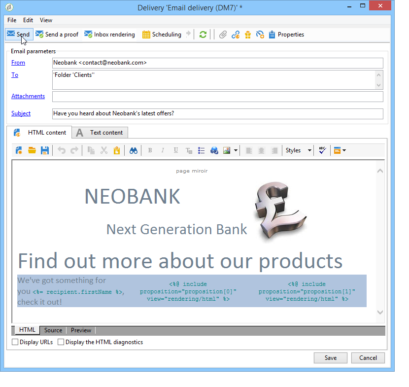

# Integrera ett erbjudande via guiden{#integrating-an-offer-via-the-wizard}

När du skapar en leverans finns det två möjliga metoder för att integrera erbjudanden:

* Anropa erbjudandemotorn i en leverans.
* Referera till erbjudanden via kampanjens leveranskonturer. Den här metoden används vanligtvis för papperskampanjer.

## Leverera med ett samtal till erbjudandemotorn {#delivering-with-a-call-to-the-offer-engine}

Om du vill presentera ett erbjudande under en marknadsföringskampanj skapar du bara en klassisk leveransåtgärd utifrån den valda kanalen. Erbjudandemotorn anropas när leveransinnehållet definieras genom att klicka på **[!UICONTROL Offers]** som finns i verktygsfältet.

Läs mer om direktreklam [i det här avsnittet](../../delivery/using/about-direct-mail-channel.md). Läs mer om marknadsföringskampanjer [i det här avsnittet](../../campaign/using/setting-up-marketing-campaigns.md).

### De viktigaste stegen för att infoga ett erbjudande i en leverans {#main-steps-for-inserting-an-offer-into-a-delivery}

Så här infogar du offertförslag i en leverans:

1. Klicka på ikonen Erbjudanden i leveransfönstret.

   

1. Välj det utrymme som passar er erbjudandemiljö.

   

1. Om du vill förfina motorns urval av erbjudanden väljer du antingen den kategori från vilken erbjudandena som ska presenteras är en del av, eller ett eller flera teman. Vi rekommenderar att du bara använder ett av dessa fält i taget för att undvika att överbelasta begränsningarna.

   

   

1. Ange antalet erbjudanden som du vill infoga i leveransbrödtexten.

   

1. Välj **[!UICONTROL Exclude non-eligible recipients]** vid behov. Mer information finns i [Parametrar för anrop av erbjudandemotor](#parameters-for-calling-offer-engine).

   

1. Om det behövs väljer du **[!UICONTROL Do not display anything if no offers are selected]** alternativ. Mer information finns i [Parametrar för anrop av erbjudandemotor](#parameters-for-calling-offer-engine).

   

1. Infoga egenskaperna i leveransinnehållet med hjälp av kopplingsfälten. Antalet tillgängliga offerter beror på hur motoranropet är konfigurerat och deras ordning beror på erbjudandenas prioritet.

   

1. Slutför innehållet och skicka leveransen som vanligt.

   

### Parametrar för anrop av erbjudandemotor {#parameters-for-calling-offer-engine}

* **[!UICONTROL Space]** : utrymme för den erbjudandemiljö som måste väljas för att aktivera erbjudandemotorn.
* **[!UICONTROL Category]** : den mapp där erbjudandena sorteras. Om ingen kategori anges kommer alla erbjudanden i miljön att beaktas av erbjudandemotorn, såvida inte ett tema väljs.
* **[!UICONTROL Themes]** : nyckelord som definieras uppströms i kategorierna. Dessa fungerar som ett filter och låter dig förfina antalet erbjudanden som ska presenteras genom att välja dem i en uppsättning kategorier.
* **[!UICONTROL Number of propositions]** : antal erbjudanden som returneras av motorn och som kan infogas i leveransenheten. Om de inte infogas i meddelandet kommer erbjudandena fortfarande att genereras, men de visas inte.
* **[!UICONTROL Exclude non-eligible recipients]** : Med det här alternativet kan du aktivera eller inaktivera exkludering av mottagare för vilka det inte finns tillräckligt med giltiga erbjudanden. Antalet giltiga förslag kan vara lägre än det begärda antalet. Om den här rutan är markerad kommer mottagare som inte har tillräckligt med erbjudanden att uteslutas från leveransen. Om du inte markerar det här alternativet kommer dessa mottagare inte att uteslutas, men de kommer inte att ha det begärda antalet förslag.
* **[!UICONTROL Do not display anything if no offer is selected]** : det här alternativet låter dig välja hur meddelandet ska behandlas om något av förslagen inte finns. När den här rutan är markerad visas inte representationen av det saknade förslaget och inget innehåll visas i meddelandet för det här förslaget. Om rutan inte är markerad avbryts själva meddelandet när det skickas och mottagarna får inte längre några meddelanden.

### Infoga ett offertförslag i en leverans {#inserting-an-offer-proposition-into-a-delivery}

Representationen av de erbjudanden som ska presenteras infogas i leveransinnehållet via kopplingsfälten. Antalet offerter definieras i parametrarna för anropet till erbjudandemotorn.

Leveransen kan anpassas med hjälp av erbjudandets fält eller, om det är ett e-postmeddelande, med återgivningsfunktionerna.

## Leverera med leveranskonturer {#delivering-with-delivery-outlines}

Du kan också presentera erbjudanden i en leverans med hjälp av leveranskonturer.

Mer information om leveransdispositioner finns i [Campaign - MRM](../../campaign/using/marketing-campaign-deliveries.md#associating-and-structuring-resources-linked-via-a-delivery-outline) guide.

1. Skapa en ny kampanj eller få tillgång till en befintlig kampanj.
1. Få åtkomst till leveransdispositionerna via kampanjens **[!UICONTROL Edit]** > **[!UICONTROL Documents]** -fliken.
1. Lägg till en disposition och infoga så många erbjudanden du vill i den genom att högerklicka på dispositionen och markera **[!UICONTROL New]** > **[!UICONTROL Offer]** och spara sedan kampanjen.

   

1. Skapa en leverans vars leveranskonturer du har tillgång till (t.ex. en direktleverans).
1. När du redigerar leveransen klickar du **[!UICONTROL Select a delivery outline]**.

   >[!NOTE]
   >
   >Beroende på typ av leverans finns det här alternativet i **[!UICONTROL Properties]** > **[!UICONTROL Advanced]** meny (för e-postleveranser till exempel).

   

1. Använda **[!UICONTROL Offers]** kan du sedan konfigurera erbjudandeutrymmet och antalet erbjudanden som ska visas i leveransen.

   

1. Lägg till offerterna i leveransbrödtexten med hjälp av anpassningsfälten (mer information finns i [Infoga ett offertförslag i en leverans](#inserting-an-offer-proposition-into-a-delivery) eller vid direktutskick genom att redigera extraheringsfilens format.

   Propositioner väljs ut bland de erbjudanden som refereras i leveransdispositionen.

   >[!NOTE]
   >
   >Information om rangordningarna och vikterna sparas endast i förslagstabellen om erbjudandena genereras direkt i leveransen.
