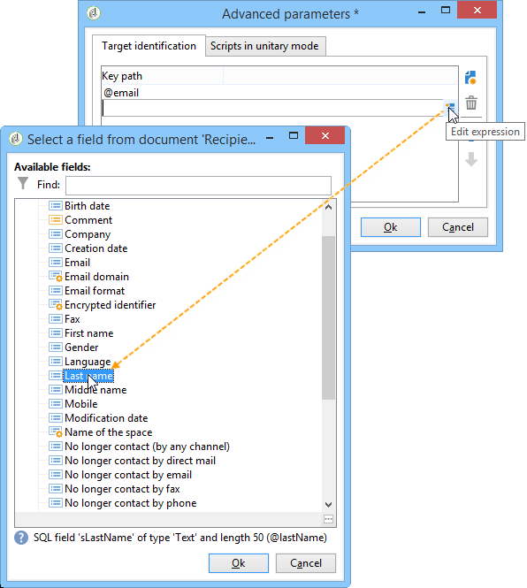

# Integrering via JavaScript (klientsida){#integration-via-javascript-client-side}


Om du vill anropa interaktionsmotorn på en webbsida infogar du ett anrop till en JavaScript-kod direkt på sidan. Det här anropet returnerar erbjudandeinnehållet i en riktad

-element.

Adobe rekommenderar att du använder JavaScript-integreringsmetoden.

Skriptet som anropar URL ser ut så här:

```
<script id="interactionProposalScript" src="https://<SERVER_URL>/nl/interactionProposal.js?env=" type="text/javascript"></script>
```

The &quot;**env**&quot;-parametern får det interna namnet på den livemiljö som är dedikerad till anonyma interaktioner.

För att kunna presentera ett erbjudande måste vi skapa en miljö och ett erbjudandeutrymme i Adobe Campaign och sedan konfigurera HTML-sidan.

I följande exempel beskrivs de möjliga alternativen för att integrera erbjudanden via JavaScript.

## HTML, läge {#html-mode}

### Presentera ett anonymt erbjudande {#presenting-an-anonymous-offer}

1. **Förbereda interaktionsmotorn**

   Öppna Adobe Campaign gränssnitt och förbered en anonym miljö.

   Skapa ett erbjudandeutrymme som är länkat till den anonyma miljön.

   Skapa ett erbjudande och dess representation länkad till erbjudandeutrymmet.

1. **HTML sidans innehåll**

   Sidan HTML måste innehålla en

   element med ett @id-attribut med värdet för det interna namnet på erbjudandeutrymmet (&quot;i_internal name space&quot;). Erbjudandet kommer att infogas i detta element av Interaction.

   I vårt exempel får attributet @id värdet &quot;i_SPC12&quot;, där &quot;SPC12&quot; är det interna namnet på det erbjudandeutrymme som skapats tidigare:

   ```
   <div id="i_SPC12"></div>
   ```

   I det här exemplet är URL:en för att anropa skriptet följande (&quot;OE3&quot; är det interna namnet på den aktiva miljön):

   ```
   <script id="interactionProposalScript" src="https://instance.adobe.org:8080/nl/interactionProposal.js?env=OE3" type="text/javascript"></script>
   ```

   >[!IMPORTANT]
   >
   >The `<script>` -taggen får inte vara självavslutande.

   Detta statiska anrop genererar automatiskt ett dynamiskt anrop som innehåller alla parametrar som behövs för interaktionsmotorn.

   Med det här beteendet kan du använda flera erbjudandemellanslag på samma sida, som hanteras av ett enda anrop till motorn.

1. **Resultat på HTML-sidan**

   Innehållet i erbjudanderepresentationen returneras till HTML-sidan av interaktionsmotorn:

   ```
   <div id="banner_header">
     <div id="i_SPC12">
       <table>
         <tbody>
           <tr>
             <td><h3>Fly to Japan!</h3></td>
           </tr>
           <tr>
             <td></td>
             <td>
               <p>Discover Japan for 2 weeks at an unbelievable price!!</p>
               <p><b>2345 Dollars - All inclusive</b></p>
             </td>
           </tr>
         </tbody>
       </table>
     </div>
     <script src="https://instance.adobe.org:8080/nl/interactionProposal.js?env=OE3" id="interactionProposalScript" type="text/javascript"></script>
   </div>
   ```

### Presentera ett identifierat erbjudande {#presenting-an-identified-offer}

Processen liknar den som beskrivs här för att erbjuda en identifierad kontakt: [Presentera ett anonymt erbjudande](#presenting-an-anonymous-offer). I webbsidans innehåll måste du lägga till följande skript som identifierar kontakten under anropet till motorn:

```
<script type="text/javascript">
  interactionTarget = <contact_identifier>;
</script>
```

1. Gå till det erbjudandeutrymme som ska anropas av webbsidan och klicka på **[!UICONTROL Advanced parameters]** och lägg till en eller flera identifieringsnycklar.

   

   I det här exemplet är identifieringsnyckeln sammansatt eftersom den baseras både på e-postadressen och mottagarens namn.

1. När webbsidan visas kan du med skriptutvärderingen skicka ID:t till erbjudandemotorn. Om ID:t är sammansatt visas tangenterna i samma sekvens som de används i de avancerade inställningarna och avgränsas med en |.

   I följande exempel har kontakten loggat in på webbplatsen och identifierades under samtalet till interaktionsmotorn tack vare deras e-postadress och namn.

   ```
   <script type="text/javascript">
     interactionTarget = myEmail|myName;
   </script>
   ```

### Använda en HTML-återgivningsfunktion {#using-an-html-rendering-function}

Du kan använda en återgivningsfunktion om du vill generera representationen av HTML automatiskt.

1. Gå till erbjudandesidan och klicka på **[!UICONTROL Edit functions]** länk.
1. Välj **[!UICONTROL Overload the HTML rendering function]**.
1. Gå till **[!UICONTROL HTML rendering]** och infoga de variabler som matchar fälten som definierats för erbjudandeinnehållet i erbjudandeutrymmet.

   

   I det här exemplet visas erbjudandet i form av en banderoll på en webbsida och består av en klickbar bild och en titel som matchar fälten i erbjudandeinnehållet.

## XML-läge {#xml-mode}

### Presentera ett erbjudande {#presenting-an-offer}

Med interaktion kan du returnera en XML-nod till HTML-sidan som anropar erbjudandemotorn. Denna XML-nod kan bearbetas av funktioner som ska utvecklas på kundsidan.

Anropet till interaktionsmotorn ser ut så här:

```
<script type="text/javascript" id="interactionProposalScript" src="https://<SERVER_URL>/nl/interactionProposal.js?env=&cb="></script>
```

The &quot;**env** parametern får det interna namnet på den aktiva miljön.

The &quot;**cb**&quot; får namnet på funktionen som ska läsa XML-noden som returneras av motorn som innehåller (återanrop). Den här parametern är valfri.

The &quot;**t**&quot;-parametern tar emot värdet för målet, endast för en identifierad interaktion. Den här parametern kan också skickas med **interactionTarget** variabel. Den här parametern är valfri.

The &quot;**c** parametern får listan med interna namn för kategorierna. Den här parametern är valfri.

The &quot;**th**&quot; får parametern listan med teman. Den här parametern är valfri.

The &quot;**gctx**&quot;-parametern tar emot anropsdata globalt (kontext) till hela sidan. Den här parametern är valfri.

Den returnerade XML-noden ser ut så här:

```
<propositions>
 <proposition id="" offer-id="" weight="" rank="" space="" div=""> //proposition identifiers
   ...XML content defined in Adobe Campaign...
 </proposition>
 ...
</propositions>
```

Följande exempel visar vilka konfigurationer som ska utföras i Adobe Campaign för att aktivera XML-läget och sedan resultatet av anropet till motorn på HTML-sidan.

1. **Skapa en miljö och ett utrymme för erbjudanden**

   Mer information om hur du skapar en miljö finns i [Live-/designmiljöer](../../interaction/using/live-design-environments.md).

   Mer information om hur du skapar ett erbjudande finns i [Skapa erbjudandemellanslag](../../interaction/using/creating-offer-spaces.md).

1. **Utöka erbjudandeschemat för att lägga till nya fält**

   Schemat definierar följande fält: Titelnummer 2 och pris.

   Schemats namn i exemplet är **cus:erbjudande**

   ```
   <srcSchema _cs="Marketing offers (cus)" created="2013-01-18 17:14:20.762Z" createdBy-id="0"
              desc="" entitySchema="xtk:srcSchema" extendedSchema="nms:offer" img="nms:offer.png"
              label="Marketing offers" labelSingular="Marketing offers" lastModified="2013-01-18 15:20:18.373Z"
              mappingType="sql" md5="F14A7AA009AE1FCE31B0611E72866AC3" modifiedBy-id="0"
              name="offer" namespace="cus" xtkschema="xtk:srcSchema">
     <createdBy _cs="Administrator (admin)"/>
     <modifiedBy _cs="Administrator (admin)"/>
     <element img="nms:offer.png" label="Marketing offers" labelSingular="Marketing offer"
              name="offer">
       <element label="Content" name="view">
         <element label="Price" name="price" type="long" xml="true"/>
         <element label="Title 2" name="title2" type="string" xml="true"/>
   
         <element advanced="true" desc="Price calculation script." label="Script price"
                  name="price_jst" type="CDATA" xml="true"/>
         <element advanced="true" desc="Title calculation script." label="Script title"
                  name="title2_jst" type="CDATA" xml="true"/>
       </element>
     </element>
   </srcSchema>
   ```

   >[!IMPORTANT]
   >
   >Varje element måste definieras två gånger. CDATA-tytelement (&quot;_jst&quot;) kan innehålla anpassningsfält.
   >
   >Glöm inte att uppdatera databasstrukturen. Mer information om detta finns i [det här avsnittet](../../configuration/using/updating-the-database-structure.md).

   >[!NOTE]
   >
   >Du kan utöka erbjudandeschemat för att lägga till nya fält både i gruppläge och enhetligt läge och i alla format (text, HTML och XML).

1. **Utöka erbjudandeformeln för att redigera nya fält och ändra ett befintligt fält**

   Redigera **Erbjudande (nsm)** indataformulär.

   I avsnittet Vyer infogar du de två nya fälten med följande innehåll:

   ```
   <input label="Title 2" margin-right="5" prebuildSubForm="false" type="subFormLink"
                        xpath="title2_jst">
                   <form label="Edit title 2" name="editForm" nothingToSave="true">
                     <input nolabel="true" toolbarAlign="horizontal" type="jstEdit"
                            xpath="." xpathInsert="/ignored/customizeTitle2">
                       <container>
                         <input menuId="viewMenuBuilder" options="inbound" type="customizeBtn"
                                xpath="/ignored/customizeTitle2"/>
                       </container>
                     </input>
                   </form>
                 </input>
                 <input nolabel="true" type="edit" xpath="title2_jst"/>
   
                 <input label="Price" margin-right="5" prebuildSubForm="false" type="subFormLink"
                        xpath="price_jst">
                   <form label="Edit price" name="editForm" nothingToSave="true">
                     <input nolabel="true" toolbarAlign="horizontal" type="jstEdit"
                            xpath="." xpathInsert="/ignored/customizePrice">
                       <container>
                         <input menuId="viewMenuBuilder" options="inbound" type="customizeBtn"
                                xpath="/ignored/customizePrice"/>
                       </container>
                     </input>
                   </form>
                 </input>
                 <input colspan="2" label="Prix" nolabel="true" type="number" xpath="price_jst"/>
   ```

   Kommentera URL-fältet för målet:

   

   >[!IMPORTANT]
   >
   >Fälten i `<input>`) måste peka på CDATA-typelementen som definieras i det skapade schemat.

   Återgivningen i formuläret för erbjudanderepresentationer ser ut så här:

   

   The **[!UICONTROL Title 2]** och **[!UICONTROL Price]** fält har lagts till och **[!UICONTROL Destination URL]** fältet visas inte längre.

1. **Skapa ett erbjudande**

   Mer information om hur du skapar erbjudanden finns i [Skapa ett erbjudande](../../interaction/using/creating-an-offer.md).

   I följande fall anges erbjudandet enligt följande:

   

1. Godkänn ett erbjudande eller låt det godkännas av någon annan och aktivera det sedan på det erbjudandeutrymme som skapades i det sista steget så att det blir tillgängligt i den länkade live-miljön.
1. **Motoranrop och resultat på HTML-sidan**

   Anropet till interaktionsmotorn på HTML-sidan ser ut så här:

   ```
   <script id="interactionProposalScript" src="https://<SERVER_URL>/nl/interactionProposal.js?env=OE7&cb=alert" type="text/javascript">
   ```

   Värdet för **env**&quot; är det interna namnet på den aktiva miljön.

   Värdet för **cb**&quot; är namnet på funktionen som behöver tolka XML-noden som returneras av motorn. I det här exemplet öppnar den anropade funktionen ett modalt fönster (funktionen alert()).

   XML-noden som returneras av interaktionsmotorn ser ut så här:

   ```
   <propositions>
    <proposition id="a28002" offer-id="10322005" weight="1" rank="1" space="SPC14" div="i_SPC14">
     <xmlOfferView>
      <title>Travel to Russia</title>
      <price>3456</price>
      <description>Discover this vacation package!INCLUDES 10 nights. FEATURES buffet breakfast daily. BONUS 5th night free.</description>
      <image>
       <path>https://myinstance.com/res/Track/ae1d2113ed732d58a3beb441084e5960.jpg</path>
       <alt>Travel to Russia</alt>
      </image>
     </xmlOfferView>
    </proposition>
   </propositions>
   ```

### Använda en återgivningsfunktion {#using-a-rendering-function-}

Det går att använda en XML-återgivningsfunktion för att skapa en erbjudandepresentation. Den här funktionen ändrar XML-noden som returneras till HTML-sidan under anropet till motorn.

1. Gå till erbjudandesidan och klicka på **[!UICONTROL Edit functions]** länk.
1. Välj **[!UICONTROL Overload the XML rendering function]**.
1. Gå till **[!UICONTROL XML rendering]** och infoga den önskade funktionen.

   Funktionen kan se ut så här:

   ```
   function (proposition) {
     delete proposition.@id;
     proposition.@newAttribute = "newValue";
   } 
   ```


