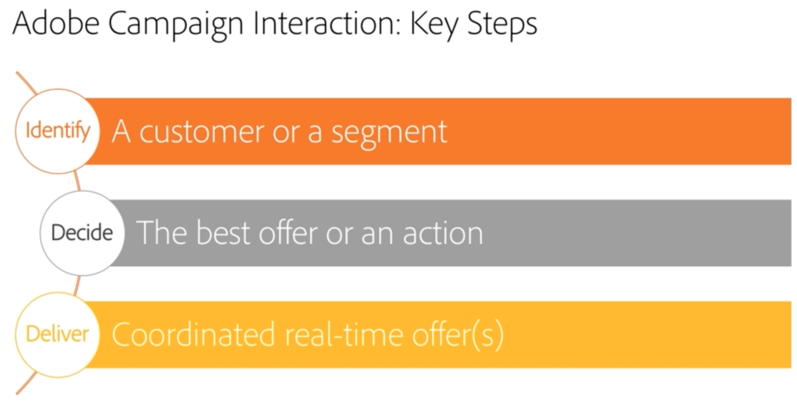

# Hantering av samverkan och erbjudanden{#interaction-and-offer-management}

Med interaktion kan du svara i realtid under en interaktion med en viss kontakt (en kund eller ett visst mål) genom att göra dem till ett eller flera anpassade erbjudanden. Det kan till exempel vara enkla kommunikationsmeddelanden, specialerbjudanden för en eller flera produkter eller en tjänst.

Erbjudandena skickas till kontakter via en inkommande (webbplats eller kundtjänst) eller utgående (e-postleverans, direktreklam eller SMS inom en marknadsföringskampanj) kontakt.

Du kan skapa en erbjudandekatalog som kommer att interagera med inkommande och utgående kanaler för att välja det bästa erbjudandet att skicka till en kontakt i en viss kontext. Vilka erbjudanden som är relevanta för en mottagare definieras utifrån reglerna för behörighet. Urvalet av ett erbjudande från en uppsättning relevanta erbjudanden bestäms med hjälp av prioritetsregler. Regler för presentation av erbjudanden tar hänsyn till kontaktens utbyteshistorik och hjälper dig att undvika att få samma erbjudande flera gånger.

Med Interaction kan du skapa och hantera en katalog med erbjudanden och konfigurera regler och programteman som är länkade till dem. Beroende på vilken kanal du väljer kan innehållet anpassas tack vare olika återgivningsfunktioner. Slutligen kan du använda simuleringsmodulen för att beräkna effekten av en erbjudandepresentation.

Titta på den här videon om du vill bekanta dig med interaktionsfunktionen och de terminologier som används i Campaign Interaction: Översikt över [Adobe Campaign Interaction](https://helpx.adobe.com/campaign/classic/how-to/acs-overview.html?playlist=/ccx/v1/collection/product/campaign/classic/segment/digital-marketers/explevel/intermediate/applaunch/get-started/collection.ccx.js&amp;ref=helpx.adobe.com).

## Relaterade ämnen

| Användbara sidor | Ytterligare resurser |
|---|---|
| [Interaktionsimplementeringssteg](../../interaction/using/implementation-steps.md) | [Distribution av testerbjudanden](../../interaction/using/about-offers-simulation.md) |
| [Live-/designmiljöer](../../interaction/using/live-design-environments.md) | [Lägga till ett erbjudande i ett e-postmeddelande](../../interaction/using/integrating-an-offer-via-the-wizard.md) |
| [Skapa erbjudandemellanslag](../../interaction/using/creating-offer-spaces.md) | [Användningsfall: lägga till ett erbjudande på en webbplats](../../interaction/using/offers-on-an-inbound-channel.md) |