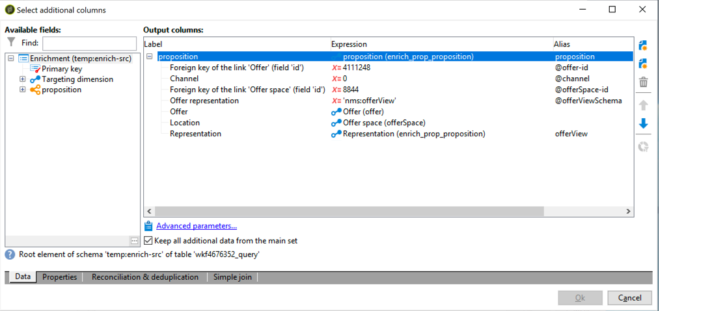

# Bästa praxis för samverkan{#interaction-best-practices}

## Allmänna rekommendationer {#general-recommendations}

I det här avsnittet beskrivs de effektivaste strategierna för att hantera interaktionsmodulen i Adobe Campaign Classic, inklusive regler för behörighet, fördefinierade filter, arbetsflödesaktiviteter och databasalternativ.

Interaktionen i Adobe Campaign kräver noggrann hantering för att fungera effektivt. Du måste hitta en balans mellan antalet kontakter och antalet erbjudandekategorier och erbjudanden. Om dessa faktorer inte behandlas noggrant kan det uppstå problem i Adobe Campaign-instansen.

### Implementering {#implementation}

Nedan visas viktiga element som du bör tänka på när du implementerar och konfigurerar interaktioner.

* För batchmotor (som vanligtvis används i utgående kommunikation som e-post) är dataflöde huvudproblemet, eftersom flera kontakter kan hanteras samtidigt. Den typiska flaskhalsen är databasprestanda.
* Den huvudsakliga begränsningen för en enastående motor (används vanligtvis i inkommande kommunikation som en banderoll på en webbplats) är fördröjning, eftersom någon förväntar sig ett svar. Den typiska flaskhalsen är processorprestanda.
* Katalogdesignen för erbjudandet har stor inverkan på prestandan i Adobe Campaign Classic.
* När det finns många erbjudanden kan du dela upp dem i flera olika erbjudandekataloger.

### Villkor {#eligibility-rules}

Nedan visas några tips om de effektivaste strategierna när det gäller regler för behörighet.

* Förenkla reglerna. Reglernas komplexitet påverkar prestanda när det utökar sökningen. En komplex regel är en regel som har fler än fem villkor.
* För att öka prestandan kan reglerna delas upp i olika fördefinierade filter som delas över flera erbjudanden.
* Placera de mest restriktiva erbjudandekategorireglerna på den högsta möjliga positionen i trädet. På så sätt filtreras de flesta kontakter först, vilket minskar målnumret och förhindrar att de bearbetas av fler regler.
* Lägg de dyraste reglerna vad gäller tid och bearbetning längst ned i trädet. På så sätt körs dessa regler bara på den återstående målgruppen.
* Börja i en viss kategori för att undvika att skanna hela trädet.
* För att spara bearbetningstid kan du beräkna aggregat i stället för att skapa komplexa regler med kopplingar. Det gör du genom att försöka lagra kunddata i en referenstabell som kan slås upp i reglerna för behörighet.
* Använd ett minsta antal vikter för att begränsa antalet frågor.
* Vi rekommenderar ett begränsat antal erbjudanden per erbjudandeplats. Detta gör att erbjudandena kan hämtas snabbare på alla typer av platser.
* Använd index, särskilt för ofta använda sökkolumner.

### Projekttabell {#proposition-table}

Nedan visas några metodtips om förslagstabellen.

* Använd ett minsta antal regler för att göra bearbetningen så snabb som möjligt.
* Begränsa antalet poster i förslagstabellen: spara bara de poster som behövs för att spåra dess statusuppdatering och vad som behövs för reglerna och arkivera dem sedan i ett annat system.
* Utför omfattande databasunderhåll i förslagstabellen, till exempel återskapa index eller återskapa tabell.
* Begränsa antalet förslag som begärs per mål. Ställ inte in mer än vad du faktiskt kommer att använda.
* Undvik kopplingar så mycket som möjligt i regelkriterierna.

## Tips och tricks för att hantera erbjudanden {#tips-managing-offers}

Det här avsnittet innehåller mer detaljerad information om hur du hanterar erbjudanden och använder interaktionsmodulen i Adobe Campaign Classic.

### Använda flera erbjudandeplatser i e-postleveranser {#multiple-offer-spaces}

När du inkluderar erbjudanden i leveranser väljs erbjudandena i allmänhet upp i kampanjen via en anrikningsaktivitet (eller en annan liknande aktivitet).

När du väljer erbjudanden i en anrikningsaktivitet kan du välja vilket utrymme som ska användas. Oberoende av vilket utrymme som har valts beror menyn för leveransanpassning på hur mycket utrymme som finns i leveransformuläret.

I exemplet nedan är det erbjudandeutrymme som valts i leveransen **[!UICONTROL Email (Environment - Recipient)]**:


Om det lediga utrymme som du väljer i leveransen inte har någon HTML-återgivningsfunktion konfigurerad, visas det inte på leveransmenyn och kan inte väljas. Detta är oberoende av vilket erbjudandeutrymme som valts i anrikningsaktiviteten.

I exemplet nedan är HTML-återgivningsfunktionen tillgänglig i listrutan eftersom det erbjudandeutrymme som valts i leveransen har en återgivningsfunktion:


Den här funktionen infogar kod som: `<%@ include proposition="targetData.proposition" view="rendering/html" %>`.

När du markerar förslaget blir värdet för **[!UICONTROL view]** attributet följande:
* &quot;rendering/html&quot;: html-återgivning. Den använder HTML-återgivningsfunktionen.
* &quot;offer/view/html&quot;: html-innehåll. Den använder inte HTML-återgivningsfunktionen. Det innehåller bara HTML-fältet.

När du inkluderar flera erbjudandeplatser i en och samma e-postleverans och om vissa av dem har återgivningsfunktioner och andra inte har det, måste du komma ihåg vilka erbjudanden som innehåller blanksteg och vilka som erbjuder återgivningsfunktioner.

För att undvika eventuella problem rekommenderar vi att alla erbjudanden har en definierad HTML-återgivningsfunktion, även om utrymmet bara kräver HTML-innehåll.

### Ställa in rangordningen i förslagsloggtabellen {#rank-proposition-log-table}

Erbjudandeutrymmen kan lagra data i förslagstabellen när förslag genereras eller godkänns:


Detta gäller dock endast inkommande interaktioner.

Det går också att lagra ytterligare data i förslagstabellen när utgående interaktioner används, och även när utgående erbjudanden används utan interaktionsmodulen.

Alla fält i arbetsflödets temporära tabell vars namn matchar ett fältnamn i förslagstabellen kopieras till samma fält i förslagstabellen.

När du till exempel väljer ett erbjudande manuellt (utan interaktion) i en anrikning definieras standardfälten enligt följande:



Ytterligare fält kan läggas till, till exempel ett @rank-fält:


Eftersom det finns ett fält i förslagstabellen med namnet @rank kopieras värdet i arbetsflödets temporära tabell.

Mer information om hur du lagrar ytterligare fält i förslagstabellen finns i [Integrera ett erbjudande via ett arbetsflöde](../../interaction/using/integrating-an-offer-via-a-workflow.md#storing-offer-rankings-and-weights).

För utgående erbjudanden med interaktion är detta användbart när flera erbjudanden är markerade och du vill registrera i vilken ordning de ska visas i ett e-postmeddelande.

Du kan också lagra ytterligare metadata direkt i förslagstabellen, t.ex. aktuell utgiftsnivå, för att hålla historik över utgifter när erbjudandena genereras.

När du använder utgående interaktion kan fältet @rank läggas till, som i exemplet ovan, men dess värde ställs in automatiskt baserat på den ordning som returneras av Interaction. Om du till exempel använder Interaction för att välja tre erbjudanden returneras värdena 1, 2 och 3 i fältet @rank.

När du använder Interaction och väljer erbjudanden manuellt kan användaren kombinera båda metoderna. Användaren kan till exempel manuellt ange att fältet @rank ska vara 1 för det manuellt valda erbjudandet och använda ett uttryck som &quot;1 + @rank&quot; för erbjudanden som returneras av Interaction. Om Interaction väljer tre erbjudanden rangordnas de erbjudanden som returneras av båda metoderna 1-4:


### Utöka nms:offer-schemat {#extending-nms-offer-schema}

När du utökar schemat nms:offer måste du följa den färdiga strukturen som redan är konfigurerad:
* Definiera nya fält för innehållslagring under `<element name="view">`.
* Varje nytt fält måste definieras två gånger. En gång som ett vanligt XML-fält och en gång som ett CDATA XML-fält med &quot;_jst&quot; som tillägg till namnet. Till exempel:

   ```
   <element label="Price" name="price" type="long" xml="true"/>
   <element advanced="true" label="Script price" name="price_jst" type="CDATA" xml="true"/>
   ```

* Alla fält som innehåller URL:er som ska spåras måste placeras under `<element name="trackedUrls">` som finns under `<element name="view" >`.