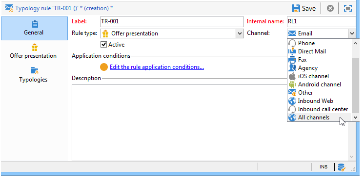

# Hantera en presentation av erbjudanden{#managing-offer-presentation}

## Översikt över presentationsregler {#presentation-rules-overview}

Med interaktion kan ni styra flödet av erbjudandeförslag med hjälp av presentationsregler. Dessa regler, som är specifika för Interaktion, är typologiregler. Med dem kan du utesluta erbjudanden baserat på historiken för de förslag som redan har lämnats till en mottagare. De refereras i miljön

## Skapa och referera till en presentationsregel för erbjudande {#creating-and-referencing-an-offer-presentation-rule}

1. Gå till **[!UICONTROL Administration]** > **[!UICONTROL Campaign management]** > **[!UICONTROL Typology management]** > **[!UICONTROL Typology rules]** nod.
1. Skapa en typologiregel och välj **[!UICONTROL Offer presentation]** typ.

   

1. Ange kanalen som regeln ska gälla för.

   

1. Konfigurera regelns programvillkor. Mer information finns i [Inställningar för presentationsregel](#presentation-rule-settings).
1. Gå till **[!UICONTROL Administration]** > **[!UICONTROL Campaign execution]** > **[!UICONTROL Typology management]** > **[!UICONTROL Typologies]** och skapa en typologi som grupperar alla **[!UICONTROL Offer presentation]** typregler.

   

1. När typologin har skapats placerar du markören på typologireglerna och grupperar dem i den typologi du just har skapat.

   

1. I er erbjudandemiljö kan du referera till typologin i listrutan.

   

## Inställningar för presentationsregel {#presentation-rule-settings}

### Ansökningsvillkor {#application-criteria-}

De programvillkor som finns i **[!UICONTROL General]** kan du ange erbjudanden som presentationsregeln ska gälla för. För att kunna göra detta måste du skapa en fråga och välja de aktuella erbjudandena enligt beskrivningen nedan.

1. I din typologiregel klickar du på **[!UICONTROL Edit the rule application conditions...]** för att skapa din fråga.

   

1. I frågefönstret kan du tillämpa ett filter på de erbjudanden som du vill tillämpa en typologiregel på.

   Du kan till exempel välja en erbjudandekategori.

   

### Erbjudandedimensioner {#offer-dimensions}

I **[!UICONTROL Offer presentation]** måste du ange samma dimensioner för presentationsregeln som de som har konfigurerats i miljön.

The **[!UICONTROL Targeting dimension]** sammanfaller med mottagartabellen (som standard: nms:mottagare) som får erbjudandeförslagen. The **[!UICONTROL Storage dimension]** sammanfaller med tabellen som innehåller den förslagshistorik som är länkad till måldimensionen (som standard):nms:propositionRcp).

>[!NOTE]
>
>Du kan också använda tabeller som inte är standard. Om du vill använda en specifik målgruppsdimension måste du skapa tabeller och en dedikerad miljö med målmappningen. Mer information finns i [Skapa en erbjudandemiljö](../../interaction/using/live-design-environments.md#creating-an-offer-environment).

### Period {#period}

Detta är en glidande period som börjar på presentationsdatumet för erbjudandet. Det fastställer en tidsgräns för giltigheten för erbjudandeförslag. Regeln gäller inte för offertförslag som gjorts efter denna period.

Perioden börjar **n** dagar före förslagsdatumet och slutar **n** dagar därefter, där **n** motsvarar talet som anges i **[!UICONTROL Period considered]** fält:

* För inkommande blanksteg är förslagsdatumet presentationsdatumet.
* För utgående blanksteg är förslagsdatumet leveransens kontaktdatum (till exempel leveransdatumet som anges i ett målarbetsflöde).

Använd pilarna för att ändra antalet dagar eller ange en punkt direkt (&quot;2d 6h&quot;, till exempel).

### Antal offerter {#number-of-propositions}

Det är möjligt att fastställa det högsta antal anbud som kan lämnas innan de berörda erbjudandena utesluts.

Använd pilarna för att ändra antalet offertförslag.

## Definiera befattningar och mottagare {#defining-propositions-and-recipients}

The **[!UICONTROL Propositions to count]** kan du ange både mottagare och förslag som kommer att leda till att de erbjudanden som definieras i **[!UICONTROL General]** om de visas ett visst antal gånger i förslagshistoriken.

### Filtrera förslag {#filtering-propositions}

Du kan välja filtreringskriterier för att exkludera offerter baserat på kanal, erbjudanden eller status för tidigare tilldelade offerter.

Dessa kriterier är de vanligaste tillämpningarna av presentationsregler. Om du vill använda andra villkor kan du skapa en fråga med **[!UICONTROL Limit propositions...]** länk. Mer information finns i [Skapa en fråga om förslag](#creating-a-query-on-propositions) -avsnitt.

* **Filtrera på kanalen**

   **[!UICONTROL On the same channel only]** : kan du utesluta erbjudandeförslag på den kanal som anges i **[!UICONTROL General]** -fliken.

   Den kanal som anges för regeln i **[!UICONTROL General]** fliken är e-post. Om de erbjudanden som regeln gäller hittills bara fanns på webbkanalen kan interaktionsmotorn presentera erbjudandena i en e-postleverans. Men när erbjudandena har presenterats via e-post väljer interaktionsmotorn en annan kanal för att presentera erbjudandena.

   >[!NOTE]
   >
   >Vi pratar om kanalen och inte rymden. Om regeln utesluter ett erbjudande på webbkanalen kommer det erbjudande som ska presenteras på en webbplats i två blanksteg (i en banderoll och till exempel i sidans brödtext) inte att visas på webbplatsen om det redan har presenterats tidigare.
   >
   >För ett arbetsflöde som innehåller en erbjudandepresentation beaktas reglerna endast korrekt om de är konfigurerade för **[!UICONTROL All channels]**.

* **Filtrera på erbjudandet**

   Med det här filtret kan du begränsa antalet erbjudandeförslag som ska räknas till specifika erbjudanden.

   **[!UICONTROL All offers]** : standardvärde. Inget filter tillämpas på erbjudandena.

   **[!UICONTROL Offer being presented]** : erbjudandet som anges i **[!UICONTROL General]** -fliken tas inte med om den redan har presenterats.

   **[!UICONTROL Offers from the same category]** : ett erbjudande utesluts om ett erbjudande från samma kategori redan har lämnats in.

   **[!UICONTROL The offers which the rule applies to]** : när flera erbjudanden definieras i **[!UICONTROL General]** tas alla erbjudandeförslag från denna uppsättning med erbjudanden med i beräkningen och avslutas med att alla erbjudanden utesluts om tröskelvärdet för erbjudandet nås.

   Erbjudandena 2, 3 och 5 definieras i **[!UICONTROL General]** -fliken. Det högsta antalet offerter är 2. Om erbjudandena 2 och 5 presenteras en gång, kommer antalet offerter att vara 2. Därför kommer erbjudande 3 aldrig att presenteras.

* **Filter på förslagsstatus**

   Med det här filtret kan du välja de vanligaste statusvärdena för erbjudandeförslag som ska beaktas i förslagshistoriken.

   **[!UICONTROL Regardless of the proposition status]** : standardvärde. Inget filter tillämpas på förslagets status.

   **[!UICONTROL Accepted or rejected propositions]** : kan du utesluta tidigare presenterade erbjudanden som har godkänts eller avvisats.

   **[!UICONTROL Accepted propositions]** : kan du utesluta tidigare presenterade erbjudanden som har godkänts.

   **[!UICONTROL Rejected propositions]** : kan du utesluta tidigare erbjudanden som har avvisats.

### Definiera mottagare {#defining-recipients}

Klicka på knappen **[!UICONTROL Edit the query from the targeting dimension...]** och välj de mottagare som berörs av regeln.

### Skapa en fråga om förslag {#creating-a-query-on-propositions}

Om du vill ange de förslag som ska räknas via en fråga klickar du på **[!UICONTROL Limit propositions...]** och ange vilka kriterier som ska beaktas.

I följande exempel är de förslag som ska räknas efter två presentationer de som finns i **Specialerbjudanden** kategori, för **Callcenter** utrymme, med en vikt under **20**.

