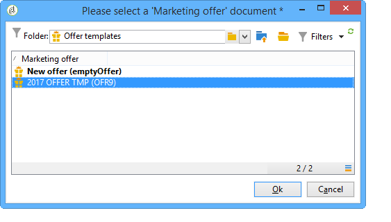

# Hantera mallar för erbjudanden{#managing-offer-templates}

Mallar för erbjudanden levereras i Adobe Campaign. Du kan använda dem när du har skapat dina erbjudanden, duplicerat dem eller anpassat deras konfiguration efter dina behov. Du kan också skapa egna mallar. Mallerbjudanden lagras i mappen **Resources** > **Mallar** > **Erbjudandemallar**.

## Skapa en erbjudandemall {#creating-an-offer-template}

Så här skapar du ett mallerbjudande:

1. Gå till **Resources** > **Mallar** > **Erbjudandemallar**.
1. Klicka på ikonen **Nytt**.

   

1. Konfigurera mallen genom att tillämpa samma process som för ett vanligt erbjudande och spara det sedan genom att klicka på **Spara**.

## Duplicera en befintlig mall {#duplicate-an-existing-template}

Så här duplicerar du en offertmall (som är färdig eller inte):

1. Gå till **Resurser > Mallar > Erbjudandemallar**.
1. Använd musen för att högerklicka på mallen som du vill duplicera och välj **Duplicera** i listrutan.

   

1. Om det behövs konfigurerar du de inställningar som du vill ska visas i mallen och sparar sedan mallen genom att klicka på **Spara**.

Den här mallen kommer nu att erbjudas när du skapar ett erbjudande.

