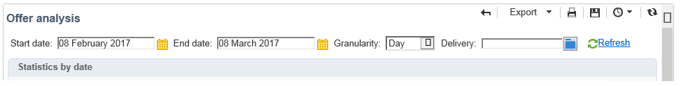

# Analysrapport{#offer-analysis-report}

Rapporten innehåller en översikt över antalet godkända eller avvisade förslag **[!UICONTROL Offer analysis]** .

>[!NOTE]
>
>Den här funktionen är bara synlig online och endast för leveranshanteraren.

Statistiken sorteras utifrån tre kriterier:

* efter datum.

   

* efter mellanslag.

   

* efter leveranser.

   

Data kan filtreras baserat på de olika kriterier som finns i rapportens övre avsnitt. När du har valt önskat villkor klickar du på **[!UICONTROL Refresh]** länken för att tillämpa dem på rapporten.

