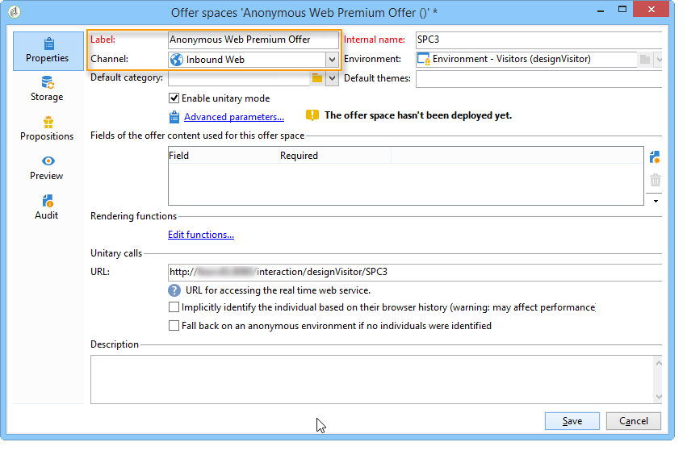
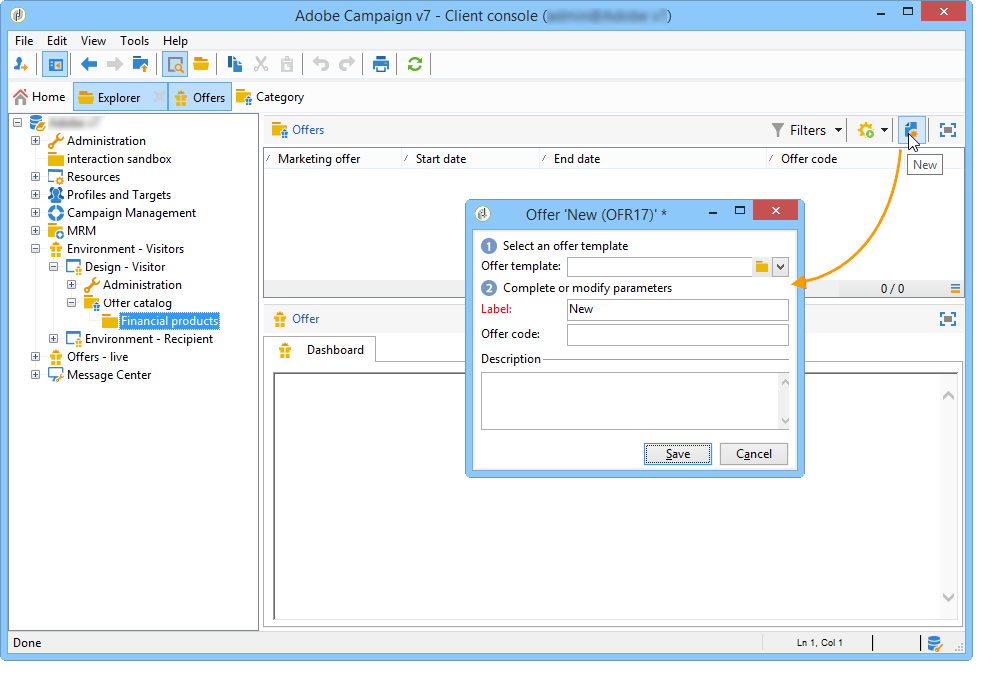
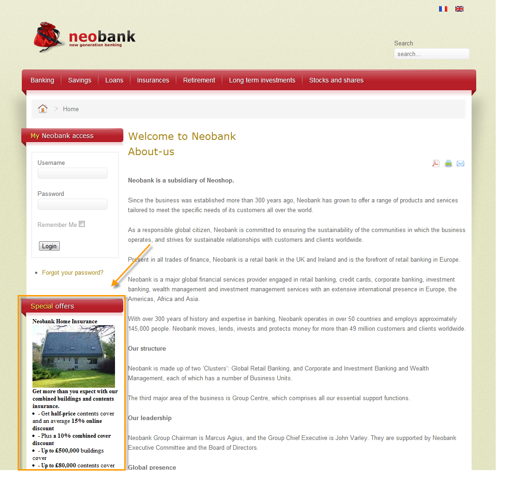
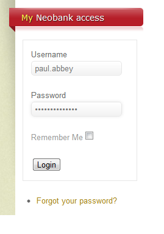
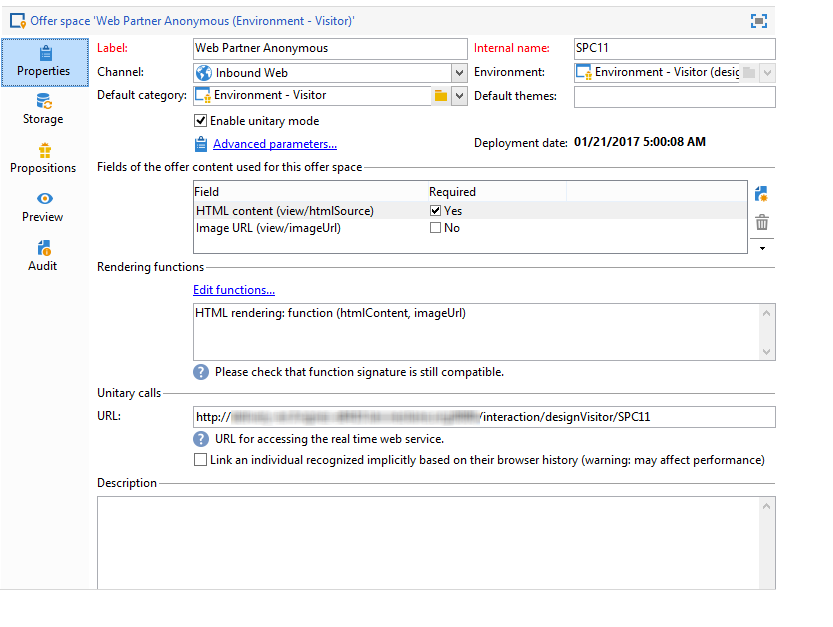
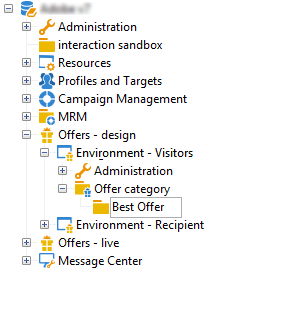
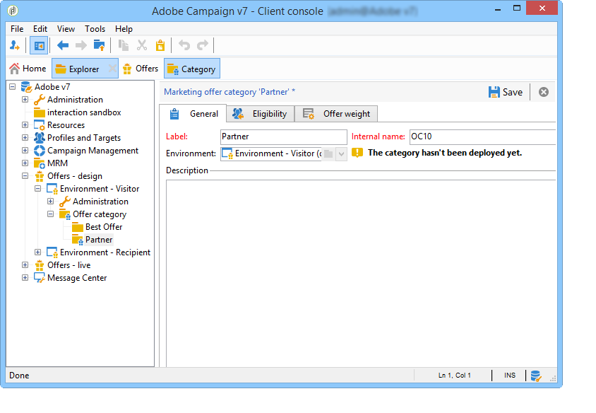
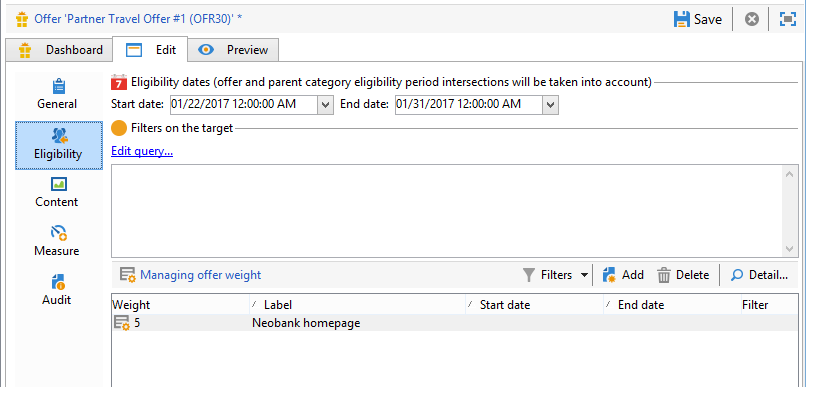

# Erbjudanden på en inkommande kanal{#offers-on-an-inbound-channel}


## Presentera ett erbjudande för en anonym besökare {#presenting-an-offer-to-an-anonymous-visitor}

Neobank-sajten vill visa ett erbjudande på sin webbplats som riktar sig till oidentifierade besökare som bläddrar på sidan.

För att lägga upp den här interaktionen kommer vi att:

1. [Skapa en anonym miljö](#creating-an-anonymous-environment)
1. [Skapa anonyma erbjudanden](#creating-anonymous-offer-spaces)
1. [Skapa en erbjudandekategori och ett tema](#creating-an-offer-category-and-a-theme)
1. [Skapa anonyma erbjudanden.](#creating-anonymous-offers)
1. [Konfigurera webbplatsens erbjudanden](#configure-the-web-offer-space-on-the-website)

### Skapa en anonym miljö {#creating-an-anonymous-environment}

Följ anvisningarna i [Skapa en erbjudandemiljö](../../interaction/using/live-design-environments.md#creating-an-offer-environment) för att skapa en anonym miljö baserad på **Besökare**&#39; dimensioner.

Du får en trädstruktur som innehåller din nya miljö:


### Skapa anonyma erbjudandeplatser {#creating-anonymous-offer-spaces}

1. I er anonyma miljö (**Besökare**) går du till **[!UICONTROL Administration]** > **[!UICONTROL Spaces]** nod.
1. Klicka **[!UICONTROL New]** för att skapa samtalskanaler.

   

   >[!NOTE]
   >
   >Utrymmet länkas automatiskt till den anonyma miljön.

1. Ändra etiketten och välj **[!UICONTROL Inbound Web]** kanal. Du måste även kontrollera **[!UICONTROL Enable unitary mode]** box.

   

1. Markera de innehållsfält för erbjudandet som används för utrymmet och ange dem enligt vad som krävs genom att markera den relevanta rutan.

   På så sätt är erbjudanden som saknar något av följande element inte berättigade till detta utrymme:

   * Titel
   * HTML content
   * Bild-URL
   * Mål-URL

   

1. Redigera återgivningsfunktionen HTML, till exempel enligt följande:

   ```
   function (imageUrl, targetUrl, shortContent, htmlSource){
         var html = "<p><b>" + shortContent + "</b></p>";
         html += "<p>" + htmlSource + "</p>";
         html += "<a _urlType='11' href='" + targetUrl + "'></a>";
         return html;
       }   
   ```

   >[!IMPORTANT]
   >
   >Återgivningsfunktionen måste namnge fälten som används för utrymmet i den ordning som de markerades tidigare, så att erbjudandena visas korrekt.

   

1. Spara utrymme.

### Skapa en erbjudandekategori och ett tema {#creating-an-offer-category-and-a-theme}

1. Gå till **[!UICONTROL Offer catalog]** i den miljö du just har skapat.
1. Högerklicka på **[!UICONTROL Offer catalog]** nod och markera **[!UICONTROL Create a new 'Offer category' folder]**.

   Namnge den nya kategorin, **Finansiella produkter** till exempel.

1. Gå till kategorins **[!UICONTROL Eligibility]** tabb och ange **finansiering** som ett tema och spara sedan ändringarna.

   

### Skapa anonyma erbjudanden {#creating-anonymous-offers}

1. Gå till kategorin som du nyss skapade.
1. Klicka på **[!UICONTROL New]**.

   

1. Välj den färdiga anonyma erbjudandemallen eller en mall som skapats tidigare.

   

1. Ändra etiketten och spara ditt erbjudande.

   

1. Gå till **[!UICONTROL Eligibility]** och ange erbjudandenas vikt enligt programkontexterna.

   I det här exemplet är erbjudandet konfigurerat att visas som en prioritet på webbplatsens hemsida till slutet av året.

   

1. Gå till **[!UICONTROL Content]** och definiera innehållet i erbjudandet.

   >[!NOTE]
   >
   >Du kan välja **[!UICONTROL Content definitions]** om du vill visa en lista med element som krävs för webbrymden.

   

1. Skapa ett andra erbjudande.

   

1. Gå till **[!UICONTROL Eligibility]** och lägga in samma vikt som för det första erbjudandet.
1. Kör godkännandecykeln för varje erbjudande för att göra dem, samt deras godkända erbjudandeplatser, tillgängliga i onlinemiljön.

### Konfigurera utrymmet för webberbjudandet på webbplatsen {#configure-the-web-offer-space-on-the-website}

Om du vill att de erbjudanden du just har konfigurerat ska vara synliga på webbplatsen infogar du en JavaScript-kod på HTML-sidan på webbplatsen för att anropa interaktionsmotorn (mer information finns i [Om inkommande kanaler](../../interaction/using/about-inbound-channels.md)).

1. Gå till sidan HTML och infoga ett @id-attribut med ett värde som matchar det interna namnet på det anonyma erbjudandeutrymmet som skapats tidigare (se [Skapa anonyma erbjudandeplatser](#creating-anonymous-offer-spaces)), föregås av **i_**.

   

1. Ange anrops-URL.

   

   De blå URL-rutorna ovan motsvarar instansnamnet, det interna namnet på miljön (se [Skapa en anonym miljö](#creating-an-anonymous-environment)) och det tema som är kopplat till kategorin ([Skapa en erbjudandekategori och ett tema](#creating-an-offer-category-and-a-theme)). Den senare är valfri.

När en besökare kommer åt webbplatsens hemsida erbjuder **finansiering** temat visas som det är konfigurerat på HTML-sidan.



En användare som besöker sidan flera gånger kommer att se antingen det ena eller det andra erbjudandet i kategorin eftersom båda har tilldelats samma vikt.

## Byta till en anonym miljö om det finns oidentifierade kontakter {#switching-to-an-anonymous-environment-in-case-of-unidentified-contacts}

Företaget Neobank vill skapa marknadsföringserbjudanden för två olika mål. Den vill visa generiska erbjudanden för sina anonyma webbläsare. Om någon av dessa användare visar sig vara kund med identifierare från Neobank vill företaget att de ska få personaliserade erbjudanden så fort de loggar in.

Denna fallstudie bygger på följande scenario:

1. En besökare surfar på Neobank-webbplatsen utan att logga in.

   

   Tre anonyma erbjudanden visas på sidan: två **Bästa erbjudande** erbjudanden för Neobank-produkter och ett erbjudande från en Neobank-partner.

   

1. Användaren, en Neobank-kund, loggar in med sina inloggningsuppgifter.

   

   Tre personaliserade erbjudanden visas.

   

För att implementera denna fallstudie måste ni ha två miljöer: en för anonym interaktion och en med erbjudanden som är särskilt konfigurerade för identifierade kontakter. Den identifierade erbjudandemiljön kommer att konfigureras för att automatiskt växla till den anonyma erbjudandemiljön om kontakten inte är inloggad och därför inte identifieras.

Använd följande steg:

* Skapa en katalog med erbjudanden som är specifika för anonyma inkommande interaktioner med följande steg:

   1. [Skapa en miljö för anonyma kontakter](#creating-an-environment-for-anonymous-contacts)
   1. [Konfigurera erbjudandeplatser för den anonyma miljön](#configuring-offer-spaces-for-the-anonymous-environment)
   1. [Skapa erbjudandekategorier i en anonym miljö](#creating-offer-categories-in-an-anonymous-environment)
   1. [Skapa erbjudanden för anonyma besökare](#creating-offers-for-anonymous-visitors)

* Skapa en katalog med erbjudanden som är specifika för identifierade inkommande interaktioner med följande steg:

   1. [Konfigurera erbjudandeutrymmena i den identifierade miljön](#configure-the-offer-spaces-in-the-identified-environment)
   1. [Skapa erbjudandekategorier i en identifierad miljö](#creating-offer-categories-in-an-identified-environment)
   1. [Skapa personaliserade erbjudanden](#creating-personalized-offers)

* Konfigurera anropet till erbjudandemotorn:

   1. [Konfigurera erbjudandeutrymmen på webbsidan](#configuring-offer-spaces-on-the-web-page)
   1. [Ange avancerade inställningar för de identifierade erbjudandeutrymmena](#specifying-the-advanced-settings-of-the-identified-offer-spaces)

### Skapa en miljö för anonyma kontakter {#creating-an-environment-for-anonymous-contacts}

1. Skapa en erbjudandemiljö för anonyma inkommande interaktioner via guiden för leveranskarta (**Besökare** mappning). Mer information finns i [Skapa en erbjudandemiljö](../../interaction/using/live-design-environments.md#creating-an-offer-environment).

   

### Konfigurera erbjudandeplatser för den anonyma miljön {#configuring-offer-spaces-for-the-anonymous-environment}

Erbjudandena som måste presenteras på webbplatsen tillhör två olika kategorier: **Bästa erbjudande** och **Partner**. I det här exemplet ska vi skapa ett specifikt erbjudandeutrymme för varje kategori.

För att skapa erbjudandeutrymme som matchar **Bästa erbjudande** -kategori använder du följande process:

1. Gå till den anonyma miljön som du just har skapat i Adobe Campaign-trädet och lägg till ett utrymme för erbjudanden.

   

1. Skapa ett nytt **[!UICONTROL Inbound web]** textutrymme.

   

1. Ange en etikett för den: **Bästa anonyma webblösningar** till exempel.
1. Lägg till de innehållsfält för erbjudandet som används för erbjudandeutrymmet och konfigurera återgivningsfunktionerna.

   

   >[!IMPORTANT]
   >
   >Återgivningsfunktionen måste namnge fälten som används för utrymmet i den ordning som de markerades tidigare, så att erbjudandena visas korrekt.

1. Använd samma process för att skapa ett erbjudande för inkommande webbkanal som matchar **Partner** kategori.

   

### Skapa erbjudandekategorier i en anonym miljö {#creating-offer-categories-in-an-anonymous-environment}

Börja med att skapa två kategorier: den **Bästa erbjudande** kategori och **Partner** kategori. Varje kategori innehåller två erbjudanden för anonyma kontakter.

1. Gå till **[!UICONTROL Offer catalog]** i den anonyma miljö som du just har skapat.
1. Lägg till en **[!UICONTROL Offer category]** mapp med **Bästa erbjudande** som en etikett.

   

1. Skapa en andra kategori med **Partner** som en etikett.

   

### Skapa erbjudanden för anonyma besökare {#creating-offers-for-anonymous-visitors}

Vi kommer nu att skapa två erbjudanden i varje kategori som skapas ovan.

1. Gå till **Bästa erbjudande** och skapa ett anonymt erbjudande.

   

1. Gå till **[!UICONTROL Eligibility]** och ange erbjudandenas vikt enligt programkontexterna.

   

1. Gå till **[!UICONTROL Content]** och definiera innehållet i erbjudandet.

   

1. Skapa ett andra erbjudande i **Bästa erbjudande** kategori.

   

1. Gå till **Partner** och skapa ett anonymt erbjudande.
1. Gå till **[!UICONTROL Content]** och definiera innehållet i erbjudandet.

   

1. Gå till **[!UICONTROL Eligibility]** och ange erbjudandenas vikt enligt programkontexterna.

   

1. Skapa ett andra erbjudande för **Partner** kategori.

   

1. Gå till **[!UICONTROL Eligibility]** och lägga in samma vikt som du lade på det första erbjudandet i den här kategorin, så att erbjudandena visas i följd på webbplatsen.

   

1. Kör godkännandecykeln för varje erbjudande för att börja göra det live. Aktivera **Partner** eller **Bästa erbjudande** erbjudandet, beroende på vilket erbjudande det gäller.

### Konfigurera erbjudandeutrymmena i den identifierade miljön {#configure-the-offer-spaces-in-the-identified-environment}

Erbjudandena som du kommer att presentera på webbplatsen är uppdelade i två olika kategorier: **Bästa erbjudande** och **Partner**. I det här exemplet vill vi skapa ett specifikt utrymme för varje kategori.

Om du vill skapa de två erbjudandeutrymmena använder du samma procedur som för anonyma erbjudandeutrymmen. Se [Konfigurera erbjudandeplatser för den anonyma miljön](#configuring-offer-spaces-for-the-anonymous-environment).

1. Gå till den miljö du just har skapat i Adobe Campaign-trädet och lägg till **Bästa erbjudande** och **Partner** erbjuder blanksteg.
1. Använda processen som beskrivs i [Konfigurera erbjudandeplatser för den anonyma miljön](#configuring-offer-spaces-for-the-anonymous-environment).

   

1. Välj **[!UICONTROL Fall back on an anonymous environment if no individuals were identified]** alternativ.

   

1. Välj det anonyma webberbjudandeutrymme som skapats tidigare i listrutan (se [Konfigurera erbjudandeplatser för den anonyma miljön](#configuring-offer-spaces-for-the-anonymous-environment)).

   

### Ange avancerade inställningar för de identifierade erbjudandeutrymmena {#specifying-the-advanced-settings-of-the-identified-offer-spaces}

I det här exemplet sker en kontaktidentifiering tack vare e-postadressen i Adobe Campaign-databasen. Gör så här om du vill lägga till mottagarens e-postadress i utrymmet:

1. I den identifierade miljön går du till mappen för erbjudandeutrymme.
1. Välj **Bästa erbjudande** visa utrymme och klicka **[!UICONTROL Advanced parameters]**.

   

1. På fliken **[!UICONTROL Target identification]** klickar du på **[!UICONTROL Add]**.

   

1. Klicka **[!UICONTROL Edit expression]**, går till mottagartabellen och väljer **[!UICONTROL Email]** fält.

   

1. Klicka **[!UICONTROL OK]** för att stänga **[!UICONTROL Advanced parameters]** och slutföra konfigurationen av **Bästa erbjudande** erbjuder utrymme.
1. Använd samma process för **Partner** erbjuder utrymme.

   

### Skapa erbjudandekategorier i en identifierad miljö {#creating-offer-categories-in-an-identified-environment}

Vi ska skapa två olika kategorier: den **Bästa erbjudande** kategori och **Partner** -kategori, var och en med två personaliserade erbjudanden.

1. Gå till **[!UICONTROL Offer catalogs]** i den identifierade miljön.
1. Som i den anonyma miljön lägger du till två **[!UICONTROL Offer category]** mappar med **Bästa erbjudande** och **Partner** som etiketter.

   

### Skapa personaliserade erbjudanden {#creating-personalized-offers}

Vi vill skapa två personaliserade erbjudanden för varje kategori, nämligen fyra.

1. Gå till **Bästa erbjudande** och skapa ett första personaliserat erbjudande.

   

1. Gå till **[!UICONTROL Eligibility]** och ange erbjudandenas vikt enligt programkontexterna.

   

1. Gå till **[!UICONTROL Content]** och definiera innehållet i erbjudandet.

   

1. Skapa ett andra erbjudande i **Bästa erbjudande** kategori.

   

1. Gå till **Partner** och skapa ett personaliserat erbjudande.

   

1. Gå till **[!UICONTROL Eligibility]** och ange erbjudandenas vikt enligt programkontexterna.

   

1. Skapa ett andra erbjudande för **Partner** kategori.

   

1. Gå till **[!UICONTROL Eligibility]** och lägga in samma vikt som du lade på det första erbjudandet i den här kategorin, så att erbjudandena visas i följd på webbplatsen.
1. Kör godkännandecykeln för varje erbjudande för att börja uppdatera dem. Aktivera **Partner** eller **Bästa erbjudande** erbjuder blanksteg.

### Konfigurera erbjudandeutrymmen på webbsidan {#configuring-offer-spaces-on-the-web-page}

På Neobanks webbplats finns tre olika erbjudanden: två för bankrelaterade erbjudanden från **Bästa erbjudande** och en för erbjudanden från **Partner** kategori.


Gör så här om du vill konfigurera de här erbjudandeutrymmena HTML på webbplatsen:

1. Infoga tre på HTML-sidan

   element med ett @id-attribut vars värde gör att vi kan ringa upp erbjudandena på webbplatsens olika erbjudandeplatser.

   

1. Infoga sedan skriptet för att definiera attributvärden.

   

   I det här exemplet **ContBO1** och **ContBO2** ta emot värdet **OsWebBestOfferIdentified**, dvs. det interna namnet på **Bästa erbjudande** erbjuder utrymme som skapats tidigare i den identifierade miljön. The **CatBestOffer** och **CatBestOfferAnonym** värdena matchar det interna namnet på **Bästa erbjudande** kategorier för anonyma och identifierade miljöer.

   

   På samma sätt **ContPtn** får **OSWebPartnerIdentified** värde, som matchar det interna namnet på **Partner** erbjuder utrymme som skapats i den identifierade miljön. **CatPartner** och **CatPartnerAnonym** matchar det interna namnet på **Partner** kategorier för anonyma och identifierade miljöer.

   

1. Tilldela den information som gör att du kan identifiera den person som loggar in på Neobank-webbplatsen för **interactionTarget** variabel.

   

   Personens identifiering kan baseras på en webbläsarcookie, en läsparameter i URL:en, e-postadressen eller identifieraren för personen. Om ett annat fält i mottagartabellen än primärnyckeln används, måste det definieras i de avancerade parametrarna för blanksteget (se [Ange avancerade inställningar för de identifierade erbjudandeutrymmena](#specifying-the-advanced-settings-of-the-identified-offer-spaces)).

1. Ange anrops-URL.

   

   URL:en innehåller **EnvNeobankRecip**, den identifierade miljöns interna namn.

När du öppnar webbsidan; skriptet gör att du kan anropa interaktionsmotorn för att visa innehållet i erbjudanden i relevanta delar av webbsidan. I ett enda anrop till Adobe Campaign-servern avgör motorn miljön, erbjudandeutrymmet och de kategorier som ska väljas.

I det här exemplet känner motorn igen den identifierade miljön (**EnvNeobankIdRecip**). Här anges erbjudandeutrymmet (**OSWebBestOfferIdentified**) och **Bästa erbjudande** kategori (**CatBestOffer**) för det första och andra erbjudandet på webbsidan samt (**OSWebPartnerIdentified**) erbjuder utrymme och **Partner** kategori (**CatPartner**) för det tredje erbjudandeutrymmet på webbplatsen.

Om motorn inte kan identifiera mottagaren växlar den till de anonyma erbjudandeutrymmena som refereras i de identifierade erbjudandeutrymmena och till de anonyma kategorierna (**CatPartner** och **CatPartnerAnonym**) enligt skriptet.
