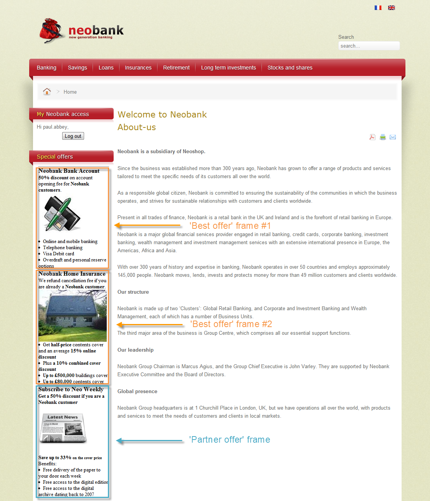

# Erbjudanden på en inkommande kanal{#offers-on-an-inbound-channel}

## Presentera ett erbjudande för en anonym besökare {#presenting-an-offer-to-an-anonymous-visitor}

Neobank-sajten vill visa ett erbjudande på sin webbplats som riktar sig till oidentifierade besökare som bläddrar på sidan.

För att lägga upp den här interaktionen kommer vi att:

1. [Skapa en anonym miljö](#creating-an-anonymous-environment)
1. [Skapa anonyma erbjudanden](#creating-anonymous-offer-spaces)
1. [Skapa en erbjudandekategori och ett tema](#creating-an-offer-category-and-a-theme)
1. [Skapa anonyma erbjudanden.](#creating-anonymous-offers)
1. [Konfigurera webbplatsens erbjudanden](#configure-the-web-offer-space-on-the-website)

### Skapa en anonym miljö {#creating-an-anonymous-environment}

Följ anvisningarna i [Skapa en erbjudandemiljö](../../interaction/using/live-design-environments.md#creating-an-offer-environment) för att skapa en anonym miljö utifrån **besökarnas** dimensioner.

Du får en trädstruktur som innehåller din nya miljö:


### Skapa anonyma erbjudandeplatser {#creating-anonymous-offer-spaces}

1. I den anonyma miljön (**besökare**) går du till **[!UICONTROL Administration]** > **[!UICONTROL Spaces]** -noden.
1. Klicka **[!UICONTROL New]** för att skapa samtalskanaler.

   

   >[!NOTE]
   >
   >Utrymmet länkas automatiskt till den anonyma miljön.

1. Ändra etiketten och markera **[!UICONTROL Inbound Web]** kanalen. Du måste också markera **[!UICONTROL Enable unitary mode]** rutan.

   

1. Markera de innehållsfält för erbjudandet som används för utrymmet och ange dem enligt vad som krävs genom att markera den relevanta rutan.

   På så sätt är erbjudanden som saknar något av följande element inte berättigade till detta utrymme:

   * Titel
   * HTML-innehåll
   * Bild-URL
   * Mål-URL
   

1. Redigera HTML-återgivningsfunktionen enligt följande:

   ```
   function (imageUrl, targetUrl, shortContent, htmlSource){
         var html = "<p><b>" + shortContent + "</b></p>";
         html += "<p>" + htmlSource + "</p>";
         html += "<a _urlType='11' href='" + targetUrl + "'></a>";
         return html;
       }   
   ```

   >[!CAUTION]
   >
   >Återgivningsfunktionen måste namnge fälten som används för utrymmet i den ordning som de markerades tidigare, så att erbjudandena visas korrekt.

   

1. Spara utrymme.

### Skapa en erbjudandekategori och ett tema {#creating-an-offer-category-and-a-theme}

1. Gå till noden i den miljö som du just har skapat. **[!UICONTROL Offer catalog]**
1. Högerklicka på **[!UICONTROL Offer catalog]** noden och välj **[!UICONTROL Create a new 'Offer category' folder]**.

   Ge den nya kategorin namnet **Finansiella produkter** till exempel.

1. Gå till kategorifliken **[!UICONTROL Eligibility]** och ange **finansiering** som ett tema. Spara sedan ändringarna.

   

### Skapa anonyma erbjudanden {#creating-anonymous-offers}

1. Gå till kategorin som du nyss skapade.
1. Klicka på **[!UICONTROL New]**.

   

1. Välj den färdiga anonyma erbjudandemallen eller en mall som skapats tidigare.

   

1. Ändra etiketten och spara ditt erbjudande.

   

1. Gå till **[!UICONTROL Eligibility]** fliken och ange erbjudandenas vikt enligt programkontexterna.

   I det här exemplet är erbjudandet konfigurerat att visas som en prioritet på webbplatsens hemsida till slutet av året.

   

1. Gå till **[!UICONTROL Content]** fliken och definiera innehållet i erbjudandet.

   >[!NOTE]
   >
   >Du kan välja **[!UICONTROL Content definitions]** att visa listan med element som krävs för webbsidan.

   

1. Skapa ett andra erbjudande.

   

1. Gå till **[!UICONTROL Eligibility]** fliken och tillämpa samma vikt som för det första erbjudandet.
1. Kör godkännandecykeln för varje erbjudande för att göra dem, samt deras godkända erbjudandeplatser, tillgängliga i onlinemiljön.

### Konfigurera utrymmet för webberbjudandet på webbplatsen {#configure-the-web-offer-space-on-the-website}

Om du vill göra de erbjudanden du just har konfigurerat synliga på webbplatsen infogar du en JavaScript-kod på webbplatsens HTML-sida för att anropa interaktionsmotorn (mer information finns i [Om inkommande kanaler](../../interaction/using/about-inbound-channels.md)).

1. Gå till HTML-sidan och infoga ett @id-attribut med ett värde som matchar det interna namnet på den anonyma erbjudanderymden som skapats tidigare (se [Skapa anonyma erbjudanden](#creating-anonymous-offer-spaces)), föregånget av **i_**.

   

1. Ange anrops-URL.

   

   De blå URL-rutorna ovan motsvarar instansnamnet, det interna namnet på miljön (se [Skapa en anonym miljö](#creating-an-anonymous-environment)) och det tema som är länkat till kategorin ([Skapa en erbjudandekategori och ett tema](#creating-an-offer-category-and-a-theme)). Den senare är valfri.

När en besökare kommer åt webbplatsens hemsida visas erbjudandena med **finansieringstemat** så som de är konfigurerade på HTML-sidan.


En användare som besöker sidan flera gånger kommer att se antingen det ena eller det andra erbjudandet i kategorin eftersom båda har tilldelats samma vikt.

## Byta till en anonym miljö om det finns oidentifierade kontakter {#switching-to-an-anonymous-environment-in-case-of-unidentified-contacts}

Företaget Neobank vill skapa marknadsföringserbjudanden för två olika mål. Den vill visa generiska erbjudanden för sina anonyma webbläsare. Om någon av dessa användare visar sig vara kund med identifierare från Neobank vill företaget att de ska få personaliserade erbjudanden så fort de loggar in.

Denna fallstudie bygger på följande scenario:

1. En besökare surfar på Neobank-webbplatsen utan att logga in.

   

   Tre anonyma erbjudanden visas på sidan: två **bästa erbjudanden** för Neobank-produkter och ett erbjudande från en Neobank-partner.

   

1. Användaren, en Neobank-kund, loggar in med sina inloggningsuppgifter.

   

   Tre personaliserade erbjudanden visas.

   

För att implementera denna fallstudie måste ni ha två miljöer: en för anonym interaktion och en med erbjudanden som är särskilt konfigurerade för identifierade kontakter. Den identifierade erbjudandemiljön kommer att konfigureras för att automatiskt växla till den anonyma erbjudandemiljön om kontakten inte är inloggad och därför inte identifieras.

Använd följande steg:

* Skapa en katalog med erbjudanden som är specifika för anonyma inkommande interaktioner med följande steg:

   1. [Skapa en miljö för anonyma kontakter](#creating-an-environment-for-anonymous-contacts)
   1. [Konfigurera erbjudandeplatser för den anonyma miljön](#configuring-offer-spaces-for-the-anonymous-environment)
   1. [Skapa erbjudandekategorier i en anonym miljö](#creating-offer-categories-in-an-anonymous-environment)
   1. [Skapa erbjudanden för anonyma besökare](#creating-offers-for-anonymous-visitors)

* Skapa en katalog med erbjudanden som är specifika för identifierade inkommande interaktioner med följande steg:

   1. [Konfigurera erbjudandeutrymmena i den identifierade miljön](#configure-the-offer-spaces-in-the-identified-environment)
   1. [Skapa erbjudandekategorier i en identifierad miljö](#creating-offer-categories-in-an-identified-environment)
   1. [Skapa personaliserade erbjudanden](#creating-personalized-offers)

* Konfigurera anropet till erbjudandemotorn:

   1. [Konfigurera erbjudandeutrymmen på webbsidan](#configuring-offer-spaces-on-the-web-page)
   1. [Ange avancerade inställningar för de identifierade erbjudandeutrymmena](#specifying-the-advanced-settings-of-the-identified-offer-spaces)

### Skapa en miljö för anonyma kontakter {#creating-an-environment-for-anonymous-contacts}

1. Skapa en erbjudandemiljö för anonyma inkommande interaktioner via guiden för leveranskarta (**Visitor** -mappning). Mer information finns i [Skapa en erbjudandemiljö](../../interaction/using/live-design-environments.md#creating-an-offer-environment).

   

### Konfigurera erbjudandeplatser för den anonyma miljön {#configuring-offer-spaces-for-the-anonymous-environment}

Erbjudandena som måste presenteras på webbplatsen tillhör två olika kategorier: **Bästa erbjudande** och **partner**. I det här exemplet ska vi skapa ett specifikt erbjudandeutrymme för varje kategori.

Gör så här för att skapa ett utrymme som matchar kategorin **Bästa erbjudande** :

1. Gå till den anonyma miljö du just skapat i Adobe Campaign-trädet och lägg till ett utrymme för erbjudanden.

   

1. Skapa ett nytt **[!UICONTROL Inbound web]** textområde.

   

1. Ange en etikett för den: Bästa **webberbjudande** , till exempel.
1. Lägg till de innehållsfält för erbjudandet som används för erbjudandeutrymmet och konfigurera återgivningsfunktionerna.

   

   >[!CAUTION]
   >
   >Återgivningsfunktionen måste namnge fälten som används för utrymmet i den ordning som de markerades tidigare, så att erbjudandena visas korrekt.

1. Använd samma process för att skapa ett erbjudande för inkommande webbkanal som passar kategorin **Partner** .

   

### Skapa erbjudandekategorier i en anonym miljö {#creating-offer-categories-in-an-anonymous-environment}

Börja med att skapa två kategorier: kategorin **Bästa erbjudande** och kategorin **Partner** . Varje kategori innehåller två erbjudanden för anonyma kontakter.

1. Gå till **[!UICONTROL Offer catalog]** i den anonyma miljö du just har skapat.
1. Lägg till en **[!UICONTROL Offer category]** mapp med **bästa erbjudande** som etikett.

   

1. Skapa en andra kategori med **Partner** som etikett.

   

### Skapa erbjudanden för anonyma besökare {#creating-offers-for-anonymous-visitors}

Vi kommer nu att skapa två erbjudanden i varje kategori som skapas ovan.

1. Gå till kategorin **Bästa erbjudande** och skapa ett anonymt erbjudande.

   

1. Gå till **[!UICONTROL Eligibility]** fliken och ange erbjudandenas vikt enligt programkontexterna.

   

1. Gå till **[!UICONTROL Content]** fliken och definiera innehållet i erbjudandet.

   

1. Skapa ett andra erbjudande i kategorin **Bästa erbjudande** .

   

1. Gå till kategorin **Partner** och skapa ett anonymt erbjudande.
1. Gå till **[!UICONTROL Content]** fliken och definiera innehållet i erbjudandet.

   

1. Gå till **[!UICONTROL Eligibility]** fliken och ange erbjudandenas vikt enligt programkontexterna.

   

1. Skapa ett andra erbjudande för kategorin **Partner** .

   

1. Gå till **[!UICONTROL Eligibility]** fliken och tillämpa samma vikt som du lade på det första erbjudandet i den här kategorin, så att erbjudandena visas i följd på webbplatsen.

   

1. Kör godkännandecykeln för varje erbjudande för att börja göra det live. När du godkänner innehåll ska du aktivera erbjudandeutrymme för **Partner** eller **Best Offer** enligt erbjudandet.

### Konfigurera erbjudandeutrymmena i den identifierade miljön {#configure-the-offer-spaces-in-the-identified-environment}

Erbjudandena som du kommer att presentera på webbplatsen är uppdelade i två olika kategorier: **Bästa erbjudande** och **partner**. I det här exemplet vill vi skapa ett specifikt utrymme för varje kategori.

Om du vill skapa de två erbjudandeutrymmena använder du samma procedur som för anonyma erbjudandeutrymmen. Se [Konfigurera erbjudandeutrymmen för den anonyma miljön](#configuring-offer-spaces-for-the-anonymous-environment).

1. Gå till den miljö du just har skapat i trädet Adobe Campaign och lägg till **Best Offer** och **Partner** -erbjudanden.
1. Använd den process som beskrivs i [Konfigurera erbjudandeutrymmen för den anonyma miljön](#configuring-offer-spaces-for-the-anonymous-environment).

   

1. Välj **[!UICONTROL Fall back on an anonymous environment if no individuals were identified]** alternativet.

   

1. Använd listrutan för att välja det anonyma webberbjudandeutrymme som skapats tidigare (se [Konfigurera erbjudandeutrymmen för den anonyma miljön](#configuring-offer-spaces-for-the-anonymous-environment)).

   

### Ange avancerade inställningar för de identifierade erbjudandeutrymmena {#specifying-the-advanced-settings-of-the-identified-offer-spaces}

I det här exemplet sker en kontaktidentifiering tack vare e-postadressen i Adobe Campaign-databasen. Gör så här om du vill lägga till mottagarens e-postadress i utrymmet:

1. I den identifierade miljön går du till mappen för erbjudandeutrymme.
1. Välj utrymme för **bästa erbjudande** och klicka på **[!UICONTROL Advanced parameters]**.

   

1. In the **[!UICONTROL Target identification]** tab, click **[!UICONTROL Add]**.

   

1. Klicka **[!UICONTROL Edit expression]**, gå till mottagartabellen och markera **[!UICONTROL Email]** fältet.

   

1. Klicka **[!UICONTROL OK]** för att stänga **[!UICONTROL Advanced parameters]** fönstret och avsluta konfigurationen av utrymmet för **bästa erbjudande** .
1. Använd samma process för **Partner** -erbjudandeutrymmet.

   

### Skapa erbjudandekategorier i en identifierad miljö {#creating-offer-categories-in-an-identified-environment}

Vi ska skapa två olika kategorier: Kategorin **Bästa erbjudande** och kategorin **Partner** , var och en med två personaliserade erbjudanden.

1. Gå till **[!UICONTROL Offer catalogs]** noden i den identifierade miljön.
1. Som i den anonyma miljön lägger du till två **[!UICONTROL Offer category]** mappar med **bästa erbjudandet** och **Partner** som etiketter.

   

### Skapa personaliserade erbjudanden {#creating-personalized-offers}

Vi vill skapa två personaliserade erbjudanden för varje kategori, nämligen fyra.

1. Gå till kategorin **Bästa erbjudande** och skapa ett första personaliserat erbjudande.

   

1. Gå till **[!UICONTROL Eligibility]** fliken och ange erbjudandenas vikt enligt programkontexterna.

   

1. Gå till **[!UICONTROL Content]** fliken och definiera innehållet i erbjudandet.

   

1. Skapa ett andra erbjudande i kategorin **Bästa erbjudande** .

   

1. Gå till kategorin **Partner** och skapa ett personaliserat erbjudande.

   

1. Gå till **[!UICONTROL Eligibility]** fliken och ange erbjudandenas vikt enligt programkontexterna.

   

1. Skapa ett andra erbjudande för kategorin **Partner** .

   

1. Gå till **[!UICONTROL Eligibility]** fliken och tillämpa samma vikt som du lade på det första erbjudandet i den här kategorin, så att erbjudandena visas i följd på webbplatsen.
1. Kör godkännandecykeln för varje erbjudande för att börja uppdatera dem. Aktivera **partnern** eller det **bästa erbjudandet** när innehållet godkänns.

### Konfigurera erbjudandeutrymmen på webbsidan {#configuring-offer-spaces-on-the-web-page}

På Neobanks webbplats finns tre olika erbjudanden: två för bankrelaterade erbjudanden från kategorin **Bästa erbjudande** och en för erbjudanden från kategorin **Partner** .



Gör så här om du vill konfigurera erbjudandena på webbplatsens HTML-sida:

1. Infoga tre i HTML-sidans innehåll

   element med ett @id-attribut vars värde gör att vi kan ringa upp erbjudandena på webbplatsens olika erbjudandeplatser.

   

1. Infoga sedan skriptet för att definiera attributvärden.

   

   I det här exemplet får **ContBO1** och **ContBO2** värdet **OsWebBestOfferIdentified**, dvs. det interna namnet på det **bästa erbjudandeutrymmet** som skapats tidigare i den identifierade miljön. Värdena **CatBestOffer** och **CatBestOfferAnonym** matchar det interna namnet för kategorierna **Bästa erbjudande** för anonyma och identifierade miljöer.

   

   På samma sätt tar **ContPtn** emot **OSWebPartnerIdentified** -värdet, som matchar det interna namnet på **Partner** -erbjudandeutrymmet som skapats i den identifierade miljön. **CatPartner** och **CatPartnerAnonym** matchar det interna namnet för **Partner** -kategorierna för anonyma och identifierade miljöer.

   

1. Tilldela den information som gör att du kan identifiera den person som loggar in på Neobank-platsen till **interactionTarget** -variabeln.

   

   Personens identifiering kan baseras på en webbläsarcookie, en läsparameter i URL:en, e-postadressen eller identifieraren för personen. Om ett annat fält i mottagartabellen än primärnyckeln används, måste det definieras i de avancerade parametrarna för blanksteget (se [Ange avancerade inställningar för de identifierade erbjudandeutrymmena](#specifying-the-advanced-settings-of-the-identified-offer-spaces)).

1. Ange anrops-URL.

   

   URL:en innehåller **EnvNeobankRecip**, den identifierade miljöns interna namn.

När du öppnar webbsidan; skriptet gör att du kan anropa interaktionsmotorn för att visa innehållet i erbjudanden i relevanta delar av webbsidan. I ett enda anrop till Adobe Campaign-servern avgör motorn miljön, erbjudandeutrymmet och de kategorier som ska väljas.

I det här exemplet känner motorn igen den identifierade miljön (**EnvNeobankIdRecip**). Den identifierar erbjudandeutrymmet (**OSWebBestOfferIdentified**) och kategorin **Best Offer** (**CatBestOffer**) för det första och andra erbjudandeutrymmet på webbsidan, samt (**OSWebPartnerIdentified**) erbjudandeutrymmet och kategorin **Partner******(¥CatPartner¥) för det tredje erbjuder utrymme på webbplatsen.

Om motorn inte kan identifiera mottagaren växlar den till de anonyma erbjudandeutrymmena som refereras i de identifierade erbjudandeutrymmena och till de anonyma kategorierna (**CatPartner** och **CatPartnerAnonym**) som anges i skriptet.
