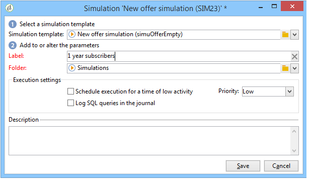
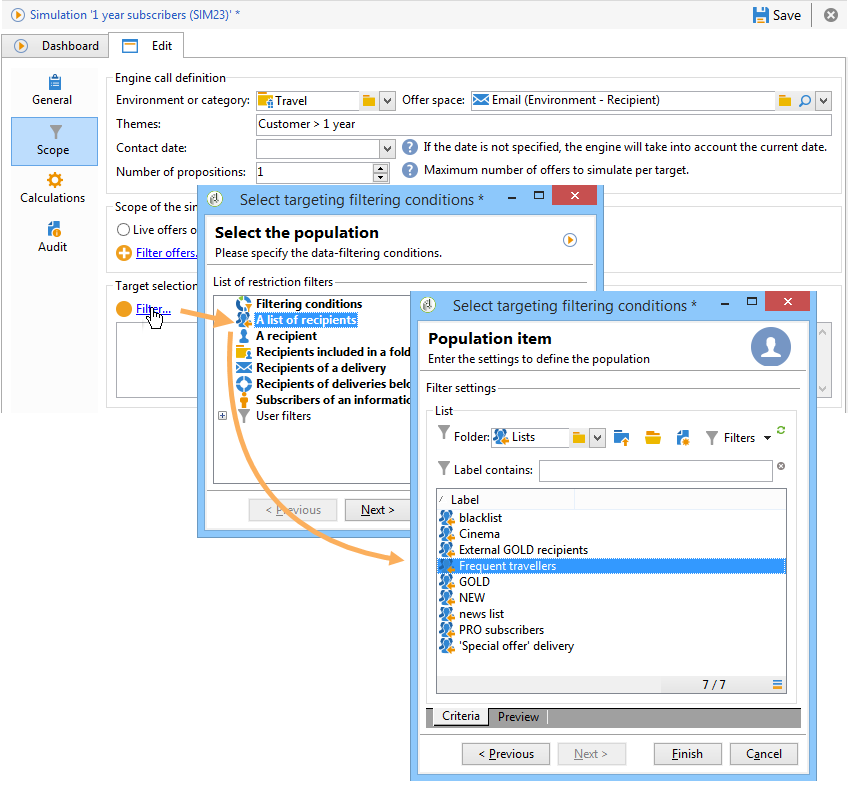

# Erbjudanden på en utgående kanal{#offers-on-an-outbound-channel}

## Leverans av e-posterbjudande {#email-offer-delivery}

I vår databas finns det en kategori reseerbjudanden till Afrika. Berättigandet, kontexterna och representationerna för varje erbjudande har konfigurerats. Nu vill vi skapa en kampanj som visar våra erbjudanden via e-post.

1. Skapa en marknadsföringskampanj och ett arbetsflöde för målinriktning.

   

1. Redigera e-postleveransen och klicka på **[!UICONTROL Offers]** ikonen .

   

1. Välj det e-postutrymme för din erbjudandemiljö som matchar helgerna.

   

1. Välj den kategori som innehåller reseerbjudandena för Afrika.

   

1. Ställ in antalet erbjudanden i leveransen till två.

   

1. Stäng fönstret för hantering av erbjudanden och skapa innehållet i leveransen.

   

1. Använd menyerna för att infoga ett första erbjudande och välj HTML-återgivningsfunktionen.

   

1. Lägg in det andra erbjudandet.

   

1. Klicka **[!UICONTROL Preview]** för att förhandsgranska erbjudandena i leveransen och välj sedan en mottagare som ska förhandsgranska erbjudandena allt eftersom de kommer att få dem.

   

1. Spara leveransen och starta arbetsflödet för målinriktning.
1. Öppna leveransen och klicka på **[!UICONTROL Audit]** fliken för leveransen: ser du att erbjudandemotorn har valt vilka erbjudanden som ska göras från de olika erbjudandena i katalogen.

   

## Simulera erbjudanden {#perform-an-offer-simulation}

1. Klicka på **[!UICONTROL Profiles and Targets]** länken i **[!UICONTROL Simulations]** universum och klicka sedan på **[!UICONTROL Create]** knappen.

   

1. Välj en etikett och ange körningsinställningarna om det behövs.

   

1. Spara simuleringen. Då öppnas den på en ny flik.

   

1. Klicka på **[!UICONTROL Edit]** fliken och sedan **[!UICONTROL Scope]**.

   

1. Välj den kategori som du vill simulera erbjudanden för.

   

1. Välj det erbjudandeutrymme som ska användas för simuleringen.

   

1. Ange giltighetsdatum. Du måste ange ett startdatum. Detta gör att erbjudandemotorfiltret kan erbjuda och välja vilka som är giltiga på ett visst datum.
1. Ange vid behov ett eller flera teman för att begränsa antalet erbjudanden till dem som innehåller nyckelordet i inställningarna.

   I vårt exempel innehåller kategorin **Resor** två underkategorier med två separata teman. Vi vill simulera erbjudanden med temat **Kunder > 1 år** .

   

1. Välj de mottagare som du vill ha som mål.

   

1. Konfigurera antalet erbjudanden som ska skickas till varje mottagare.

   I vårt exempel kommer erbjudandemotorn att välja de tre erbjudandena med den högsta vikten för varje mottagare.

   

1. Spara inställningarna och klicka sedan **[!UICONTROL Start]** på **[!UICONTROL Dashboard]** fliken för att köra simuleringen.

   

1. När simuleringen är klar hittar du detaljerad information om offerter per erbjudande i **[!UICONTROL Results]** .

   I vårt exempel har offertmotorn baserat uppdelningen av erbjudanden på tre anbud.

   

1. Visa **[!UICONTROL Breakdown of offers by rank]** för att visa listan över erbjudanden som valts ut av erbjudandemotorn.

   

1. Om det behövs kan du ändra omfångsinställningarna och köra simuleringen igen genom att klicka **[!UICONTROL Start simulation]**.

   

1. Om du vill spara simuleringsdata använder du historik- eller exportfunktionerna som finns i rapporten.

   

