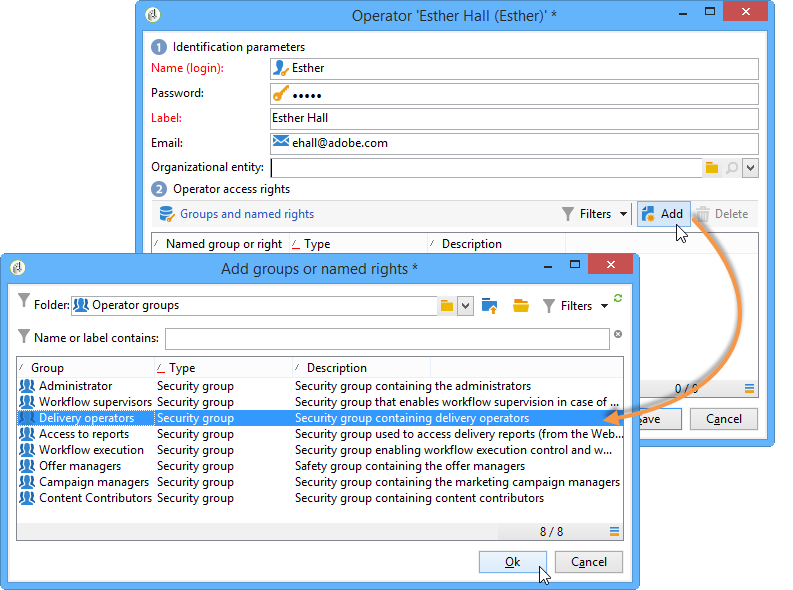

# Operatörsprofiler{#operator-profiles}

Det finns två typer av operatorer som använder Interaction: offer managers och delivery managers. De har specifika rättigheter som bara ger dem tillgång till vissa delar av trädet och plattformen.

* **[!UICONTROL Offer manager]** : skapar och underhåller erbjudanden. Observera att om erbjudanden används i arbetsflödet måste operatorn finnas i **[!UICONTROL Administrator]** eller **[!UICONTROL Offer managers]** operatörsgrupp för att köra arbetsflödet.
* **[!UICONTROL Delivery manager]** : godkänner och använder erbjudanden

Stegen för att skapa operatorer som är specifika för Interaction är identiska med de som används för att skapa alla andra operatorer på plattformen. Mer information om detta finns i [det här avsnittet](../../platform/using/access-management.md). Rättigheterna konfigureras när operatorn skapas.

## Erbjudandehanterare {#offer-manager}

1. Skapa en ny operator.
1. Gå till **[!UICONTROL Groups and named rights]** fönster, klicka **[!UICONTROL Add]** och väljer **[!UICONTROL Offer manager]** grupp.

   

Rättigheterna som tilldelats den som ansvarar för erbjudandet gör att de kan utföra följande uppgifter:

* Ändra **[!UICONTROL Design]** miljöer.
* Visa **[!UICONTROL Live]** miljöer.
* Konfigurera administrationsfunktioner (fördefinierade blanksteg och filter).
* Skapa och ändra kategorier.
* Skapa erbjudanden.
* Konfigurera berättigande för erbjudanden.
* Godkänn erbjudanden.

  >[!NOTE]
  >
  >Erbjudandehanteraren kan bara godkänna ett erbjudande i två specifika fall. Det första är om ingen har specificerats som granskare och det andra är om den som ansvarar för att skapa mallar (med behörighet att tilldela granskare) har angett dem som granskare i erbjudandemallen som erbjudandet baseras på.

## Delivery manager {#delivery-manager}

1. Skapa en ny operator.
1. Gå till **[!UICONTROL Groups and named rights]** fönster, klicka **[!UICONTROL Add]** och väljer **[!UICONTROL Delivery manager]** grupp.

   

De rättigheter som tilldelats till leveransansvariga gör det möjligt för dem att utföra följande uppgifter:

* Visa **[!UICONTROL Live]** miljöer.
* Visa och ändra erbjudandekategorier.
* Godkänn erbjudanden om den här leveranshanteraren har angetts som en av dess granskare.

  >[!NOTE]
  >
  >Leveransansvariga kan bara godkänna ett erbjudande om de har definierats som granskare under konfigurationen av erbjudandet.

## Återvinning av rättigheter enligt operatör {#recap-of-rights-according-to-operator}

<table> 
 <tbody> 
  <tr> 
   <td> </td> 
   <td> <strong>Erbjudandehanterare (redigering)</strong>  </td> 
   <td> <strong>Erbjudandehanterare (live)</strong>  </td> 
  </tr> 
  <tr> 
   <td> <strong>Trädstrukturnivå</strong>  </td> 
   <td> </td> 
   <td> </td> 
  </tr> 
  <tr> 
   <td> Erbjudanden som redigeras/Live-erbjudanden  </td> 
   <td> Läs/skriv  </td> 
   <td> Läs  </td> 
  </tr> 
  <tr> 
   <td> Mottagare - miljö  </td> 
   <td> Läs/skriv  </td> 
   <td> Läs  </td> 
  </tr> 
  <tr> 
   <td> Administration  </td> 
   <td> Läs/skriv  </td> 
   <td> Läs  </td> 
  </tr> 
  <tr> 
   <td> Blanksteg  </td> 
   <td> Läs/skriv  </td> 
   <td> Läs  </td> 
  </tr> 
  <tr> 
   <td> Fördefinierade erbjudandefilter  </td> 
   <td> Läs/skriv  </td> 
   <td> Läs  </td> 
  </tr> 
  <tr> 
   <td> Typologi  </td> 
   <td> Läs/skriv  </td> 
   <td> Läs  </td> 
  </tr> 
  <tr> 
   <td> Typologiregler  </td> 
   <td> Läs/skriv  </td> 
   <td> Läs  </td> 
  </tr> 
  <tr> 
   <td> Erbjudandekatalog  </td> 
   <td> Läs/skriv  </td> 
   <td> Läs  </td> 
  </tr> 
  <tr> 
   <td> Erbjudandekategori  </td> 
   <td> Läs/skriv  </td> 
   <td> Läs  </td> 
  </tr> 
 </tbody> 
</table>

<table> 
 <tbody> 
  <tr> 
   <td> </td> 
   <td> <strong>Delivery manager (redigering)</strong>  </td> 
   <td> <strong>Delivery manager (live)</strong>  </td> 
  </tr> 
  <tr> 
   <td> <strong>Trädstrukturnivå</strong>  </td> 
   <td> </td> 
   <td> </td> 
  </tr> 
  <tr> 
   <td> Erbjudanden som redigeras/Live-erbjudanden  </td> 
   <td> </td> 
   <td> Läs  </td> 
  </tr> 
  <tr> 
   <td> Mottagare - miljö  </td> 
   <td> </td> 
   <td> Läs  </td> 
  </tr> 
  <tr> 
   <td> Administration  </td> 
   <td> </td> 
   <td> </td> 
  </tr> 
  <tr> 
   <td> Blanksteg  </td> 
   <td> </td> 
   <td> </td> 
  </tr> 
  <tr> 
   <td> Fördefinierade erbjudandefilter  </td> 
   <td> Läs  </td> 
   <td> Läs  </td> 
  </tr> 
  <tr> 
   <td> Typologi  </td> 
   <td> Läs  </td> 
   <td> Läs  </td> 
  </tr> 
  <tr> 
   <td> Typologiregler  </td> 
   <td> </td> 
   <td> Läs  </td> 
  </tr> 
  <tr> 
   <td> Erbjudandekatalog  </td> 
   <td> Läs  </td> 
   <td> Läs  </td> 
  </tr> 
  <tr> 
   <td> Erbjudandekategori  </td> 
   <td> </td> 
   <td> Läs  </td> 
  </tr> 
 </tbody> 
</table>
