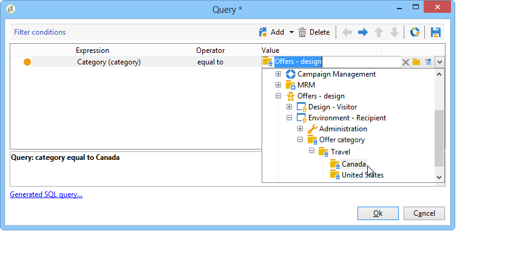
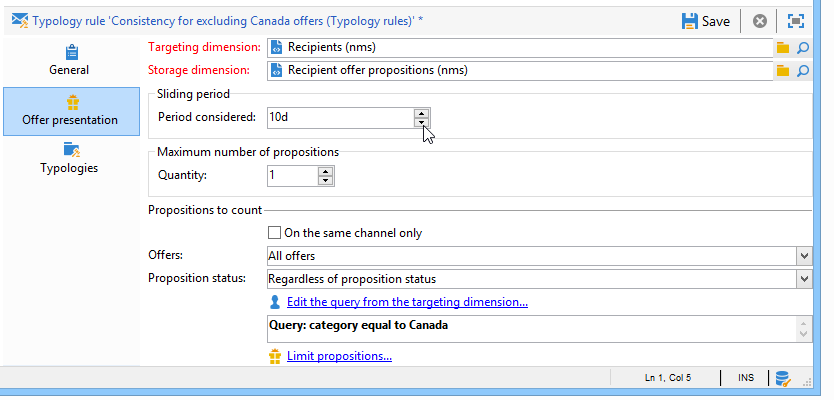
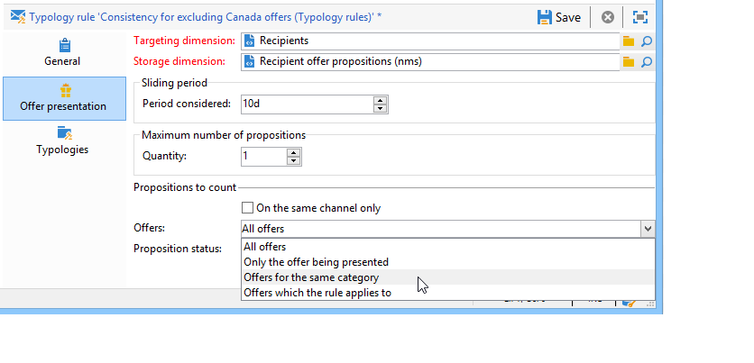
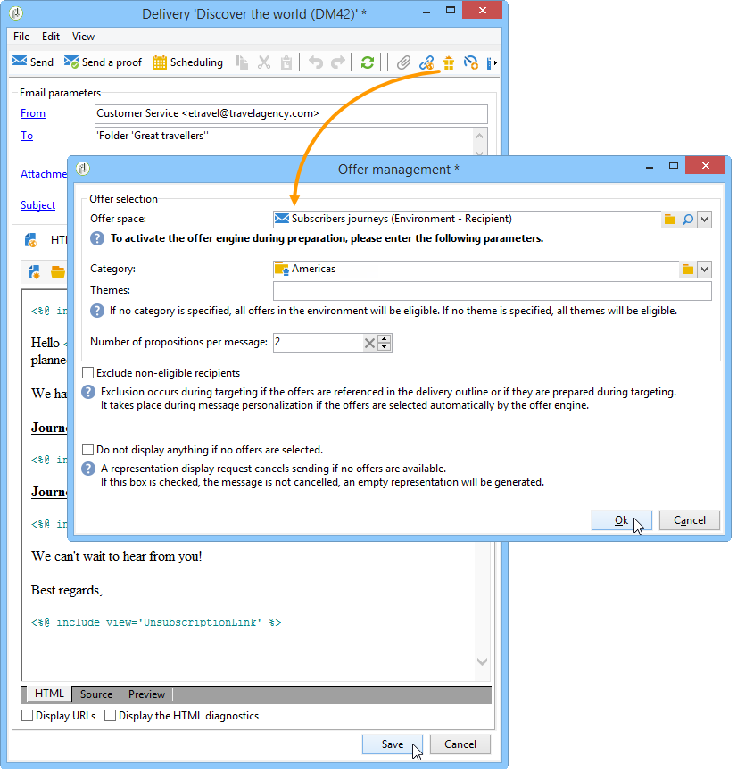

# Presentationsregler{#presentation-rules}

## Skapa en presentationsregel {#creating-a-presentation-rule}

I vår databas finns flera reseerbjudanden för Europa, Afrika, USA och Kanada. Vi vill skicka erbjudanden för en resa till Kanada, men om mottagaren vägrar skicka den här typen av erbjudande vill vi inte skicka det till dem igen

Vi kommer att konfigurera vår regel så att resan till Kanada endast erbjuds en gång per mottagare och inte erbjuds igen om den avvisas.

1. Gå till noden **[!UICONTROL Administration]** > **[!UICONTROL Campaign management]** > **[!UICONTROL Typology management]** > **[!UICONTROL Typology rules]** i Adobe Campaign-trädet.
1. Skapa en ny **[!UICONTROL Offer presentation]** typregel.

   

1. Ändra vid behov etiketten och beskrivningen.

   

1. Välj alternativet **[!UICONTROL All channels]** om du vill utöka regeln till alla kanaler.

   

1. Klicka på **[!UICONTROL Edit expression]** länken och välj **[!UICONTROL Category]** noden som ett uttryck.

   

1. Välj den kategori som matchar ditt reseerbjudande för Kanada och klicka **[!UICONTROL OK]** för att stänga frågefönstret.

   

1. Välj samma dimensioner som de som är konfigurerade i miljön på **[!UICONTROL Offer presentation]** fliken.

   

1. Ange den period under vilken regeln ska gälla.

   

1. Begränsa erbjudandet till ett så att mottagare som redan har avvisat en resa till Kanada inte får ett liknande erbjudande.

   

1. Välj filtret **[!UICONTROL Offers for the same category]** om du vill exkludera alla erbjudanden från kategorin **Kanada** .

   

1. Markera filtret om du bara vill ta hänsyn till förslag som avvisats av mottagaren. **[!UICONTROL Rejected propositions]**

   

1. Välj de mottagare som den här regeln gäller för.

   I vårt exempel ska vi välja **mottagare av vanliga resenärer** .

   

1. Referera regeln i en erbjudandetypologi.

   

1. Gå till erbjudandemiljön (**Miljö - mottagare** i det här fallet) och referera till den nya typologin som just skapats med listrutan på **[!UICONTROL Eligibility]** fliken.

   

## Använda presentationsregeln {#applying-the-presentation-rule}

Här är ett programexempel på den typologiregel som skapades tidigare.

Vi vill skicka ett första erbjudande som tillhör kategorin Kanada. Om någon av mottagarna avvisar erbjudandet kommer det inte att erbjudas igen.

1. I mottagarmappen för **vanliga resenärer** väljer du en av profilerna för att kontrollera de erbjudanden som de är berättigade till: klicka på **[!UICONTROL Propositions]** fliken och sedan på **[!UICONTROL Preview]** fliken.

   I vårt exempel är **Tim Ramsey** berättigad till ett erbjudande som ingår i kategorin **Amerika** .

   

1. Börja med att skapa en e-postleverans som riktar sig till **återkommande resenärer** med erbjudanden.
1. Välj parametrarna för anropet till erbjudandemotorn.

   I vårt exempel väljs kategorin **Resa i Amerika** , som innehåller underkategorierna **Kanada** och **USA** .

   

1. Lägg in erbjudandena i meddelandetexten och skicka leveransen. Mer information finns i [Om utgående kanaler](../../interaction/using/about-outbound-channels.md).

   Mottagaren har fått det erbjudande som de är berättigade till.

1. Mottagaren avvisade erbjudandet från Kanada, vilket visas i offerthistoriken.

   

1. Kontrollera de erbjudanden som de nu är berättigade till.

   Vi ser att inga erbjudanden för Kanada har valts ut.

   

**Relaterat ämne**

* [Hantera erbjudanden och styr redundansen över alla kanaler](https://helpx.adobe.com/campaign/kb/simplifying-campaign-management-acc.html#Manageoffersandcontrolredundancyacrosschannels)