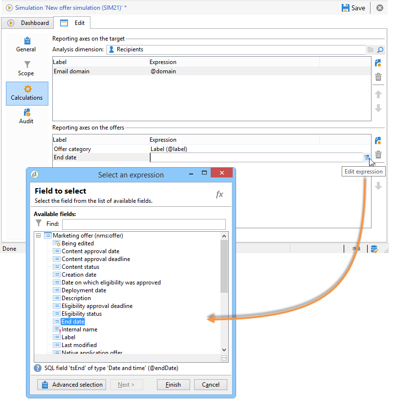

# Simuleringsomfång{#simulation-scope}

## Definition av omfattningen {#definition-of-the-scope}

Öppna **[!UICONTROL Scope]** fliken och välj inställningar.

Följande punkter är obligatoriska:

* Miljö eller erbjudandekategori.
* Erbjud utrymme.
* Kontaktdatum. Erbjudanden som inte är berättigade på kontaktdatumet beaktas inte.
* Målgrupp.

   Om du inte konfigurerar ett filter på målet kommer hela mottagartabellen att beaktas.

* Antal förslag som ska simuleras per mål.

   Mottagaren får så många förslag. Om du till exempel anger 5 får varje mottagare maximalt 5 erbjudandeförslag.

   

Om du vill förfina de erbjudanden som ska beaktas vid simuleringen kan du lägga till ett eller flera teman (som anges i förväg i kategorierna).

Du kan också välja att utföra simuleringen för alla erbjudanden eller endast de som finns online. Vissa filter gör att du kan ändra markeringen om du vill.

>[!NOTE]
>
>Du måste ange ett kontaktdatum. Detta gör att interaktionsmotorn kan sortera erbjudandena i den valda miljön eller kategorin. Om inget datum är konfigurerat genereras ett fel vid simuleringen.

## Lägga till rapporteringsaxlar {#adding-reporting-axes}

Du kan förbättra simuleringsanalysen genom att lägga till rapportaxlar på målet eller själva erbjudandena via **[!UICONTROL Calculations]** fliken.

Det gör du genom att klicka på **[!UICONTROL Add]** knappen och välja lämpliga fält. Axlar används för att beräkna simuleringen och visas i analysrapporten. Mer information finns i [Simuleringsspårning](../../interaction/using/simulation-tracking.md).

