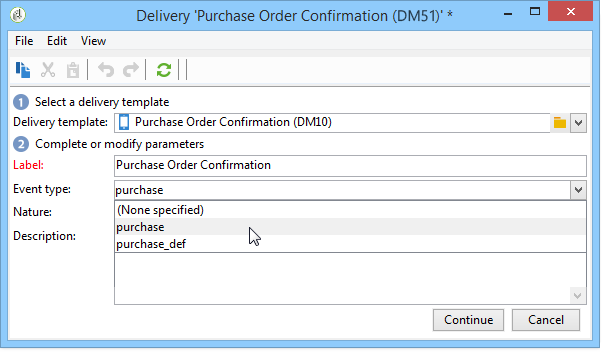

# Händelsebearbetning {#about-event-processing}

I kontexten för transaktionsmeddelanden genereras en händelse av ett externt informationssystem och skickas till Adobe Campaign via metoderna **[!UICONTROL PushEvent]** och **[!UICONTROL PushEvents]** (se [Händelsebeskrivning](../../message-center/using/event-description.md)).

Den här händelsen innehåller data som är länkade till händelsen, till exempel [typ](../../message-center/using/creating-event-types.md) (orderbekräftelse, kontoskapande på en webbplats, osv.), e-postadress eller mobilnummer, samt annan information som gör att du kan förbättra och anpassa transaktionsmeddelandet före leverans (kundens kontaktinformation, meddelandespråk, e-postformat osv.).

Exempel på händelsedata:

## Händelsebearbetningssteg {#event-processing}

För att bearbeta transaktionsmeddelandehändelser tillämpas följande steg på körningsinstansen/instanserna:

1. [Händelsesamling](#event-collection)
1. [Händelseöverföring till en meddelandemall](#routing-towards-a-template)
1. Evenemangsberikning med personaliseringsdata
1. [Leveranskörning](../../message-center/using/delivery-execution.md)
1. [Återvinning av ](#event-recycling) händelser vars länkade leverans misslyckades (via ett Adobe Campaign-arbetsflöde)

När alla steg ovan har utförts via körningsinstansen får varje målmottagare ett personligt meddelande.

>[!NOTE]
>
>Mer information om transaktionsmeddelandeinstanser finns i [Transactional messaging architecture](../../message-center/using/transactional-messaging-architecture.md).

## Händelsesamling {#event-collection}

Händelser som genereras av informationssystemet kan samlas in på två sätt:

* Anrop till SOAP-metoder gör att du kan skicka händelser i Adobe Campaign: Med metoden PushEvent kan du skicka en händelse i taget. Med metoden PushEvents kan du skicka flera händelser samtidigt. Mer information finns i [Händelsebeskrivning](../../message-center/using/event-description.md).

* Om du skapar ett arbetsflöde kan du återställa händelser genom att importera filer eller via en SQL-gateway (med alternativet [Federated Data Access](../../installation/using/about-fda.md)).

När de har samlats in delas händelser upp i tekniska arbetsflöden mellan realtids- och batchköer för körningsinstansen/instanserna, medan händelser väntar på att länkas till en meddelandemall.

>[!NOTE]
>
>I körningsinstanserna får mapparna **[!UICONTROL Real time events]** eller **[!UICONTROL Batch events]** inte anges som vyer eftersom detta kan leda till problem med åtkomst. Mer information om hur du anger en mapp som en vy finns i [det här avsnittet](../../platform/using/access-management-folders.md).

## Routning mot en mall {#routing-towards-a-template}

När meddelandemallen har publicerats på körningsinstansen/körningsinstanserna genereras två mallar automatiskt: en som ska länkas till en realtidshändelse och en som ska länkas till en batchhändelse.

Vägningssteget består i att länka en händelse till rätt meddelandemall baserat på:

* Händelsetypen som anges i egenskaperna för själva händelsen:

   

* Händelsetypen som anges i meddelandemallens egenskaper:

   

Som standard används följande information för routning:

* Händelsetypen
* Den kanal som ska användas (som standard: e-post)
* Den senaste leveransmallen, baserad på publiceringsdatumet

## Händelsestatus {#event-statuses}

I **Händelsehistoriken**, under **[!UICONTROL Message Center]** > **[!UICONTROL Event history]** grupperas alla bearbetade händelser i en enda vy. De kan kategoriseras efter händelsetyp eller efter **status**. Dessa statusvärden är:

* **Väntande**: Händelsen kan vara:

   * En händelse som precis har samlats in och som ännu inte har bearbetats. Kolumnen **[!UICONTROL Number of errors]** visar värdet 0. E-postmallen har ännu inte länkats.
   * En händelse bearbetades men vars bekräftelse är felaktig. Kolumnen **[!UICONTROL Number of errors]** visar ett värde som inte är 0. Om du vill veta när den här händelsen ska behandlas igen kan du läsa kolumnen **[!UICONTROL Process requested on]**.

* **Väntande leverans**: Händelsen bearbetades och leveransmallen är länkad. E-postmeddelandet väntar på att levereras och den klassiska leveransprocessen tillämpas. Du kan öppna leveransen om du vill ha mer information.
* **Skickat**,  **** ignorerat och  **leveransfel**: Dessa leveransstatusvärden återställs via arbetsflödet  **** updateEventsStatus. Mer information får du genom att öppna den relevanta leveransen.
* **Händelsen omfattas** inte: Transactional Messaging-routningsfasen misslyckades. Adobe Campaign hittade till exempel inte e-postmeddelandet som fungerar som mall för händelsen.
* **Händelsen har upphört att gälla**: Det maximala antalet sändningsförsök har uppnåtts. Händelsen betraktas som null.

## Återvinning av händelser {#event-recycling}

Om det inte går att skicka ett meddelande via en viss kanal kan Adobe Campaign skicka meddelandet igen via en annan kanal. Om till exempel en leverans på SMS-kanalen misslyckas, skickas meddelandet igen med e-postkanalen.

För att göra detta måste du konfigurera ett arbetsflöde som återskapar alla händelser med statusen **Leveransfel** och tilldelar dem en annan kanal.

>[!CAUTION]
>
>Det här steget kan bara utföras med ett arbetsflöde och är därför reserverat för expertanvändare. Kontakta er kontoansvarige på Adobe för mer information.