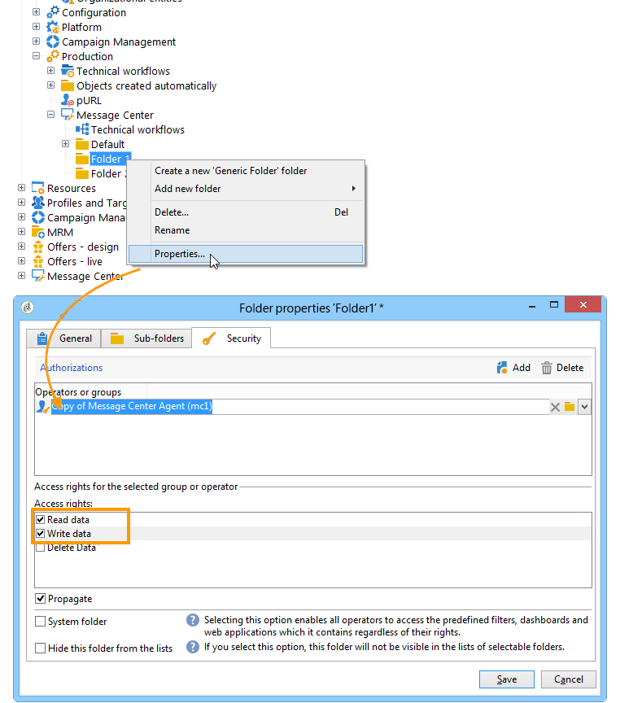

# Konfigurera instanser {#creating-a-shared-connection}

Om du vill använda funktionerna för transaktionsmeddelanden måste du konfigurera instanser för kontroll och körning. Du kan använda antingen:
* [En kontrollinstans](#control-instance) som är associerad med en eller flera körningsinstanser
* [Flera kontrollinstanser](#using-several-control-instances) associerade med flera körningsinstanser

>[!IMPORTANT]
>
>Schematillägg påverkade de resurser som används av [Message Center tekniska arbetsflöden](../../message-center/using/additional-configurations.md#technical-workflows) för antingen kontroll- eller körningsinstanser måste dupliceras i de andra instanser som används av Transactional Messaging-modulen.

Du måste också ange och ansluta körningsinstansen/körningsinstanserna till kontrollinstansen/kontrollinstanserna.

Alla steg som krävs för att konfigurera och ansluta kontroll- och körningsinstanserna beskrivs i det här avsnittet.

>[!IMPORTANT]
>
>Kontrollinstansen och körningsinstansen/körningsinstanserna måste vara installerade på olika datorer. De kan inte dela samma Campaign-instans.

## Konfigurera kontrollinstansen {#control-instance}

Om du vill ansluta kontrollinstansen och körningsinstanserna måste du först skapa och konfigurera ett **[!UICONTROL Execution instance]**-typskonto **på kontrollinstansen**. Därför kan transaktionsmeddelandemallar distribueras till körningsinstanserna när [har publicerats](../../message-center/using/publishing-message-templates.md#template-publication).

Om du använder flera körningsinstanser måste du skapa lika många externa konton som det finns körningsinstanser.

>[!NOTE]
>
>När körningsinstanser används av flera kontrollinstanser kan data delas upp efter mapp och operator. Mer information finns i [Använda flera kontrollinstanser](#using-several-control-instances).

### Skapa ett externt konto

>[!NOTE]
>
>Stegen nedan måste utföras **på kontrollinstansen**.

Så här skapar du ett externt konto av typen **[!UICONTROL Execution instance]**:

1. Gå till mappen **[!UICONTROL Administration > Platform > External accounts]**.
1. Välj ett av de externa konton av körningsinstanstyp som finns i Adobe Campaign, högerklicka och välj **[!UICONTROL Duplicate]**.

   

1. Ändra etiketten efter dina behov.

   

1. Välj alternativet **[!UICONTROL Enabled]** om du vill att det externa kontot ska fungera.

   

1. Ange adressen till den server där körningsinstansen är installerad.

   

1. Kontot måste matcha Message Center Agent enligt operatormappen. Som standard är det användningsklara konto som tillhandahålls av Adobe Campaign **[!UICONTROL mc]**.

   

1. Ange lösenordet för kontot enligt definitionen i mappen operator.

   >[!NOTE]
   >
   >Du kan undvika att ange ett lösenord varje gång du loggar in på instansen genom att ange IP-adressen för kontrollinstansen i körningsinstansen. Mer information finns i [Konfigurera körningsinstansen/instanserna](#execution-instance).

1. Ange den återställningsmetod som ska användas av körningsinstansen. De data som ska återställas vidarebefordras till kontrollinstansen av körningsinstansen för att läggas till i transaktionsmeddelanden och händelsearkiv.

   

   Datainsamling sker antingen via en webbtjänst som använder HTTP/HTTPS-åtkomst eller via FDA-modulen (Federated Data Access).

   >[!NOTE]
   >
   >Observera att när du använder FDA över HTTP stöds endast körningsinstanser med en PostgreSQL-databas. MSSQL- eller Oraclena-databaser stöds inte.

   Den andra metoden (FDA) rekommenderas om kontrollinstansen har direktåtkomst till databasen med körningsinstanserna. Välj i annat fall webbtjänståtkomst. Det FDA-konto som ska anges sammanfaller med anslutningen till databaserna för de olika körningsinstanserna som skapas i kontrollinstansen.

   

   Mer information om FDA (Federated Data Access) finns i [det här avsnittet](../../installation/using/about-fda.md).

1. Klicka på **[!UICONTROL Test the connection]** för att kontrollera att kontrollinstansen och körningsinstansen är länkade till varandra.

   

Om du använder flera körningsinstanser upprepar du dessa steg för att skapa så många externa konton som det finns körningsinstanser.

### Identifiera körningsinstanser {#identifying-execution-instances}

Varje körningsinstans måste associeras med en unik identifierare för att särskilja historiken för varje körningsinstans när de visas på kontrollinstansen.

Den här identifieraren kan tilldelas för varje körningsinstans **manuellt**. I det här fallet måste det här steget utföras **för varje körningsinstans**. Det gör du genom att använda distributionsguiden enligt nedan:

1. Öppna distributionsguiden på en körningsinstans.
1. Gå till fönstret **[!UICONTROL Message Center]**.
1. Tilldela den valda identifieraren till instansen.

   

1. Upprepa stegen ovan för varje körningsinstans.

Identifieraren kan också tilldelas **automatiskt**. Det gör du genom att gå till **kontrollinstansen** och klicka på knappen **[!UICONTROL Initialize connection]**.

## Konfigurera körningsinstansen/instanserna {#execution-instance}

>[!NOTE]
>
>Stegen nedan måste utföras **på körningsinstansen**.

Följ stegen nedan för att ansluta körningsinstansen/körningsinstanserna till kontrollinstansen.

För att kontrollinstansen ska kunna ansluta till körningsinstansen utan att behöva ange ett lösenord anger du bara IP-adressen för kontrollinstansen i **Message Center** -åtkomsträttighetsavsnittet. Tomma lösenord tillåts dock inte som standard.

Om du vill använda ett tomt lösenord går du till körningsinstanserna och definierar en säkerhetszon som är begränsad till IP-adressen för det informationssystem som skickar händelserna. Säkerhetszonen måste tillåta tomma lösenord och acceptera anslutningar av typen `<identifier> / <password>`. Mer information om detta finns i [det här avsnittet](../../installation/using/security-zones.md).

>[!NOTE]
>
>När körningsinstanser används av flera kontrollinstanser kan data delas upp efter mapp och operator. Mer information finns i [Använda flera kontrollinstanser](#using-several-control-instances).

1. På en körningsinstans går du till mappen operator ( **[!UICONTROL Administration > Access management > Operators]** ).
1. Välj agenten **Message Center**.

   

1. Välj fliken **[!UICONTROL Edit]**, klicka på **[!UICONTROL Access rights]** och klicka sedan på länken **[!UICONTROL Edit the access parameters...]**.

   

1. Klicka på länken **[!UICONTROL Add a trusted IP mask]** i fönstret **[!UICONTROL Access settings]** och lägg till IP-adressen för kontrollinstansen.

   

Om du använder flera körningsinstanser upprepar du dessa steg för varje körningsinstans.

## Använda flera kontrollinstanser {#using-several-control-instances}

Du kan dela ett körningskluster med olika kontrollinstanser. Den här typen av arkitektur kräver följande konfiguration.

Tänk dig att ditt företag hanterar två varumärken, var och en med sin egen kontrollinstans: **Kontroll 1** och **Kontroll 2**. Två körningsinstanser används också. Du måste ange en annan Message Center-operator för varje kontrollinstans: en **mc1** -operator för **Control 1** -instansen och en **mc2** -operator för **Control 2** -instansen.

I trädet för alla körningsinstanser skapar du en mapp per operator (**Mapp 1** och **Mapp 2**) och begränsar varje operatörs dataåtkomst till deras mapp.

### Konfigurera kontrollinstanser {#configuring-control-instances}

>[!NOTE]
>
>Stegen nedan måste utföras **på kontrollinstanserna**.

1. Skapa ett externt konto per körningsinstans på kontrollinstansen **Control 1** och ange operatorn **mc1** i varje externt konto. Operatorn **mc1** skapas sedan för alla körningsinstanser (se [Konfigurera körningsinstanser](#configuring-execution-instances)).

   

1. Skapa ett externt konto per körningsinstans på kontrollinstansen **Control 2** och ange operatorn **mc2** i varje externt konto. Operatorn **mc2** skapas sedan för alla körningsinstanser (se [Konfigurera körningsinstanser](#configuring-execution-instances)).

   

   >[!NOTE]
   >
   >Mer information om hur du konfigurerar en kontrollinstans finns i [det här avsnittet](#control-instance).

### Konfigurera körningsinstanser {#configuring-execution-instances}

>[!NOTE]
>
>Stegen nedan måste utföras **på körningsinstanserna**.

Om du vill använda flera kontrollinstanser måste den här konfigurationen utföras på ALLA körningsinstanser.

1. Skapa en mapp per operator i noden **[!UICONTROL Administration > Production > Message Center]**: **Mapp 1** och **Mapp 2**. Mer information om hur du skapar mappar och vyer finns på [den här sidan](../../platform/using/access-management-folders.md).

   

1. Skapa operatorerna **mc1** och **mc2** genom att duplicera operatorn för meddelandecenter som anges som standard (**mc**). Mer information om hur du skapar operatorer finns i [det här avsnittet](../../platform/using/access-management-operators.md).

   

   >[!NOTE]
   >
   >Operatorer för **mc1** och **mc2** måste ha **[!UICONTROL Message Center execution]**-behörighet och de kan inte komma åt Adobe Campaign klientkonsol. En operator måste alltid länkas till en säkerhetszon. Mer information om detta finns i [det här avsnittet](../../installation/using/security-zones.md).

1. För varje operator markerar du rutan **[!UICONTROL Restrict to information found in sub-folders of]** och väljer lämplig mapp (**Mapp 1** för operatorn **mc1** och **Mapp 2** för operatorn **mc2**).

   

1. Ge varje operator läs- och skrivbehörighet för sin mapp. Om du vill göra det högerklickar du på mappen och väljer **[!UICONTROL Properties]**. Välj sedan fliken **[!UICONTROL Security]** och lägg till den relevanta operatorn (**mc1** för **Mapp 1** och **mc2** för **Mapp 2**). Kontrollera att kryssrutorna för **[!UICONTROL Read/Write data]** är markerade.

   
