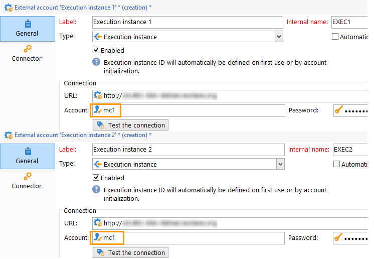
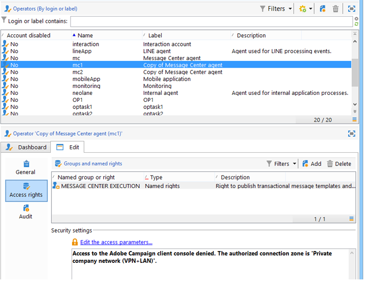

# Skapa en delad anslutning{#creating-a-shared-connection}

>[!CAUTION]
>
>* Schematillägg som görs för scheman som används av [meddelandecentrets tekniska arbetsflöden](../../message-center/using/technical-workflows.md) för antingen kontroll- eller körningsinstanser måste dupliceras i de andra instanser som används av transaktionsmeddelandemodulen i Adobe Campaign.
>* Kontrollinstansen och körningsinstansen/körningsinstanserna måste vara installerade på olika datorer. De kan inte dela samma Campaign-instans.
>

## Kontrollinstans {#control-instance}

Om du har en uppdelad arkitektur måste du ange de körningsinstanser som är länkade till kontrollinstansen och ansluta dem. Transaktionsmeddelandemallar distribueras till körningsinstanserna. Anslutningen mellan kontrollinstansen och körningsinstanserna skapas genom att **[!UICONTROL Execution instance]** typen externa konton konfigureras. Du måste skapa så många externa konton som det finns körningsinstanser.

>[!NOTE]
>
>När körningsinstanser används av flera kontrollinstanser kan data delas upp efter mapp och operator. Mer information finns i [Använda flera kontrollinstanser](#using-several-control-instances).

Så här skapar du ett externt konto av instanstypen körning:

1. Gå till **[!UICONTROL Administration > Platform > External accounts]** mappen.
1. Välj ett av de externa konton av körningsinstanstyp som finns i Adobe Campaign, högerklicka och välj **[!UICONTROL Duplicate]** .

   

1. Ändra etiketten efter dina behov.

   

1. Välj **[!UICONTROL Enabled]** alternativet om du vill att det externa kontot ska fungera.

   

1. Ange adressen till den server där körningsinstansen är installerad.

   

1. Kontot måste matcha Message Center Agent enligt operatormappen. Som standard är det färdiga konto som tillhandahålls av Adobe Campaign **[!UICONTROL mc]** .

   

1. Ange lösenordet för kontot enligt definitionen i mappen operator.

   >[!NOTE]
   >
   >Du kan undvika att ange ett lösenord varje gång du loggar in på instansen genom att ange IP-adressen för kontrollinstansen i körningsinstansen. Mer information finns i [Körningsinstans](#execution-instance).

1. Ange den återställningsmetod som ska användas av körningsinstansen.

   De data som ska återställas vidarebefordras till kontrollinstansen av körningsinstansen för att läggas till i transaktionsmeddelanden och händelsearkiv.

   

   Datainsamling sker antingen via en webbtjänst som använder HTTP/HTTPS-åtkomst eller via FDA-modulen (Federated Data Access).

   Den andra metoden rekommenderas om kontrollinstansen har direktåtkomst till databasen för körningsinstanserna. Välj i annat fall webbtjänståtkomst. Det FDA-konto som ska anges sammanfaller med anslutningen till databaserna för de olika körningsinstanserna som skapas i kontrollinstansen.

   

   Mer information om FDA (Federated Data Access) finns i [Åtkomst till en extern databas](../../platform/using/accessing-an-external-database.md).

1. Klicka **[!UICONTROL Test the connection]** för att kontrollera att kontrollinstansen och körningsinstansen är länkade till varandra.

   

1. Varje körningsinstans måste associeras med en identifierare. Den här identifieraren kan tilldelas för varje körningsinstans manuellt med hjälp av distributionsguiden (se [Identifiera körningsinstanser](../../message-center/using/identifying-execution-instances.md)), eller automatiskt, genom att klicka på **initiera anslutning** från kontrollinstansen.

   

## Körningsinstans {#execution-instance}

Om du vill att kontrollinstansen ska kunna ansluta till körningsinstansen utan att behöva ange ett lösenord anger du bara IP-adressen för kontrollinstansen i avsnittet **Meddelandecentrets** åtkomstbehörighet. Tomma lösenord tillåts dock inte som standard.

Om du vill använda ett tomt lösenord går du till körningsinstanserna och definierar en säkerhetszon som är begränsad till IP-adressen för det informationssystem som skickar händelserna. Den här säkerhetszonen måste tillåta tomma lösenord och acceptera `<identifier> / <password>` typanslutningar. Mer information finns i [det här avsnittet](../../installation/using/configuring-campaign-server.md#defining-security-zones).

>[!NOTE]
>
>När körningsinstanser används av flera kontrollinstanser kan data delas upp efter mapp och operator. Mer information finns i [Använda flera kontrollinstanser](#using-several-control-instances).

1. Gå till mappen operator i körningsinstansen ( **[!UICONTROL Administration > Access management > Operators]** ).
1. Välj agenten för **meddelandecentret** .

   

1. Markera **[!UICONTROL Edit]** fliken, klicka på **[!UICONTROL Access rights]** och klicka sedan på **[!UICONTROL Edit the access parameters...]** länken.

   

1. I **[!UICONTROL Access settings]** fönstret klickar du på **[!UICONTROL Add a trusted IP mask]** länken och lägger till IP-adressen för kontrollinstansen.

   

## Använda flera kontrollinstanser {#using-several-control-instances}

Du kan dela ett körningskluster med olika kontrollinstanser. Den här typen av arkitektur kräver följande konfiguration.

Om ditt företag till exempel hanterar två varumärken, var och en med sin egen kontrollinstans: **Kontroll 1** och **Kontroll 2**. Två körningsinstanser används också. Du måste ange en annan Message Center-operator för varje kontrollinstans: en **mc1** -operator för **Control 1** -instansen och en **mc2** -operator för **Control 2** -instansen.

I trädet för alla körningsinstanser skapar du en mapp per operator (**Mapp 1** och **Mapp 2**) och begränsar varje operatörs dataåtkomst till mappen.

### Konfigurera kontrollinstanser {#configuring-control-instances}

1. I **kontrollinstansen Control 1** skapar du ett externt konto per körningsinstans och anger operatorn **mc1** i varje externt konto. Därefter skapas operatorn **mc1** för alla körningsinstanser (se [Konfigurera körningsinstanser](#configuring-execution-instances)).

   

1. I **kontrollinstansen Control 2** skapar du ett externt konto per körningsinstans och anger operatorn **mc2** i varje externt konto. Operatorn **mc2** skapas sedan för alla körningsinstanser (se [Konfigurera körningsinstanser](#configuring-execution-instances)).

   

   >[!NOTE]
   >
   >Mer information om hur du konfigurerar en kontrollinstans finns i [Kontrollinstans](#control-instance).

### Konfigurera körningsinstanser {#configuring-execution-instances}

Om du vill använda flera kontrollinstanser måste den här konfigurationen utföras på ALLA körningsinstanser.

1. Skapa en mapp per operator i **[!UICONTROL Administration > Production > Message Center]** noden: **Mapp 1** och **Mapp 2**. Mer information om hur du skapar mappar och vyer finns i [Plattform](../../platform/using/access-management.md#folders-and-views).

   

1. Skapa operatorerna **mc1** och **mc2** genom att duplicera operatorn Message Center som anges som standard (**mc**). Mer information om hur du skapar operatorer finns i [det här avsnittet](../../platform/using/access-management.md#operators).

   

   >[!NOTE]
   >
   >**mc1** - och **mc2** -operatorer måste ha **[!UICONTROL Message Center execution]** rättigheter och kan inte komma åt Adobe Campaign-klientkonsolen. En operator måste alltid länkas till en säkerhetszon. Mer information finns i [det här avsnittet](../../installation/using/configuring-campaign-server.md#defining-security-zones).

1. För varje operator markerar du **[!UICONTROL Restrict to information found in sub-folders of]** rutan och väljer lämplig mapp (**Mapp 1** för operatorn **mc1** och **Mapp 2** för operatorn **mc2** ).

   

1. Ge varje operator läs- och skrivbehörighet för sin mapp. Om du vill göra det högerklickar du på mappen och väljer **[!UICONTROL Properties]** . Markera sedan **[!UICONTROL Security]** fliken och lägg till den relevanta operatorn (**mc1** för **Mapp 1** och **mc2** för **Mapp 2**). Kontrollera att **[!UICONTROL Read/Write data]** rutorna är markerade.

   

