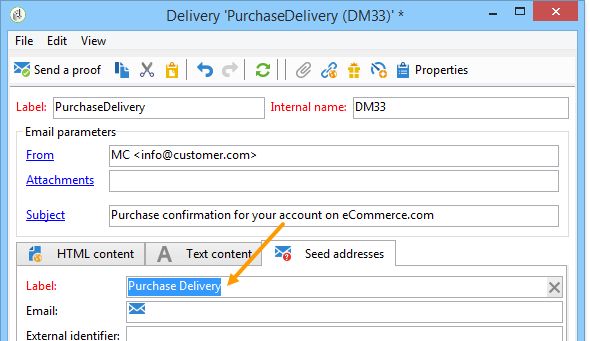

# Hantera dirigerade adresser i transaktionsmeddelanden{#managing-seed-addresses-in-transactional-messages}

Med en dirigerad adress kan du visa en förhandsgranskning av ditt meddelande, skicka ett korrektur och testa meddelandepersonalisering innan e-post eller SMS-leverans. Seed-adresserna är kopplade till leveransen och kan inte användas för andra leveranser.

## Skapa en startadress {#creating-a-seed-address}

1. Klicka på **[!UICONTROL Seed addresses]** fliken i transaktionsmeddelandemallen.

   

1. Tilldela en etikett till den så att du enkelt kan välja den senare.

   

1. Ange startadressen (e-post eller mobiltelefon beroende på kommunikationskanalen).

   

1. Ange den externa identifieraren: I det här valfria fältet kan du ange en affärsnyckel (unikt ID, namn + e-post osv.) som är gemensamma för alla program på webbplatsen och som används för att identifiera dina profiler. Om det här fältet också finns i marknadsföringsdatabasen för Adobe Campaign kan du sedan koppla en händelse till en profil i databasen.

   

1. Infoga testdata (se [personaliseringsdata](../../message-center/using/personalization-data.md)).

   

## Skapa flera dirigeringsadresser {#creating-several-seed-addresses}

1. Klicka på **[!UICONTROL Add other seed addresses]** länken och sedan på **[!UICONTROL Add]** knappen.

   

1. Följ konfigurationsstegen för en startadress som anges i avsnittet [Skapa en startadress](#creating-a-seed-address) .
1. Upprepa processen för att skapa så många adresser du behöver.

   

När adresserna har skapats kan du visa deras förhandsgranskning och personalisering. Se Förhandsgranska [transaktionsmeddelande](../../message-center/using/transactional-message-preview.md).
