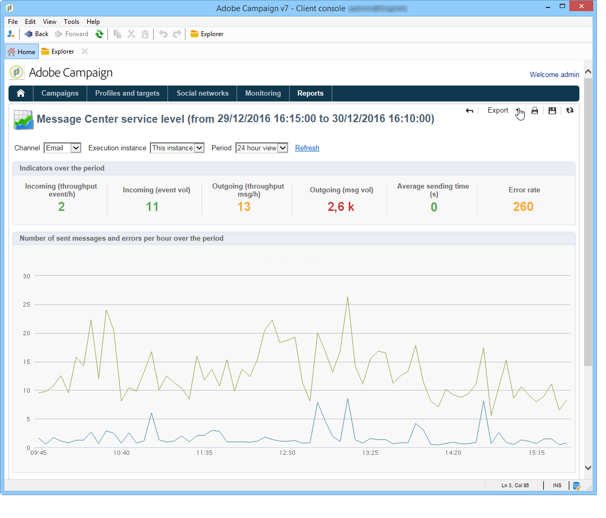

# Tjänstenivå för meddelandecentret {#message-center-service-level}

Den här rapporten innehåller leveransstatistik för transaktionsmeddelanden samt felinformation. Du kan klicka på en feltyp för att visa information om den.

Den här rapporten, som riktar sig till tekniska administratörer, kan också nås via fliken **[!UICONTROL Monitoring]** i kontrollinstansen.

I den här rapporten kan du välja att visa den övergripande statistiken eller den som är relativ till en viss körningsinstans. Du kan också filtrera data efter kanal och under en viss period.

Indikatorerna som visas i avsnittet **[!UICONTROL Indicators over the period]** beräknas för den valda perioden:

* **[!UICONTROL Incoming (throughput event/h)]** : genomsnittligt antal händelser per timme som anges i meddelandecenterkön.
* **[!UICONTROL Incoming (event vol)]** : antal händelser har angetts i meddelandecenterkön.
* **[!UICONTROL Outgoing (throughput msg/h)]** : genomsnittligt antal utgående Message Center-händelser per timme (skickas av en leverans).
* **[!UICONTROL Outgoing (msg vol)]** : antal slutförda utgående Message Center-händelser (skickade av en leverans).
* **[!UICONTROL Average sending time (seconds)]** : Genomsnittlig tid i meddelandecentret för slutförda händelser. Beräkningen tar hänsyn till bearbetningstiden och den maximala sändningstiden.
* **[!UICONTROL Error rate]** : antal händelser med fel jämfört med antalet händelser som har öppnats i Message Center-kön. Följande fel beaktas: routningsfel, utgångna händelser (händelse som har varit i kön för lång), leveransfel, ignoreras av leveransen (karantän, osv.).

>[!NOTE]
>
>Tröskelvärdena för varningsmeddelanden (orange) och varningsmeddelanden (röda) kan konfigureras i distributionsguiden. Se [Skärmtröskelvärden](../../message-center/using/additional-configurations.md#monitoring-thresholds).
