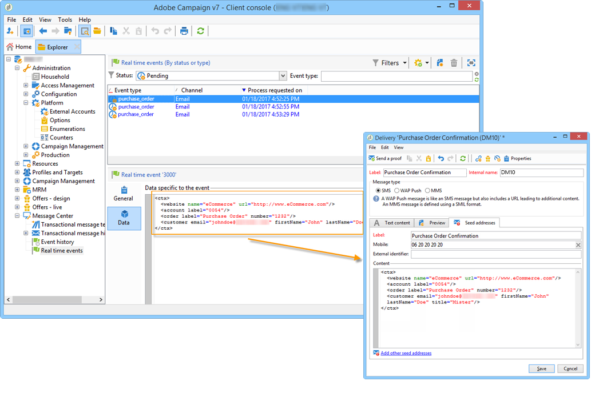

# Personaliseringsdata{#personalization-data}

Det går att använda data i meddelandemallen för att testa anpassning av transaktionsmeddelanden. Den här funktionen används för att generera en förhandsgranskning eller skicka ett korrektur. Om du installerar modulen **Leverans** kan du med den här informationen visa en återgivning av meddelanden för olika leverantörer av Internetåtkomst (**inkorgsåtergivning**: Mer information finns i [det här avsnittet](../../delivery/using/about-deliverability.md)).

Syftet med dessa data är att testa dina meddelanden innan de levereras. Dessa meddelanden sammanfaller inte med faktiska data som ska bearbetas av meddelandecentret. XML-strukturen måste dock vara identisk med den för händelsen som lagras i körningsinstansen, vilket visas nedan.

Med den här informationen kan du anpassa meddelandeinnehåll med personaliseringstaggar (mer information finns i [Skapa meddelandeinnehåll](../../message-center/using/creating-message-content.md)).

1. Klicka på **[!UICONTROL Seed addresses]** fliken i meddelandemallen.
1. I händelseinnehållet anger du testinformationen i XML-format.

   

