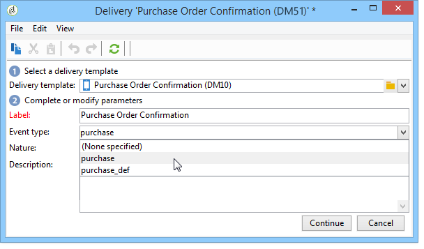

# Cirkulera mot en mall{#routing-towards-a-template}

När meddelandemallen har publicerats på körningsinstansen/körningsinstanserna genereras automatiskt två mallar som ska länkas till en realtid eller en batchhändelse. Vägningssteget består av att länka en händelse till rätt meddelandemall. Länkningen baseras på händelsetypen som anges i egenskaperna för själva händelsen och mallens egenskaper.

Definition av händelsetypen i händelseegenskaperna:

Definition av händelsetypen i meddelandemallens egenskaper:

Som standard baseras routningen på följande information:

* händelsetypen,
* den kanal som ska användas (som standard: e-post),
* den senaste leveransmallen, baserat på publiceringsdatumet.

