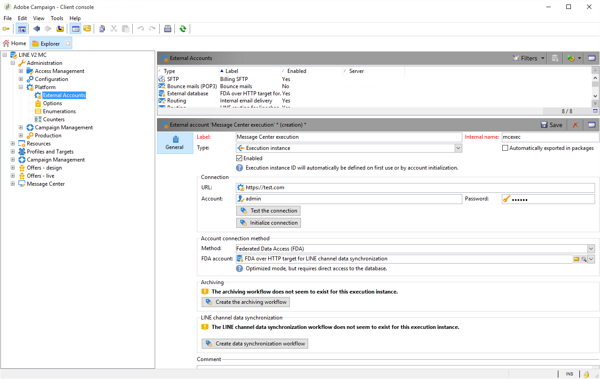

# Transaktionsmeddelandets arkitektur{#transactional-messaging-architecture}

## Om körnings- och kontrollinstanser {#about-execution-and-control-instances}

I Adobe Campaign har funktioner för transaktionsmeddelanden (även kallat Message Center) utformats för att stödja skalbarhet och tillhandahålla en tjänst dygnet runt. Den består av flera instanser:

* en kontrollinstans som meddelandemallarna skapas i,
* en eller flera körningsinstanser som tar emot händelser och levererar meddelanden.

För att kunna använda dessa funktioner loggar Adobe Campaign-användare in på kontrollinstansen för att skapa transaktionsmeddelandemallar, generera meddelandeförhandsvisningen med hjälp av en startlista, visa rapporter och övervaka körningsinstanser.

Körningsinstanser tar emot händelser, länkar dem till transaktionsmeddelandemallar och skickar ett personligt meddelande till varje mottagare.


## Stöd för flera kontrollinstanser {#supporting-several-control-instances}

>[!IMPORTANT]
>
>Delning av ett körningskluster med flera kontrollinstanser stöds endast i lokala miljöer.

Det går att dela ett körningskluster mellan flera kontrollinstanser. Om du till exempel hanterar flera specialiserade butiker kan du konfigurera en kontrollinstans per varumärke och länka alla till samma körningskluster.


>[!NOTE]
>
>Mer information om nödvändig konfiguration finns i [Använda flera kontrollinstanser](../../message-center/using/creating-a-shared-connection.md#using-several-control-instances).

## Installerar instanser {#installing-instances}

Du måste vidta flera försiktighetsåtgärder när du installerar Transactional-meddelandepaket. Adobe rekommenderar att du arbetar i en testmiljö innan du börjar producera något. Du måste också ha en kompatibel Adobe Campaign-licens. Kontakta er kontoansvarige på Adobe för mer information.

>[!IMPORTANT]
>
>Kontrollinstansen och körningsinstansen/körningsinstanserna måste vara installerade på olika datorer. De kan inte dela samma Campaign-instans.

Om du behöver använda flera kanaler måste du installera och konfigurera relaterade paket innan du installerar Transactional-meddelandepaket. Se [Lägga till en leveranskanal](#adding-a-delivery-channel).

* Om du vill installera kontrollinstansen på datorn väljer du modulen **[!UICONTROL Transactional message control]**.

   

* Om du vill installera körningsinstansen på datorn väljer du modulen **[!UICONTROL Transactional message execution]**.

   

## Lägga till en leveranskanal {#adding-a-delivery-channel}

Lägga till en leveranskanal (mobilkanal, mobilappskanal osv.) måste utföras innan du installerar Transactional-meddelandepaketet.

Adobe rekommenderar att du alltid lägger till leveranskanalpaketet innan du installerar Transactional-meddelandepaketet.

Om du har påbörjat ett transaktionsmeddelandeprojekt i e-postkanalen och sedan bestämmer dig under projektet för att lägga till en ny kanal, kan du följa stegen nedan.

>[!NOTE]
>
>Den här proceduren gäller endast kunder som använder en Windows NLServer som är installerad på samma dator som de arbetar på.

1. Installera den kanal du behöver, till exempel **Mobile channel**, med hjälp av guiden för paketimport ( **[!UICONTROL Tools > Advanced > Import package... > Adobe Campaign Package]**).
1. Utför en filimport ( **[!UICONTROL Tools > Advanced > Import package... > File]**) och välj filen **datakitnms **`[Your language]`**packageCenter.xml**.
1. I **[!UICONTROL XML content of the data to import]** ska du bara behålla den leveransmall som motsvarar den tillagda kanalen. Om du till exempel har lagt till **mobilkanalen** ska du bara behålla elementet **entities** som motsvarar **[!UICONTROL Mobile transactional message]** (smsTriggerMessage). Om du har lagt till **Mobile App Channel** ska du bara behålla **transaktionsmeddelandet** (iosTriggerMessage) och **transaktionsmeddelandet för Android** (androidTriggerMessage).

   

<!--## Transactional messages and inbound Interaction {#transactional-messages-and-inbound-interaction}

When combined with the Inbound Interaction module, transactional messaging enables you to insert a marketing offer dedicated to the recipient into the message.

>[!NOTE]
>
>The Interaction module is detailed in [Interaction](../../interaction/using/interaction-and-offer-management.md).

To use transactional messaging with Interaction, you need to apply the following configurations:

* Install the **Interaction** package onto the control instance and configure your offer catalog.

  >[!IMPORTANT]
  >
  >Do not replicate the offers onto the execution instances.

* The event must include an identifier linked to the recipients, for personalizing offers. The **@externalId** attribute must contain the value of this identifier. **Interaction** is configured by default to identify the recipient of the primary key:

  ```
  <rtEvent type="order_confirmation" email="john.doe@adobe.com" externalId="1242"> 
  ```

  You can configure **Interaction** so that identification takes place in the field of your choice, for example on the email address:

  ```
  <rtEvent type="order_confirmation" email="john.doe@adobe.com" externalId="john.doe@yahoo.com"> 
  ```

Create your delivery templates the way you would for an email campaign:

* Add the offer to your transactional message template.
* Check the preview, send a proof and publish the template.

You also have to enable the unitary mode on your offer spaces. For more on this, refer to [this section](../../interaction/using/creating-offer-spaces.md).-->

## Transaktionsmeddelanden och push-meddelanden {#transactional-messaging-and-push-notifications}

I kombination med mobilappskanalmodulen kan du med transaktionsmeddelanden skicka transaktionsmeddelanden via meddelanden på mobila enheter.

>[!NOTE]
>
>Mobilappskanalen beskrivs i [det här avsnittet](../../delivery/using/about-mobile-app-channel.md).

Om du vill använda transaktionsmeddelandemoduler med Mobile App Channel måste du använda följande konfigurationer:

1. Installera **Mobile App Channel**-paketet på kontroll- och körningsinstanserna.
1. Replikera **Mobile-programmet**-typen av Adobe Campaign-tjänst samt de mobilprogram som den innehåller i körningsinstanserna.

Händelsen måste innehålla följande element:

* Mobilenhets-ID (**registrationId** för Android och **deviceToken** för iOS). Detta ID representerar den adress som meddelandet ska skickas till.
* Länken till mobilprogrammet eller integreringsnyckeln (**uid**) som gör att du kan återställa anslutningsinformation som är specifik för programmet.
* Den kanal som meddelandet ska skickas till (**önskadKanal**): 41 för iOS och 42 för Android
* Alla data är användbara för personalisering

Här är ett exempel på en händelse som innehåller den här informationen:

```
<SOAP-ENV:Envelope xmlns:xsd="http://www.w3.org/2001/XMLSchema" xmlns:xsi="http://www.w3.org/2001/XMLSchema-instance" xmlns:SOAP-ENV="http://schemas.xmlsoap.org/soap/envelope/">
   <SOAP-ENV:Body>
     <urn:PushEvent>
         <urn:sessiontoken>mc/</urn:sessiontoken>
         <urn:domEvent>

              <rtEvent wishedChannel="41" type="DELIVERY" registrationToken="2cefnefzef758398493srefzefkzq483974">
                <mobileApp _operation=”none” uuid="com.adobe.NeoMiles"/>
                <ctx>
                    <deliveryTime>1:30 PM</deliveryTime>
                    <url>http://www.adobe.com</url>
                </ctx>
              </rtEvent>

         </urn:domEvent>
     </urn:PushEvent>           
   </SOAP-ENV:Body>
</SOAP-ENV:Envelope>
```

>[!NOTE]
>
>Meddelandemallar skapas inte på samma sätt.

## Transactional messaging and LINE {#transactional-messaging-and-line}

I kombination med LINE Channel kan du med transaktionsmeddelanden skicka meddelanden i realtid på LINE-appen som är installerad på konsumentmobilenheter. Detta används för att skicka välkomstmeddelandet när en LINE-användare lägger till varumärkets sida.

Om du vill använda transaktionsmeddelandemodulen med LINE behöver du följande element för konfigurationen på din **marketing**-instans och din **exekvering**-instans:

* Installera **[!UICONTROL LINE Connect]**-paketet på båda instanserna.
* Installera **[!UICONTROL Transactional message control]**-paketet på din marknadsinstans och **[!UICONTROL Transactional message execution]**-paketet på körningsinstansen.
* Skapa en LINE **extern konto** och **tjänst** för båda instanserna med samma namn för att de ska synkroniseras. Mer information om hur du skapar ett externt LINE-konto och -tjänst finns på den här [sidan](../../delivery/using/line-channel.md#creating-a-line-account-and-an-external-account-).

Från **[!UICONTROL Explorer]**, i **[!UICONTROL Platform]** > **[!UICONTROL External account]**, måste du sedan konfigurera olika externa konton för båda instanserna:

1. Skapa ett externt **[!UICONTROL External database]**-konto i din **exekvering**-instans med följande konfiguration:

   

   * **[!UICONTROL Label]** och  **[!UICONTROL Internal name]** : namnge ditt externa konto efter behov.
   * **[!UICONTROL Type]** : välj  **[!UICONTROL External database]** .
   * **[!UICONTROL Enabled]** måste vara markerad.

   Från kategorin **[!UICONTROL Connection]**:

   * **[!UICONTROL Type]** : välj databasserver, t.ex. PostgresSQL.
   * **[!UICONTROL Server]** : ange URL:en för databasservern.
   * **[!UICONTROL Account]** : ange ditt databaskonto.

      >[!NOTE]
      >
      >Databasanvändaren måste ha läsbehörighet för följande tabeller för FDA-anslutningen: XtkOption, NmsVisitor, NmsVisitorSub, NmsService, NmsBroadLogRtEvent, NmsBroadLogBatchEvent, NmsTrackingLogRtEvent, NmsTrackingLogBatchEvent, NmsRtEvent, NmsBatchEvent, NmsBroadLog Msg, NmsTrackingUrl, NmsDelivery, NmsWebTrackingLogXtkFolder.

   * **[!UICONTROL Password]** : Ange lösenordet för ditt databaskonto.
   * **[!UICONTROL Database]** : ange databasnamnet för körningsinstansen.
   * **[!UICONTROL Target of an HTTP relay to remote database's account]** måste vara markerad.


1. Skapa ett **[!UICONTROL External Database]**-konto i din **Marketing**-instans med följande konfiguration.

   

   * **[!UICONTROL Label]** och  **[!UICONTROL Internal name]** : namnge ditt externa konto efter behov.
   * **[!UICONTROL Type]** : välj  **[!UICONTROL External database]** .
   * Rutan Aktiverad måste vara markerad.

   Från kategorin **[!UICONTROL Connection]**:

   * **[!UICONTROL Type]** : välj  **[!UICONTROL HTTP relay to remote Database]** .
   * **[!UICONTROL Server]** : Ange kampanjens server-URL för körningsinstansen.
   * **[!UICONTROL Account]** : Ange kontot som används för att komma åt din körningsinstans.
   * **[!UICONTROL Password]** : Ange lösenordet för kontot som används för att komma åt din körningsinstans.
   * **[!UICONTROL Data Source]** : ange följande syntax  **[!UICONTROL nms:extAccount:ID of your external database account in the execution instance]** .


1. Skapa ett externt **[!UICONTROL Execution instance]**-konto i din **Marketing**-instans med följande konfiguration för att skapa arbetsflödet för datasynkronisering:

   

   * **[!UICONTROL Label]** och  **[!UICONTROL Internal name]** : namnge ditt externa konto efter behov.
   * **[!UICONTROL Type]** : välj  **[!UICONTROL Execution instance]** .
   * Rutan Aktiverad måste vara markerad.

   Från kategorin **[!UICONTROL Connection]**:

   * **[!UICONTROL URL]** : ange körningsinstansens URL.
   * **[!UICONTROL Account]** : ange det konto som används för att komma åt din körningsinstans.
   * **[!UICONTROL Password]** : Ange lösenordet för kontot som används för att komma åt din körningsinstans.

   Från kategorin **[!UICONTROL Account connection method]**:

   * **[!UICONTROL Method]** : välj  **[!UICONTROL Federated Data Access (FDA)]** .
   * **[!UICONTROL FDA account]** : välj ditt FDA-konto i listrutan.
   * Klicka på knappen **[!UICONTROL Create the archiving workflow]**.
   * Klicka på knappen **[!UICONTROL Create data synchronization workflow]** för att skapa arbetsflödet för synkronisering av LINE-data.


1. Nu kan du börja skapa transaktionsmeddelanden. Se denna [sida](../../message-center/using/introduction.md) för mer information om detta.
