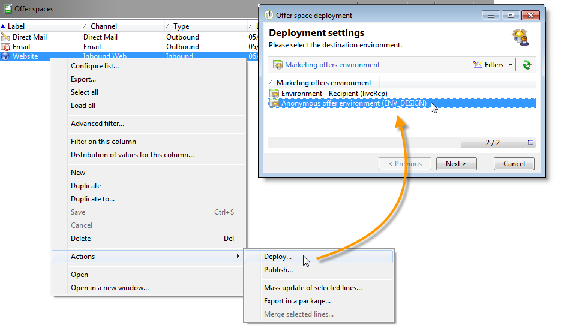
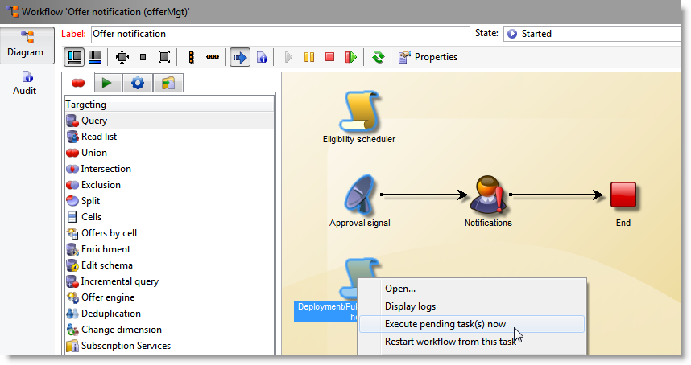

# Allmänna konfigurationer{#general-configurations}

I det här avsnittet beskrivs den konfiguration som ska utföras i Adobe Campaign v7 om du migrerar från en v5.11 eller en v6.02.

Dessutom:

* Om du migrerar från v5.11 måste du också slutföra konfigurationen som beskrivs i avsnittet [Specifika konfigurationer i v5.11](../../migration/using/specific-configurations-in-v5-11.md) .
* Om du migrerar från v6.02 måste du också slutföra konfigurationen som beskrivs i avsnittet [Specifika konfigurationer i v6.02](../../migration/using/specific-configurations-in-v6-02.md) .

## Tidszoner {#time-zones}

### Läge för flera tidszoner {#multi-time-zone-mode}

I v6.02 var läget &quot;multi time zone&quot; bara tillgängligt för PostgreSQL-databasmotorer. Det erbjuds nu oavsett vilken typ av databasmotor som används. Vi rekommenderar att du omvandlar din bas till en&quot;multi-timezone&quot;-bas.

Om du vill använda TIMESTAMP MED TIMEZONE-läge måste du även lägga till alternativet **-userTimestamptz:1** på kommandoraden efter uppgradering.

>[!IMPORTANT]
>
>Om parametern **-usetimestamptz:1** används med en inkompatibel databasmotor kommer databasen att vara skadad och du måste återställa en säkerhetskopia av databasen och köra kommandot ovan igen.

>[!NOTE]
>
>Det går att ändra tidszonen efter migrering via konsolen (**[!UICONTROL Administration > Platform > Options > WdbcTimeZone]** nod).
>
>Mer information om hantering av tidszoner finns i [det här avsnittet](../../installation/using/time-zone-management.md).

### Oracle {#oracle}

Om du får ett **ORA 01805** -fel under efteruppgraderingen innebär det att Oracles tidszonsfiler mellan programservern och databasservern inte är synkroniserade. Så här synkroniserar du dem igen:

1. Kör följande kommando för att identifiera tidszonsfilen som används:

   ```
   select * from v$timezone_file
   ```

   Tidszonsfiler finns vanligtvis i mappen **ORACLE_HOME/oracore/zoneinfo/** .

1. Kontrollera att tidszonsfilerna är identiska på båda servrarna.

Mer information finns på: [https://docs.oracle.com/cd/E11882_01/server.112/e10729/ch4datetime.htm#NLSPG004](https://docs.oracle.com/cd/E11882_01/server.112/e10729/ch4datetime.htm#NLSPG004).

En felpassning av tidszonen mellan klienten och servern kan också orsaka vissa förluster. Därför rekommenderar vi att du använder samma version av Oracle-biblioteket på klient- och serversidan. Båda tidszonerna måste vara desamma.

Så här kontrollerar du om båda sidorna finns i samma tidszoner:

1. Kontrollera versionen av tidszonsfilen på klientsidan genom att köra följande kommando:

   ```
   genezi -v
   ```

   genezi är en binärfil som finns i **$ORACLE_HOME/bin** -databasen.

1. Kontrollera versionen av tidszonsfilen på serversidan genom att köra följande kommando:

   ```
   select * from v$timezone_file
   ```

1. Om du vill ändra tidszonsfilen på klientsidan använder du miljövariabeln **ORA_TZFILE** .

## Säkerhet {#security}

### Säkerhetszoner {#security-zones}

>[!IMPORTANT]
>
>Av säkerhetsskäl är Adobe Campaign-plattformen inte längre tillgänglig som standard: måste du konfigurera säkerhetszonerna och därför samla in operatörens IP-adresser.

Adobe Campaign v7 innehåller begreppet **säkerhetszoner**. Varje användare måste associeras med en zon för att kunna logga in på en instans och användarens IP-adress måste inkluderas i de adresser eller adressintervall som definieras i säkerhetszonen. Du kan konfigurera säkerhetszoner i konfigurationsfilen för Adobe Campaign-servern. Den säkerhetszon som en användare är kopplad till måste definieras i konsolen (**[!UICONTROL Administration > Access management > Operators]**).

**Före migreringen** ber du nätverksadministratören att hjälpa dig att definiera de säkerhetszoner som ska aktiveras efter migreringen.

**Efter uppgraderingen** (innan servern startas om) måste du konfigurera säkerhetszonerna.

Säkerhetszonskonfigurationen finns i [det här avsnittet](../../installation/using/configuring-campaign-server.md#defining-security-zones).

### Användarlösenord {#user-passwords}

I v7 måste **intern** anslutning och **administratörsanslutning** skyddas av ett lösenord. Vi rekommenderar att du tilldelar lösenord till dessa konton och alla operatörskonton **före migreringen**. Om du inte har angett ett lösenord för **intern** anslutning kan du inte ansluta. Om du vill tilldela ett lösenord till **internt** anger du följande kommando:

```
nlserver config -internalpassword
```

>[!IMPORTANT]
>
>Det **interna** lösenordet måste vara identiskt för alla spårningsservrar. Mer information finns i [det här avsnittet](../../installation/using/campaign-server-configuration.md#internal-identifier) och i [det här avsnittet](../../platform/using/access-management.md#about-permissions).

### Nya funktioner i v7 {#new-features-in-v7}

* Användare utan behörighet kan inte längre ansluta till Adobe Campaign. Deras behörigheter måste läggas till manuellt, till exempel genom att skapa en behörighet som kallas **anslut**.

   Användare som påverkas av den här ändringen identifieras och visas under efteruppgraderingen.

* Spårning fungerar inte längre om lösenordet är tomt. Om så är fallet visas ett felmeddelande som talar om det och ber dig konfigurera om det.
* Användarlösenord lagras inte längre i schemat **xtk:sessionInfo** .
* Administrationsbehörigheter krävs nu för att använda funktionerna **xtk:builder:EvaluateJavaScript** och **xtk:builder:EvaluateJavaScriptTemplate** .

Vissa färdiga scheman har ändrats och är nu som standard bara tillgängliga med skrivbehörighet för operatorer med **administratörsbehörighet** :

* ncm:publicera
* nl:övervakning
* nms:kalender
* xtk:builder
* xtk:anslutningar
* xtk:dbInit
* xtk:entityBackupNew
* xtk:entityBackupOriginal
* xtk:entityOriginal
* xtk:formulär
* xtk:funcList
* xtk:fusion
* xtk:bild
* xtk:javascript
* xtk:jssp
* xtk:jst
* xtk:navtree
* xtk:operatorGroup
* xtk:package
* xtk:queryDef
* xtk:resourceMenu
* xtk:rättigheter
* xtk:schema
* xtk:scriptContext
* xtk:specFile
* xtk:sql
* xtk:sqlSchema
* xtk:srcSchema
* xtk:strängar
* xtk:xslt

### Sessiontoken-parameter {#sessiontoken-parameter}

I v5 fungerade **sessiontoken** -parametern på båda klientsidorna (lista med översiktstypsskärmar, länkredigerare osv.) och serversidan (webbprogram, rapporter, jsp, jssp, osv.). I v7 fungerar den bara på serversidan. Om du vill återgå till full funktionalitet som i v5 måste du ändra länkarna med den här parametern och skicka via anslutningssidan:

Länkexempel:

```
/view/recipientOverview?__sessiontoken=<trusted login>
```

Ny länk med anslutningssidan:

```
/nl/jsp/logon.jsp?login=<trusted login>&action=submit&target=/view/recipientOverview
```

>[!IMPORTANT]
>
>Om du använder en operator som är länkad till en betrodd IP-mask, kontrollerar du att den har de lägsta rättigheterna och att den finns i en säkerhetszon i **sessionTokenOnly** -läge.

### SQL-funktioner {#sql-functions}

Okända SQL-funktionsanrop skickas inte längre naturligt till servern. För närvarande måste alla SQL-funktioner läggas till i schemat **xtk:funcList** (mer information finns i [det här avsnittet](../../configuration/using/adding-additional-sql-functions.md)). När du migrerar läggs ett alternativ till under efteruppgraderingen som gör att du kan bibehålla kompatibiliteten med gamla odeklarerade SQL-funktioner. Om du vill fortsätta använda de här funktionerna kontrollerar du att alternativet **XtkPassUnknownSQLFunactionsToRDBMS** verkligen är definierat på **[!UICONTROL Administration > Platform > Options]** nodnivå.

>[!IMPORTANT]
>
>Vi rekommenderar starkt att du inte använder det här alternativet på grund av de säkerhetsrisker det medför.

### JSSP {#jssp}

Om du vill tillåta åtkomst till vissa sidor via HTTP-protokollet (inte HTTPS), i dina webbprogram, till exempel, oavsett vilken konfiguration som utförs i säkerhetszonerna, måste du ange parametern **httpAllowed=&quot;true&quot;** i motsvarande reläregel.

Om du använder anonyma JSSP:er måste du lägga till parametern **httpAllowed=&quot;true&quot;** i en reläregel för din JSSP (**[!UICONTROL serverConf.xml]** fil):

Till exempel:

```
<url IPMask="" deny="" hostMask="" httpAllowed="true" relayHost="true" relayPath="true"
           status="blacklist" targetUrl="https://localhost:8080" timeout="" urlPath="*/cus/myPublicPage.jssp"/>
```

## Syntax {#syntax}

### JavaScript {#javascript}

Adobe Campaign v7 integrerar en nyare JavaScript-tolk. Uppdateringen kan dock leda till att vissa skript inte fungerar som de ska. Eftersom den tidigare motorn var mer flexibel skulle vissa syntaxer fungera, vilket inte längre är fallet med den nya versionen av motorn.

Syntaxen **[!UICONTROL myObject.@attribute]** gäller nu endast för XML-objekt. Den här syntaxen kan användas för att personalisera leveranser och innehållshantering. Om du använde den här typen av syntax för ett objekt som inte är XML kommer personaliseringsfunktionerna inte längre att fungera.

För alla andra objekttyper är syntaxen nu **[!UICONTROL myObject`[`&quot;attribute&quot;`]`]**. Ett icke-XML-objekt som använder följande syntax:**[!UICONTROL employee.@sn]**måste nu använda följande syntax:**[!UICONTROL employee`[`&quot;sn&quot;`]`]**.

* Tidigare syntax:

   ```
   employee.@sn
   ```

* Ny syntax:

   ```
   employee["sn"]
   ```

Om du vill ändra ett värde i ett XML-objekt måste du nu börja med att uppdatera värdet innan du lägger till XML-noden:

* Gammal JavaScript-kod:

   ```
   var cellStyle = node.style.copy();
   this.styles.appendChild(cellStyle);
   cellStyle.@width = column.@width;
   ```

* Ny JavaScript-kod:

   ```
   var cellStyle = node.style.copy();
   cellStyle.@width = column.@width;
   this.styles.appendChild(cellStyle);
   ```

Du kan inte längre använda ett XML-attribut som tabellnyckel.

* Tidigare syntax:

   ```
   if(serverForm.activities[ctx.activityHistory.activity[0].@name].type !="end")
   ```

* Ny syntax:

   ```
   if(serverForm.activities[String(ctx.activityHistory.activity[0].@name)].type !="end"
   ```

### SQLData {#sqldata}

För att stärka instanssäkerheten har en ny syntax introducerats i Adobe Campaign v7 som ersätter syntaxen som baseras på SQLData. Om du använder dessa kodelement med den här syntaxen måste du ändra dem. De viktigaste faktorer som berörs är

* Filtrera efter underfråga: den nya syntaxen baseras på elementet `<subQuery>` för att definiera en underfråga
* Aggregat: den nya syntaxen är &quot;aggregeringsfunktion(samling)&quot;
* Filtrera efter join: den nya syntaxen är `[schemaName:alias:xPath]`

Schemat queryDef (xtk:queryDef) har ändrats:

* det finns ett nytt `<subQuery>` element som kan ersätta SELECT som ingår i SQLData
* två nya värden, &quot;IN&quot; och &quot;NOT IN&quot;, introduceras för attributet @setOperator
* ett nytt `<where>` element som är underordnat `<node>` elementet: gör att du kan göra&quot;delmarkeringar&quot; i SELECT

När ett &quot;@expr&quot;-attribut används kan det finnas SQLData. Du kan söka efter följande termer: &quot;SQLData&quot;, &quot;aliasSqlTable&quot;, &quot;sql&quot;.

Adobe Campaign v7-instanser skyddas som standard. Dokumentskyddet avser definitioner av säkerhetszoner i **[!UICONTROL serverConf.xml]** filen: Attributet **allowSQLInjection** hanterar SQL-syntaxsäkerheten.

Om ett SQLData-fel inträffar under efteruppgraderingen måste du ändra det här attributet så att SQLData-baserade syntaxer tillfälligt tillåts, så att du kan skriva om koden. För att göra detta måste följande alternativ ändras i filen **serverConf.xml** :

```
allowSQLInjection="true"
```

Starta därför om efteruppgraderingen med följande kommando:

```
nlserver config -postupgrade -instance:<instance_name> -force
```

Du måste konfigurera säkerhetszonerna (se [Säkerhet](#security)) och sedan återaktivera skyddet genom att ändra alternativet:

```
allowSQLInjection="false"
```

Här nedan hittar du jämförelseexempel mellan den gamla och den nya syntaxen.

**Filtrera efter underfrågor**

* Tidigare syntax:

   ```
   <condition expr="@id NOT IN ([SQLDATA[SELECT iOperatorId FROM XtkOperatorGroup WHERE iGroupId = $(../@owner-id)]])" enabledIf="$(/ignored/@ownerType)=1"/>
   ```

* Ny syntax:

   ```
   <condition setOperator="NOT IN" expr="@id" enabledIf="$(/ignored/@ownerType)=1">
     <subQuery schema="xtk:operatorGroup">
        <select>
          <node expr="[@operator-id]" />
        </select>
        <where>
          <condition expr="[@group-id]=$long(../@owner-id)"/>
        </where>
      </subQuery>
   </condition>
   ```

* Tidigare syntax:

   ```
   <queryFilter name="dupEmail" label="Emails duplicated in the folder" schema="nms:recipient">
       <where>
         <condition sql="sEmail in (select sEmail from nmsRecipient where iFolderId=$(folderId) group by sEmail having count(sEmail)>1)" internalId="1"/>
       </where>
       <folder _operation="none" name="nmsSegment"/>
     </queryFilter>
   ```

* Ny syntax:

   ```
   <queryFilter name="dupEmail" label=" Emails duplicated in the folder " schema="nms:recipient">
       <where>
         <condition expr="@email" setOperator="IN" internalId="1">
           <subQuery schema="nms:recipient">
             <select><node expr="@email"/></select>
             <where><condition expr="[@folder-id]=$(folderId)"/></where>
             <groupBy><node expr="@email"/></groupBy>
             <having><condition expr="count(@email)>1"/></having>
           </subQuery>
         </condition>
       </where>
       <folder _operation="none" name="nmsSegment"/>
     </queryFilter>
   ```

**Sammanställningen**

Sammanställningsfunktion(samling)

* Tidigare syntax:

   ```
   <node sql="(select count(*) from NmsNewsgroup WHERE O0.iOperationId=iOperationId)" alias="@nbMessages"/>
   ```

* Ny syntax:

   ```
   <node expr="count([newsgroup/@id])" alias="../@nbMessages"/>
   ```

   >[!NOTE]
   >
   >Hörn utförs automatiskt för sammanställningsfunktionerna. Det är inte längre nödvändigt att ange villkoret WHERE O0.iOperationId=iOperationId.
   >
   >Det går inte längre att använda funktionen &quot;count(*)&quot;. Du måste använda &quot;countall()&quot;.

* Tidigare syntax:

   ```
   <node sql="(select Sum(iToDeliver) from NmsDelivery WHERE O0.iOperationId=iOperationId AND iSandboxMode=0 AND iState>=45)" alias="@nbMessages"/>
   ```

* Ny syntax:

   ```
   <node expr="Sum([delivery-linkedDelivery/properties/@toDeliver])" alias= "../@sumToDeliver">
                     <where><condition expr="[validation/@sandboxMode]=0 AND @state>=45" /></where></node>
   ```

**Filter efter kopplingar**

`[schemaName:alias:xPath]`

Aliaset är valfritt

* Tidigare syntax:

   ```
   <condition expr={"[" + joinPart.destination.nodePath + "] = [SQLDATA[W." + joinPart.source.SQLName + "]]"}
                                            aliasSqlTable={nodeSchemaRoot.SQLTable + " W"}/>
   ```

* Ny syntax:

   ```
   <condition expr={"[" + joinPart.destination.nodePath + "] = [" + nodeSchema.id + ":" + joinPart.source.nodePath + "]]"}/>
   ```

**Tips och tricks**

Använd följande syntax för att referera till ett&quot;fält&quot; i `<subQuery>` `<queryDef>` huvudelementet i ett element: `[../@field]`

Exempel:

```
<queryDef operation="select" schema="xtk:jobLog" startPath="/" xtkschema="xtk:queryDef">
  <select>
    <node expr="[job/@pid]" alias="@pid"/>
    <node expr="@id" ordered="true"/>
    <node expr="@logType"/>
  </select>
  <where>
    <condition expr="[@job-id]=99"/>
    <condition expr="@logType" setOperator="IN">
      <subQuery schema="xtk:jobLog">
        <select><node expr="@logType"/></select>
        <where><condition expr="[@job-id]=[../job/@id]"/></where>
        <groupBy><node expr="@logType"/></groupBy>
        <having><condition expr="count(@logType)>1"/></having>
      </subQuery>
    </condition>
  </where>
</queryDef>
```

## Konflikter {#conflicts}

Migreringen utförs efter uppgraderingen och konflikter kan uppstå i rapporter, formulär eller webbprogram. Konflikterna kan lösas från konsolen.

Efter resurssynkroniseringen kan du med kommandot **postupgrade** upptäcka om synkroniseringen genererar fel eller varningar.

### Visa synkroniseringsresultatet {#view-the-synchronization-result}

Synkroniseringsresultatet kan visas på två sätt:

* I kommandoradsgränssnittet materialiseras felen med en trippelkniv **>>>** och synkroniseringen stoppas automatiskt. Varningar materialiseras med en dubbel skiftning **>>** och måste åtgärdas när synkroniseringen är klar. När uppgraderingen är klar visas en sammanfattning i kommandotolken. Till exempel:

   ```
   2013-04-09 07:48:39.749Z        00002E7A          1     info    log     =========Summary of the update==========
   2013-04-09 07:48:39.749Z        00002E7A          1     info    log     test instance, 6 warning(s) and 0 error(s) during the update.
   2013-04-09 07:48:39.749Z        00002E7A          1     warning log     The document with identifier 'mobileAppDeliveryFeedback' and type 'xtk:report' is in conflict with the new version.
   2013-04-09 07:48:39.749Z        00002E7A          1     warning log     The document with identifier 'opensByUserAgent' and type 'xtk:report' is in conflict with the new version.
   2013-04-09 07:48:39.750Z        00002E7A          1     warning log     The document with identifier 'deliveryValidation' and type 'nms:webApp' is in conflict with the new version.
   2013-04-09 07:48:39.750Z        00002E7A          1     warning log     Document of identifier 'nms:includeView' and type 'xtk:srcSchema' updated in the database and found in the file system. You will have to merge the two versions manually.
   ```

   Om varningen gäller en resurskonflikt måste du åtgärda den.

* Filen **postupgrade_`<server version number>`_time för postupgrade`>`.log** innehåller synkroniseringsresultatet. Den är som standard tillgänglig i följande katalog: **installationskatalog/var/`<instance>`postupgrade**. Fel och varningar indikeras av **fel** - och **varningsattributen** .

### Lösa en konflikt {#resolve-a-conflict}

Lösning av konflikter får endast utföras av avancerade operatorer och sådana som har fått administratörsbehörighet.

Så här löser du en konflikt:

1. Placera markören över trädstrukturen i Adobe Campaign **[!UICONTROL Administration > Configuration > Package management > Edit conflicts]**.
1. Markera den konflikt som du vill lösa i listan.

Det finns tre möjliga sätt att lösa en konflikt:

* **[!UICONTROL Declared as resolved]**: kräver åtgärd från operatörens sida i förväg.
* **[!UICONTROL Accept the new version]**: rekommenderas om resurserna i Adobe Campaign inte har ändrats av användaren.
* **[!UICONTROL Keep the current version]**: betyder att uppdateringen inte godkänns.

   >[!IMPORTANT]
   Om du väljer det här upplösningsläget riskerar du att förlora korrigeringar i den nya versionen. Vi rekommenderar därför starkt att detta alternativ inte används eller reserveras enbart för expertoperatorer.

Om du väljer att lösa konflikten manuellt gör du så här:

1. I fönstrets nedre del söker du efter **`_conflict_ string`** för att hitta enheterna med konflikter. Entiteten som installerades med den nya versionen innehåller det **nya** argumentet, entiteten som matchar den tidigare versionen innehåller **cus** -argumentet.

   

1. Ta bort den version som du inte vill behålla. Ta bort namnet **`_conflict_argument_ string`** på enheten som du håller kvar.

   

1. Gå till den konflikt du skulle ha löst. Klicka på **[!UICONTROL Actions]** ikonen och välj **[!UICONTROL Declare as resolved]**.
1. Spara ändringarna: konflikten är nu löst.

## Tomcat {#tomcat}

Den integrerade Tomcat-servern i Adobe Campaign v7 har ändrat version (Tomcat 7). Installationsmappen (tomcat-6) har därför ändrats (tomcat 7). Efter uppgraderingen kontrollerar du att sökvägarna är länkade till den uppdaterade mappen (i **[!UICONTROL serverConf.xml]** filen):

```
$(XTK_INSTALL_DIR)/tomcat-7/bin/bootstrap.jar 
$(XTK_INSTALL_DIR)/tomcat-7/bin/tomcat-juli.jar
$(XTK_INSTALL_DIR)/tomcat-7/lib/tomcat-util.jar
$(XTK_INSTALL_DIR)/tomcat-7/lib/tomcat-api.jar
$(XTK_INSTALL_DIR)/tomcat-7/lib/servlet-api.jar
$(XTK_INSTALL_DIR)/tomcat-7/lib/jsp-api.jar
$(XTK_INSTALL_DIR)/tomcat-7/lib/el-api.jar
```

## Interaktion {#interaction}

### Förutsättningar {#prerequisites}

**Innan efteruppgraderingen** sker måste du ta bort alla schemareferenser från 6.02 som inte längre finns i v7.

* nms:emailOfferView
* nms:webOfferView
* nms:callCenterOfferView
* nms:mobileOfferView
* nms:paperOfferView

### Erbjud innehåll {#offer-content}

I v7 har erbjudandeinnehållet flyttats. I v6.02 fanns innehållet i varje representationsschema (**nms:emailOfferView**). I v7 finns innehållet nu i erbjudandeschemat. Efter uppgraderingen visas därför inte innehållet i gränssnittet. Efter uppgraderingen måste du återskapa erbjudandeinnehållet eller utveckla ett skript som automatiskt flyttar innehållet från det publiceringsschema som visas till erbjudandeschemat.

>[!IMPORTANT]
Om vissa leveranser med konfigurerade erbjudanden skulle skickas efter migreringen måste du ta bort och återskapa alla dessa leveranser i v7. Om du inte kan göra det visas ett kompatibilitetsläge. Det här läget rekommenderas inte eftersom du inte kan utnyttja alla nya funktioner i Interaction v7. Detta är ett övergångsläge som gör att ni kan slutföra pågående kampanjer före den faktiska migreringen av 6.1. Kontakta oss om du vill ha mer information om det här läget.

Ett exempel på ett flyttskript (**interactionTo610_full_XX.js**) finns i mappen **Migration** i mappen Adobe Campaign v7. Den här filen visar ett exempel på ett skript för en klient som använder en e-postrepresentation per erbjudande ( **[!UICONTROL htmlSource]** fälten och **[!UICONTROL textSource]** fälten). Innehållet som fanns i **tabellen NmsEmailOfferView** har flyttats till erbjudandetabellen.

>[!NOTE]
Om du använder det här skriptet kan du inte utnyttja alternativen för innehållshantering och återgivningsfunktioner. För att kunna dra nytta av dessa funktioner måste du tänka om katalogen erbjuder, särskilt erbjudandeinnehållet och konfigurationsutrymmena.

```
loadLibrary("/nl/core/shared/nl.js");

NL.require("/nl/core/shared/xtk.js");

// 1. Restore old emailOfferView schema
logInfo("Restoring old emailOfferView schema");
var oldOfferViewSchemas = <entities schema="xtk:srcSchema"/>;

oldOfferViewSchemas.appendChild(
  <srcSchema img="nms:offerView.png"
             label="Email offer representations"
             labelSingular="Email offer representation"
             name="emailOfferView" namespace="nlmig"
             genAccessors="false" implements="xtk:persist">
    <element name="emailOfferView" template="nms:offerView" sqltable="NmsEmailOfferView">
      <element name="offer" revLabel="Email representation" revIntegrity="owncopy"/>
      <element   name="htmlSource"      type="html" label="HTML content"  xml="true"/>
      <element   name="textSource"      type="CDATA" label="Text content" xml="true"/>
      <element   name="htmlSource_jst"  type="CDATA" label="HTML script"  desc="HTML content calculation script."  xml="true" advanced="true"/>
      <element   name="textSource_jst"  type="CDATA" label="Text script" desc="Text content calculation script." xml="true" advanced="true"/>
    </element>
  </srcSchema>);

var oldOfferViewsPkg = <builder><package buildNumber="*">{oldOfferViewSchemas}</package></builder>;
xtk.builder.InstallPackage(oldOfferViewsPkg);

// 2. Migrate data from old emailOfferView table to nms:offer
logInfo("Moving data from old EmailOfferView table to NmsOffer");
var OFFER_STATUS_VALIDATED = 3;

var queryDef = xtk.queryDef.create(
  <queryDef operation="select" schema="nlmig:emailOfferView">
    <select>
      <node expr="[@offer-id]"/>
      <node expr="[@space-id]"/>
      <node expr="htmlSource_jst"/>
      <node expr="textSource_jst"/>
    </select>
  </queryDef>);
var res = queryDef.ExecuteQuery();

var processedOffers = {};
for each( var emailOfferView in res.emailOfferView )
{
  if( processedOffers[String(emailOfferView.@["offer-id"])] != undefined )
  {
    logWarning("Found 2 or more eff fffffmail representations for offer " + String(emailOfferView.@["offer-id"]) + ". Only keep the first one here.");
    continue;
  }
  xtk.session.Write(
    <offer id={emailOfferView.@["offer-id"]} status={OFFER_STATUS_VALIDATED} xtkschema="nms:offer">
      <view>
        {emailOfferView.mdSource_jst}
        {emailOfferView.textSource_jst}
      </view>
    </offer>
  );
  processedOffers[String(emailOfferView.@["offer-id"])] = 1;
}

// 3. Get rid of emailOfferView schema now that data has been moved.
logInfo("Deleting EmailOfferView schema");
xtk.session.Write(<srcSchema xtkschema="xtk:srcSchema" name="emailOfferView" namespace="nlmig" _operation="delete"/>);

logInfo("Done");
```

### Test och konfiguration {#tests-and-configuration}

Så här gör du när du har flyttat erbjudandeinnehållet om du bara har en miljö. I det här fallet tar vi &quot;ENV&quot; som exempel.

1. I alla&quot;ENV&quot;-miljöer finns blanksteg. Uppdatera listan med fält som används. Om du till exempel har ett erbjudandeutrymme som bara använder **[!UICONTROL htmlSource]** måste du lägga till **[!UICONTROL view/htmlSource]**.

   

1. Markera i **[!UICONTROL Type of Environment]** fältet på **[!UICONTROL General]** fliken **[!UICONTROL Live]**.

   

1. Skapa en designmiljö (&quot;ENV_DESIGN&quot; till exempel) och anslut den till ENV:s onlinemiljö.

   

1. Distribuera alla&quot;ENV&quot;-miljöer med blanksteg (högerklick > **[!UICONTROL Actions > Deploy]**) och välj miljön&quot;ENV_DESIGN&quot;.

   

1. Gör samma sak med alla ENV-miljöer.
1. Aktivera alla miljöerbjudanden för&quot;ENV_DESIGN&quot; i relevanta kanaler.
1. Testa att få ett erbjudande att publiceras. Om du inte får några problem kör du väntande uppgifter på den senaste arbetsflödesuppgiften **[!UICONTROL Offer notification]** (offerMgt) så att alla erbjudanden blir tillgängliga.

   

1. Utför omfattande tester.

   >[!NOTE]
   Namnen på kategorier och erbjudanden online ändras när de publicerats. Uppdatera alla referenser till erbjudanden och kategorier i den inkommande kanalen.

## Rapporter {#reports}

### Standardrapporter {#standard-reports}

Alla standardrapporter använder för närvarande återgivningsmotorn v6.x. Om du har lagt till JavaScript i dessa rapporter kanske vissa element inte längre fungerar. Den gamla versionen av JavaScript är inte kompatibel med v6.x-renderingsmotorn. Du måste därför kontrollera JavaScript-koden och senare anpassa den. Du bör testa alla rapporter, särskilt exportfunktionen.

### Personaliserade rapporter {#personalized-reports}

Om du vill ha den blå banderollen från v7 (som ger dig tillgång till universum) måste du publicera om rapporter. Om du råkar ut för problem kan du tvinga fram v6.0-återgivningsmotorn. Det gör du genom att gå till **[!UICONTROL Properties]** rapporten, klicka **[!UICONTROL Rendering]** och välja **[!UICONTROL Version 6.0 (Flash & OpenOffice)]** återgivningsmotorn.


Om du vill dra nytta av de nya rapportfunktionerna måste du välja v.6.x-renderingsmotorn. I det här fallet kontrollerar du alla skript och ändrar dem om det behövs. När det gäller PDF-export fungerar detta inte längre med den nya PDF-exportmotorn (PhantomJS) om du har lagt till ett specifikt skript för OpenOffice.

## Webbprogram {#web-applications}

Det finns två webbprogramfamiljer:

* identifierade webbapplikationer (sammantagna, godkännandeblanketter, intern utveckling av extranätet),
* anonyma webbapplikationer (webb- eller enkätsvar).

### Identifierade webbprogram {#identified-web-applications}

Precis som för rapporter (se [Rapporter](#reports)) måste du, om du har lagt till JavaScript, kontrollera och anpassa om det behövs. Om du vill använda den blå v7-banderollen (som innehåller universum) måste du publicera webbprogrammet igen. Om JavaScript-koden fungerar kan du välja v6.x-återgivningsmotorn. Om så inte är fallet kan du använda v6.0-renderingsmotorn när du anpassar koden och sedan använda v6.x-renderingsmotorn.

>[!NOTE]
Stegen för att välja återgivningsmotor är desamma som för att välja rapporter. Se [Personaliserade rapporter](#personalized-reports).

Anslutningsmetoderna för webbprogrammet har ändrats i v7. Om du stöter på anslutningsproblem i dina identifierade webbprogram måste du tillfälligt aktivera alternativen **allowUserPassword** och **sessionTokenOnly** i **filen serverConf.xml** . Ändra följande alternativvärden efter uppgraderingen:

```
allowUserPassword="true"
```

```
sessionTokenOnly="true"
```

Starta därför om efteruppgraderingen med följande kommando:

```
nlserver config -postupgrade -instance:<instance_name> -force
```

Testa dina webbprogram i v6.x-renderingsmotorn innan du publicerar dem. Inaktivera sedan dessa två alternativ.

```
allowUserPassword="false"
```

```
sessionTokenOnly="false"
```

### Anonyma webbapplikationer {#anonymous-web-applications}

Om du råkar ut för problem publicerar du webbprogrammet igen. Om problemet kvarstår kan du välja v6.0-återgivningsmotorn. Eftersom du inte har lagt till JavaScript kan du välja renderingsmotorn v6.x och dra nytta av dess nya funktioner.

>[!NOTE]
Stegen för att välja återgivningsmotor är desamma som för att välja rapporter. Se [Personaliserade rapporter](#personalized-reports).

## Red-Hat {#red-hat}

Om färdiga scheman har tagits bort i v6.02 eller v5.11 kanske du inte längre kan redigera dina scheman efter uppgraderingen. Om det här inträffar kör du kommandot:

```
su - neolane
nlserver config -postupgrade -instance:<instance name> -force
```
