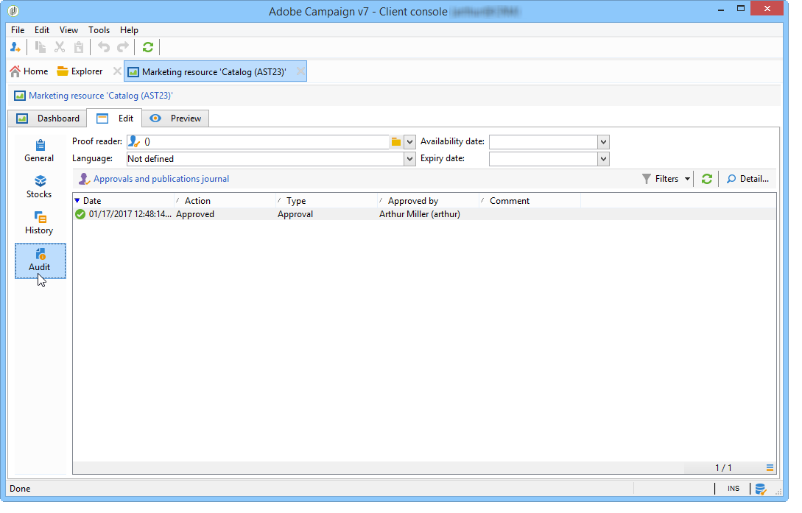
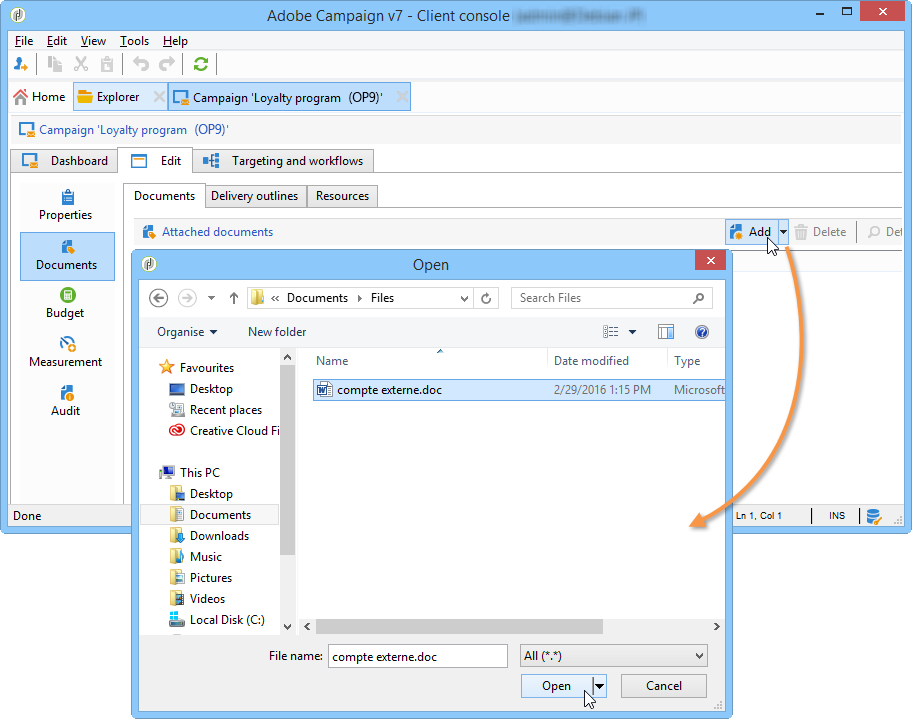
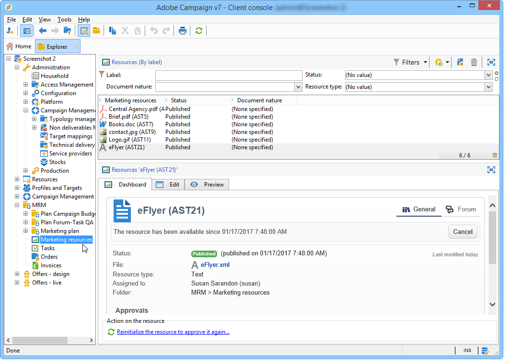

# Hantera marknadsföringsresurser{#managing-marketing-resources}

Med Adobe Campaign kan ni hantera och spåra de marknadsföringsresurser som ingår i kampanjens livscykel. Dessa marknadsföringsresurser kan vara en broschyr, ett visuellt stöd eller något annat kommunikationsmedium som involverar flera aktörer.

För varje marknadsföringsresurs som hanteras via Adobe Campaign kan du när som helst spåra dess status och historik och visa den aktuella versionen.

## Lägga till en marknadsföringsresurs {#adding-a-marketing-resource}

Marknadsföringsresurser nås via fliken **[!UICONTROL Campaigns]**.

Klicka på knappen **[!UICONTROL Create]** om du vill lägga till en resurs.

Om du vill göra en resurs tillgänglig på Adobe Campaign-servern måste du lägga till den genom att dra och släppa den i mitten av redigeraren. Du kan också klicka på länken **[!UICONTROL Upload file to server...]**.

Ett bekräftelsemeddelande låter dig starta överföringen.

När överföringen är klar läggs resursen till i listan över tillgängliga resurser. Den är tillgänglig för Adobe Campaign-operatörer. De kan visa den (via fliken **[!UICONTROL Preview]**), göra en kopia för att ändra den eller uppdatera filen på servern (med fliken **[!UICONTROL Edit]**).

Klicka på fliken **[!UICONTROL General]** för att välja de operatorer eller grupper av operatorer som ansvarar för övervakning, spårning och godkännande av resursen. Granskaren markeras via länken **[!UICONTROL Advanced parameters]**.

* Operatorn som resursen tilldelas är ansvarig för att spåra den.
* Godkännandeoperatorn ansvarar för att godkänna marknadsföringsresursen. De meddelas när resursvalideringsprocessen startas.

   Om ingen granskare har valts måste resursen **[!UICONTROL cannot be]** godkännas.

* Om det behövs kan du även ange en korrekturläsare.

Du kan ange ett (vägledande) tillgänglighetsdatum för resursen. Efter detta datum visas den med **[!UICONTROL Late]**-status.

## Samarbete kring resurser {#collaborative-work-on-resources}

Du kan ändra och uppdatera en marknadsföringsresurs och vid behov informera andra Adobe Campaign-operatörer om detta. Du kan:

* Hämta resursen lokalt för att ändra den.
* Uppdatera filen på servern och gör den tillgänglig för andra operatorer.
* Lås en resurs för att förhindra att den ändras av andra operatorer.

>[!NOTE]
>
>Fliken **[!UICONTROL History]** innehåller hämtnings- och uppdateringsloggen för resursen. Med knappen **[!UICONTROL Details]** kan du visa den valda versionen:

### Låsa/låsa upp en resurs {#locking-unlocking-a-resource}

När resurserna har skapats är de tillgängliga på kontrollpanelen för marknadsföringsresurser och operatorer kan redigera och ändra dem.

När en operator vill arbeta med en resurs är det bättre att låsa den innan du startar arbetet, så att andra operatorer inte kan ändra den samtidigt. Resursen är sedan reserverad; den förblir tillgänglig, men kan inte publiceras eller uppdateras på servern av en annan operator.

Ett specialmeddelande meddelar alla operatorer som försöker få åtkomst till det:

Fliken **[!UICONTROL Tracking]** anger namnet på operatorn som låste resursen och det planerade uppdateringsdatumet.

Om du vill låsa en resurs måste du klicka på resursen följt av knappen **[!UICONTROL Lock]** på kontrollpanelen för resurser.

Du kan ange det planerade returdatumet på fliken **[!UICONTROL Tracking]** för resursen.

Med den här informationen kan du informera andra Adobe Campaign-operatorer om vilket datum resursen kommer att låsas upp.

När resursen har uppdaterats låses den upp automatiskt och blir tillgänglig för alla operatorer igen.

Om det behövs kan du även låsa upp det manuellt från kontrollpanelen.

>[!NOTE]
>
>Endast operatorn som låste resursen och operatorer med administratörsbehörighet har behörighet att låsa upp en resurs.

### Diskussionsforum {#discussion-forums}

På fliken **[!UICONTROL Forum]** kan deltagare utbyta information för varje resurs.

[Diskussionsforumen ](../../mrm/using/discussion-forums.md) förklarar hur diskussionsforumen fungerar i Adobe Campaign.

## En marknadsföringsresurs livscykel {#life-cycle-of-a-marketing-resource}

När resursen skapas utses Adobe Campaign-operatorer för att utforma, korrekturläsa, godkänna och publicera resursen. En varaktighet kan fastställas för dessa kampanjer.

På fliken **[!UICONTROL Tracking]** kan du övervaka alla åtgärder som utförs på resursen: godkännanden, godkännanden, avslag, kommentarer eller publikationer.

Fliken **[!UICONTROL History]** visar filöverföringar som har utförts för den här resursen.

### Godkännandeprocess {#approval-process}

Det förväntade tillgänglighetsdatumet visas i resursinformationen om det angavs på fliken **[!UICONTROL Tracking]**. När detta datum har nåtts kan du köra godkännandeprocessen med knappen **[!UICONTROL Submit for approval]** på kontrollpanelen för resurser. Resursstatusen ändras sedan till **[!UICONTROL Approval in progress]**.

En resurs kan godkännas via knappen **[!UICONTROL Approve resource]** på kontrollpanelen.

Auktoriserade operatorer kan sedan godkänna eller avvisa godkännande. Den här åtgärden är möjlig: via det e-postmeddelande som skickas (genom att klicka på länken i meddelandet) eller via konsolen (genom att klicka på knappen **[!UICONTROL Approve]** ).

I godkännandefönstret kan du ange en kommentar.

På fliken **[!UICONTROL Tracking]** kan alla operatorer spåra de olika stegen i godkännandeprocessen.

>[!NOTE]
>
>Förutom den granskare som har angetts för varje marknadsföringsresurs har operatorer med administratörsrättigheter och resurshanteraren behörighet att godkänna en marknadsföringsresurs.

### Publicera en resurs {#publishing-a-resource}

Marknadsföringsresursen måste publiceras när den har godkänts. Publiceringsprocessen måste genomföras i enlighet med företagets krav. Detta innebär att resurser kan publiceras på ett extranät eller på en annan server, specifik information kan skickas till en extern tjänsteleverantör osv.

Om du vill publicera en resurs klickar du på knappen **[!UICONTROL Publish]** i redigeringszonen på kontrollpanelen för marknadsföringsresurser.

Du kan också automatisera publiceringen av en resurs via ett arbetsflöde.

Att publicera en resurs innebär att göra den tillgänglig för användning (till exempel för en annan uppgift). Publikationen varierar beroende på vilken typ av resurs du har: för ett flygblad kan publicering innebära att du skickar filen till ett tryckeri, för en webbbyrå kan det betyda att du publicerar den på en webbplats, osv.

För att Adobe Campaign ska kunna publicera måste du skapa ett lämpligt arbetsflöde och länka det till resursen. Det gör du genom att öppna rutan **[!UICONTROL Advanced settings]** för resursen och sedan välja önskat arbetsflöde i fältet **[!UICONTROL Post-processing]**.

Arbetsflödet kommer att köras:

* När granskaren klickar på länken **[!UICONTROL Publish resource]** (eller, om ingen granskare har definierats, den person som ansvarar för resursen).
* Om resursen hanteras via en marknadsföringsresursuppgift körs den när aktiviteten är inställd på **[!UICONTROL Finished]**, så länge som rutan **[!UICONTROL Publish the marketing resource]** är markerad i aktiviteten (se [aktiviteten Skapa marknadsföringsresurs](../../mrm/using/creating-and-managing-tasks.md#marketing-resource-creation-task))

Om ett arbetsflöde inte startas omedelbart (om arbetsflödet till exempel stoppas) ändras resursens status till **[!UICONTROL Pending publication]**. När arbetsflödet har startats ändras resursens status till **[!UICONTROL Published]**. Denna status tar inte hänsyn till eventuella fel i publiceringsprocessen. Kontrollera arbetsflödets status för att kontrollera att det har körts korrekt.

## Länka en resurs till en kampanj {#linking-a-resource-to-a-campaign}

### Referera till en marknadsföringsresurs {#referencing-a-marketing-resource}

Marknadsföringsresurser kan associeras med kampanjer, förutsatt att den här funktionen har valts i kampanjmallen.

>[!NOTE]
>
>Mer information om hur du skapar och konfigurerar kampanjmallar finns i [Kampanjmallar](../../campaign/using/marketing-campaign-templates.md#campaign-templates).

Klicka på fliken **[!UICONTROL Documents > Resources]** på kontrollpanelen för kampanjer och klicka sedan på **[!UICONTROL Add]** för att välja den aktuella resursen.

Du kan filtrera resurser efter status, typ eller typ, eller använda ett anpassat filter.

Klicka på **[!UICONTROL OK]** för att lägga till resursen i listan över marknadsföringsresurser som refereras till för kampanjen.

Med knappen **[!UICONTROL Details]** kan du redigera och visa den.

De tillagda resurserna visas på kontrollpanelen. De kan också redigeras där.

### Lägga till en marknadsföringsresurs i en leveransdisposition {#adding-a-marketing-resource-to-a-delivery-outline}

Marknadsföringsresurser kan associeras med leveranser via leveranskonturer.

>[!NOTE]
>
>Mer information om leveransdispositioner finns i [Associera och strukturera resurser som är länkade via en leveransdisposition](../../campaign/using/marketing-campaign-deliveries.md#associating-and-structuring-resources-linked-via-a-delivery-outline).

## Stock-hantering {#stock-management}

Du kan associera en marknadsföringsresurs med en eller flera lager för att hantera dina leveranser och visa en varning på instrumentpanelen om det inte finns tillräckligt med lager.

>[!NOTE]
>
>Mer information om Stock Management i Adobe Campaign finns i [Stock Management](../../campaign/using/providers--stocks-and-budgets.md#stock-management).

Om du vill associera en marknadsföringsresurs med en aktie redigerar du aktiekartan och redigerar eller skapar en aktie. Lägg till en aktierad och välj motsvarande marknadsföringsresurs.

Om det behövs kan du redigera den markerade resursen via ikonen **[!UICONTROL Edit the link]** (förstoringsglas) som finns till höger om resursen när den har valts.

Ange det ursprungliga lagret och larmlagret och spara sedan.

Lagret anges i resursinformationen.

När beståndet är otillräckligt skickas en varning till de berörda aktörerna.

## Avancerade funktioner {#advanced-functions}

Med kontrollpanelen för marknadsföringsresurser kan du utföra vanliga typer av åtgärder: lägga till, redigera, låsa/låsa upp, godkänna, publicera. Du kan skapa andra typer av marknadsföringsresurser och komma åt avancerade funktioner via Adobe Campaign-trädet. Det gör du genom att klicka på **[!UICONTROL Explorer]** på Adobe Campaign hemsida.

Som standard lagras marknadsföringsresurser i noden **[!UICONTROL MRM > Marketing resources]** i trädet.

Du kan lägga till följande resurser från den här vyn:

* Fil
* HTML
* Text
* URL
