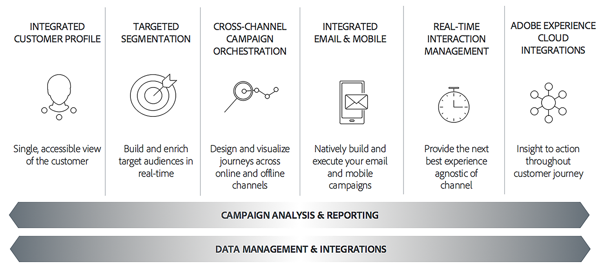

# Om Adobe Campaign Classic{#about-adobe-campaign-classic}

För att kunna leverera en hög grad av kundengagemang och fantastiska upplevelser måste varumärkena skapa enhetliga kundresor vid alla kontaktytor. Marknadsförarna kan nu effektivt utforma, planera, genomföra, hantera och optimera flerkanalskampanjer som ger hög avkastning på marknadsföringsinvesteringar och ökar lojaliteten.

Med Adobe Campaign kan ni samordna framtagningen av marknadsföringskampanjer för konversationer. Adobe Campaign har innovativa funktioner för att modellera, effektivisera och automatisera processer för marknadsföring och kundkommunikation.

>[!NOTE]
>
>Adobe Campaign Classic finns i version 6.11 och v7. Förutom när det anges gäller hjälpmaterialet båda versionerna, i den senaste versionen. Skärmbilderna gäller Campaign Classic v7.

## Viktiga funktioner {#key-capabilities}

Adobe Campaign är en plattform för att utforma kundupplevelser i flera kanaler och erbjuder en miljö för visuell kampanjsamordning, interaktionshantering i realtid och kanalövergripande körning.

Marknadsföringskampanjen i Adobe Campaign illustrerar de viktigaste funktionalitetsområdena för produkten:

### Integrerad kundprofil {#integrated-customer-profile}

Profiler (kunder, prospects, nyhetsbrev, prenumeranter osv.) är centraliserade i Adobe Campaign-databasen. Det finns många sätt att skaffa profiler och bygga upp databasen: onlinesamling via webbformulär, manuell eller automatisk import av textfiler, replikering med företagsdatabaser eller andra informationssystem. Med Adobe Campaign kan ni införliva marknadsföringshistorik, inköpsinformation, preferenser, CRM-data och alla relevanta PII-data i en samlad vy för att analysera och vidta åtgärder.

I Adobe Campaign är mottagare standardprofiler som är avsedda för att skicka leveranser (e-post, SMS, osv.). Tack vare de mottagardata som lagras i databasen kan du filtrera det mål som ska ta emot en viss leverans och lägga till personaliseringsdata i leveransinnehållet. Det finns andra typer av profiler i databasen. De är utformade för olika användningsområden. Exempelvis görs dirigeringsprofiler för att testa dina leveranser innan de skickas till det slutliga målet.

Grunderna i Profilhantering beskrivs i [Om profiler](../../platform/using/about-profiles.md).

### Målinriktad segmentering {#targeted-segmentation}

Adobe Campaign har kraftfulla, användarvänliga funktioner för segmentering och målinriktning som gör att ni kan skapa välriktade, differentierade erbjudanden. Med den beskrivande analysfunktionen kan ni analysera information både i ett tidigare och senare skede av era marknadsföringskampanjer, och med filterhanteringen och den [grafiska frågeredigeringsfunktionen](../../platform/using/about-queries-in-campaign.md) kan ni filtrera era era abonnentpopulationer och sampla eller skapa målgrupper baserat på ett obegränsat antal kriterier. Funktionerna för analys och målinriktning beskrivs på [den här sidan](../../reporting/using/about-descriptive-analysis.md) och i avsnittet [Skapa filter](../../platform/using/creating-filters.md) .

Den avancerade datahanteringsfunktionen utökar databearbetningsfunktionerna. Det förenklar och optimerar målgruppsprocessen genom att inkludera data som inte är modellerade i datamappningen. Den här funktionaliteten beskrivs närmare på [den här sidan](../../workflow/using/targeting-data.md#data-management).

### Flerkanalsmarknadsföring {#cross-channel-campaign-orchestration}

Med Adobe Campaign kan ni utforma och samordna målinriktade och personaliserade kampanjer i flera kanaler: e-post, direktreklam, SMS, push-meddelanden. Ett enda gränssnitt ger er alla funktioner ni behöver för att schemalägga, samordna, konfigurera, personalisera, automatisera, genomföra och mäta alla kampanjer och all kommunikation. Mer information om schemaläggning och körning av kampanjer finns på [den här sidan](../../campaign/using/setting-up-marketing-campaigns.md).

### Personalisering och interaktion i realtid {#personalization-and-real-time-interaction}

Attrahera kundernas uppmärksamhet och förbättra svarsfrekvensen tack vare den avancerade personaliseringen av meddelandeinnehåll och meddelandehuvuden baserat på kundprofiler och önskemål. Mer information om hantering och anpassning av meddelandeinnehåll finns på [den här sidan](../../delivery/using/about-personalization.md). Samarbete kring innehålls-, meddelande- och godkännandekretsar beskrivs i [detta avsnitt](../../campaign/using/about-marketing-resource-management.md).

### Analys och rapportering {#analysis-and-reporting}

Med Adobe Campaign kan ni övervaka och tolka kundernas beteende genom att gradvis förbättra deras data och profiler. Med rapporterings- och analysverktygen kan ni utnyttja varje ny kampanj, bättre målinrikta era marknadsföringsinitiativ och optimera deras effekt och avkastning på investeringen. Mer information finns på [den här sidan](../../reporting/using/reports-on-deliveries.md#accessing-existing-reports) .

### Integreringar med Adobe Experience Cloud {#adobe-experience-cloud-integrations}

Ni kan kombinera leveransfunktionerna och de avancerade kampanjhanteringsfunktionerna i Adobe Campaign med en uppsättning lösningar som hjälper er att personalisera användarnas upplevelse: Adobe Experience Manager, Adobe Analytics, Adobe Target eller Adobe Experience Cloud triggers till exempel. Du kan även integrera med Adobe IMS och logga in på Campaign med ditt Adobe ID. Mer information om integreringar mellan lösningar och autentisering finns i [det här avsnittet](../../integrations/using/about-adobe-id.md).

## Kärnfunktioner och tillägg {#core-capabilities-and-add-ons}

Adobe Campaign erbjuder en uppsättning funktioner som hjälper er att implementera och optimera marknadsföringsfunktionerna för konversationer beroende på era behov och er arkitektur. Vissa av dem är kärnfunktioner och andra är beroende av att ett paket installeras och av din konfiguration. En detaljerad produktbeskrivning finns här: Produktbeskrivning för [Adobe Campaign Classic](https://helpx.adobe.com/legal/product-descriptions/adobe-campaign-classic---product-description.html).

Följande funktioner är tillgängliga. Beroende på vilket licensavtal du har kan vissa av dessa funktioner vara tillgängliga eller inte i din instans.

* [Kanaler](../../delivery/using/communication-channels.md) - utforma och skicka leveranser i olika kanaler: e-post, SMS, Line, mobilapp, direktreklam,
* [Campaign](../../campaign/using/designing-marketing-campaigns.md) - samordna flerkanalskampanjer,
* [MRM](../../campaign/using/about-marketing-resource-management.md) - hantera marknadsföringsresurser och budget,
* [Interaktion](../../interaction/using/interaction-and-offer-management.md) - hantering av erbjudanden med Campaign,
* [Message Center](../../message-center/using/about-transactional-messaging.md) - skicka transaktionsmeddelanden via e-post, SMS eller mobilapp,
* [Social marknadsföring](../../social/using/about-social-marketing.md) - kommunicera i sociala medier: Facebook, Twitter,
* [Arbetsflöde](../../workflow/using/about-workflows.md) /datahantering - automatisera processer och hantera data med arbetsflöden,
* [Webbprogram](../../web/using/about-web-applications.md) - skapa webbsidor och formulär,
* [Survey Manager](../../web/using/about-surveys.md) - skapa online-enkäter och undersökningar,
* [Content Manager](../../delivery/using/about-content-management.md) - hantera e-postinnehåll,
* [Distribuerad marknadsföring](../../campaign/using/about-distributed-marketing.md) - samordna kampanjer för centrala/lokala myndigheter,
* [Response Manager](../../campaign/using/about-response-manager.md) - hantera kundsvar,
* [Kopplingar](../../platform/using/about-connectors.md) - använd kopplingar för att kommunicera med externa lösningar och databasmotorer.
* [Webbtjänster](../../configuration/using/about-web-services.md) - använd Campaign via API:er/webbtjänster,
* [Rapportering](../../reporting/using/about-adobe-campaign-reporting-tools.md) - få tillgång till inbyggda rapporter, analysera data och utforma egna rapporter.

