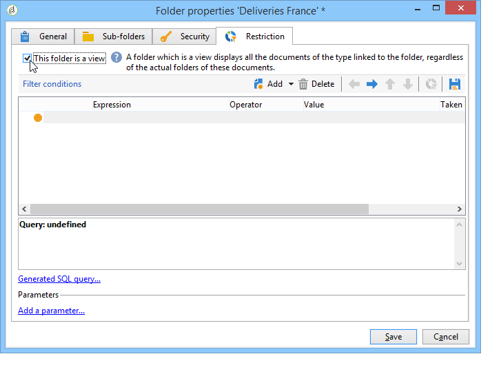

# Hantera åtkomst till mappar{#folder-access-management}

Varje mapp i Utforskarens navigeringsträd har behörighet att läsa, skriva och ta bort. För att få åtkomst till en fil måste en operator eller grupp av operatorer åtminstone ha läsåtkomst till den.

## Mappar och vyer {#folders-and-views}

### Vad är en mapp? {#about-folders}

Mappar är noder i Adobe Campaign-trädet. De här noderna skapas genom att högerklicka på trädet, via **[!UICONTROL Add new folder]** -menyn. Som standard gör den första menyn att du kan lägga till den mapp som motsvarar den aktuella kontexten.

Du kan anpassa utforskarens navigeringsträd. Lär dig konfigurationssteg och metodtips [i det här avsnittet](adobe-campaign-workspace.md).

### Vad är en vy? {#about-views}

Dessutom kan du skapa vyer för att begränsa tillgången till data och ordna innehållet i trädet så att det passar dina behov. Du kan sedan tilldela behörighet till vyerna.

En vy är en mapp som visar poster som lagras fysiskt i en eller flera andra mappar av samma typ. Om du till exempel skapar en Campaign-mapp som är en vy, visas alla kampanjer som finns i databasen som standard, oavsett ursprung. Dessa data kan sedan filtreras.

När du konverterar en mapp till en vy visas alla data som motsvarar mapptypen i databasen i vyn, oavsett i vilken mapp den sparas. Du kan sedan filtrera den för att begränsa vilka data som visas.

>[!IMPORTANT]
>
>Vyerna innehåller data och ger åtkomst till dem, men data lagras inte fysiskt i visningsmappen. Operatorn måste ha rätt behörighet för den önskade åtgärden i datakällmapparna (minst läsåtkomst).
>
>Om du vill ge åtkomst till en vy utan att ge åtkomst till dess källmapp, ger du bara inte läsåtkomst till den överordnade noden i källmappen.

För att skilja vyer från mappar visas namnet på varje vy i en annan färg (mörk cyan).

### Lägga till mappar och skapa vyer {#adding-folders-and-creating-views}

I exemplet nedan skapar vi nya mappar för att visa specifika data:

1. Skapa ett nytt **[!UICONTROL Deliveries]** skriv mapp och namnge den **Leveranser i Frankrike**.
1. Högerklicka på den här mappen och välj **[!UICONTROL Properties...]**.

   

1. I **[!UICONTROL Restriction]** flik, välja **[!UICONTROL This folder is a view]**. Därefter visas alla leveranser i databasen.

   

1. Definiera leveransfiltervillkoren från frågeredigeraren i fönstrets mellersta del: kampanjerna som motsvarar det definierade filtret visas sedan.

   >[!NOTE]
   >
   >Frågeredigeraren visas i [det här avsnittet](../../platform/using/about-queries-in-campaign.md).

   Med följande filtervillkor:

Följande leveranser visas i vyn:

>[!NOTE]
>
>Vid hantering [transaktionsmeddelanden](../../message-center/using/about-transactional-messaging.md) händelser, **[!UICONTROL Real time events]** eller **[!UICONTROL Batch events]** mappar får inte anges som vyer för körningsinstanserna eftersom det kan leda till problem med åtkomst till dem. Mer information om händelsesamling finns i [det här avsnittet](../../message-center/using/about-event-processing.md#event-collection).

## Behörigheter för en mapp

### Redigera behörigheter i en mapp {#edit-permissions-on-a-folder}

Följ stegen nedan om du vill redigera behörigheter i en viss mapp i trädet:

1. Högerklicka på mappen och välj **[!UICONTROL Properties...]**.

   

1. Klicka på **[!UICONTROL Security]** för att visa behörigheter i den här mappen.

   

### Ändra behörigheter {#modify-permissions}

Om du vill ändra behörigheter kan du:

* **Ersätta en grupp eller en operator**. Det gör du genom att klicka på en av grupperna (eller operatorerna) med rättigheter till mappen och välja en ny grupp (eller en ny operator) i listrutan:

  

* **Auktorisera en grupp eller en operator**. Klicka på **[!UICONTROL Add]** och välj den grupp eller operator som du vill tilldela behörigheter till den här mappen.
* **Förbjud en grupp eller en operatör**. Det gör du genom att klicka **[!UICONTROL Delete]** och välj den grupp eller operator som du vill ta bort behörigheten för den här mappen från.
* **Välj rättigheter som tilldelats en grupp eller en operator**. Det gör du genom att klicka på gruppen eller operatorn i fråga och sedan markera de åtkomsträttigheter som du vill ge och avmarkera de andra.

  

### Sprid behörigheter {#propagate-permissions}

Du kan sprida auktoriseringar och åtkomsträttigheter. Om du vill göra det väljer du **[!UICONTROL Propagate]** i mappegenskaperna.

Behörigheterna som definieras i det här fönstret kommer sedan att tillämpas på alla undermappar i den aktuella noden. Du kan sedan överlagra dessa behörigheter för var och en av undermapparna.

>[!NOTE]
>
>Om du rensar det här alternativet för en mapp tas det inte bort automatiskt för undermapparna. Du måste rensa det explicit för var och en av undermapparna.

### Ge åtkomst till alla operatorer {#grant-access-to-all-operators}

I **[!UICONTROL Security]** om **[!UICONTROL System folder]** om du väljer det här alternativet får alla operatorer åtkomst till dessa data, oavsett deras rättigheter. Om det här alternativet är avmarkerat måste du uttryckligen lägga till operatorn (eller deras grupp) i listan över auktoriseringar för att de ska ha åtkomst.

