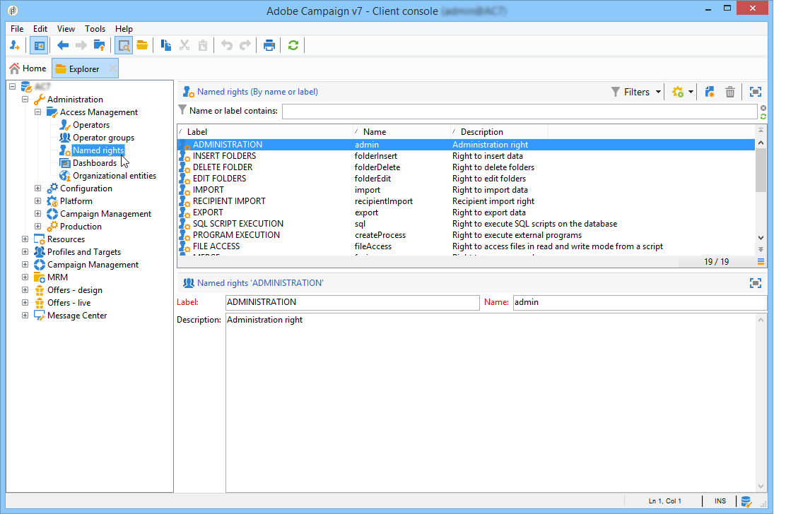
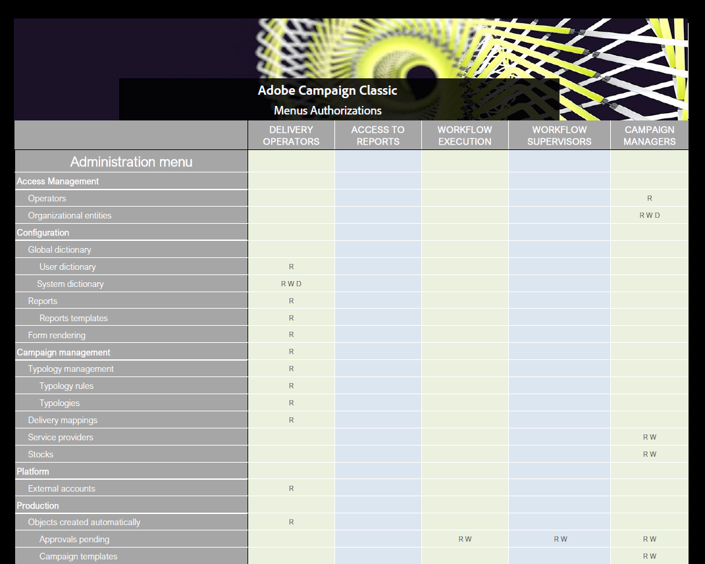

# Använd namngivna rättigheter för att ställa in behörigheter{#named-rights}

Som standard föreslår Adobe Campaign en uppsättning namngivna rättigheter som gör att du kan definiera de behörigheter som tilldelats operatorer och grupper av operatorer. Dessa rättigheter kan redigeras via **[!UICONTROL Administration > Access management > Named rights]** trädnod.

Dessa rättigheter är följande:

* **[!UICONTROL ADMINISTRATION]**: Operatorer med **[!UICONTROL ADMINISTRATION]** har fullständig åtkomst till instansen. Administratörsanvändare kan köra/skapa/redigera/ta bort objekt som arbetsflöde, leverans, skript osv.

* **[!UICONTROL APPROVAL ADMINISTRATION]**: Du kan ange flera godkännandesteg i arbetsflöden och leveranser för att säkerställa att det aktuella läget har godkänts av en tilldelad operator eller grupp. Användare med **[!UICONTROL APPROVAL ADMINISTRATION]** kan ange godkännandesteg och även tilldela en operator eller operatörsgrupp som ska godkänna dessa steg.

* **[!UICONTROL CENTRAL]**: Rätt till central hantering (distribuerad marknadsföring).

* **[!UICONTROL DELETE FOLDER]**: Rätt att ta bort mappar. Med den här rättigheten kan användare ta bort mappar från utforskarvyn.

* **[!UICONTROL EDIT FOLDERS]**: Rätt att ändra mappegenskaper som internt namn, etikett, associerad bild, undermappsordning osv.

* **[!UICONTROL EXPORT]**: Användare kan exportera data från sina Adobe Campaign-instanser till en fil på servern eller den lokala datorn med **[!UICONTROL EXPORT]** arbetsflödesaktivitet.

* **[!UICONTROL FILES ACCESS]**: Rätt att läsa och skriva för filer via ett skript som kan skrivas i **[!UICONTROL JavaScript]** arbetsflödesaktivitet för att läsa/skriva filer på en server.

* **[!UICONTROL IMPORT]**: Rätt för allmän dataimport. **[!UICONTROL IMPORT]** kan du importera data till andra tabeller medan **[!UICONTROL RECIPIENT IMPORT]** tillåter endast import till mottagartabellen.

* **[!UICONTROL INSERT FOLDERS]**: Rätt att infoga mappar. Användare med **[!UICONTROL INSERT FOLDERS]** höger kan skapa nya mappar i mappträdet i utforskarvyn.

* **[!UICONTROL LOCAL]**: Rätt till lokal hantering (distribuerad marknadsföring).

* **[!UICONTROL MERGE]**: Höger om du vill sammanfoga de markerade posterna till en. Om mottagarna finns som dubbletter visas **[!UICONTROL MERGE]** ger användaren möjlighet att välja dubbletter och sammanfoga dem till en primär mottagare.

* **[!UICONTROL PREPARE DELIVERIES]**: Rätt att skapa, redigera och spara en leverans. Användare med **[!UICONTROL PREPARE DELIVERIES]** kan också starta leveransanalysprocessen.

* **[!UICONTROL PRIVACY DATA RIGHT]**: Rätt att samla in och ta bort personuppgifter. Se denna [sida](https://helpx.adobe.com/se/campaign/kb/acc-privacy.html) för mer information om detta.

* **[!UICONTROL PROGRAM EXECUTION]**: Rätt att köra kommandon på olika programmeringsspråk.

* **[!UICONTROL RECIPIENT IMPORT]**: Rätt att importera mottagare. Användare med **[!UICONTROL RECIPIENT IMPORT]** kan importera en lokal fil till mottagartabellen.

* **[!UICONTROL SQL SCRIPT EXECUTION]** Rätt att köra ett SQL-kommando direkt i databasen.

* **[!UICONTROL START DELIVERIES]**: Rätt att godkänna tidigare analyserade leveranser. Efter leveransanalysen pausas leveransen vid olika godkännandesteg och måste godkännas för att kunna återupptas. Användare med **[!UICONTROL START DELIVERIES]** rätt att godkänna leveranser.

* **[!UICONTROL USE SQL DATA MANAGEMENT ACTIVITY]**: Rätt att skriva egna SQL-skript med SQL Data Management-aktiviteten för att skapa och fylla i arbetstabeller (se [det här avsnittet](../../workflow/using/sql-data-management.md)).

* **[!UICONTROL WORKFLOW]**: Rätt att köra arbetsflöden. Utan den här rättigheten kan användare inte starta, stoppa eller starta om arbetsflöden.

* **[!UICONTROL WEBAPP]**: Rätt att använda webbprogram.

>[!NOTE]
>
>Listan kan variera beroende på vilka tillägg som är installerade på plattformen.

## Matris för åtkomsträttigheter {#access-rights-matrix}

Standardgrupper och namngivna rättigheter ger operatorer åtkomst till vissa mappar i navigeringshierarkin och ger behörighet att läsa, skriva och ta bort.

Adobe Campaign åtkomsträttighetsmatris är tillgänglig [här](/help/platform/using/assets/access-rights-matrix.pdf).

