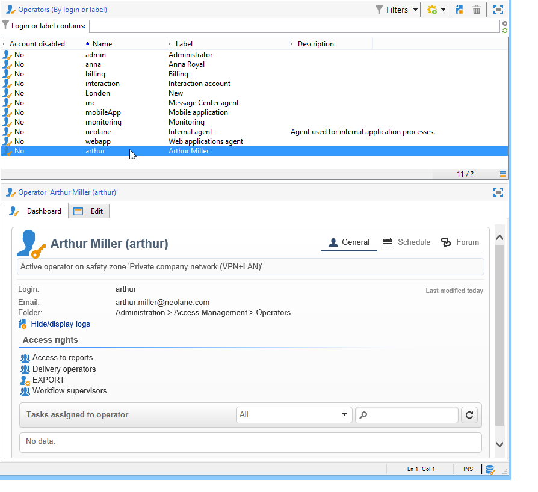

# Skapa och hantera operatörer {#operators}

## Kom igång med Campaign-operatorer  {#about-operators}

En operator är en Adobe Campaign-användare som har behörighet att logga in och utföra åtgärder.

Som standard lagras operatorer i **[!UICONTROL Administration > Access management > Operators]** nod.

Operatorer kan skapas manuellt eller mappas på en befintlig LDAP-katalog.

En fullständig procedur för att skapa en operator beskrivs i [den här sidan](#creating-an-operator).

Mer information om Adobe Campaign- och LDAP-integrering finns i [den här sidan](../../installation/using/connecting-through-ldap.md).

>[!IMPORTANT]
>
>Operatorer måste länkas till en säkerhetszon för att kunna logga in på en instans. Mer information om säkerhetszoner i Adobe Campaign finns i [den här sidan](../../installation/using/security-zones.md).

Användare kan även ansluta direkt till Adobe Campaign via sin Adobe ID. Se denna [sida](../../integrations/using/about-adobe-id.md) för mer information om detta.

## Skapa en operator {#creating-an-operator}

Så här skapar du en ny operator och tilldelar behörigheter:

1. Klicka på **[!UICONTROL New]** ovanför listan med operatorer och ange information om operatorn new.

   

1. Ange **[!UICONTROL Identification parameters]** för användaren: användar-ID, lösenord och namn. Inloggningen och lösenordet används av operatören för att logga in på Adobe Campaign. När användaren är inloggad kan han/hon ändra sitt lösenord via **[!UICONTROL Tools > Change password]** -menyn. Operatorns e-postadress är viktig eftersom den gör det möjligt för operatorn att ta emot meddelanden, till exempel när godkännanden behandlas.

   I det här avsnittet kan du även länka en operator till en organisationsenhet. Mer information finns i [den här sidan](../../distributed/using/about-distributed-marketing.md).

1. Välj behörigheter för operatorn i dialogrutan **[!UICONTROL Operator access rights]** -avsnitt.

   Klicka på knappen **[!UICONTROL Add]** ovanför behörighetslistan och välj sedan en grupp operatorer i listan över tillgängliga grupper:

   

   Du kan också välja en eller flera namngivna rättigheter (se [Namngivna rättigheter](#named-rights)). Klicka på pilen till höger om **[!UICONTROL Folder]** fält och markera **[!UICONTROL Named rights]**:

   

   Välj grupper och/eller namngivna rättigheter som ska tilldelas och klicka på **[!UICONTROL OK]** att validera.

1. Klicka **[!UICONTROL Ok]** så här skapar du operatorn: profilen läggs till i listan över befintliga operatorer.

   

>[!NOTE]
>
>Du kan ordna operatorerna efter dina behov genom att skapa nya operatormappar. Om du vill göra det högerklickar du på mappen operator och väljer **[!UICONTROL Add an 'Operators' folder]**.

När operatörens profil har skapats kan du lägga till eller uppdatera informationen för den. Om du vill göra det klickar du på **[!UICONTROL Edit]** -fliken.

>[!NOTE]
>
>The **[!UICONTROL Session timeout]** I kan du justera fördröjningen innan tidsgränsen för FDA-sessionen överskrids. Mer information finns i [Om åtkomst till federerade data](../../installation/using/about-fda.md).

## Definiera operatorns tidszon {#time-zone-of-the-operator}

I **[!UICONTROL General]** kan du välja operatörens tidszon. Som standard arbetar operatorer i serverns tidszon. Det går dock att välja en annan tidszon i listrutan.

Konfigurationen av tidszoner beskrivs i [den här sidan](../../installation/using/time-zone-management.md).

>[!NOTE]
>
>För samarbete inom olika tidszoner krävs att datum lagras i UTC. Datum konverteras i lämplig tidszon i följande sammanhang: när ett datum visas i användartidszonen, när filer importeras och exporteras, när en e-postleverans schemaläggs, när aktiviteter schemaläggs i ett arbetsflöde (schemaläggare, vänta, tidsbegränsning osv.)
>
>Begränsningar och rekommendationer som är kopplade till dessa sammanhang presenteras i relaterade avsnitt i Adobe Campaign-dokumentationen.

Dessutom är **[!UICONTROL Regional settings]** I den nedrullningsbara listan kan du välja format för att visa datum och nummer.

## Lägg till behörigheter {#access-rights-options}

Använd **[!UICONTROL Access rights]** för att uppdatera grupper och namngivna rättigheter som är länkade till operatorn.

The **[!UICONTROL Edit the access parameters...]** kan du använda följande alternativ:

* The **[!UICONTROL Disable account]** kan du inaktivera operatörens konto: den här användaren inte längre kommer att få åtkomst till Adobe Campaign.

   >[!NOTE]
   >
   >Även om deras konto är inaktiverat kan operatorn fortfarande ta emot aviseringar eller meddelanden från Campaign. Om du inte längre vill skicka Campaign-meddelanden till den här operatorn rekommenderar Adobe att du tar bort e-postadressen från deras profil.

* The **[!UICONTROL Forbid access from the rich client]** kan du begränsa användningen av Adobe Campaign till [Webbåtkomst](../../platform/using/adobe-campaign-workspace.md#console-and-web-access) eller via API:er: åtkomst till Adobe Campaign klientkonsol inte längre är tillgänglig.
* Det går att länka en säkerhetszon till operatören. Mer information finns på [den här sidan](../../installation/using/security-zones.md).
* Du kan också definiera en betrodd IP-mask med hjälp av lämplig länk.

   Operatören kan ansluta till Adobe Campaign utan att ange sitt lösenord om IP-adressen finns i listan.

   Du kan också ange en uppsättning IP-adresser som ska auktoriseras att ansluta utan lösenord, som i följande exempel:

   

   >[!NOTE]
   >
   >För att åtkomsten till din plattform ska vara säker måste det här alternativet användas med försiktighet.

* The **[!UICONTROL Restrict to information found in sub-folders of:]** kan du begränsa de rättigheter som tilldelas en mapps operator. Endast undermapparna för noden som anges i det här alternativet visas för användaren:

   

   >[!IMPORTANT]
   >
   >Detta är en mycket noggrann restriktion som måste användas med försiktighet. En operator som är inloggad med den här typen av rättigheter kan BARA se innehållet i den angivna mappen och har inte åtkomst till någon annan nod i trädet via Utforskaren. Beroende på vilka funktioner som den här operatorn har åtkomst till (till exempel: arbetsflöden) kan användaren visa data som vanligtvis lagras i noder som inte är tillgängliga.

### Kontrollera inställningar {#check-settings}

The **[!UICONTROL Audit]** Med -fliken kan du visa information om operatorn. De olika flikarna läggs till automatiskt baserat på inställningarna som anges i operatorområdet.

Du kan komma åt:

* Listan över rättigheter för mappar som är länkade till operatorn.

   

   >[!NOTE]
   >
   >Mer information finns i [Hantering av mappåtkomst](#folder-access-management).

* Operatörens godkännandelogg.

   

* Listan med diskussionsforum som de prenumererar på.
* Händelser i deras kalender.
* Listan över uppgifter som tilldelats dem.

## Standardoperatorer {#default-operators}

Adobe Campaign använder tekniska operatorer med profiler som är konfigurerade som standard: Administratör (&#39;admin&#39;), fakturering (&#39;billing&#39;), övervakning, webbprogramagent (&#39;webapp&#39;) osv. Vissa av dessa beror på vilka program och alternativ som är installerade på plattformen: Operatorer av typen central och lokal är till exempel bara synliga om alternativet Distribuerad marknadsföring är installerat.

>[!IMPORTANT]
>
>Dessa tekniska operatorer meddelas som standard när informationsmeddelanden returneras av plattformen. Vi rekommenderar att du skickar ett e-postmeddelande till dem.
>
>För att webbprogrammen ska fungera på rätt sätt rekommenderar vi att du inte definierar specifika regionala inställningar för webbprogramsoperatorn.

Som standard har den tekniska operatorn&quot;webapp&quot; namngiven ADMINISTRATION-behörighet, vilket kan leda till säkerhetsrisker. För att åtgärda det här problemet rekommenderar vi att du tar bort den här rättigheten. Så här gör du:

1. Från **[!UICONTROL Administration > Access management > Named rights]** nod, klicka **[!UICONTROL New]** för att skapa en rättighet och ge den namnet WEBAPP.

   

   Namngivna rättigheter beskrivs i [Namngivna rättigheter](#named-rights) -avsnitt.

1. Från **[!UICONTROL Administration > Access management > Operators]** väljer du webbprogramagentens operator (&#39;webapp&#39;).

   Välj **[!UICONTROL Edit]** -fliken och sedan **[!UICONTROL Access rights]** och ta bort ADMINISTRATIONEN med namnet right från listan.

   

   Klicka **[!UICONTROL Add]** och väljer WEBAPP-höger som du just har skapat och sparar sedan ändringarna.

   

1. Tilldela operatorn &#39;webapp&#39; behörighet att läsa och skriva data i de mappar som berör den här operatorn, som i första hand är mapparna &#39;Recipient&#39;.

   

   Redigeringsrättigheter för trädmappar finns i [Hantering av mappåtkomst](#folder-access-management) -avsnitt.

>[!NOTE]
>
>Mer information om säkerhetsriktlinjerna finns i [Checklista för Adobe Campaign-säkerhetskonfiguration](https://experienceleague.adobe.com/docs/campaign-classic/using/installing-campaign-classic/security-privacy/get-started-security-privacy.html?lang=sv).
