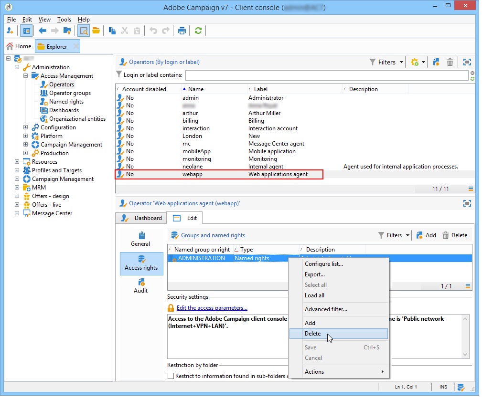

# Åtkomsthantering{#access-management}

## Om behörigheter {#about-permissions}

Med Adobe Campaign kan ni definiera och hantera de rättigheter som tilldelats de olika operatorerna. Detta är en uppsättning rättigheter och begränsningar som tillåter eller nekar:

* Tillgång till vissa funktioner (via namngivna rättigheter).
* Tillgång till vissa register.
* Skapa, ändra och/eller ta bort poster (åtgärder, kontakter, kampanjer, grupper osv.).

Behörigheterna gäller för operatorprofiler eller operatorgrupper.

De fylls i av säkerhetsparametrar som är kopplade till operatörens anslutningsläge till Adobe Campaign. For more on this, refer to [this page](../../installation/using/configuring-campaign-server.md#defining-security-zones).

Det finns två typer av behörigheter som du kan ge en användare:

* Du kan definiera grupper av operatorer som du tilldelar rättigheter till och sedan associera operatorerna med en eller flera grupper. På så sätt kan du återanvända behörigheter och göra användarprofilerna mer enhetliga. Det underlättar också hantering och underhåll av profiler. Skapa och hantera grupper visas i [operatörsgrupper](#operator-groups).
* Du kan tilldela namngivna rättigheter direkt till användare, i vissa fall för att överlagra rättigheterna som tilldelats via grupper. Dessa rättigheter presenteras i [Namngivna rättigheter](#named-rights).

>[!NOTE]
>
>Innan du börjar definiera behörigheter rekommenderar Adobe att du läser checklistan för [säkerhetskonfiguration](https://docs.campaign.adobe.com/doc/AC/getting_started/EN/security.html).

## Operatorer {#operators}

### Om operatorer {#about-operators}

En operator är en Adobe Campaign-användare som har behörighet att logga in och utföra åtgärder.

Som standard lagras operatorer i **[!UICONTROL Administration > Access management > Operators]** noden.

Operatorer kan skapas manuellt eller mappas på en befintlig LDAP-katalog.

En fullständig procedur för att skapa en operator beskrivs på [den här sidan](#creating-an-operator).

Mer information om Adobe Campaign och LDAP-integrering finns på [den här sidan](../../installation/using/connecting-through-ldap.md).

>[!IMPORTANT]
>
>Operatorer måste länkas till en säkerhetszon för att kunna logga in på en instans. Mer information om säkerhetszoner i Adobe Campaign finns på [den här sidan](../../installation/using/configuring-campaign-server.md#defining-security-zones).

Användarna kan också ansluta direkt till Adobe Campaign med sitt Adobe-ID. Mer information finns på den här [sidan](../../integrations/using/about-adobe-id.md).

### Skapa en operator {#creating-an-operator}

Så här skapar du en ny operator och tilldelar behörigheter:

1. Klicka på **[!UICONTROL New]** knappen ovanför listan med operatorer och ange information om operatorn new.

   

1. Ange användarens namn **[!UICONTROL Identification parameters]** : användar-ID, lösenord och namn. Operatören använder inloggningsnamnet och lösenordet för att logga in på Adobe Campaign. När användaren är inloggad kan han/hon ändra sitt lösenord via **[!UICONTROL Tools > Change password]** menyn. Operatorns e-postadress är viktig eftersom den gör det möjligt för operatorn att ta emot meddelanden, till exempel när godkännanden behandlas.

   I det här avsnittet kan du även länka en operator till en organisationsenhet. Mer information finns på den [här sidan](../../campaign/using/about-distributed-marketing.md).

1. Välj behörigheter för operatorn i **[!UICONTROL Operator access rights]** avsnittet.

   Om du vill tilldela behörigheter till operatorn klickar du på **[!UICONTROL Add]** knappen ovanför listan över rättigheter och väljer sedan en grupp operatorer i listan över tillgängliga grupper:

   

   Du kan också välja en eller flera namngivna rättigheter (se [Namngivna rättigheter](#named-rights)). Det gör du genom att klicka på pilen till höger om **[!UICONTROL Folder]** fältet och välja **[!UICONTROL Named rights]**:

   

   Välj grupper och/eller namngivna rättigheter som ska tilldelas och klicka på **[!UICONTROL OK]** för att validera.

1. Klicka **[!UICONTROL Ok]** för att skapa operatorn: profilen läggs till i listan över befintliga operatorer.

   

>[!NOTE]
>
>Du kan ordna operatorerna efter dina behov genom att skapa nya operatormappar. Om du vill göra det högerklickar du på mappen operator och väljer **[!UICONTROL Add an 'Operators' folder]**.

När operatörens profil har skapats kan du lägga till eller uppdatera informationen för den. Klicka på **[!UICONTROL Edit]** fliken om du vill göra det.

>[!NOTE]
>
>I **[!UICONTROL Session timeout]** fältet kan du justera fördröjningen innan tidsgränsen för FDA-sessionen har nåtts. Mer information finns i [Om åtkomst till](../../platform/using/about-fda.md)federerade data.

### Operatorns tidszon {#time-zone-of-the-operator}

På **[!UICONTROL General]** fliken kan du välja operatörens tidszon. Som standard arbetar operatorer i serverns tidszon. Det går dock att välja en annan tidszon i listrutan.

Konfigurationen av tidszoner beskrivs på [den här sidan](../../installation/using/time-zone-management.md).

>[!NOTE]
>
>För samarbete inom olika tidszoner krävs att datum lagras i UTC. Datum konverteras i lämplig tidszon i följande sammanhang: när ett datum visas i användartidszonen, när filer importeras och exporteras, när en e-postleverans schemaläggs, när aktiviteter schemaläggs i ett arbetsflöde (schemaläggare, vänta, tidsbegränsning osv.)
>
>Begränsningar och rekommendationer som är kopplade till dessa sammanhang visas i relaterade avsnitt i dokumentationen för Adobe Campaign.

Dessutom kan du i den **[!UICONTROL Regional settings]** nedrullningsbara listan välja vilket format som ska visas för datum och nummer.

### Alternativ för åtkomsträttigheter {#access-rights-options}

Använd fliken **[!UICONTROL Access rights]** för att uppdatera grupper och namngivna rättigheter som är länkade till operatorn.

Med hjälp av **[!UICONTROL Edit the access parameters...]** länken kommer du åt följande alternativ:

* Med **[!UICONTROL Disable account]** alternativet kan du inaktivera operatörens konto: Han kommer inte längre att ha tillgång till Adobe Campaign.
* Med **[!UICONTROL Forbid access from the rich client]** det här alternativet kan du begränsa användningen av Adobe Campaign till [webbåtkomst](../../platform/using/adobe-campaign-workspace.md#console-and-web-access) eller via API:er: åtkomst till Adobe Campaign-klientkonsolen är inte längre tillgänglig.
* Det går att länka en säkerhetszon till operatören. For more on this, refer to [this page](../../installation/using/configuring-campaign-server.md#defining-security-zones).
* Du kan också definiera en betrodd IP-mask med hjälp av lämplig länk.

   Operatören kan ansluta till Adobe Campaign utan att ange sitt lösenord om IP-adressen finns i listan.

   Du kan också ange en uppsättning IP-adresser som ska auktoriseras att ansluta utan lösenord, som i följande exempel:

   

   >[!NOTE]
   >
   >För att åtkomsten till din plattform ska vara säker måste det här alternativet användas med försiktighet.

* Med det här **[!UICONTROL Restrict to information found in sub-folders of:]** alternativet kan du begränsa vilka rättigheter som tilldelas en mapps operator. Endast undermapparna för noden som anges i det här alternativet visas för användaren:

   

   >[!IMPORTANT]
   >
   >Detta är en mycket noggrann restriktion som måste användas med försiktighet. En operator som är inloggad med den här typen av rättigheter kan BARA se innehållet i den angivna mappen och har inte åtkomst till någon annan nod i trädet via Utforskaren. Beroende på vilka funktioner han har tillgång till (t.ex.: arbetsflöden) kan han visa data som vanligtvis lagras i noder som han inte kan se.

### En operatörs mappar, godkännande och uppgifter {#folders--approval-and-tasks-of-an-operator}

På fliken **[!UICONTROL Audit]** kan du visa information om operatorn. De olika flikarna läggs till automatiskt baserat på inställningarna som anges i operatorområdet.

Du kan komma åt:

* Listan över rättigheter för mappar som är länkade till operatorn.

   

   >[!NOTE]
   >
   >Mer information finns i Hantera mappåtkomst.

* Operatörens godkännandelogg.

   

* Listan med diskussionsforum som de prenumererar på.
* Händelser i deras kalender.
* Listan över uppgifter som tilldelats dem.

### Standardoperatorer {#default-operators}

Adobe Campaign använder tekniska operatorer med profiler som konfigurerats som standard: Administratör (&#39;admin&#39;), fakturering (&#39;billing&#39;), övervakning, webbprogramagent (&#39;webapp&#39;) osv. Vissa av dessa beror på vilka program och alternativ som är installerade på plattformen: Operatorer av typen central och lokal är till exempel bara synliga om alternativet Distribuerad marknadsföring är installerat.

>[!IMPORTANT]
>
>Dessa tekniska operatorer meddelas som standard när informationsmeddelanden returneras av plattformen. Vi rekommenderar att du skickar ett e-postmeddelande till dem.
>
>För att webbprogrammen ska fungera på rätt sätt rekommenderar vi att du inte definierar specifika regionala inställningar för webbprogramsoperatorn.

Som standard har den tekniska operatorn&quot;webapp&quot; namngiven ADMINISTRATION-behörighet, vilket kan leda till säkerhetsrisker. För att åtgärda det här problemet rekommenderar vi att du tar bort den här rättigheten. Så här gör du:

1. Klicka på **[!UICONTROL Administration > Access management > Named rights]** noden för **[!UICONTROL New]** att skapa en höger och ge den namnet WEBAPP.

   

   Namngivna rättigheter beskrivs i avsnittet [Namngivna rättigheter](#named-rights) .

1. På **[!UICONTROL Administration > Access management > Operators]** noden väljer du agenten för webbprogram (&#39;webapp&#39;).

   Markera **[!UICONTROL Edit]** fliken, klicka på **[!UICONTROL Access rights]** fliken och ta bort den ADMINISTRATION som är namngiven till höger från listan.

   

   Klicka på **[!UICONTROL Add]** och välj den WEBAPP-fil som du just har skapat och spara sedan ändringarna.

   

1. Tilldela operatorn &#39;webapp&#39; behörighet att läsa och skriva data i de mappar som berör den här operatorn, som i första hand är mapparna &#39;Recipient&#39;.

   

   Information om hur du ändrar behörigheter för trädmappar finns i avsnittet Hantering [av](#folder-access-management) mappåtkomst.

>[!NOTE]
>
>Mer information om säkerhetsriktlinjer finns i checklistan [för säkerhetskonfiguration i](https://docs.campaign.adobe.com/doc/AC/getting_started/EN/security.html)Adobe Campaign.

## Operatörsgrupper {#operator-groups}

Operatorgrupper skapas via **[!UICONTROL Administration > Access management > Operator groups]** noden i trädet.

### Skapa en ny operatorgrupp {#creating-a-new-operator-group}

Så här skapar du en ny operatorgrupp:

1. Klicka på **[!UICONTROL New]** knappen till höger om listan med grupper eller högerklicka på listan och välj **[!UICONTROL New]**.
1. I det nedre avsnittsfönstret på fliken **[!UICONTROL General]** anger du namnet och en beskrivning för gruppen i motsvarande fält.

   

1. Klicka på **[!UICONTROL Content]** fliken för att definiera auktoriseringar för den här gruppen.
1. Klicka på **[!UICONTROL Add]** knappen för att välja en tilldelad rättighet eller en operator att associera till gruppen.
1. Klicka på listrutan eller på mappen till höger om **[!UICONTROL Folder]** fältet för att leta reda på de utsedda rättigheterna eller operatorerna som ska associeras med den här gruppen.
1. Markera de rättigheter eller operatorer som ska läggas till och klicka på **[!UICONTROL OK]** för att validera.

   

   Upprepa den här åtgärden om du vill lägga till andra rättigheter eller operatorer.

1. Klicka på **[!UICONTROL Save]** knappen för att lägga till gruppen i listan.

### Standardgrupper {#default-groups}

Standardoperatorgrupperna är:

1. Leveransoperatörer

   Operatörerna i den här gruppen ansvarar för hanteringen av leveranser: de ger tillgång till de viktigaste resurser som krävs för att skapa och förbereda leveranser (kampanjtyper, leveransmappningar, standardmallar, personaliseringsblock osv.).

   Den här gruppen innehåller följande namngivna rättigheter:

   * FÖRBEREDANDE LEVERANSER: rätt att skapa, redigera och starta leveransanalysen,
   * STARTA LEVERANSER: rätt att godkänna tidigare analyserade leveranser.

1. Kampanjansvariga

   Operatörerna i den här gruppen kan hantera marknadsföringskampanjer: gör att du kan komma åt objekt som är kopplade till kampanjer (planer, program, arbetsflöden, budgetar osv.).

   Den här gruppen innehåller följande namngivna rättigheter:

   * INFOGA MAPPAR: rätt att infoga mappar i Adobe Campaign-trädet (förutsatt att du har redigeringsbehörighet för de berörda grenarna),
   * ARBETSFLÖDE: rätt att använda arbetsflöden.
   >[!NOTE]
   >
   >Den här gruppen tillåter inte att operatorer påbörjar leveranser.

1. Innehållsmedarbetare

   Operatörerna i den här gruppen har tillgång till innehållsmapparna inom ramen för **innehållshantering** (valfri Adobe Campaign-modul). Den här gruppen ger inte några ytterligare rättigheter.

1. Åtkomst till rapporter

   Den här gruppen är reserverad för externa operatorer för att få åtkomst till leveransrapporter via webbåtkomst.

1. Arbetsflödeskörning

   Med den här gruppen kan ni tilldela operatörer rätten att hantera arbetsflöden som inte har med kampanjer att göra.

1. Arbetsflödesansvariga

   Operatörerna i den här gruppen får ett e-postmeddelande om det uppstår varningar om kampanjarbetsflöden.

1. Lokal/central hantering

   Med dessa grupper kan ni använda **distribuerad marknadsföring** (valfri Adobe Campaign-modul).

1. Erbjudandeansvariga

   Operatorerna i den här gruppen kan skapa och underhålla erbjudanden. Mer information finns på den här [sidan](../../interaction/using/operator-profiles.md).
Den här gruppen innehåller följande namngivna rättigheter:

   * INFOGA MAPPAR: Rätt att infoga mappar i Adobe Campaign-trädet (förutsatt att du har redigeringsbehörighet för de berörda grenarna),
   * REDIGERA MAPPAR: Rätt att ändra mappegenskaper som internt namn, etikett, associerad bild, undermappsordning osv.

## Namngivna rättigheter {#named-rights}

Som standard föreslår Adobe Campaign en uppsättning namngivna rättigheter som gör att ni kan definiera de behörigheter som tilldelats operatorer och grupper av operatorer. Dessa rättigheter kan redigeras från trädnoden **[!UICONTROL Administration > Access management > Named rights]** .

Dessa rättigheter är följande:

* **[!UICONTROL ADMINISTRATION]**: Operatorer med **[!UICONTROL ADMINISTRATION]** rättigheten har fullständig åtkomst till instansen. Administratörsanvändare kan köra/skapa/redigera/ta bort objekt som arbetsflöde, leverans, skript osv.

* **[!UICONTROL APPROVAL ADMINISTRATION]**: Du kan ange flera godkännandesteg i arbetsflöden och leveranser för att säkerställa att det aktuella läget har godkänts av en tilldelad operator eller grupp. Användare med **[!UICONTROL APPROVAL ADMINISTRATION]** behörighet kan ange godkännandesteg och även tilldela en operator eller operatörsgrupp som ska godkänna dessa steg.

* **[!UICONTROL CENTRAL]**: Rätt till central hantering (distribuerad marknadsföring).

* **[!UICONTROL DELETE FOLDER]**: Rätt att ta bort mappar. Med den här rättigheten kan användare ta bort mappar från utforskarvyn.

* **[!UICONTROL EDIT FOLDERS]**: Rätt att ändra mappegenskaper som internt namn, etikett, associerad bild, undermappsordning osv.

* **[!UICONTROL EXPORT]**: Användare kan exportera data från sina Adobe Campaign-instanser till en fil på servern eller den lokala datorn med hjälp av arbetsflödesaktiviteten **[!UICONTROL EXPORT]** .

* **[!UICONTROL FILES ACCESS]**: Rätt att läsa och skriva för filer via ett skript som kan skrivas i arbetsflödesaktiviteten för att läsa och skriva filer på en server. **[!UICONTROL JavaScript]**

* **[!UICONTROL IMPORT]**: Rätt för allmän dataimport. **[!UICONTROL IMPORT]** tillåter att du importerar data till andra tabeller, medan rätten endast tillåter import till mottagartabellen **[!UICONTROL RECIPIENT IMPORT]** .

* **[!UICONTROL INSERT FOLDERS]**: Rätt att infoga mappar. Användare med **[!UICONTROL INSERT FOLDERS]** höger kan skapa nya mappar i mappträdet i utforskarvyn.

* **[!UICONTROL LOCAL]**: Rätt till lokal hantering (distribuerad marknadsföring).

* **[!UICONTROL MERGE]**: Höger om du vill sammanfoga de markerade posterna till en. Om mottagarna finns som dubbletter ger rättigheten användaren **[!UICONTROL MERGE]** möjlighet att välja dubbletter och sammanfoga dem till en primär mottagare.

* **[!UICONTROL PREPARE DELIVERIES]**: Rätt att skapa, redigera och spara en leverans. Användare med rätt **[!UICONTROL PREPARE DELIVERIES]** behörighet kan också starta leveransanalysprocessen.

* **[!UICONTROL PRIVACY DATA RIGHT]**: Rätt att samla in och ta bort personuppgifter. Mer information finns på den här [sidan](https://helpx.adobe.com/campaign/kb/acc-privacy.html).

* **[!UICONTROL PROGRAM EXECUTION]**: Rätt att köra kommandon på olika programmeringsspråk.

* **[!UICONTROL RECIPIENT IMPORT]**: Rätt att importera mottagare. Användare med **[!UICONTROL RECIPIENT IMPORT]** behörighet kan importera en lokal fil till mottagartabellen.

* **[!UICONTROL SQL SCRIPT EXECUTION]** Rätt att köra ett SQL-kommando direkt i databasen.

* **[!UICONTROL START DELIVERIES]**: Rätt att godkänna tidigare analyserade leveranser. Efter leveransanalysen pausas leveransen vid olika godkännandesteg och måste godkännas för att kunna återupptas. Användare med rätt **[!UICONTROL START DELIVERIES]** behörighet kan godkänna leveranser.

* **[!UICONTROL USE SQL DATA MANAGEMENT ACTIVITY]**: Rätt att skriva egna SQL-skript med SQL Data Management-aktiviteten för att skapa och fylla i arbetstabeller (se [det här avsnittet](../../workflow/using/sql-data-management.md)).

* **[!UICONTROL WORKFLOW]**: Rätt att köra arbetsflöden. Utan den här rättigheten kan användare inte starta, stoppa eller starta om arbetsflöden.

* **[!UICONTROL WEBAPP]**: Rätt att använda webbprogram.

>[!NOTE]
>
>Listan kan variera beroende på vilka tillägg som är installerade på plattformen.

## Matris för åtkomsträttigheter {#access-rights-matrix}

Standardgrupper och namngivna rättigheter ger operatorer åtkomst till vissa mappar i navigeringshierarkin och ger behörighet att läsa, skriva och ta bort.

Matris för Adobe Campaign-åtkomsträttigheter finns [här](/help/platform/using/assets/accessrights.pdf).

## Hantering av mappåtkomst {#folder-access-management}

Varje mapp i trädet har behörighet att läsa, skriva och ta bort. För att få åtkomst till en fil måste en operator eller grupp av operatorer åtminstone ha läsåtkomst till den.

### Redigera behörigheter i en mapp {#edit-permissions-on-a-folder}

Följ stegen nedan om du vill redigera behörigheter i en viss mapp i trädet:

1. Högerklicka på mappen och välj **[!UICONTROL Properties...]**.

   

1. Klicka på **[!UICONTROL Security]** fliken för att visa behörigheter för den här mappen.

   

### Ändra behörigheter {#modify-permissions}

Om du vill ändra behörigheter kan du:

* **Ersätta en grupp eller en operator**. Det gör du genom att klicka på en av grupperna (eller operatorerna) med rättigheter till mappen och välja en ny grupp (eller en ny operator) i listrutan:

   

* **Auktorisera en grupp eller en operator**. Det gör du genom att klicka på **[!UICONTROL Add]** knappen och välja den grupp eller operator som du vill tilldela behörigheter för den här mappen.
* **Förbjud en grupp eller en operator**. Om du vill göra det klickar du på **[!UICONTROL Delete]** och väljer den grupp eller operator som du vill ta bort behörigheten för den här mappen från.
* **Välj de rättigheter som tilldelats en grupp eller en operator**. Det gör du genom att klicka på gruppen eller operatorn i fråga och sedan markera de åtkomsträttigheter som du vill ge och avmarkera de andra.

   

### Sprid behörigheter {#propagate-permissions}

Du kan sprida auktoriseringar och åtkomsträttigheter. Det gör du genom att välja **[!UICONTROL Propagate]** alternativet i mappegenskaperna.

Behörigheterna som definieras i det här fönstret kommer sedan att tillämpas på alla undermappar i den aktuella noden. Du kan sedan överlagra dessa behörigheter för var och en av undermapparna.

>[!NOTE]
>
>Om du rensar det här alternativet för en mapp tas det inte bort automatiskt för undermapparna. Du måste rensa det explicit för var och en av undermapparna.

### Ge åtkomst till alla operatorer {#grant-access-to-all-operators}

Om **[!UICONTROL Security]** alternativet är markerat på fliken **[!UICONTROL System folder]** får alla operatorer åtkomst till dessa data, oavsett deras rättigheter. Om det här alternativet är avmarkerat måste du uttryckligen lägga till operatorn (eller deras grupp) i listan över auktoriseringar för att de ska ha åtkomst.

## Mappar och vyer {#folders-and-views}

### Om mappar {#about-folders}

Mappar är noder i Adobe Campaign-trädet. De här noderna skapas genom att högerklicka på trädet via **[!UICONTROL Add new folder]** menyn. Som standard gör den första menyn att du kan lägga till den mapp som motsvarar den aktuella kontexten.

Du kan ge dessa mappar behörigheter som i alla andra mappar i trädet. Se [Mappåtkomsthantering](#folder-access-management).

### Om vyer {#about-views}

Dessutom kan du skapa vyer för att begränsa tillgången till data och ordna innehållet i trädet så att det passar dina behov. Du kan sedan tilldela behörighet till vyerna.

En vy är en mapp som visar poster som lagras fysiskt i en eller flera andra mappar av samma typ. Om du till exempel skapar en Campaign-mapp som är en vy, visas alla kampanjer som finns i databasen som standard, oavsett ursprung. Dessa data kan sedan filtreras.

När du konverterar en mapp till en vy visas alla data som motsvarar mapptypen i databasen i vyn, oavsett i vilken mapp den sparas. Du kan sedan filtrera den för att begränsa vilka data som visas.

>[!IMPORTANT]
>
>Vyerna innehåller data och ger åtkomst till dem, men data lagras inte fysiskt i visningsmappen. Operatorn måste ha rätt behörighet för den önskade åtgärden i datakällmapparna (minst läsåtkomst).
>
>Om du vill ge åtkomst till en vy utan att ge åtkomst till dess källmapp, ger du bara inte läsåtkomst till den överordnade noden i källmappen.

För att skilja vyer från mappar visas namnet på varje vy i en annan färg (mörk cyan).

### Lägga till mappar och skapa vyer {#adding-folders-and-creating-views}

I exemplet nedan skapar vi nya mappar för att visa specifika data:

1. Skapa en ny **[!UICONTROL Deliveries]** typmapp och ge den namnet **Leveranser i Frankrike**.
1. Högerklicka på den här mappen och välj **[!UICONTROL Properties...]**.

   

1. Välj på **[!UICONTROL Restriction]** fliken **[!UICONTROL This folder is a view]**. Därefter visas alla leveranser i databasen.

   

1. Definiera villkor för leveransfilter från frågeredigeraren i fönstrets mellersta del: kampanjer som motsvarar det definierade filtret visas sedan.

   >[!NOTE]
   >
   >Frågeredigeraren visas i [det här avsnittet](../../platform/using/about-queries-in-campaign.md).

   Med följande filtervillkor:

Följande leveranser visas i vyn:

