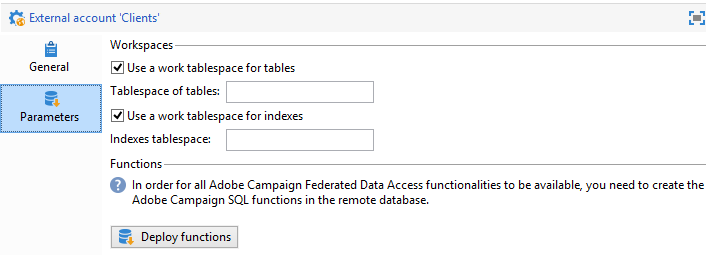
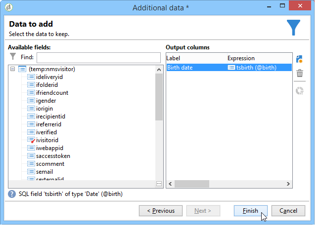

# Åtkomst till en extern databas{#accessing-an-external-database}

## Om åtkomst till federerade data {#about-federated-data-access}

I Adobe Campaign finns alternativet **FDA (Federated Data Access** ) för att bearbeta information som lagras i en eller flera externa databaser: kan ni få åtkomst till externa data utan att ändra strukturen på Adobe Campaign-data.

>[!CAUTION]
>
>FDA-modulen ( **Federated Data Access** ) är valfri. Kontrollera licensavtalet för Adobe Campaign.
>  
>Dessutom är det endast möjligt att få tillgång till en extern databas via FDA för anläggningsinstallationer eller hybridinstallationer.

### Verksamhetsprincip {#operating-principle}

Med alternativet FDA kan du samla in data från SQL-källor och automatiskt identifiera strukturen för måltabellerna.

Om du vill använda den här funktionen måste du:

1. Ha en extern databas som är kompatibel med Adobe Campaign FDA-modulen. Listan över databassystem och kompatibla versioner finns i [kompatibilitetsmatrisen](https://helpx.adobe.com/campaign/kb/compatibility-matrix.html). Användarna måste också ha [nödvändiga behörigheter](#remote-database-access-rights) i Adobe Campaign och i den externa databasen.
1. [Installera drivrutinerna](#specific-configurations-by-database-type) som motsvarar databasen på Adobe Campaign-servern.
1. [Skapa och konfigurera ett externt konto](#connecting-to-the-database) som gör att du kan upprätta en anslutning mellan Adobe Campaign och den externa databasen. Mer information om tillgängliga externa konton finns på den här [sidan](../../platform/using/external-accounts.md).
1. [Skapa lässchemat](#creating-the-data-schema) för den externa databasen i Adobe Campaign. På så sätt kan du känna igen den externa databasens datastruktur.
1. Till slut [skapar du en ny målmappning](#defining-data-mapping) från det tidigare skapade schemat, om mottagarna av dina leveranser kommer från den externa databasen. Detta innebär vissa begränsningar, särskilt när det gäller att personalisera leveranserna.

När databasschemat har skapats kan data bearbetas i Adobe Campaign-arbetsflöden. Mer information finns i [det här avsnittet](../../workflow/using/executing-a-workflow.md#architecture).

### God praxis och rekommendationer {#best-practices-and-recommendations}

FDA-alternativet används för att ändra data i externa databaser i batchläge i arbetsflöden. Användning av FDA i ett annat sammanhang, t.ex. för enhetsoperationer, måste utföras med försiktighet (personalisering, interaktion, realtidsleveranser osv.).

Innan du börjar utnyttja din externa databas utför du prestandatester för att upptäcka eventuella problem och optimera med det här alternativet.

Undvik de åtgärder som behöver använda både Adobe Campaign och den externa databasen så mycket som möjligt. Om du vill göra det kan du:

* Exportera Adobe Campaign-databasen till den externa databasen och kör åtgärderna endast från den externa databasen innan du importerar resultaten till Adobe Campaign igen.
* Samla in data från den externa Adobe Campaign-databasen och kör åtgärderna lokalt.

Om du vill utföra personalisering i leveranser med data från den externa databasen, samlar du in data som ska användas i ett arbetsflöde för att göra dem tillgängliga i en tillfällig tabell. Använd sedan data från den tillfälliga tabellen för att anpassa leveransen.

### Begränsningar {#limitations}

FDA-alternativet är underställt begränsningsskyddet för det externa databassystem som du använder.

Av prestandaskäl rekommenderar vi inte att du använder den här funktionen för att utföra enhetliga operationer (leveranspersonalisering, interaktionsmodul, realtid).

## Specifika konfigurationer efter databastyp {#specific-configurations-by-database-type}

Beroende på vilka externa databaser du vill kunna komma åt från Adobe Campaign måste du utföra vissa specifika konfigurationer. Dessa konfigurationer innebär i princip att installera drivrutiner och deklarera miljövariabler som tillhör varje RDBMS på Adobe Campaign-servern.

Som regel måste du installera motsvarande klientlager på den externa databasen på Adobe Campaign-servern.

>[!NOTE]
>
>Kompatibla versioner visas i [Campaign-kompatibilitetsmatrisen](https://helpx.adobe.com/campaign/kb/compatibility-matrix.html#FederatedDataAccessFDA) .

### Konfigurera åtkomst till Hadoop {#configure-access-to-hadoop}

För att ansluta till en extern Hadoop-databas i FDA krävs följande konfigurationer på Adobe Campaign-servern.

#### För Windows {#for-windows}

1. Installera ODBC- och [Azure HD Insight](https://www.microsoft.com/en-us/download/details.aspx?id=40886) -drivrutiner för Windows.
1. Skapa DSN (namn på datakälla) genom att köra administrationsverktyget för ODBC-datakälla. Du kan ändra ett system-DSN-exempel för Hive.

   ```
   Description: vorac (or any name you like)
   Host: vorac.azurehdinsight.net
   Port: 443
   Database: sm_tst611 (or your database name)
   Mechanism: Azure HDInsight Service
   User/Password: admin/<your password here>
   ```

1. Skapa det externa Hadoop-kontot enligt informationen i avsnittet [Skapa en delad anslutning](#creating-a-shared-connection) .

#### För Linux {#for-linux}

1. Installera unixodbc för Linux.

   ```
   apt-get install unixodbc
   ```

1. Hämta och installera ODBC-drivrutiner för Apache Hive från HortonWorks: [https://www.hortonworks.com/downloads/](https://www.hortonworks.com/downloads/).

   ```
   dpkg -i hive-odbc-native_2.1.10.1014-2_amd64.deb
   ```

1. Kontrollera ODBC-filens plats.

   ```
   root@campadpac71:/tmp# odbcinst -j
   unixODBC 2.3.1
   DRIVERS............: /etc/odbcinst.ini
   SYSTEM DATA SOURCES: /etc/odbc.ini
   FILE DATA SOURCES..: /etc/ODBCDataSources
   USER DATA SOURCES..: /root/.odbc.ini
   SQLULEN Size.......: 8
   SQLLEN Size........: 8
   SQLSETPOSIROW Size.: 8
   ```

1. Skapa DSN (Data Source Name) och redigera filen odbc.ini. Skapa sedan ett DSN för din Hive-anslutning.

   Här är ett exempel för HDInsight som skapar en anslutning som kallas&quot;viral&quot;:

   ```
   [ODBC Data Sources]
   vorac 
   
   [vorac]
   Driver=/usr/lib/hive/lib/native/Linux-amd64-64/libhortonworkshiveodbc64.so
   HOST=vorac.azurehdinsight.net
   PORT=443
   Schema=sm_tst611
   HiveServerType=2
   AuthMech=6
   UID=admin
   PWD=<your password here>
   HTTPPath=
   UseNativeQuery=1
   ```

   >[!NOTE]
   >
   >Parametern **UseNativeQuery** är mycket viktig. Campaign är Hive-medveten och fungerar inte korrekt om inte UseNativeQuery har angetts. Vanligtvis skriver drivrutinen eller Hive SQL Connector om frågor och ändrar kolumnordningen.

   Inställningen av autentisering beror på konfigurationen av Hive/Hadoop. För HD Insight använder du till exempel AuthMech=6 för användar-/lösenordsautentisering enligt beskrivningen [här](http://www.simba.com/products/Spark/doc/ODBC_InstallGuide/unix/content/odbc/hi/configuring/authenticating/azuresvc.htm).

1. Exportera variablerna.

   ```
   export ODBCINI=/etc/myodbc.ini
   export ODBCSYSINI=/etc/myodbcinst.ini
   ```

1. Konfigurera drivrutiner för Hortonworks via /usr/lib/hive/lib/native/Linux-amd64-64/hortonworks.hiveodbc.ini.

   Du måste använda UTF-16 för att kunna ansluta till Campaign och unix-odbc (libodbcinst).

   ```
   [Driver]
   
   DriverManagerEncoding=UTF-16
   ErrorMessagesPath=/usr/lib/hive/lib/native/hiveodbc/ErrorMessages/
   LogLevel=0
   LogPath=/tmp/hive
   SwapFilePath=/tmp
   
   ODBCInstLib=libodbcinst.so
   ```

1. Nu kan du testa anslutningen med isql.

   ```
   isql vorac
   isql vorac -v
   ```

1. Skapa det externa Hadoop-kontot enligt informationen i avsnittet [Skapa en delad anslutning](#creating-a-shared-connection) .

### Konfigurera åtkomst till MySQL {#configure-access-to-mysql}

Mer information om hur du konfigurerar MySQL-databasen finns i den här [artikeln](https://helpx.adobe.com/campaign/kb/campaign_fda_mysql.html).

### Konfigurera åtkomst till Netezza {#configure-access-to-netezza}

För att ansluta till en extern Netezza-databas i FDA krävs ytterligare konfigurationer nedan på Adobe Campaign-servern:

1. Installera ODBC-drivrutinerna för Netezza, enligt det operativsystem du använder:

   * **nz-linuxclient-v7.2.0.0.tar.gz** för Linux. Markera den mapp som motsvarar ditt operativsystem (Linux eller Linux64) och starta uppackningskommandot. Du kan lämna installationen som ska utföras i den databas som föreslås som standard: &quot;/usr/local/nz&quot;.
   * **nz-winclient-v7.2.0.0.zip** för Windows. Zippa upp filen och starta det körbara skript som hör till ditt operativsystem: nzodbcsetup.exe eller nzodbcsetup64.exe. Följ instruktionerna i guiden för att slutföra installationen av drivrutinerna.

1. Konfigurera ODBC-drivrutinen. Konfigurationen kan utföras i standardfilerna: **/etc/odbc.ini** för allmänna parametrar och **/etc/odbcinst.ini** för att deklarera drivrutiner.

   * **/etc/odbc.ini**

      ```
      [ODBC]
      InstallDir=/etc/
      ```

      &quot;InstallDir&quot; motsvarar platsen för filen odbcinst.ini.

   * **/etc/odbcinst.ini**

      ```
      [ODBC Drivers]
      NetezzaSQL = Installed
      
      [NetezzaSQL]
      Driver           = /usr/local/nz/lib/libnzsqlodbc3.so
      Setup            = /usr/local/nz/lib/libnzsqlodbc3.so
      APILevel         = 1
      ConnectFunctions = YYN
      Description      = Netezza ODBC driver
      DriverODBCVer    = 03.51
      DebugLogging     = false
      LogPath          = /tmp
      UnicodeTranslationOption = utf8
      CharacterTranslationOption = all
      PreFetch         = 256
      Socket           = 16384
      ```

1. Ange miljövariablerna för Adobe Campaign-servern:

   * **LD_LIBRARY_PATH**: /usr/local/nz/lib och /usr/local/nz/lib64. &quot;/usr/local/nz&quot; motsvarar den installationsdatabas som finns som standard när du installerar drivrutinerna. Här måste du ange vilken databas du har valt för installationen.
   * **ODBCINI**: platsen för filen odbc.ini (till exempel /etc/odbc.ini).
   * **NZ_ODBC_INI_PATH**: platsen för filen odbc.ini. Netezza kräver också den andra variabeln för att kunna använda filen odbc.ini.

1. Skapa det externa Netezza-kontot, vilket beskrivs i avsnittet [Skapa en delad anslutning](#creating-a-shared-connection) .

>[!NOTE]
>
>Åtgärder för scheman som innehåller automatiskt genererade primärnycklar beaktas inte.
>
>Tabellen använder **Organizer on** -satsen för det första indexvärdet som definieras i schemat. Eftersom den här satsen är begränsad till 1 till 4 kolumner med Netezza, får indexet inte innehålla fler än 4 kolumner.

### Konfigurera åtkomst till Oracle {#configure-access-to-oracle}

För att ansluta till en extern Oracle-databas i FDA krävs ytterligare konfigurationer nedan på Adobe Campaign-servern.

#### För Linux {#for-linux-1}

1. Installera den fullständiga Oracle-klienten som motsvarar din version av Oracle.
1. Lägg till dina TNS-definitioner i installationen. Om du vill göra det anger du dem i en **namnfil.ora** i databasen /etc/oracle. Om den här databasen inte finns skapar du den.

   Skapa sedan en ny TNS_ADMIN-miljövariabel: exportera TNS_ADMIN=/etc/oracle och starta om datorn.

1. Integrera Oracle med er Adobe Campaign-server (nlserver). Det gör du genom att kontrollera att filen **customer.sh** finns i mappen &quot;nl6&quot; i serverstrukturen för Adobe Campaign och att den innehåller länkarna till Oracle-biblioteken.

   Exempel: för en klient i 11.2:

   ```
   export ORACLE_HOME=/usr/lib/oracle/11.2
   export TNS_ADMIN=/etc/oracle
   export LD_LIBRARY_PATH=$ORACLE_HOME/client64/lib:$LD_LIBRARY_PATH
   ```

   >[!NOTE]
   >
   >Dessa värden (särskilt ORACLE_HOME) beror på installationsdatabaserna. Kontrollera trädstrukturen innan du refererar till dessa värden.

1. Installera de bibliotek som krävs för Oracle:

   * **libclntsh.so**

      ```
      cd /usr/lib/oracle/<version>/client<architecture>/lib
      ln -s libclntsh.so.<version> libclntsh.so
      ```

   * **libaio1**

      ```
      aptitude install libaio1
      or
      yum install libaio1
      ```

#### För Windows {#for-windows-1}

1. Installera Oracle-klienten.
1. I mappen C:Oracle skapar du en **namnfil.ora** som innehåller din TNS-definition.

   Lägg till en TNS_ADMIN-miljövariabel med C:Oracle som-värde och starta om datorn.

### Konfigurera åtkomst till Sybase IQ {#configure-access-to-sybase-iq}

För att ansluta till en extern Sybase IQ-databas i FDA krävs ytterligare konfigurationer nedan på Adobe Campaign-servern:

1. Kontrollera att Unixodbc-paketet finns på servern.
1. Installera **iq_odbc**. Ett fel kan uppstå i slutet av installationen. Det här felet kan ignoreras.
1. Installera **iq_client_common**. Ett Java-fel kan uppstå när installationen är klar. Det här felet kan ignoreras.
1. Konfigurera ODBC-drivrutinen. Konfigurationen kan utföras i standardfilerna: /etc/odbc.ini för allmänna parametrar och /etc/odbcinst.ini för att deklarera drivrutiner:

   * **/etc/odbc.ini** (ersätt värden som `<server_alias>` tecken med egna):

      ```
      [ODBC Data Sources]
      <server_alias>=libdbodbc.so
      
      [<server_alias>]
      Driver=/opt/sybase/IQ-16_0/lib64/libdbodbc16.so
      Description=<description>
      Username=<username>
      Password=<password>
      ServerName=<server_name>
      CommLinks=tcpip(host=<host>)
      ```

   * **/etc/odbcinst.ini**

      ```
      [ODBC DRIVERS]
      SAP SybaseIQ=Installed
      
      [SAP SybaseIQ]
      Driver=/opt/sybase/IQ-16_0/lib64/libdbodbc16.so
      ```

1. Lägg till sökvägen för det nya biblioteket libodbc16.so i variabeln LD_LIBRARY_PATH. Så här gör du:

   * Om du använder en customer.sh-fil för att deklarera sökvägen: lägg till sökvägen /opt/sybase/IQ-16_0/lib64 för variabeln LD_LIBRARY_PATH.
   * Annars använder du ett Unix-kommando.

1. Skapa ett nytt externt FDA-konto enligt beskrivningen i avsnittet [Skapa en delad anslutning](#creating-a-shared-connection) . För Sybase IQ motsvarar servernamnet ODBC-anslutningen (`<server_alias>`) som definieras i steg 5. Det behöver inte vara namnet på själva servern.

>[!NOTE]
>
>För Windows måste du installera Sybase IQ-klienten på Adobe Campaign-servern och skapa en ODBC-anslutning. Se till att du skapar en systemdatakälla när Adobe Campaign-servern (nlserver) körs som en tjänst i Windows.

### Konfigurera åtkomst till Teradata {#configure-access-to-teradata}

För anslutning till en extern Teradata-databas i FDA krävs vissa ytterligare konfigurationer på Adobe Campaign-servern. Mer information om hur du konfigurerar Teradata-databasen finns i den här [artikeln](https://helpx.adobe.com/campaign/kb/campaign_fda_teradata.html).

1. Installera [ODBC-drivrutinen för Teradata](http://downloads.teradata.com/download/connectivity/odbc-driver/linux).

   Den består av tre paket som kan installeras på Red Hat (eller CentOS)/Suse i följande ordning:

   * TeraGSS
   * tdicu1510 (installera den med setup_wrapper.sh)
   * tdodbc1510 (installera den med setup_wrapper.sh)

1. Konfigurera ODBC-drivrutinen. Konfigurationen kan utföras i standardfilerna: /etc/odbc.ini **** för allmänna parametrar och /etc/odbcinst.ini för att deklarera drivrutiner:

   * **/etc/odbc.ini**

      ```
      [ODBC]
      InstallDir=/etc/
      ```

      &quot;InstallDir&quot; motsvarar platsen för filen **odbcinst.ini** .

   * **/etc/odbcinst.ini**

      ```
      [ODBC DRIVERS]
      teradata=Installed
      
      [teradata]
      Driver=/opt/teradata/client/15.10/lib64/tdata.so
      APILevel=CORE
      ConnectFunctions=YYY
      DriverODBCVer=3.51
      SQLLevel=1
      ```

1. Ange miljövariablerna för Adobe Campaign-servern:

   * **LD_LIBRARY_PATH**: /opt/teradata/client/15.10/lib64 och /opt/teradata/client/15.10/odbc_64/lib.
   * **ODBCINI**: platsen för filen odbc.ini (till exempel /etc/odbc.ini).
   * **NLSPATH**: plats för filen opermsgs.cat (/opt/teradata/client/15.10/msg/opermsgs.cat)

### Konfigurera åtkomst till SAP HANA {#configure-access-to-sap-hana}

Anslutning till en extern SAP HANA-databas i FDA kräver vissa ytterligare konfigurationer på Adobe Campaign-servern:

1. Installera ODBC-drivrutinerna för SAP HANA, enligt det operativsystem du använder:

   * **hdb_client_linux.tgz** för Linux. När du har packat upp en fil startar du kommandot hdbinst och följer instruktionerna för att slutföra installationen av drivrutinerna.
   * **hdb_client_windows.zip** för Windows. Zippa upp filen och starta den körbara filen: **hdbinst.exe**. Följ instruktionerna i guiden för att slutföra installationen av drivrutinerna.

1. Konfigurera ODBC-drivrutinen. Konfigurationen kan utföras i standardfilerna: /etc/odbc.ini för allmänna parametrar och /etc/odbcinst.ini för att deklarera drivrutiner.

   * **/etc/odbc.ini**

      ```
      [ODBC]
      InstallDir=/etc/
      
      [HDB]
      Driver=HDBODBC
      servernode=localhost:39013 (this value depend of your server)
      User:SYSTEM
      ```

      &quot;InstallDir&quot; motsvarar platsen för filen **odbcinst.ini** .

   * **/etc/odbcinst.ini**

      ```
      [HDBODBC]
      Description = "SmartCloudPT HANA"
      Driver = /usr/sap/hdbclient/libodbcHDB.so
      ```

1. Ange miljövariablerna för Adobe Campaign-servern:

   * **LD_LIBRARY_PATH**: Den bör innehålla länken till SAP Hana-klienten (/usr/sap/hdbclient/ [libodbcHDB.so](http://libodbchdb.so/) som standard).
   * **ODBCINI**: platsen för filen odbc.ini (till exempel /etc/odbc.ini).

1. Skapa det externa SAP Hana-kontot, vilket beskrivs i avsnittet [Skapa en delad anslutning](#creating-a-shared-connection) .

## Åtkomsträttigheter till fjärrdatabas {#remote-database-access-rights}

För det första, för att användaren ska kunna utföra åtgärder på en extern databas via FDA, måste den senare ha en specifik namngiven behörighet i Adobe Campaign.

1. Markera **[!UICONTROL Administration > Access Management > Named Rights]** noden i Adobe Campaign Explorer.
1. Skapa en ny rättighet genom att ange den valda etiketten.
1. Fältet måste **[!UICONTROL Name]** ha följande format: **användare: base@server**, där:

   * **-användaren** motsvarar namnet på användaren i den externa databasen.
   * **base** motsvarar namnet på den externa databasen.
   * **servern** motsvarar namnet på den externa databasservern.

      >[!NOTE]
      >
      >Delen **:base** är valfri i Oracle.

1. Spara den namngivna rättigheten och länka den till den valda användaren från noden **[!UICONTROL Administration > Access Management > Operators]** i Adobe Campaign Explorer.

För att bearbeta data i en extern databas måste Adobe Campaign-användaren ha minst skrivbehörighet för databasen för att kunna skapa arbetstabeller. Dessa tas bort automatiskt av Adobe Campaign.

I allmänhet är följande rättigheter nödvändiga:

* **ANSLUT**: anslutning till fjärrdatabasen,
* **LÄS data**: skrivskyddad åtkomst till tabeller som innehåller kunddata,
* **LÄS &#39;MetaData&#39;**: åtkomst till serverns datakataloger för att få fram tabellstrukturen,
* **LADDA**: massinläsning i arbetstabeller (krävs vid arbete med samlingar och kopplingar),
* **CREATE/DROP** for **TABLE/INDEX/PROCEDURE/FUNCTION**,
* **FÖRKLARA** (rekommenderas): för övervakning av prestanda vid problem,
* **SKRIV data** (beroende på integrationsscenariot).

>[!NOTE]
>
>Databasadministratören måste se till att dessa rättigheter matchar de rättigheter som är specifika för varje databasmotor. Mer information finns i [RDBMS-specifika rättigheter](https://docs.campaign.adobe.com/doc/AC6.1/en/technicalResources/technicalResources.html).

## Ansluta till databasen {#connecting-to-the-database}

Om du vill aktivera en anslutning till den externa databasen måste du ange anslutningsparametrarna, dvs. måldatakällan och namnet på tabellen med data som behöver läsas in.

>[!CAUTION]
>
>Adobe Campaign-användaren behöver specifika rättigheter för den externa databasen och Adobe Campaign-programservern för att bearbeta data från en extern databas. Mer information finns i avsnittet [Åtkomstbehörighet](#remote-database-access-rights) för fjärrdatabas.
>
>För att undvika felfunktioner måste operatorer som har åtkomst till delade fjärrdata arbeta från separata blanksteg.

### Skapa en delad anslutning {#creating-a-shared-connection}

Om du vill aktivera en anslutning till en delad extern databas kan du komma åt databasen via Adobe Campaign, så länge den här anslutningen är aktiv.

1. Konfigurationen måste definieras i förväg via **[!UICONTROL Administration > Platform > External accounts]** noden.
1. Klicka på **[!UICONTROL New]** knappen och välj **[!UICONTROL External database]** typ.
1. Definiera den externa databasens **[!UICONTROL Connection]** parametrar.

   För anslutningar till en **ODBC** -typdatabas måste **[!UICONTROL Server]** fältet innehålla namnet på ODBC-datakällan och inte servernamnet. Dessutom kan vissa ytterligare konfigurationer vara nödvändiga beroende på vilka databaser som används. Se avsnittet [Specifika konfigurationer per databastyp](#specific-configurations-by-database-type) .

1. När parametrarna har angetts klickar du på **[!UICONTROL Test the connection]** knappen för att godkänna dem.

   

1. Om det behövs avmarkerar du alternativet för att inaktivera åtkomsten till den här databasen utan att ta bort dess konfiguration. **[!UICONTROL Enabled]**
1. Om du vill att Adobe Campaign ska få åtkomst till den här databasen måste du distribuera SQL-funktionerna. Klicka på **[!UICONTROL Parameters]** fliken och sedan på **[!UICONTROL Deploy functions]** knappen.

   

Du kan definiera särskilda arbetstabellutrymmen för tabellerna och för indexet på **[!UICONTROL Parameters]** fliken.

### Skapa en anslutning med Windows-autentisering {#creating-a-connection-with-windows-authentication}

Du kan också ansluta via FDA med Windows-autentisering. Så här gör du:

* Kontrollera att Adobe Campaign-tjänsten körs med ett Windows-konto som inte är samma som det lokala systemkontot.
* Kontrollera att Adobe Campaign-operatorn har tillräckliga rättigheter för Adobe Campaign-programservern och den externa databasen.
* Skapa motsvarande externt konto utan att ange **[!UICONTROL Account]** och **[!UICONTROL Password]**. Ange bara databasens namn.

### Skapa en tillfällig anslutning {#creating-a-temporary-connection}

Du kan definiera en anslutning till en extern databas direkt från arbetsflödesaktiviteter. I det här fallet kommer den att finnas i en lokal extern databas som är reserverad för att användas i ett aktuellt arbetsflöde: den sparas inte på externa konton. Den här typen av punktlig anslutning kan skapas för olika aktiviteter i arbetsflödet, särskilt **[!UICONTROL Query]**, **[!UICONTROL Data loading (RDBMS)]**, **[!UICONTROL Enrichment]** aktiviteten eller **[!UICONTROL Split]** aktiviteten.

>[!CAUTION]
>
>Den här typen av konfiguration rekommenderas inte, men kan användas regelbundet för att samla in data. Du bör ändå skapa ett externt konto, vilket beskrivs i avsnittet [Skapa en delad anslutning](#creating-a-shared-connection) .

I frågeaktiviteten är till exempel stegen för att skapa en periodisk anslutning till en extern databas följande:

1. Klicka på **[!UICONTROL Add data...]** och välj **[!UICONTROL External data]** alternativ.
1. Välj **[!UICONTROL Locally defining the data source]** alternativet.

   

1. Välj måldatabasmotorn i listrutan. Ange namnet på servern och ange autentiseringsparametrarna.

   Ange också namnet på den externa databasen.

   

   Klicka på **[!UICONTROL Next]** knappen.

1. Markera tabellen där data lagras.

   Du kan ange namnet på tabellen direkt i motsvarande fält eller klicka på redigeringsikonen för att öppna listan med databastabeller.

   

1. Klicka på **[!UICONTROL Add]** knappen för att definiera ett eller flera avstämningsfält mellan externa databasdata och data i Adobe Campaign-databasen. Ikonerna **[!UICONTROL Edit expression]** i **[!UICONTROL Remote field]** och **[!UICONTROL Local field]** ger dig tillgång till listan med fält i varje tabell.

   

1. Om det behövs anger du ett filtreringsvillkor och datasorteringsläget.
1. Välj de ytterligare data som ska samlas in i den externa databasen. Det gör du genom att dubbelklicka på de fält som du vill lägga till för att visa dem i **[!UICONTROL Output columns]**.

   

   Klicka **[!UICONTROL Finish]** för att bekräfta konfigurationen.

### Säker anslutning {#secure-connection}

Du kan skydda åtkomsten till en extern databas när du konfigurerar ett externt FDA-konto.

Det gör du genom att lägga till &quot;**:ssl**&quot; efter serveradressen och adressen för den port som används. Till exempel: **192.168.0.52:4501:ssl**.

Data skickas sedan via det säkra SSL-protokollet.

### Ytterligare konfigurationer {#additional-configurations}

Om det behövs kan du skapa schemat för databearbetning i en extern databas. På samma sätt kan du med Adobe Campaign definiera mappning för data i en extern tabell. Dessa konfigurationer är allmänna och gäller inte enbart arbetsflöden.

>[!NOTE]
>
>Mer information om hur du skapar scheman i Adobe Campaign och definierar en ny datamappning finns på [den här sidan](../../configuration/using/about-schema-edition.md).

## Skapa dataschemat {#creating-the-data-schema}

Om du vill skapa ett schema i en extern databas klickar du på **[!UICONTROL New]** knappen ovanför listan med datamappningar och väljer **[!UICONTROL Access external data]**.


Ange ett namn och en beskrivning för schemat och välj det externa konto som ska aktivera anslutningen till databasen. Detta ger åtkomst till listan med tabeller som är tillgängliga i den externa basen. Välj den tabell som innehåller de data som ska samlas in.


Bekräfta genom **[!UICONTROL OK]** att klicka. Adobe Campaign identifierar automatiskt strukturen för den valda tabellen och genererar det logiska schemat.

>[!NOTE]
>
>Adobe Campaign genererar inga länkar.

Klicka **[!UICONTROL Save]** för att bekräfta skapandet.


Indexen skapas automatiskt när en tabell mappas (standard- eller FDA-mappning).

## Definiera datamappning {#defining-data-mapping}

Med Adobe Campaign kan ni definiera mappning av data i en extern tabell.

För att göra detta måste du skapa en ny leveransmappning för att kunna använda data i den här tabellen som leveransmål när schemat för den externa tabellen har skapats.

Gör så här:

1. Skapa en ny leveranskarta och välj målinriktningsdimensionen, det schema du just skapade, till exempel.

   

1. Ange fälten där leveransinformationen lagras (efternamn, förnamn, e-postadress, adress osv.).

   

1. Ange parametrarna för informationslagring, inklusive suffixet för tilläggsscheman för att de ska vara enkla att identifiera.

   

   Du kan välja att lagra undantag (**exkluderande**), med meddelanden (**utsändning**) eller i en separat tabell.

   Du kan också välja om du vill hantera spårning för den här leveranskartan (**spårningslogg**).

1. Välj sedan de tillägg som ska beaktas. Tilläggstypen beror på plattformens parametrar och alternativ (se licensavtalet).

   

   Klicka på **[!UICONTROL Save]** knappen för att starta framtagningen av leveransmappningen: alla länkade tabeller skapas automatiskt baserat på de valda parametrarna.

## Ytterligare alternativ {#additional-options}

### HTTP-relä till en fjärrinstans {#http-relay-to-a-remote-instance}

Du kan komma åt externa databaser som konfigurerats i fjärrinstanser med HTTP-protokollet.

>[!NOTE]
>
>Alla SQL-datatyper stöds inte av den här funktionen. Blobbdatatyper stöds inte alls. Det är möjligt att andra datatyper inte fungerar beroende på måldatabasen (t.ex. Tidsstämpel på Microsoft SQL Server). Kontakta Adobes support för mer information.

Detta förenklar överföring och synkronisering av data mellan två instanser. Det gör det också möjligt att stega förbi alla tunnlar mellan en instans och en fjärrdatabas samt att installera klientlager för att få åtkomst till den här databasen. Målinstansen kan vara en värdinstans.

>[!CAUTION]
>
>Det här alternativet är endast till för att underlätta datareplikeringsflöden (ETL).
>
>Det gör till exempel att en molnbaserad instans kan ha direkt åtkomst till data i en&quot;lokal&quot; värddatabas. Det är dock inte avsett att tillåta målinriktning på en lokal databas direkt från molnet.

För att göra detta måste du konfigurera de externa kontona för de två instanserna så att den lokala instansen kan kommunicera med fjärrinstansen med HTTP-protokollet:

* Lokal instans: välj den nya **[!UICONTROL HTTP relay to a remote database]** anslutningstypen.

   Om data överförs satsvis anger du även buffertstorleken. Välj komprimeringsalternativet om du vill minska storleken på överförda data.

   Värdet **[!UICONTROL Data source]** måste definieras med följande syntax: &quot;nms:extAccount : `<internal_name_of_the_external_account>`&quot;

   

   >[!NOTE]
   >
   >Vi rekommenderar att du använder en HTTPS-anslutning.

* Fjärrinstans: i FDA:s externa konto för databasen som nås via HTTP-reläet, kontrollerar du målvärdet för en **[!UICONTROL 'HTTP relay to a remote database' account option]**.

   

I följande exempel visas det nya möjliga operativläget:


>[!CAUTION]
>
>Fjärrinstansens standarddatabas måste även nås via ett externt konto.

Den här operativmetoden undviker att rensningsarbetsflödet för varje instans tar bort arbetstabellerna i databaserna som använder instansen som relä.

I föregående exempel kommer rensningsarbetsflödet för fjärrinstansen alltså inte att utföra någon åtgärd på den röda FDA-databasen som den används av den lokala instansen.

### Skapa tillfälliga scheman direkt {#directly-creating-temporary-schemas}

Om du vill hantera flera åtkomster till en extern FDA-databas kan du med ett nytt alternativ skapa ett arbetsschema direkt när du konfigurerar ett externt konto.

>[!NOTE]
>
>Det här alternativet fungerar bara med PostgreSQL.


### Optimera e-postpersonalisering med externa data {#optimizing-email-personalization-with-external-data}

Från version 8740 **[!UICONTROL Prepare the personalization data with a workflow]** är alternativet nu tillgängligt på fliken **[!UICONTROL Analysis]** för leveransegenskaperna.

Under leveransanalysen skapar och kör det här alternativet automatiskt ett arbetsflöde som lagrar alla data som är länkade till målet i en tillfällig tabell, inklusive data från tabeller som är länkade i FDA.

Genom att markera det här alternativet kan du uppnå en avsevärd prestandaökning för personalisering.

### Cloud Messaging - FDA-synkronisering {#cloud-messaging---fda-synchronization}

När Cloud Messaging-servern och Marketing Server inte har synkroniserats på lång tid kan antalet saknade utskick på Marketing Server vara betydande. Alternativet **NmsMidSourcing_LogsPeriodHour** har lagts till för att optimera sändningssynkroniseringen via FDA. Detta gör att en maximal period (uttryckt i timmar) kan anges som för att begränsa antalet utsändning som återställs varje gång synkroniseringsarbetsflödet körs.

Alternativet ska läggas till i konsolen, i **[!UICONTROL Administration > Options]** noden.

>[!CAUTION]
>
>Det här alternativet får **bara** användas för synkronisering av en stor mängd utsändningar via FDA.

>[!NOTE]
>
>Alternativet beaktas endast om det finns ett senaste återställningsdatum (alternativet **NmsMidSourcing_LastBroadLog_*** ).

### Meddelandecenter - läsåtkomst för XtkFolder-tabellen {#message-center---read-access-on-the-xtkfolder-table}

Från och med version 8141 krävs manuell åtgärd om Message Center använder FDA som arkiveringsläge.

Du måste ge läsåtkomst i XtKFolder-tabellen till användaren som är länkad till det externa FDA-kontot.

För en PostgreSQL-databas är kommandot som följer:

```
GRANT SELECT ON XtkFolder TO DBUSER;
```

Användaren måste ha läsåtkomst till följande tabeller:

* NmsBroadLogRtEvent
* NmsBroadLogBatchEvent
* NmsTrackingLogRtEvent
* NmsTrackingLogBatchEvent
* NmsRtEvent
* NmsBatchEvent
* NmsBroadLogMsg
* NmsTrackingUrl
* NmsDelivery
* NmsWebTrackingLog

>[!NOTE]
Den här ändringen tar bort felmeddelandet &quot;Behörighet nekad för relationsxtkfolder&quot;.

Om det arbetsschema som har valts i det externa FDA-kontot inte är det körklara Neolane-kontot behöver du inte ändra åtkomstbehörigheterna.

## Använda data från en extern databas i ett arbetsflöde {#using-data-from-an-external-database-in-a-workflow}

I flera arbetsflödesaktiviteter i Adobe Campaign kan du använda data som lagras i en extern databas.

### Filtrera externa data {#filtering-on-external-data}

Med frågeaktiviteten kan du lägga till externa data och använda dem i definierade filterkonfigurationer.

Mer information finns i avsnittet [Fråga](../../workflow/using/targeting-data.md#selecting-data) .

### Skapa delmängder {#creating-sub-sets}

Med den delade aktiviteten kan du skapa delmängder. Du kan använda externa data för att definiera de filtervillkor som ska användas.

Mer information finns i avsnittet [Dela](../../workflow/using/split.md) .

### Läser in extern databas {#loading-external-database}

Du kan använda externa data i datainläsningen (RDBMS). Den här aktiviteten visas i avsnittet [Datainläsning](../../workflow/using/data-loading--rdbms-.md) .

### Lägga till information och länkar {#adding-information-and-links}

Med hjälp av anrikningsaktiviteten kan du lägga till ytterligare data till arbetsflödets arbetstabell samt länkar till en extern tabell. Därför kan den utnyttja data från en extern databas. Den här aktiviteten presenteras i [anrikningsavsnittet](../../workflow/using/enrichment.md) .
