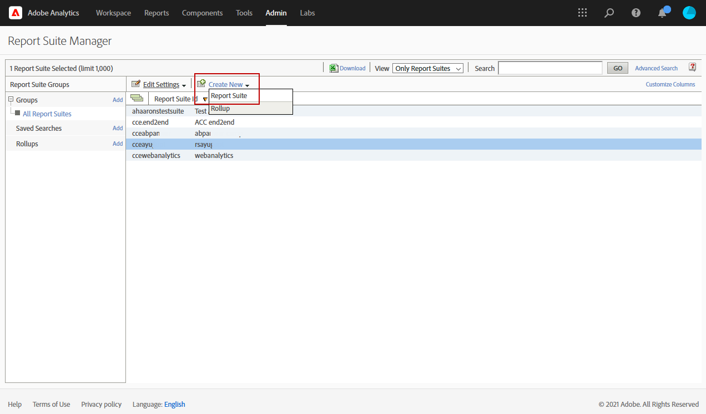

# Adobe Analytics Connector{#adobe-analytics-connector}

## Om integrering med Adobe Analytics Connector {#about-analytics-connector-integration}

>[!CAUTION]
>
>Adobe Analytics Connector är inte kompatibelt med Transactional Messaging (Message Center).

Adobe Analytics Connector gör att Adobe Campaign och Adobe Analytics kan interagera via **[!UICONTROL Web Analytics connectors]**-paketet. Den skickar data till Adobe Campaign i form av segment som gäller användarbeteende efter en e-postkampanj. Omvänt skickas indikatorer och attribut för e-postkampanjer från Adobe Campaign till Adobe Analytics.

Med Adobe Analytics Connector kan Adobe Campaign mäta internetpublik (Web Analytics). Tack vare dessa integreringar kan Adobe Campaign återställa data om besökares beteende för en eller flera webbplatser efter en marknadsföringskampanj och (efter analys) köra återmarknadsföringskampanjer i syfte att konvertera dem till köpare. Omvänt gör webbanalysverktygen att Adobe Campaign kan vidarebefordra indikatorer och kampanjattribut till sina plattformar.

Åtgärdsfälten för varje verktyg är följande:

* Webbanalysens roll:

   1. markerar de e-postkampanjer som lanserats med Adobe Campaign,
   1. sparar mottagarnas beteende, på den webbplats som de bläddrade efter att ha klickat på kampanjmeddelandet, i form av segment. Segmenten avser övergivna produkter (som visas men inte läggs till i kundvagnen eller köpta), inköp eller övergivna varukorgar.

* Adobe Campaign roll:

   1. skickar indikatorerna och kampanjattributen till kopplingen, som i sin tur vidarebefordrar dem till webbanalysverktyget,
   1. återställa och analysera segment,
   1. utlöser en återmarknadsföringskampanj.

## Konfigurera integreringen {#setting-up-the-integration}

Om du vill konfigurera dataanslutningen måste du ansluta till din Adobe Campaign-instans och utföra följande åtgärder:

1. [Skapa en rapportsvit i Adobe Analytics](#report-suite-analytics)
1. [Konfigurera konverteringsvariabler och lyckade händelser](#configure-conversion-success)
1. [Konfigurera ditt externa konto i Adobe Campaign Classic](#external-account-classic)

### Skapa din rapportsvit i Adobe Analytics {#report-suite-analytics}

Om du vill konfigurera integreringen av Adobe Analytics/Adobe Campaign Classic måste du ansluta till din [!DNL Adobe Analytics]-instans och utföra följande åtgärder:

1. I [!DNL Adobe Analytics] väljer du **[!UICONTROL Admin tab]** och klickar sedan på **[!UICONTROL All admin]**.

   

1. Klicka på **[!UICONTROL Report suites]**.

   

1. På sidan **[!UICONTROL Report suite manager]** klickar du på **[!UICONTROL Create new]** och sedan på **[!UICONTROL Report suite]**.

   Detaljerade anvisningar om hur du skapar **[!UICONTROL Report suite]** finns i det här [avsnittet](https://experienceleague.adobe.com/docs/analytics/admin/manage-report-suites/new-report-suite/t-create-a-report-suite.html?lang=en#prerequisites).

   

1. Välj en mall.

1. Konfigurera din nya rapportsvit med följande information:

   * **[!UICONTROL Report Suite ID]**
   * **[!UICONTROL Site Title]**
   * **[!UICONTROL Time Zone]**
   * **[!UICONTROL Go Live Date]**
   * **[!UICONTROL Estimated Page Views Per Day]**

   

1. När konfigurationen är klar klickar du på **[!UICONTROL Create report suite]**.

### Konfigurera konverteringsvariablerna och lyckade händelser {#configure-conversion-success}

När du har skapat din **[!UICONTROL Report suite]** måste du konfigurera din **[!UICONTROL Conversion variables]** och **[!UICONTROL Success events]** enligt följande:

1. Välj din tidigare konfigurerade **[!UICONTROL Report suite]**.

1. Välj **[!UICONTROL Conversion]** > **[!UICONTROL Conversion variables]** från knappen **[!UICONTROL Edit settings]**.

   

1. Klicka på **[!UICONTROL Add new]** för att skapa de identifierare som krävs för att mäta effekten av e-postkampanjen, dvs. det interna kampanjnamnet (cid) och ID:t för registret iNmsBroadlog (bid).

   Mer information om hur du redigerar **[!UICONTROL Conversion variables]** finns i det här [avsnittet](https://experienceleague.adobe.com/docs/analytics/admin/admin-tools/conversion-variables/t-conversion-variables-admin.html?lang=en#admin-tools).

   

1. Klicka på **[!UICONTROL Save]** när du är klar.

1. Skapa sedan din **[!UICONTROL Success events]** genom att välja **[!UICONTROL Conversion]** > **[!UICONTROL Success events]** från knappen **[!UICONTROL Edit settings]**.

   

1. Klicka på **[!UICONTROL Add new]** för att konfigurera följande **[!UICONTROL Success events]**:

   * **[!UICONTROL Clicked]**
   * **[!UICONTROL Opened]**
   * **[!UICONTROL Person clicks]**
   * **[!UICONTROL Processed]**
   * **[!UICONTROL Scheduled]**
   * **[!UICONTROL Sent]**
   * **[!UICONTROL Total bounces]**
   * **[!UICONTROL Unique Clicks]**
   * **[!UICONTROL Unique Opens]**
   * **[!UICONTROL Unsubscribed]**

   Mer information om hur du konfigurerar **[!UICONTROL Success events]** finns i det här [avsnittet](https://experienceleague.adobe.com/docs/analytics/admin/admin-tools/success-events/t-success-events.html?lang=en#admin-tools)

   

1. Klicka på **[!UICONTROL Save]** när du är klar.

När rapportsviten har konfigurerats måste du konfigurera **[!UICONTROL External accounts]** i Adobe Campaign Classic.

### Konfigurera ditt externa konto i Adobe Campaign Classic {#external-account-classic}

>[!IMPORTANT]
>
> För att den här integreringen ska fungera måste du installera **[!UICONTROL Web Analytics connectors]**-paketet i Adobe Campaign.
>
>Mer information om paketinstallation finns på den här [sidan](../../installation/using/installing-campaign-standard-packages.md).

Nu måste du konfigurera ditt externa **[!UICONTROL Web Analytics]**-konto i Adobe Campaign för att aktivera synkroniseringen mellan de två lösningarna.

Observera, att om en av dina **[!UICONTROL Report suite]**, **[!UICONTROL Conversion variables]** eller **[!UICONTROL Success events]** inte visas när du konfigurerar ditt externa konto, innebär det att du saknar behörighet för den nya komponenten i **[!UICONTROL Product profile]** som är associerad med användaren.

Mer information finns på sidan [Produktprofiler för Adobe Analytics](https://experienceleague.adobe.com/docs/analytics/admin/admin-console/permissions/product-profile.html?lang=en#product-profile-admins).

1. Gå till mappen **[!UICONTROL Administration]** > **[!UICONTROL Platform]** > **[!UICONTROL External accounts]** i Adobe Campaign-trädet och klicka på **[!UICONTROL New]**.

   

1. Använd listrutan för att välja typen **[!UICONTROL Web Analytics]** och **[!UICONTROL Adobe Analytics]** i listrutan **[!UICONTROL Integration]**.

   

1. Klicka på **[!UICONTROL Configure]** bredvid listrutan **[!UICONTROL Integration]**.

1. Mappa det externa kontot från **[!UICONTROL Configure Analytics integration]**-fönstret med den rapportsvit du skapat tidigare och ge följande information:

   * **[!UICONTROL E-Mail]**
   * **[!UICONTROL IMS Org]**
   * **[!UICONTROL Analytics Company]**
   * **[!UICONTROL Report Suite]**

1. Mappa de två **[!UICONTROL Conversion variables]** som konfigurerats i [!DNL Adobe Analytics] i kategorin **[!UICONTROL eVars]**.

   

1. Mappa de tio **[!UICONTROL Success events]** som konfigurerats i [!DNL Adobe Analytics] från kategorin **[!UICONTROL Events]**.

1. Klicka på **[!UICONTROL Submit]** när du är klar. Adobe Campaign skapar en **[!UICONTROL Data source]**, **[!UICONTROL Calculated metrics]**, **[!UICONTROL Remarketing segments]** och **[!UICONTROL Classifications]** i den mappade analysen **[!UICONTROL Report Suite]**.

   När synkroniseringen mellan [!DNL Adobe Analytics] och Adobe Campaign är klar kan du stänga fönstret.

1. Inställningarna kan visas från fliken **[!UICONTROL Data Settings]** i fönstret **[!UICONTROL Configure Analytics integration]**.

   Med knappen **[!UICONTROL Sync]** kommer [!DNL Adobe Campaign] att synkronisera namnändringarna i [!DNL Adobe Analytics]. Om komponenten tas bort i [!DNL Adobe Analytics] kommer komponenten att genomstrykas i [!DNL Adobe Campaign] eller visas med ett **meddelande som inte hittas**.

   

1. Om det behövs kan du lägga till eller ta bort segment från fliken **[!UICONTROL Update Segments]**.

1. Klicka på länken **[!UICONTROL Enrich the formula...]** i **[!UICONTROL External account]** för att ändra URL-beräkningsformeln och ange integreringsinformation för verktyget Webbanalys (kampanj-ID) och domänerna för de webbplatser vars aktivitet måste spåras.

   

1. Ange domännamn för webbplatserna.

   

1. Klicka på **[!UICONTROL Next]** och kontrollera att domännamnen har sparats.

   

1. Om det behövs kan du överlagra beräkningsformeln. Markera rutan och redigera formeln direkt i fönstret.

   >[!IMPORTANT]
   >
   >Det här konfigurationsläget är reserverat för expertanvändare: eventuella fel i den här formeln kan leda till avbrutna e-postleveranser.

1. På fliken **[!UICONTROL Advanced]** kan du konfigurera eller ändra fler tekniska inställningar.

   * **[!UICONTROL Lifespan]**: I kan du ange efter hur många dagar (i dagar) som webbhändelser återställs i Adobe Campaign av tekniska arbetsflöden. Standard: 180 dagar.
   * **[!UICONTROL Persistence]**: Med kan du ange den period under vilken alla webbhändelser (till exempel ett köp) kan tillskrivas en återmarknadsföringskampanj, Standard: 7 dagar.

>[!NOTE]
>
>Om du använder flera målgruppsmätningsverktyg kan du välja **[!UICONTROL Other]** i listrutan **[!UICONTROL Partners]** när du skapar det externa kontot. Du får endast referera till ett externt konto i leveransegenskaperna: Du måste därför anpassa formeln för spårade URL-adresser genom att lägga till de parametrar som förväntas av Adobe och alla andra mätverktyg som används.

### Tekniska arbetsflöden för webbanalysprocesser {#technical-workflows-of-web-analytics-processes}

Datautbyte mellan Adobe Campaign och Adobe Analytics hanteras av fyra tekniska arbetsflöden som körs som en bakgrundsuppgift.

De finns i Adobe Campaign-trädet, under mappen **[!UICONTROL Administration]** > **[!UICONTROL Production]** > **[!UICONTROL Technical workflows]** > **[!UICONTROL Web analytics process]**.

* **[!UICONTROL Recovering of web events]**: en gång i timmen hämtar det här arbetsflödet segment om hur användare beter sig på en viss webbplats, inkluderar dem i Adobe Campaign-databasen och startar arbetsflödet för ommarknadsföring.
* **[!UICONTROL Event purge]**: Med det här arbetsflödet kan du ta bort alla händelser från databasen beroende på vilken period som har konfigurerats i  **[!UICONTROL Lifespan]** fältet. Mer information finns i [Konfigurera ditt externa konto i Adobe Campaign Classic](#external-account-classic).
* **[!UICONTROL Identification of converted contacts]**: katalog över de besökare som gjorde ett köp efter en återmarknadsföringskampanj. Data som samlas in av det här arbetsflödet är tillgängliga i **[!UICONTROL Re-marketing efficiency]**-rapporten, se den här [sidan](#creating-a-re-marketing-campaign).
* **[!UICONTROL Sending of indicators and campaign attributes]**: Med kan ni skicka kampanjindikatorer via Adobe Campaign till Adobe Experience Cloud med Adobe Analytics Connector. Arbetsflödet utlöses kl. 4.00 varje dag och det kan ta 24 timmar innan data skickas till Analytics.

   Observera att det här arbetsflödet inte ska startas om, annars skickas alla tidigare data på nytt, vilket kan fördröja analysresultaten.

   Följande indikatorer ingår:

   * **[!UICONTROL Messages to deliver]** (@toDeliver)
   * **[!UICONTROL Processed]** (@bearbetad)
   * **[!UICONTROL Success]** (@success)
   * **[!UICONTROL Total count of opens]** (@totalRecipientOpen)
   * **[!UICONTROL Recipients who have opened]** (@mottagareÖppna)
   * **[!UICONTROL Total number of recipients who clicked]** (@totalRecipientClick)
   * **[!UICONTROL People who clicked]** (@personClick)
   * **[!UICONTROL Number of distinct clicks]** (@mottagareKlicka)
   * **[!UICONTROL Opt-Out]** (@optOut)
   * **[!UICONTROL Errors]** (@error)

   >[!NOTE]
   >
   >Skickade data är deltavärdet baserat på den senaste ögonblicksbilden, vilket kan leda till ett negativt värde i mätdata.

   Följande attribut skickas:

   * **[!UICONTROL Internal name]** (@internalName)
   * **[!UICONTROL Label]** (@label)
   * **[!UICONTROL Label]** (operation/@label): bara om  **** Campaign-paketet är installerat
   * **[!UICONTROL Nature]** (operation/@nature): bara om  **** Campaign-paketet är installerat
   * **[!UICONTROL Tag 1]** (webAnalytics/@tag1)
   * **[!UICONTROL Tag 2]** (webAnalytics/@tag2)
   * **[!UICONTROL Tag 3]** (webAnalytics/@tag3)
   * **[!UICONTROL Contact date]** (schemalägger/@contactDate)

## Spåra leveranser i Adobe Campaign {#tracking-deliveries-in-adobe-campaign}

För att Adobe Experience Cloud ska kunna spåra aktiviteter på webbplatserna när leveransen har skickats av Adobe Campaign, måste du referera till matchande koppling i leveransegenskaperna. Gör så här:

1. Öppna leveransen av kampanjen som ska spåras.

   

1. Öppna leveransegenskaperna.
1. Gå till fliken **[!UICONTROL Web Analytics]** och välj det tidigare skapade externa kontot. Se [Konfigurera ditt externa konto i Adobe Campaign Classic](#external-account-classic).

   

1. Nu kan du skicka leveransen och öppna rapporten i Adobe Analytics.

## Skapa en marknadsföringskampanj {#creating-a-re-marketing-campaign}

För att förbereda er marknadsföringskampanj skapar ni helt enkelt leveransmallar som kan användas för återmarknadsföringskampanjer. Konfigurera sedan er marknadsföringskampanj och länka den till ett segment. Varje segment måste ha olika återmarknadsföringskampanjer.

Återmarknadsföringskampanjer startas automatiskt när Adobe Campaign har återställt segmenten och analyserat beteendet hos de personer som den inledande kampanjen riktar sig till. Om kunden överger en varukorg eller visar en produkt utan att köpa den skickas en leverans till de berörda mottagarna så att surfandet avslutas vid köpet.

Adobe Campaign tillhandahåller skräddarsydda leveransmallar som ni kan använda eller registrera er själva för att förbereda kampanjer.

1. Gå till mappen **[!UICONTROL Resources]** > **[!UICONTROL Templates]** > **[!UICONTROL Delivery templates]** i Adobe Campaign-trädet.**[!UICONTROL Explorer]**

1. Duplicera **[!UICONTROL Email delivery (re-marketing)]**-mallen eller mallexemplen för ny marknadsföring som Adobe Campaign erbjuder.

   

1. Anpassa mallen efter dina behov och spara den.

1. Skapa en ny kampanj och välj mallen **[!UICONTROL Re-marketing campaign]** i listrutan.

   

1. Klicka på länken **[!UICONTROL Configure...]** för att ange segmentet och leveransmallen som är länkad till kampanjen.

1. Välj det tidigare konfigurerade externa kontot.

   

1. Välj det berörda segmentet.

   

1. Välj leveransmallen som ska användas för den här återmarknadsföringskampanjen och klicka sedan på **[!UICONTROL Finish]** för att stänga fönstret.

   

1. Klicka på **[!UICONTROL OK]** för att stänga kampanjfönstret.

**[!UICONTROL Re-marketing efficiency]**-rapporten nås via den globala rapportsidan. Här kan du se antalet konverterade kontakter (dvs. ha köpt något) i relation till antalet övergivna kundvagnar efter Adobe Campaign marknadsföringskampanj. Konverteringsgraden beräknas per vecka, månad eller sedan synkroniseringen mellan Adobe Campaign och webbanalysverktygen startades.

