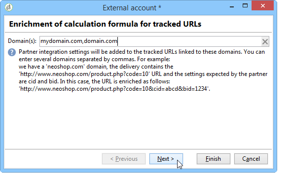

# Adobe Analytics Data Connector{#adobe-analytics-data-connector-legacy}

>[!IMPORTANT]
>
>Adobe Analytics Data Connector är nu föråldrat. De föråldrade funktionerna är fortfarande tillgängliga, men de kommer inte att förbättras ytterligare eller stödjas. Läs mer [på den här sidan](../../rn/using/deprecated-features.md).

## Om integrering med Data Connector {#about-data-connector-integration}

>[!IMPORTANT]
>
>Adobe Analytics Data Connector är inte kompatibel med transaktionsmeddelanden (meddelandecentret).

Med Data Connector (tidigare Adobe Genesis) kan Adobe Campaign och Adobe Analytics interagera via paketet med **Web Analytics-kopplingar**. Den skickar data till Adobe Campaign i form av segment som gäller användarbeteende efter en e-postkampanj. Omvänt skickas indikatorer och attribut för e-postkampanjer som levereras av Adobe Campaign till Adobe Analytics – Data connector..

Med hjälp av Data Connector kan Adobe Campaign mäta internetpublik (Web Analytics). Tack vare dessa integreringar kan Adobe Campaign inhämta data om besökares beteende för en eller flera webbplatser efter en marknadsföringskampanj och (efter analys) köra återmarknadsföringskampanjer i syfte att konvertera dem till köpare. Omvänt gör webbanalysverktygen att Adobe Campaign kan vidarebefordra indikatorer och kampanjattribut till sina plattformar.

Åtgärdsfälten för varje verktyg är följande:

* Webbanalysens roll:

   1. markerar de e-postkampanjer som lanserats med Adobe Campaign,
   1. sparar mottagarnas beteende, på den webbplats där de bläddrade efter att ha klickat på kampanjmeddelandet, i form av segment. Segmenten avser övergivna produkter (som visats men inte lagts till i varukorgen eller köpts), inköp eller övergivna varukorgar.

* Adobe Campaigns roll:

   1. skickar indikatorerna och kampanjattributen till kopplingen, som i sin tur vidarebefordrar dem till webbanalysverktyget,
   1. återställer och analyserar segment,
   1. utlöser en återmarknadsföringskampanj.

## Konfigurera integreringen {#setting-up-the-integration}

Om du vill konfigurera datakopplingen måste du ansluta till din Adobe Campaign-instans och utföra följande åtgärder:

* [Steg 1: Konfigurera integrering i Analytics](#step-1--configure-integration-in-analytics)
* [Steg 2: Skapa det externa kontot i Campaign](#step-2--create-the-external-account-in-campaign)
* [Steg 3: Synkronisera Adobe Campaign och Adobe Analytics](#step-3--synchronize-adobe-campaign-and-adobe-analytics)

### Steg 1: konfigurera integrering i Analytics {#step-1--configure-integration-in-analytics}

I följande steg beskrivs konfigurationen av datakopplingen med hjälp av en guide.

1. Logga in på Adobe Experience Cloud med ett Adobe ID eller ett Enterprise ID.

   

1. Välj **[!UICONTROL Analytics]** i listan över Experience Cloud-lösningar.

   

1. På fliken **[!UICONTROL Admin]** väljer du **[!UICONTROL Data Connectors]**.

   Du måste ha följande behörigheter för analysverktygen för att komma åt **[!UICONTROL Data Connectors]**-menyn. Se denna [sida](https://experienceleague.adobe.com/docs/analytics/admin/admin-console/permissions/analytics-tools.html?lang=sv) för mer information om detta
   * Integreringar (skapa)
   * Integreringar (uppdatera)
   * Integreringar (ta bort)

   

1. Välj **[!UICONTROL Adobe Campaign Classic]** i listan över partners.

   

1. I dialogrutan **[!UICONTROL Add integration]**, klicka på **[!UICONTROL Activate]**.
1. Markera **[!UICONTROL I accept these terms and conditions]** och välj **[!UICONTROL Report suite]** som är länkad till den här integreringen och ange kopplingsetiketten.

   När du är klar klickar du på **[!UICONTROL Create and configure this integration]**.

   

1. Ange den e-postadress som ska ta emot meddelanden för kopplingsprogrammet och kopiera sedan **[!UICONTROL Account ID]** så som den visas i det externa Adobe Campaign-kontot (mer information finns i [steg 2: Skapa det externa kontot i Campaign](#step-2--create-the-external-account-in-campaign)).

   

1. Ange de identifierare som krävs för att mäta effekten av e-postkampanjen, dvs. det interna kampanjnamnet (cid) och ID:t för registret iNmsBroadlog (bid). Du bör också ange indikatorer för händelser som ska samlas in.
Kontrollera att **[!UICONTROL Events]** är av numerisk typ, annars visas de inte i listrutan.

   

1. Ange vid behov de personanpassade segmenten.

   

1. I **[!UICONTROL Data collection]** väljer du en metod för att inhämta data, i det här fallet identifierarna **[!UICONTROL cid]** och **[!UICONTROL bid]** som anges i steg 6.

   

1. Välj den information som ska visas på kontrollpanelen.

   

1. Kontrollera konfigurationen på sidan som summerar föregående steg.

   

1. Klicka på **[!UICONTROL Activate Now]** för att godkänna konfigurationen och aktivera kopplingen.

   

   Datakopplingen är nu konfigurerad.

### Steg 2: skapa det externa kontot i Campaign {#step-2--create-the-external-account-in-campaign}

Integreringen av Adobe Campaign i Analytics-plattformarna görs med hjälp av en koppling. Använd följande process om du vill synkronisera programmen:

1. Installera **Web Analytics-kopplingspaketet** i Adobe Campaign.
1. Gå till mappen **[!UICONTROL Administration > Platform > External accounts]** i Adobe Campaign-trädet.
1. Högerklicka på listan med externa konton och välj **[!UICONTROL New]** i listrutan (eller klicka på knappen **[!UICONTROL New]** ovanför listan med externa konton).
1. Använd listrutan för att välja typen **[!UICONTROL Web Analytics]**.
1. Välj provider för kopplingen, dvs. **[!UICONTROL Adobe Analytics - Data Connector]** i det här fallet.

   

1. Klicka på länken **[!UICONTROL Enrich the formula...]** om du vill ändra URL-beräkningsformeln för att ange integreringsinformation för webbanalysverktyget (kampanj-ID) och domänerna för de webbplatser vars aktivitet måste spåras.
1. Ange domännamn för webbplatserna.

   

1. Klicka på **[!UICONTROL Next]** och kontrollera att domännamnen har sparats.

   

1. Om det behövs måste du överlagra beräkningsformeln. Markera rutan och redigera formeln direkt i fönstret.

   

   >[!IMPORTANT]
   >
   >Det här konfigurationsläget är reserverat för expertanvändare: fel i den här formeln kan leda till att e-postleveranser stoppas.

1. På fliken **[!UICONTROL Advanced]** kan du konfigurera eller ändra fler tekniska inställningar.

   * **[!UICONTROL Lifespan]**: Låter dig ange fördröjningen (i dagar) efter vilken webbhändelser återställs i Adobe Campaign av tekniska arbetsflöden. Standard: 180 dagar.
   * **[!UICONTROL Persistence]**: låter dig definiera den period under vilken alla webbhändelser (till exempel ett köp) kan tillskrivas en återmarknadsföringskampanj, Standard: 7 dagar.

>[!NOTE]
>
>Om du använder flera målgruppsmätningsverktyg kan du välja **[!UICONTROL Other]** i listrutan **[!UICONTROL Partners]** när du skapar det externa kontot. Du får endast referera till ett externt konto i leveransegenskaperna: du måste därför anpassa formeln för spårade URL-adresser genom att lägga till de parametrar som förväntas av Adobe och alla andra mätverktyg som används.

### Steg 3: synkronisera Adobe Campaign och Adobe Analytics {#step-3--synchronize-adobe-campaign-and-adobe-analytics}

När du har skapat det externa kontot måste du synkronisera båda programmen.

1. Gå till ditt tidigare skapade externa konto.
1. Ändra kontot **[!UICONTROL Label]** efter behov.
1. Ändra **[!UICONTROL Internal name]** så att det matchar **[!UICONTROL Name]** som valdes när du konfigurerade datakopplingen.

   

1. Klicka på länken **[!UICONTROL Approve connection]**.

   

   Se till att **[!UICONTROL Internal name]** matchar **[!UICONTROL Name]** som anges i konfigurationsguiden för datakopplingen.

1. Ange **[!UICONTROL Account ID]** i konfigurationsguiden för datakopplingen.

   

1. Följ stegen i guiden för datakopplingen och gå sedan tillbaka till det externa kontot i Adobe Campaign.
1. Klicka på **[!UICONTROL Next]** för att datautbytet ska äga rum via datakopplingen mellan Adobe Campaign och Adobe Analytics.

   Segmentlistan visas när synkroniseringen är klar.

   

När synkroniseringen av data via datakopplingen mellan Adobe Campaign och Adobe Analytics är aktiverad, återställs de tre standardsegmenten som definieras i guiden för datakopplingen av Adobe Campaign och blir tillgängliga på fliken **[!UICONTROL Segments]** i det externa kontot i Adobe Campaign.

Om ytterligare segment har konfigurerats i guiden för datakopplingen kan du lägga till dem i Adobe Campaign. Du gör det genom att klicka på länken **[!UICONTROL Update segment list]** och följa stegen som beskrivs i guiden för externa konton. När åtgärden har utförts visas de nya segmenten i listan.

### Tekniska arbetsflöden för webbanalysprocesser {#technical-workflows-of-web-analytics-processes}

Datautbyte mellan Adobe Campaign och Adobe Analytics via datakopplingen hanteras av fyra tekniska arbetsflöden som körs som en bakgrundsuppgift.

De är tillgängliga i trädet i Adobe Campaign, under mappen **[!UICONTROL Administration > Production > Technical workflows > Web analytics process]**.

* **[!UICONTROL Recovering of web events]**: En gång i timmen hämtar det här arbetsflödet segment om hur användare beter sig på en viss webbplats, inkluderar dem i Adobe Campaign-databasen och startar arbetsflödet för återmarknadsföring.
* **[!UICONTROL Event purge]**: Med det här arbetsflödet kan du ta bort alla händelser från databasen beroende på vilken period som har konfigurerats i fältet **[!UICONTROL Lifespan]**. Mer information finns i [Steg 2: Skapa det externa kontot i Campaign](#step-2--create-the-external-account-in-campaign).
* **[!UICONTROL Identification of converted contacts]**: katalog över de besökare som gjorde ett köp efter en återmarknadsföringskampanj. Data som har samlas in av det här arbetsflödet är tillgängliga i rapporten **[!UICONTROL Re-marketing efficiency]**. Se den här [sidan](#creating-a-re-marketing-campaign).
* **[!UICONTROL Sending of indicators and campaign attributes]**: Låter dig skicka kampanjindikatorer via Adobe Campaign till Adobe Experience Cloud med datakopplingen i Adobe Analytics. Arbetsflödet utlöses kl. 4.00 varje dag och det kan ta 24 timmar innan data skickas till Analytics.

  Observera att det här arbetsflödet inte ska startas om, annars skickas alla tidigare data på nytt, vilket kan förvränga analysresultaten.

  Följande indikatorer ingår:

   * **[!UICONTROL Messages to deliver]** (@toDeliver)
   * **[!UICONTROL Processed]** (@processed)
   * **[!UICONTROL Success]** (@success)
   * **[!UICONTROL Total count of opens]** (@totalRecipientOpen)
   * **[!UICONTROL Recipients who have opened]** (@recipientOpen)
   * **[!UICONTROL Total number of recipients who clicked]** (@totalRecipientClick)
   * **[!UICONTROL People who clicked]** (@personClick)
   * **[!UICONTROL Number of distinct clicks]** (@recipientClick)
   * **[!UICONTROL Opt-Out]** (@optOut)
   * **[!UICONTROL Errors]** (@error)

  >[!NOTE]
  >
  >Skickade data är deltavärdet baserat på den senaste ögonblicksbilden vilket kan leda till ett negativt värde i mätdata.

  Följande attribut skickas:

   * **[!UICONTROL Internal name]** (@internalName)
   * **[!UICONTROL Label]** (@label)
   * **[!UICONTROL Label]** (operation/@label): bara om **Campaign**-paketet är installerat
   * **[!UICONTROL Nature]** (operation/@natur): bara om **Campaign**-paketet är installerat
   * **[!UICONTROL Tag 1]** (webAnalytics/@tag1)
   * **[!UICONTROL Tag 2]** (webAnalytics/@tag2)
   * **[!UICONTROL Tag 3]** (webAnalytics/@tag3)
   * **[!UICONTROL Contact date]** (scheduling/@contactDate)

## Spåra leveranser i Adobe Campaign {#tracking-deliveries-in-adobe-campaign}

För att Adobe Experience Cloud ska kunna spåra aktiviteter på webbplatserna när leveransen har skickats av Adobe Campaign måste du referera till matchande koppling i leveransegenskaperna. Gör så här:

1. Öppna leveransen av kampanjen som ska spåras.

   

1. Öppna leveransegenskaperna.
1. Gå till fliken **[!UICONTROL Web Analytics]** och välj det tidigare skapade externa kontot. Se [Steg 2: Skapa det externa kontot i Campaign](#step-2--create-the-external-account-in-campaign).

   

1. Nu kan du skicka leveransen och öppna rapporten i Adobe Analytics.

## Skapa en återmarknadsföringskampanj {#creating-a-re-marketing-campaign}

För att förbereda din återmarknadsföringskampanj skapar du helt enkelt leveransmallar som kan användas för återmarknadsföringskampanjer. Konfigurera sedan din återmarknadsföringskampanj och länka den till ett segment. Varje segment måste ha olika återmarknadsföringskampanjer.

Återmarknadsföringskampanjer startas automatiskt när Adobe Campaign har återställt segmenten och analyserat beteendet hos de personer som den inledande kampanjen riktar sig till. Om kunden överger en varukorg eller visar en produkt utan att köpa den skickas en leverans till de berörda mottagarna för att surfandet ska avslutas med ett köp.

Adobe Campaign tillhandahåller skräddarsydda leveransmallar som ni kan använda eller registrera er själva i för att förbereda kampanjer.

1. Gå till mappen **[!UICONTROL Resources > Templates > Delivery templates]** i Adobe Campaign-trädet från **[!UICONTROL Explorer]**.
1. Duplicera **[!UICONTROL Email delivery (re-marketing)]**-mallen eller mallexemplen för återmarknadsföring som Adobe Campaign erbjuder.
1. Anpassa mallen efter dina behov och spara den.

   

1. Skapa en ny kampanj och välj mallen **[!UICONTROL Re-marketing campaign]** i listrutan.

   

1. Klicka på länken **[!UICONTROL Configure...]** för att ange segmentet och leveransmallen som är länkad till kampanjen.
1. Välj det tidigare konfigurerade externa kontot.

   

1. Välj det berörda segmentet.

   

1. Välj leveransmallen som ska användas för den här återmarknadsföringskampanjen och klicka sedan på **[!UICONTROL Finish]** för att stänga fönstret.

   

1. Klicka på **[!UICONTROL OK]** för att stänga kampanjfönstret.

**[!UICONTROL Re-marketing efficiency]**-rapporten nås via den globala rapportsidan. Här kan du se antalet konverterade kontakter (dvs. de har köpt något) i relation till antalet övergivna varukorgar efter Adobe Campaign marknadsföringskampanj. Konverteringsgraden beräknas per vecka, månad eller sedan synkroniseringen mellan Adobe Campaign och webbanalysverktygen startades.

