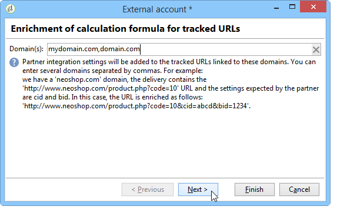

# Adobe Analytics Data Connector{#adobe-analytics-data-connector}

## Om integrering med Data Connector {#about-data-connector-integration}

>[!CAUTION]
>
>Adobe Analytics Data Connector är inte kompatibelt med Transactional Messaging (Message Center).

Med Data Connector (tidigare Adobe Genesis) kan Adobe Campaign och Adobe Analytics interagera via **Web Analytics-anslutningspaketet** . Den skickar data till Adobe Campaign i form av segment som rör användarbeteende efter en e-postkampanj. Omvänt skickas indikatorer och attribut för e-postkampanjer från Adobe Campaign till Adobe Analytics - Data Connector.

Med hjälp av Data Connector kan Adobe Campaign mäta internetpublik (Web Analytics). Tack vare dessa integreringar kan Adobe Campaign återställa data om besökares beteende för en eller flera webbplatser efter en marknadsföringskampanj och (efter analys) köra återmarknadsföringskampanjer i syfte att konvertera dem till köpare. Omvänt gör webbanalysverktygen att Adobe Campaign kan vidarebefordra indikatorer och kampanjattribut till sina plattformar.

Mer information om hur Adobe Analytics implementeras med Adobe Campaign finns i den här [dokumentationen](https://helpx.adobe.com/marketing-cloud/how-to/analytics-ac.html).

Åtgärdsfälten för varje verktyg är följande:

* Webbanalysens roll:

   1. markerar de e-postkampanjer som lanserats med Adobe Campaign,
   1. sparar mottagarnas beteende, på den webbplats som de bläddrade efter att ha klickat på kampanjmeddelandet, i form av segment. Segmenten avser övergivna produkter (som visas men inte läggs till i kundvagnen eller köpta), inköp eller övergivna varukorgar.

* Adobe Campaigns roll:

   1. skickar indikatorerna och kampanjattributen till kopplingen, som i sin tur vidarebefordrar dem till webbanalysverktyget,
   1. återställa och analysera segment,
   1. utlöser en återmarknadsföringskampanj.

## Konfigurera integreringen {#setting-up-the-integration}

Om du vill konfigurera dataanslutningen måste du ansluta till din Adobe Campaign-instans och utföra följande åtgärder:

* [Steg 1: Konfigurera integrering i Analytics](#step-1--configure-integration-in-analytics)
* [Steg 2: Skapa det externa kontot i Campaign](#step-2--create-the-external-account-in-campaign)
* [Steg 3: Synkronisera Adobe Campaign och Adobe Analytics](#step-3--synchronize-adobe-campaign-and-adobe-analytics)

### Steg 1: Konfigurera integrering i Analytics {#step-1--configure-integration-in-analytics}

I följande steg beskrivs konfigurationen av dataanslutningen med hjälp av en guide.

1. Logga in på Adobe Experience Cloud med ett Adobe ID eller Enterprise ID.

   

1. Välj **[!UICONTROL Analytics]** i listan över Experience Cloud-lösningar.

   

1. From the **[!UICONTROL Admin]** tab, select **[!UICONTROL Data Connectors]**.

   Du måste ha följande behörigheter för analysverktygen för att komma åt **[!UICONTROL Data Connectors]** menyn. Mer information finns på den här [sidan](https://docs.adobe.com/content/help/en/analytics/admin/admin-console/permissions/analytics-tools.html)
   * Integreringar (skapa)
   * Integreringar (uppdatering)
   * Integreringar (ta bort)
   

1. Välj **[!UICONTROL Adobe Campaign Classic]** i listan över partners.

   

1. In the **[!UICONTROL Add integration]** dialog, click **[!UICONTROL Activate]**.
1. Markera **[!UICONTROL I accept these terms and conditions]** och markera den **[!UICONTROL Report suite]** länkade till den här integreringen och ange kopplingsetiketten.

   När du är klar klickar du på **[!UICONTROL Create and configure this integration]**.

   

1. Ange den e-postadress som ska ta emot meddelanden för anslutningsprogrammet och kopiera sedan meddelandet **[!UICONTROL Account ID]** så som det visas i det externa Adobe Campaign-kontot (mer information finns i [steg 2: Skapa det externa kontot i Campaign](#step-2--create-the-external-account-in-campaign)).

   

1. Ange de identifierare som krävs för att mäta effekten av e-postkampanjen, dvs. det interna kampanjnamnet (cid) och ID:t för registret iNmsBroadlog (bid). Du bör också ange indikatorer för händelser som ska samlas in.
Kontrollera att **[!UICONTROL Events]** du har typen Numerisk, annars visas de inte i listrutan.

   

1. Ange vid behov de personaliserade segmenten.

   

1. I **[!UICONTROL Data collection]** väljer du en metod för att återställa data, i det här fallet de identifierare **[!UICONTROL cid]** och **[!UICONTROL bid]** identifierare som anges i steg 6.

   

1. Välj den information som ska visas på kontrollpanelen.

   

1. Kontrollera konfigurationen på sidan som summerar föregående steg.

   

1. Klicka **[!UICONTROL Activate Now]** för att godkänna konfigurationen och aktivera kopplingen.

   

   Datakopplingen är nu konfigurerad.

### Steg 2: Skapa det externa kontot i Campaign {#step-2--create-the-external-account-in-campaign}

Integreringen av Adobe Campaign i Analytics-plattformarna görs med hjälp av en koppling. Använd följande process om du vill synkronisera programmen:

1. Installera paketet **Web Analytics-anslutningar** i Adobe Campaign.
1. Gå till **[!UICONTROL Administration > Platform > External accounts]** mappen för Adobe Campaign-trädet.
1. Högerklicka på listan med externa konton och välj **[!UICONTROL New]** i listrutan (eller klicka på **[!UICONTROL New]** knappen ovanför listan med externa konton).
1. Välj **[!UICONTROL Web Analytics]** typ i listrutan.
1. Välj provider för kopplingen, d.v.s. **[!UICONTROL Adobe Analytics - Data Connector]** i det här fallet.

   

1. Klicka på **[!UICONTROL Enrich the formula...]** länken om du vill ändra URL-beräkningsformeln för att ange integreringsinformation för verktyget Webbanalys (kampanj-ID) och domänerna för de webbplatser vars aktivitet måste spåras.
1. Ange domännamn för webbplatserna.

   

1. Klicka **[!UICONTROL Next]** och kontrollera att domännamnen har sparats.

   

1. Om det behövs måste du överlagra beräkningsformeln. Markera rutan och redigera formeln direkt i fönstret.

   

   >[!CAUTION]
   >
   >Det här konfigurationsläget är reserverat för expertanvändare: om något fel i den här formeln kan leda till att e-postleveranser stoppas.

1. På fliken **[!UICONTROL Advanced]** kan du konfigurera eller ändra fler tekniska inställningar.

   * **[!UICONTROL Lifespan]**: Med kan du ange fördröjningen (i dagar) efter vilken webbhändelser återfanns i Adobe Campaign via tekniska arbetsflöden. Standard: 180 dagar.
   * **[!UICONTROL Persistence]**: Med kan du ange den period under vilken alla webbhändelser (till exempel ett köp) kan tillskrivas en återmarknadsföringskampanj, Standard: 7 dagar.

>[!NOTE]
>
>Om du använder flera målgruppsmätningsverktyg kan du välja **[!UICONTROL Other]** i **[!UICONTROL Partners]** listrutan när du skapar det externa kontot. Du får endast referera till ett externt konto i leveransegenskaperna: Du måste därför anpassa formeln för spårade URL:er genom att lägga till de parametrar som Adobe förväntar sig och alla andra mätverktyg som används.

### Steg 3: Synkronisera Adobe Campaign och Adobe Analytics {#step-3--synchronize-adobe-campaign-and-adobe-analytics}

När du har skapat det externa kontot måste du synkronisera båda programmen.

1. Gå till ditt tidigare skapade externa konto.
1. Ändra kontot efter **[!UICONTROL Label]** behov.
1. Ändra **[!UICONTROL Internal name]** så att den matchar det **[!UICONTROL Name]** valda när du konfigurerar Data Connector.

   

1. Klicka på **[!UICONTROL Approve connection]** länken.

   

   Kontrollera att **[!UICONTROL Internal name]** matchar **[!UICONTROL Name]** inställningarna i konfigurationsguiden för Data Connector.

1. Ange informationen **[!UICONTROL Account ID]** i konfigurationsguiden för Data Connector.

   

1. Följ stegen i guiden för Data Connector och gå sedan tillbaka till det externa kontot i Adobe Campaign.
1. Klicka **[!UICONTROL Next]** för att datautbytet ska äga rum mellan Adobe Campaign och Adobe Analytics - Data Connector.

   Segmentlistan visas när synkroniseringen är klar.

   

När synkroniseringen av data mellan Adobe Campaign och Adobe Analytics - Data connector är effektiv, återställs de tre standardsegmenten som definieras i guiden för dataanslutning av Adobe Campaign och blir tillgängliga på fliken **[!UICONTROL Segments]** i det externa Adobe Campaign-kontot.

Om ytterligare segment har konfigurerats i guiden för dataanslutning kan du lägga till dem i Adobe Campaign. Det gör du genom att klicka på **[!UICONTROL Update segment list]** länken och följa stegen som beskrivs i guiden för det externa kontot. När åtgärden har utförts visas de nya segmenten i listan.

### Tekniska arbetsflöden för webbanalysprocesser {#technical-workflows-of-web-analytics-processes}

Datautbyte mellan Adobe Campaign och Adobe Analytics - Datautkopplingen hanteras av fyra tekniska arbetsflöden som körs som en bakgrundsuppgift.

De är tillgängliga i Adobe Campaign-trädet, under **[!UICONTROL Administration > Production > Technical workflows > Web analytics process]** mappen.

* **[!UICONTROL Recovering of web events]**: en gång i timmen hämtar det här arbetsflödet segment om hur användare beter sig på en viss webbplats, inkluderar dem i Adobe Campaign-databasen och startar arbetsflödet för ommarknadsföring.
* **[!UICONTROL Event purge]**: Med det här arbetsflödet kan du ta bort alla händelser från databasen beroende på vilken period som är konfigurerad i **[!UICONTROL Lifespan]** fältet. Mer information finns i [steg 2: Skapa det externa kontot i Campaign](#step-2--create-the-external-account-in-campaign).
* **[!UICONTROL Identification of converted contacts]**: katalog över de besökare som gjorde ett köp efter en återmarknadsföringskampanj. De data som samlas in av det här arbetsflödet är tillgängliga i **[!UICONTROL Re-marketing efficiency]** rapporten, se den här [sidan](#creating-a-re-marketing-campaign).
* **[!UICONTROL Sending of indicators and campaign attributes]**: Med kan ni skicka indikatorer för e-postkampanjer via Adobe Campaign till Adobe Experience Cloud med hjälp av Adobe Analytics - Data Connector. Arbetsflödet utlöses kl. 4.00 varje dag och det kan ta 24 timmar innan data skickas till Analytics.

   Observera att det här arbetsflödet inte ska startas om, annars skickas alla tidigare data på nytt, vilket kan fördröja analysresultaten.

   Följande indikatorer ingår:

   * **[!UICONTROL Messages to deliver]** (@toDeliver)
   * **[!UICONTROL Processed]** (@bearbetad)
   * **[!UICONTROL Success]** (@success)
   * **[!UICONTROL Total count of opens]** (@totalRecipientOpen)
   * **[!UICONTROL Recipients who have opened]** (@mottagareÖppna)
   * **[!UICONTROL Total number of recipients who clicked]** (@totalRecipientClick)
   * **[!UICONTROL People who clicked]** (@personClick)
   * **[!UICONTROL Number of distinct clicks]** (@mottagareKlicka)
   * **[!UICONTROL Opt-Out]** (@optOut)
   * **[!UICONTROL Errors]** (@error)
   >[!NOTE]
   >
   >Skickade data är deltavärdet baserat på den senaste ögonblicksbilden, vilket kan leda till ett negativt värde i mätdata.

   Följande attribut skickas:

   * **[!UICONTROL Internal name]** (@internalName)
   * **[!UICONTROL Label]** (@label)
   * **[!UICONTROL Label]** (operation/@label): bara om **Campaign** -paketet är installerat
   * **[!UICONTROL Nature]** (operation/@nature): bara om **Campaign** -paketet är installerat
   * **[!UICONTROL Tag 1]** (webAnalytics/@tag1)
   * **[!UICONTROL Tag 2]** (webAnalytics/@tag2)
   * **[!UICONTROL Tag 3]** (webAnalytics/@tag3)
   * **[!UICONTROL Contact date]** (schemalägger/@contactDate)

## Spåra leveranser i Adobe Campaign {#tracking-deliveries-in-adobe-campaign}

För att Adobe Experience Cloud ska kunna spåra aktiviteter på webbplatserna när leveransen har skickats av Adobe Campaign måste ni referera till matchande koppling i leveransegenskaperna. Gör så här:

1. Öppna leveransen av kampanjen som ska spåras.

   

1. Öppna leveransegenskaperna.
1. Gå till **[!UICONTROL Web Analytics]** fliken och välj det tidigare skapade externa kontot. Se [steg 2: Skapa det externa kontot i Campaign](#step-2--create-the-external-account-in-campaign)).

   

1. Nu kan ni skicka leveransen och få tillgång till rapporten i Adobe Analytics.

## Skapa en ny marknadsföringskampanj {#creating-a-re-marketing-campaign}

För att förbereda er marknadsföringskampanj skapar ni helt enkelt leveransmallar som kan användas för återmarknadsföringskampanjer. Konfigurera sedan er marknadsföringskampanj och länka den till ett segment. Varje segment måste ha olika återmarknadsföringskampanjer.

Återmarknadsföringskampanjer startas automatiskt när Adobe Campaign har återskapat segmenten och analyserat beteendet hos de personer som den inledande kampanjen riktar sig till. Om kunden överger en varukorg eller visar en produkt utan att köpa den skickas en leverans till de berörda mottagarna för att surfandet ska sluta vid köpet.

Adobe Campaign innehåller skräddarsydda leveransmallar som ni kan använda eller databasera er själva för att förbereda kampanjer.

1. Gå **[!UICONTROL Explorer]** till mappen **[!UICONTROL Resources > Templates > Delivery templates]** i Adobe Campaign-trädet.
1. Duplicera **[!UICONTROL Email delivery (re-marketing)]** mallen eller mallexemplen för ny marknadsföring som Adobe Campaign erbjuder.
1. Anpassa mallen efter dina behov och spara den.

   

1. Skapa en ny kampanj och välj **[!UICONTROL Re-marketing campaign]** mallen i listrutan.

   

1. Klicka på **[!UICONTROL Configure...]** länken för att ange det segment och den leveransmall som är länkad till kampanjen.
1. Välj det tidigare konfigurerade externa kontot.

   

1. Välj det berörda segmentet.

   

1. Välj leveransmallen som ska användas för den här återmarknadsföringskampanjen och klicka sedan på **[!UICONTROL Finish]** för att stänga fönstret.

   

1. Klicka **[!UICONTROL OK]** för att stänga kampanjfönstret.

Du kommer åt **[!UICONTROL Re-marketing efficiency]** rapporten via den globala rapportsidan. Här kan du se antalet konverterade kontakter (dvs. ha köpt något) i relation till antalet övergivna kundvagnar efter Adobe Campaigns återmarknadsföringskampanj. Konverteringsgraden beräknas per vecka, månad eller sedan synkroniseringen mellan Adobe Campaign och webbanalysverktygen inleddes.

