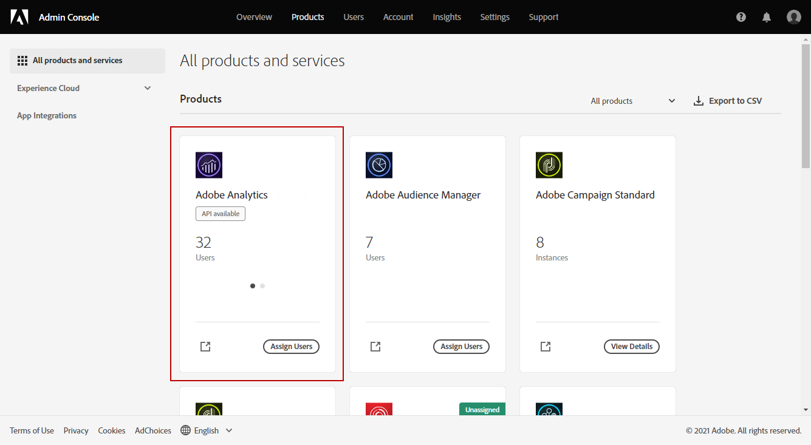
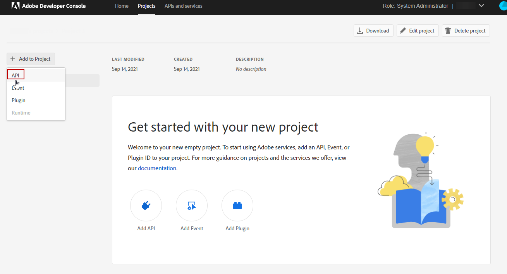

# Etablering av Adobe Analytics Connector {#adobe-analytics-connector-provisioning}

>[!CAUTION]
>
> Dessa åtgärder bör endast utföras av Hybrid- och On-Premise-implementeringar.
>
>För implementeringar av Hosted och Campaign Managed Services kontaktar du [Adobe kundtjänst](https://helpx.adobe.com/se/enterprise/admin-guide.html/enterprise/using/support-for-experience-cloud.ug.html) team.

Integrationen mellan Adobe Campaign Classic och Adobe Analytics autentisering stöder Adobe Identity Management Service (IMS):

* Om du hanterar ett migrerat externt konto måste du implementera Adobe IMS och ansluta till Adobe Campaign via en Adobe ID.

  Observera att den användare som är inloggad via Adobe ID IMS måste vara ägare till **Dataanslutning** i Adobe Analytics och har behörigheter för **Produktprofil** nämnd [nedan](#analytics-product-profile).

Problemet var att ägaren till dataanslutningen var en annan användare än användaren som loggade in på Campaign och testade integreringen med Analytics.

* Om du implementerar en ny koppling är det valfritt att implementera Adobe IMS. Utan en Adobe ID-användare använder Adobe Campaign en teknisk användare för att synkronisera med Adobe Analytics.

För att den här integreringen ska fungera måste du skapa en Adobe Analytics-produktprofil som används exklusivt för Analytics-kontakten. Sedan måste du skapa ett Adobe I/O-projekt.

>[!AVAILABILITY]
>
> JWT-autentiseringsuppgifterna (Service Account) har tagits bort av Adobe, och Campaign-integreringar med Adobe-lösningar och appar måste nu förlita sig på autentiseringsuppgifter för OAuth Server-till-Server. </br>
>
> * Om du har implementerat inkommande integreringar med Campaign måste du migrera ditt tekniska konto enligt informationen i [den här dokumentationen](https://developer.adobe.com/developer-console/docs/guides/authentication/ServerToServerAuthentication/migration/#_blank). Befintliga JWT-referenser (Service Account) kommer att fortsätta att fungera fram till 27 januari 2025. Dessutom går det inte längre att skapa nya JWT-referenser (Service Account) i Developer Console från och med 3 juni 2024. Det går inte att skapa eller lägga till en ny JWT-autentiseringsuppgift (Service Account) i ett projekt efter detta datum. </br>
>
> * Om ni har implementerat utgående integreringar, som integrering med Campaign-Analytics eller integrering med Experience Cloud-utlösare, fortsätter de att fungera fram till 27 januari 2025. Innan detta datum måste ni dock uppgradera er Campaign-miljö till v7.4.1 och migrera ert tekniska konto till Autentisering. Eftersom det inte längre är möjligt att skapa nya JWT-referenser (Service Account) i Developer Console från och med 3 juni 2024, kan du inte skapa en ny utgående integrering som är beroende av JWT efter detta datum

## Skapa en Adobe Analytics-produktprofil {#analytics-product-profile}

Produktprofilen avgör vilken åtkomstnivå en användare har till dina olika Analytics-komponenter.

Om du redan har en Analytics-produktprofil bör du ändå skapa en ny Adobe Analytics-produktprofil som används exklusivt för Analytics-kontakten. Detta säkerställer att din produktprofil är inställd med rätt behörigheter för den här integreringen.

Mer information om produktprofiler finns i [Dokumentation till Admin Console](https://helpx.adobe.com/mt/enterprise/admin-guide.html).

1. Från [Admin Console](https://adminconsole.adobe.com/)väljer du Adobe Analytics **[!UICONTROL Product]**.

   

1. Klicka på **[!UICONTROL New Profile]**.

   

1. Lägg till en **[!UICONTROL Product profile name]** föreslår vi att du använder följande syntax: `reserved_campaign_classic_<Company Name>`. Klicka sedan på **[!UICONTROL Next]**.

   Detta **[!UICONTROL Product profile]** ska endast användas för Analytics Connector för att förhindra felkonfigurationsfel.

1. Öppna dina nyskapade **[!UICONTROL Product profile]** och väljer **[!UICONTROL Permissions]** -fliken.

   

1. Konfigurera de olika funktionerna genom att klicka **[!UICONTROL Edit]** och väljer behörigheter att tilldela **[!UICONTROL Product profile]** genom att klicka på plusikonen (+).

   Mer information om hur du hanterar behörigheter finns i [Dokumentation till Admin Console](https://helpx.adobe.com/mt/enterprise/using/manage-permissions-and-roles.html).

1. För **[!UICONTROL Report Suites]** funktioner, lägga till **[!UICONTROL Report Suites]** du måste använda senare.

   Om du inte har några rapportsviter kan du skapa dem enligt följande [dessa steg](../../platform/using/gs-aa.md).

   

1. För **[!UICONTROL Metrics]** funktioner, lägga till **[!UICONTROL Metrics]** måste du konfigurera senare.

   Om det behövs kan du aktivera alternativet Inkludera automatiskt som lägger till alla behörighetsobjekt i den inkluderade listan och automatiskt lägger till nya behörighetsobjekt.

   

1. För **[!UICONTROL Dimensions]** funktioner, lägga till **[!UICONTROL Dimensions]** behövs för framtida konfiguration.

   Kontrollera att de valda Dimensionerna överensstämmer med de som ska konfigureras i det externa kontot och att de är anpassade till motsvarande eVars-nummer från Adobe Analytics.

1. För **[!UICONTROL Report Suite Tools]** lägger du till följande behörigheter:

   * **[!UICONTROL Report suite Mgmt]**
   * **[!UICONTROL Conversion variables]**
   * **[!UICONTROL Success events]**
   * **[!UICONTROL Custom data Warehouse report]**
   * **[!UICONTROL Data sources manager]**
   * **[!UICONTROL Classifications]**

1. För **[!UICONTROL Analytics Tools]** lägger du till följande behörigheter:

   * **[!UICONTROL Code Manager - Web services]**
   * **[!UICONTROL Logs - Web services]**
   * **[!UICONTROL Web services]**
   * **[!UICONTROL Web service access]**
   * **[!UICONTROL Calculated metric creation]**
   * **[!UICONTROL Segment creation]**

Din produktprofil är nu konfigurerad. Sedan måste du skapa projektet Adobe I/O.

## Skapa Adobe I/O-projekt {#create-adobe-io}

1. Öppna Adobe I/O och logga in som **Systemadministratör** i er organisation.

   Mer information om administratörsroller finns i [page](https://helpx.adobe.com/enterprise/using/admin-roles.html).

1. Klicka på **[!UICONTROL Create a new project]**.

   

1. Klicka **[!UICONTROL Add to Project]** och markera **[!UICONTROL API]**.

   

1. Markera [!DNL Adobe Analytics] och klicka på **[!UICONTROL Next]**.

   

1. Välj **[!UICONTROL Service Account (JWT)]** som autentiseringstyp och klicka **[!UICONTROL Next]**.

   

1. Välj **[!UICONTROL Option 1: Generate a Key-Pair]** och klicka **[!UICONTROL Generate a Key-Pair]**.

   Filen config.zip hämtas sedan automatiskt.

   

1. Klicka på **[!UICONTROL Next]**.

   

1. Välj **[!UICONTROL Product profile]** som har skapats i föregående steg som beskrivs i detta [section](#analytics-product-profile).

1. Klicka sedan på **[!UICONTROL Save Configured API]**.

   

1. Välj [!DNL Adobe Analytics] och kopiera följande information under **[!UICONTROL Service Account (JWT)]**:

   * **[!UICONTROL Client ID]**
   * **[!UICONTROL Client Secret]**
   * **[!UICONTROL Technical account ID]**
   * **[!UICONTROL Organization ID]**

   

1. Använd den privata nyckel som genereras i steg 6.

   Om du redan har konfigurerat utlösare med dessa autentiseringsuppgifter måste din privata nyckel vara densamma för den här anslutningskonfigurationen.

1. Koda den privata nyckeln med följande kommando: `base64 ./private.key > private.key.base64`. Detta sparar base64-innehållet i en ny fil `private.key.base64`.

   >[!NOTE]
   >
   >Extra rader kan ibland läggas till automatiskt när du kopierar/klistrar in den privata nyckeln. Kom ihåg att ta bort den innan du kodar din privata nyckel.

1. Kopiera innehållet från filen `private.key.base64`.

1. Logga in via SSH i varje behållare där Adobe Campaign-instansen är installerad och lägg till projektinloggningsuppgifterna i Adobe Campaign genom att köra följande kommando som `neolane` användare. Det här infogar **[!UICONTROL Technical Account]** autentiseringsuppgifter i instanskonfigurationsfilen.

   ```
   nlserver config -instance:<instance name> -setimsjwtauth:Organization_Id/Client_Id/Technical_Account_ID/<Client_Secret>/<Base64_encoded_Private_Key>
   ```

Nu kan ni börja använda Analytics-kontakten och spåra era kundbeteenden.
