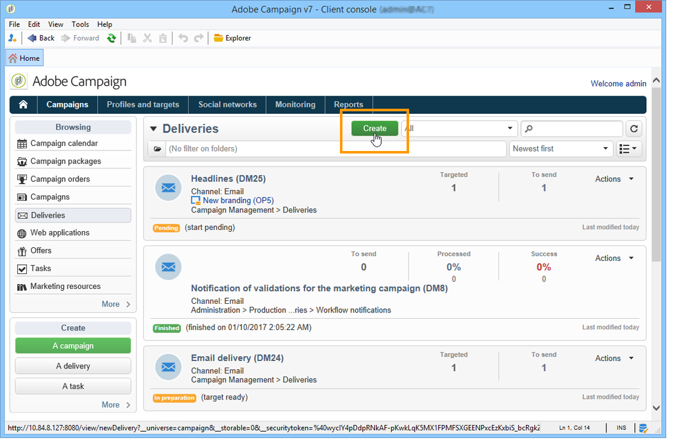
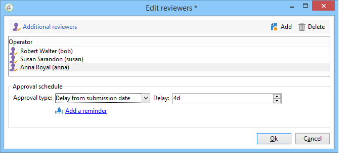

# Arbetsytan i Adobe Campaign{#adobe-campaign-workspace}

## Om Adobe Campaign-gränssnittet {#about-adobe-campaign-interface}

När du är ansluten till databasen kommer du åt Adobe Campaigns hemsida, som är en kontrollpanel: den består av länkar och genvägar som gör att du kan komma åt funktioner, beroende på installation och allmänna plattformskonfigurationer.

Från den centrala delen av startsidan kan du använda länkar för att få åtkomst till webbdokumentationsportalen för Campaign, forumet och supportwebbplatsen.

Skärmbilden ovan är ett exempel på hemsidan för en Adobe Campaign-användare. Mer information finns i [översiktsvideon](https://docs.adobe.com/content/help/en/campaign-learn/campaign-classic-tutorials/getting-started/interface-overview.html)om Adobe Campaign Interface.

>[!NOTE]
>
>Vilka Adobe Campaign-funktioner som är tillgängliga i din instans beror på vilka moduler och tillägg som är installerade. Vissa av dem kanske inte heller är tillgängliga, beroende på dina behörigheter och specifika konfigurationer.
>
>Innan du installerar en modul eller ett tillägg måste du kontrollera licensavtalet eller kontakta din kontoansvarige på Adobe.

### Konsol- och webbåtkomst {#console-and-web-access}

Adobe Campaign-plattformen är tillgänglig via en konsol eller en webbläsare.

Webbåtkomsten har ett gränssnitt som liknar konsolen men med en reducerad uppsättning funktioner.

För en viss operator visas en kampanj med följande alternativ i konsolen:

Med tillgång till webben kommer man främst att kunna se

### Språk {#languages}

Språket väljs när du installerar Adobe Campaign Classic-instansen och kan inte ändras efteråt. Mer information om hur du skapar en instans finns på den här [sidan](../../installation/using/creating-an-instance-and-logging-on.md).

Du kan välja mellan fem olika språk:

* Engelska (USA)
* Engelska (EN)
* Franska
* Tyska
* Japanska

Det språk du väljer för Adobe Campaign Classic-instansen kan påverka datum- och tidsformat. For more on this, refer to this [section](../../platform/using/adobe-campaign-workspace.md#date-and-time).

## Navigeringsgrunder {#navigation-basics}

### Bläddra bland sidor {#browsing-pages}

Plattformens olika funktioner är uppdelade i kärnfunktioner: använd länkarna som visas i det övre avsnittet av gränssnittet för att komma åt dem.

Listan över kärnfunktioner som du kan komma åt beror på vilka paket och tillägg du har installerat och på din åtkomstbehörighet.

Varje funktion innehåller en uppsättning funktioner som bygger på uppgiftsrelaterade behov och användningssammanhanget. Länken ger dig till exempel **[!UICONTROL Profiles and targets]** till mottagarlistor, prenumerationstjänster, befintliga arbetsflöden för målinriktning och genvägar för att skapa dessa element.

Listorna är tillgängliga via **[!UICONTROL Lists]** länken till vänster i **[!UICONTROL Profiles and Targets]** gränssnittet.

### Använda tabbar {#using-tabs}

* När du klickar på en kärnfunktion eller en länk ersätter den relevanta sidan den aktuella sidan. Om du vill gå tillbaka till föregående sida klickar du på **[!UICONTROL Back]** knappen i verktygsfältet. Klicka på **[!UICONTROL Home]** knappen om du vill gå tillbaka till startsidan.

   

* När det gäller en meny eller ett kortkommando för en visningsskärm (t.ex. ett webbprogram, program, leverans, rapport) visas den matchande sidan på en annan flik. På så sätt kan du bläddra mellan sidorna med hjälp av flikarna.

   

### Skapa ett element {#creating-an-element}

I varje kärnfunktionsavsnitt kan du bläddra bland de tillgängliga elementen. Använd kortkommandona i **[!UICONTROL Browsing]** avsnittet för att göra detta. Med **[!UICONTROL Other choices]** länken kan du komma åt alla andra sidor, oavsett miljö.

Du kan skapa ett nytt element (leverans, webbprogram, arbetsflöde osv.) med kortkommandona i **[!UICONTROL Create]** avsnittet till vänster på skärmen. Använd knappen ovanför listan för att lägga till nya element i listan **[!UICONTROL Create]** .

Använd till exempel knappen för att skapa en ny leverans på leveranssidan **[!UICONTROL Create]** .

## Använda Adobe Campaign Explorer {#using-adobe-campaign-explorer}

### Om Adobe Campaign Explorer {#about-adobe-campaign-explorer}

Utforskaren i Adobe Campaign är tillgänglig via verktygsfältsikonen. Med den får ni tillgång till Adobe Campaign alla funktioner i Adobe Campaign, konfigurationsskärmar och en mer detaljerad bild av några plattformselement.

Arbetsytan **[!UICONTROL Explorer]** är uppdelad i tre zoner:

**1 - Träd**: kan du anpassa innehållet i trädet (lägga till, flytta eller ta bort noder). Den här proceduren är endast avsedd för expertanvändare. For more on this, refer to [this page](../../configuration/using/about-navigation-hierarchy.md).

**2 - Lista**: kan du filtrera den här listan, köra sökningar, lägga till information eller sortera data.

**3 - Information**: Du kan visa information om det markerade elementet. Med ikonen i det övre högra avsnittet kan du visa den här informationen i helskärmsläge.

### Skärmupplösning {#screen-resolution}

För optimal navigering och användbarhet rekommenderar Adobe att du använder en skärmupplösning på minst 1 600 × 900 pixlar.

>[!CAUTION]
>
>Upplösningar på under 1 600 x 900 pixlar kanske inte stöds av Adobe Campaign.

Om vissa delar av **[!UICONTROL Explorer]** zonen verkar vara trunkerade på arbetsytan expanderar du den med pilen över zonen eller klickar på **[!UICONTROL Details]** **[!UICONTROL Enlarge]** knappen.

### Bläddringslistor {#browsing-lists}

Om du vill bläddra i en lista kan du använda **rullningslisterna** (vågrätt och lodrätt) för att bläddra igenom den utan att ändra postmarkeringen, **mushjulet** eller **piltangenterna**.

>[!NOTE]
>
>Konfiguration och personalisering av listinnehåll presenteras i [Konfigurationslistor](#configuring-lists).
>
>Du kan också sortera och filtrera data. Se [Filtreringsalternativ](../../platform/using/filtering-options.md).

### Inventeringsposter {#counting-records}

Som standard läser Adobe Campaign in de första 200 posterna i en lista. Det innebär att visningen inte nödvändigtvis visar alla poster i tabellen som du visar. Du kan räkna antalet poster i listan och läsa in fler poster.

I den nedre högra delen av listskärmen **[!UICONTROL counter]** visas hur många poster som har lästs in och det totala antalet poster i databasen (efter att eventuella filter har använts):

Om ett &quot;**?**&quot; visas i stället för siffran till höger. Klicka på räknaren för att starta beräkningen.

### Läser in fler poster {#loading-more-records}

Om du vill läsa in (och därför visa) ytterligare poster (200 rader som standard) klickar du på **[!UICONTROL Continue loading]**.

Om du vill läsa in alla poster högerklickar du på listan och väljer **[!UICONTROL Load all]**.

>[!CAUTION]
>
>Beroende på antalet poster kan tiden för inläsning av den fullständiga listan vara lång.

### Ändra standardantal poster {#change-default-number-of-records}

Om du vill ändra standardantalet inlästa poster klickar du **[!UICONTROL Configure list]** i listans nedre högra hörn.

Klicka på Avancerade parametrar (längst ned till vänster) i listkonfigurationsfönstret och ändra antalet rader som ska hämtas.

### Konfigurera listor {#configuring-lists}

#### Lägg till kolumner {#add-columns}

Det finns två sätt att lägga till en kolumn i en lista.

Du kan snabbt lägga till en kolumn i en lista från detaljerna i en post. Så här gör du:

1. På en detaljskärm högerklickar du på det fält som du vill visa i en kolumn.
1. Välj **[!UICONTROL Add in the list]**.

   Kolumnen läggs till till höger om de befintliga kolumnerna.

Ett annat sätt att lägga till kolumner, till exempel om du vill visa data som inte visas på detaljskärmen, är att använda listkonfigurationsfönstret. Så här gör du:

1. Klicka **[!UICONTROL Configure list]** nedan och till höger om listan.

   

1. Dubbelklicka på det fält som ska läggas till i listan i listkonfigurationsfönstret för att lägga till det i **[!UICONTROL Available fields]** listan **[!UICONTROL Output columns]**.

   

   >[!NOTE]
   >
   >Som standard visas inte avancerade fält. Om du vill visa dem klickar du på **Visa avancerade fält** nedan och till höger om listan med tillgängliga fält.
   >
   >Etiketterna visas per tabell och sedan i alfabetisk ordning.
   >
   >Använd fältet **Sök** för att köra en sökning i de tillgängliga fälten. Mer information finns i [Sortera en lista](#sorting-a-list).
   >
   >Fält identifieras av specifika ikoner: SQL-fält, länkade tabeller, beräknade fält osv. För varje markerat fält visas beskrivningen under listan med tillgängliga fält.
   [Konfigurerar listor](#configuring-lists).
   >
   >Du kan också sortera och filtrera data. Se [Filtreringsalternativ](../../platform/using/filtering-options.md).

1. Upprepa för varje kolumn som ska visas.
1. Använd pilarna för att ändra **visningsordningen**. Den högsta kolumnen finns till vänster i listan med poster.

   

1. Om du behöver kan du klicka **[!UICONTROL Distribution of values]** för att visa omfördelningen av värden för det valda fältet i den aktuella mappen.

   

1. Klicka **[!UICONTROL OK]** för att bekräfta konfigurationen och visa resultatet.

#### Skapa en ny kolumn {#create-a-new-column}

Du kan skapa nya kolumner för att visa ytterligare fält i listan. Så här gör du:

1. Klicka **[!UICONTROL Configure the list]** nedan och till höger om listan.
1. Klicka **[!UICONTROL Add]** för att visa ett nytt fält i listan.

#### Ta bort en kolumn {#remove-a-column}

Du kan maskera en eller flera kolumner i en lista med poster med hjälp av **[!UICONTROL Configure list]** som finns nedanför och till höger om listan.

I listkonfigurationsfönstret markerar du den kolumn som ska maskeras från **[!UICONTROL Output columns]** zonen och klickar på knappen Ta bort.

Upprepa för varje kolumn som ska maskeras. Klicka **[!UICONTROL OK]** för att bekräfta konfigurationen och visa resultatet.

#### Justera kolumnbredd {#adjust-column-width}

När en lista är aktiv, d.v.s. minst en rad är markerad, kan du använda F9 för att justera bredden på kolumnerna så att alla kolumner kan visas på skärmen.

#### Visa undermappsposter {#display-sub-folders-records}

Listor kan visa:

* Antingen posterna i den valda mappen,
* Eller posterna i den markerade mappen OCH dess undermappar.

Om du vill växla från ett visningsläge till ett annat klickar du **[!UICONTROL Display sub-levels]** i verktygsfältet.

### Spara en listkonfiguration {#saving-a-list-configuration}

Listkonfigurationerna definieras lokalt på arbetsstationsnivå. När den lokala cachen rensas inaktiveras lokala konfigurationer.

Som standard gäller de definierade visningsparametrarna för alla listor med motsvarande mapptyp. När du ändrar hur listan med mottagare visas från en mapp kommer den här konfigurationen att användas för alla övriga mottagarmappar.

Det går dock att spara mer än en konfiguration som ska användas på olika mappar av samma typ. Konfigurationen sparas med egenskaperna för den mapp som innehåller data och kan tillämpas på nytt.

För en leveransmapp är det till exempel möjligt att konfigurera följande visning:

Följ stegen nedan för att spara listkonfigurationen så att den kan återanvändas:

1. Högerklicka på mappen som innehåller de data som visas.
1. Välj **[!UICONTROL Properties]**.
1. Klicka på **[!UICONTROL Advanced settings]** och ange sedan ett namn i **[!UICONTROL Configuration]** fältet.

   

1. Click **[!UICONTROL OK]** and then click **[!UICONTROL Save]**.

Du kan sedan använda den här konfigurationen i en annan **leveransmapp** :

Klicka **[!UICONTROL Save]** i fönstret för mappegenskaper. Listvisningen har ändrats så att den matchar den angivna konfigurationen:

### Exportera en lista {#exporting-a-list}

Om du vill exportera data från en lista måste du använda en exportguide. Du kommer åt den genom att markera de element som ska exporteras i listan, högerklicka och välja **[!UICONTROL Export...]**.

Användningen av import- och exportfunktionerna förklaras i [Allmän import och export](../../platform/using/generic-imports-and-exports.md).

>[!CAUTION]
>
>Element från en lista får inte exporteras med funktionen Kopiera/Klistra in.

### Sortera en lista {#sorting-a-list}

Listor kan innehålla en stor mängd data. Du kan sortera dessa data eller använda enkla eller avancerade filter. Med sortering kan du visa data i stigande eller fallande ordning. Med filter kan du definiera och kombinera villkor så att endast markerade data visas.

Klicka på kolumnrubriken om du vill använda en stigande eller fallande sortering eller om du vill avbryta sorteringen. Aktiv sorteringsstatus och sorteringsordning anges med en blå pil före kolumnetiketten. Ett rött streck före kolumnetiketten betyder att sorteringen tillämpas på data som indexeras från databasen. Den här sorteringsmetoden används för att optimera sorteringsjobb.

Du kan också konfigurera sortering eller kombinera sorteringsvillkor. Gör så här:

1. **[!UICONTROL Configure list]** nedan och till höger om listan.

   

1. Klicka på **[!UICONTROL Sorting]** fliken i listkonfigurationsfönstret.
1. Markera de fält som ska sorteras och sorteringsriktningen (stigande eller fallande).

   

1. Sorteringsprioriteten definieras av sorteringskolumnernas ordning. Om du vill ändra prioriteten använder du lämpliga ikoner för att ändra ordningen på kolumnerna.

   

   Sorteringsprioriteten påverkar inte visningen av kolumnerna i listan.

1. Klicka **[!UICONTROL Ok]** för att bekräfta konfigurationen och visa resultatet i listan.

### Köra en sökning {#running-a-search}

Du kan göra en sökning av de tillgängliga fälten i en redigerare med hjälp av det **[!UICONTROL Search]** fält som finns ovanför listan med fält. Tryck på **Enter** på tangentbordet eller bläddra i listan. Fälten som matchar sökningen får feta etiketter.

>[!NOTE]
>
>Du kan skapa filter för att endast visa en del av data i en lista. Se [Skapa filter](../../platform/using/creating-filters.md).

## Format och enheter {#formats-and-units}

### Datum och tid {#date-and-time}

Språket i Adobe Campaign Classic-instansen påverkar datum- och tidsformat.

Språk väljs vid installation av Campaign och kan inte ändras efteråt. Du kan välja: Engelska (USA), engelska (EN), franska, tyska eller japanska. For more on this, refer to [this page](../../installation/using/creating-an-instance-and-logging-on.md).

De största skillnaderna mellan amerikansk engelska och brittisk engelska är:

<table> 
 <thead> 
  <tr> 
   <th> Format  </th> 
   <th> Engelska (USA)  </th> 
   <th> Engelska (EN)  </th> 
  </tr> 
 </thead> 
 <tbody> 
  <tr> 
   <td> Datum  </td> 
   <td> Veckan börjar på söndag  </td> 
   <td> Veckan börjar på måndag  </td> 
  </tr> 
  <tr> 
   <td> Kort datum  </td> 
   <td> 
%2M/%2D/%4Y

<strong>ex: 09/25/2018</strong>
 </td> 
   <td> 
%2D/%2M/%4Y

<strong>ex: 25/09/2018</strong>
 </td> 
  </tr> 
  <tr> 
   <td> Kort datum med tid  </td> 
   <td> 
%2M/%2D/%4Y %I:%2N:%2S %P

<strong>ex: 09/25/2018 10:47:25 PM</strong>
 </td> 
   <td> 
%2D/%2M/%4Y %2H:%2N:%2S

<strong>ex: 25/09/2018 22:47:25</strong>
 </td> 
  </tr> 
 </tbody> 
</table>

### Lägga till värden i en uppräkning {#add-values-in-an-enumeration}

Med hjälp av inmatningsfälten i en nedrullningsbar lista kan du ange ett uppräkningsvärde som kan lagras och sedan visas som ett alternativ i listrutan. Du kan t.ex. ange London i fältet **[!UICONTROL City]** på fliken **[!UICONTROL General]** för en mottagarprofil. När du trycker på Retur för att bekräfta det här värdet tillfrågas du om du vill spara det här värdet för uppräkningen som är associerad med fältet.

Om du klickar **[!UICONTROL Yes]** på den här kommandoknappen visas det här värdet i kombinationsfältet för det aktuella fältet (i det här fallet: **[!UICONTROL London]**).

>[!NOTE]
>
>Uppräkningar (kallas även&quot;specificerade listor&quot;) hanteras av administratören via **[!UICONTROL Administration > Platform > Enumerations]** avsnittet. Mer information finns i [Hantera uppräkningar](../../platform/using/managing-enumerations.md).

### Standardenheter {#default-units}

I de fält som uttrycker en varaktighet (t.ex. giltighetsperiod för resurserna för en leverans, sista ansökningsdag för en uppgift osv.) kan värdet uttryckas i följande **enheter**:

* **[!UICONTROL s]** i sekunder,
* **[!UICONTROL mn]** i minuter,
* **[!UICONTROL h]** i timmar,
* **[!UICONTROL d]** i dagar.

