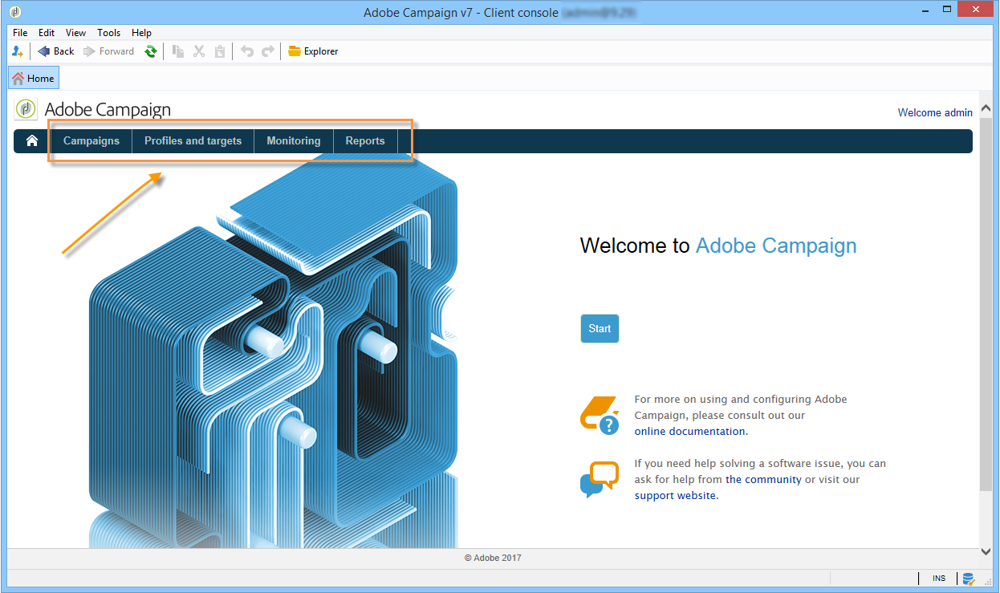

# Arbetsytan i Adobe Campaign {#adobe-campaign-workspace}

## Utforska Adobe Campaign gränssnitt {#about-adobe-campaign-interface}

När du är ansluten till databasen öppnar du Adobe Campaign hemsida. Den här sidan är din instrumentpanel: den består av länkar och genvägar som gör att du kan komma åt funktioner, beroende på din installation och allmänna plattformskonfigurationer.

I den centrala delen av startsidan kan du använda länkar för att komma åt Campaign-dokumentationsportalen, communityn och Adobe kundtjänstwebbplats.

 Upptäck arbetsytan Campaign i [video](#video)

>[!NOTE]
>
>Vilka Adobe Campaign-funktioner som är tillgängliga i din instans beror på vilka moduler och tillägg som är installerade. Vissa av dem kanske inte heller är tillgängliga, beroende på dina behörigheter och specifika konfigurationer.
>
>Innan du installerar en modul eller ett tillägg måste du kontrollera licensavtalet eller kontakta din kontoansvarige på Adobe.

### Konsol- och webbåtkomst {#console-and-web-access}

Adobe Campaign-plattformen är tillgänglig via en konsol eller en webbläsare. Se kompatibla webbläsare i [kompatibilitetsmatrisen](../../rn/using/compatibility-matrix.md#Browsers).

Webbgränssnittet liknar konsolgränssnittet. Från en webbläsare kan du använda samma navigerings- och visningsfunktioner som i konsolen, men du kan bara utföra en reducerad uppsättning åtgärder på kampanjer. Du kan till exempel visa och avbryta kampanjer, men du kan inte ändra dem. För en viss operator visas en kampanj med följande alternativ i konsolen:

När det gäller webbåtkomst kommer alternativen främst att göra det möjligt att se

Läs mer om hur du använder webbgränssnittet i [dokumentationen för Campaign v8](https://experienceleague.adobe.com/docs/campaign/automation/campaign-orchestration/marketing-campaign-create.html?lang=svl#use-the-web-interface-){target=_blank}.

### Språk {#languages}

Språket väljs när du installerar din Adobe Campaign Classic-instans.

Du kan välja mellan följande språk:

* Engelska (UK)
* Engelska (USA)
* Franska
* Tyska
* Japanska

Språket du valde för din Adobe Campaign Classic-instans kan påverka datum- och tidsformat. Mer information finns i [dokumentationen för Campaign v8 (konsol)](https://experienceleague.adobe.com/sv/docs/campaign/campaign-v8/new/campaign-ui){target=_blank}.

Mer information om hur du skapar en instans finns på [sidan](../../installation/using/creating-an-instance-and-logging-on.md).

>[!CAUTION]
>
>Språket kan inte ändras efter att instansen har skapats.

## Navigeringsgrunder {#navigation-basics}

Plattformens olika funktioner är uppdelade i kärnfunktioner: använd länkarna som visas i det övre avsnittet av gränssnittet för att komma åt dem.

Listan över kärnfunktioner som du kan komma åt beror på vilka paket och tillägg du har installerat och på din åtkomstbehörighet.

### Bläddra bland sidor {#browsing-pages}

Varje funktion innehåller en uppsättning funktioner som bygger på uppgiftsrelaterade behov och användningssammanhanget. Länken **[!UICONTROL Profiles and targets]** ger dig till exempel till mottagarlistor, prenumerationstjänster, befintliga arbetsflöden för målinriktning och genvägar för att skapa dessa element.

Listorna är tillgängliga via länken **[!UICONTROL Lists]** i den vänstra delen av gränssnittet i **[!UICONTROL Profiles and Targets]**.

### Använda tabbar {#using-tabs}

* När du klickar på en kärnfunktion eller en länk ersätter den relevanta sidan den aktuella sidan. Om du vill gå tillbaka till föregående sida klickar du på knappen **[!UICONTROL Back]** i verktygsfältet. Klicka på knappen **[!UICONTROL Home]** om du vill gå tillbaka till startsidan.

  

* När det gäller en meny eller ett kortkommando för en visningsskärm (t.ex. ett webbprogram, program, leverans, rapport) visas den matchande sidan på en annan flik. På så sätt kan du bläddra mellan sidorna med hjälp av flikarna.

  

### Skapa ett element {#creating-an-element}

I varje kärnfunktionsavsnitt kan du bläddra bland de tillgängliga elementen. Använd kortkommandona i avsnittet **[!UICONTROL Browsing]** för att göra detta. Med länken **[!UICONTROL Other choices]** kan du komma åt alla andra sidor, oavsett miljö.

Du kan skapa ett nytt element (leverans, webbprogram, arbetsflöde osv.) med hjälp av genvägarna i avsnittet **[!UICONTROL Create]** till vänster på skärmen. Använd knappen **[!UICONTROL Create]** ovanför listan för att lägga till nya element i listan.

Använd till exempel knappen **[!UICONTROL Create]** på leveranssidan för att skapa en ny leverans.

## Använda Adobe Campaign Explorer {#using-adobe-campaign-explorer}

Utforskaren i Adobe Campaign är tillgänglig via verktygsfältsikonen. Du får tillgång till alla funktioner i Adobe Campaign, konfigurationsskärmar och en mer detaljerad vy över några av plattformselementen.

Mer information om Adobe Campaign Explorer finns på följande sidor i **Campaign v8-dokumentationen (konsolen)**:

* [Kampanjanvändargränssnittet - översikt](https://experienceleague.adobe.com/sv/docs/campaign/campaign-v8/new/campaign-ui){target=_blank}

* [Inställningar för kampanjgränssnitt](https://experienceleague.adobe.com/en/docs/campaign/campaign-v8/config/configuration/ui-settings){target=_blank}

* [Hantera mappar och vyer i Utforskaren](https://experienceleague.adobe.com/en/docs/campaign/campaign-v8/config/configuration/folders-and-views){target=_blank}

## Arbeta med data {#work-with-data}

### Filtrera data {#filters}

Datafiltrering innebär att en datauppsättning begränsas till endast de poster som matchar specifika villkor. Den här delmängden kan sedan användas för målinriktade åtgärder (till exempel uppdateringar eller målgruppsskapande) eller för analys.

När du bläddrar i Campaign visas data i listor. Du kan använda inbyggda filter för att snabbt komma åt en definierad delmängd, till exempel adresser i karantän, mottagare utan mål eller poster inom ett visst åldersintervall eller ett visst datum när de skapades. Dessutom kan du skapa anpassade filter, spara dem för framtida bruk och dela dem med andra Campaign-användare.

Lär dig hur du **får tillgång till, utformar och delar filter** i [dokumentationen för Campaign v8 (konsol)](https://experienceleague.adobe.com/sv/docs/campaign/campaign-v8/audience/create-filters){target=_blank}.

### Fråga databasen{#about-queries-in-campaign}

Frågeverktyget finns på olika nivåer i programmet och kan användas för att definiera målpopulationer, segmentera kunder, extrahera och filtrera spårningsloggar, skapa filter och mycket mer.

+++Om den generiska frågeredigeraren

Den innehåller en dedikerad assistent - den generiska frågeredigeraren - som du kommer åt på menyn **[!UICONTROL Tools > Generic query editor...]**. Med den här redigeraren kan databasfrågor extrahera, ordna, gruppera och sortera information. Den kan till exempel hämta mottagare som klickat mer än n gånger på en nyhetsbrevslänk under en viss period.

Den generiska frågeredigeraren centraliserar alla frågefunktioner. Det gör det möjligt att skapa och lagra begränsningsfilter, som sedan kan återanvändas i andra sammanhang, till exempel rutan Fråga i ett målarbetsflöde.

+++

>[!BEGINTABS]

>[!TAB Fråga databasen]

Steg för att skapa en fråga beskrivs i **[Campaign v8-dokumentationen (konsolen)](https://experienceleague.adobe.com/sv/docs/campaign/campaign-v8/data/query/query-editor){target=_blank}**

{target=_blank}

>[!TAB Lägg till en fråga i ett arbetsflöde]

Lär dig de viktigaste stegen som rör skapandet av frågan i ett arbetsflöde i **[dokumentationen för Campaign v8](https://experienceleague.adobe.com/sv/docs/campaign/automation/workflows/wf-activities/targeting-activities/query){target=_blank}**

{target=_blank}

>[!TAB Filtervillkor]

Om du vill utforma frågan måste du välja filtervillkoren i frågeredigeraren. Tillgängliga funktioner och användningsexempel finns i **[Campaign v8-dokumentationen](https://experienceleague.adobe.com/sv/docs/campaign/campaign-v8/data/query/filter-conditions){target=_blank}**

{target=_blank}

>[!ENDTABS]

### Hantera listor {#manage-and-customize-lists}

I Campaign-klientkonsolen visas data i listor. Du kan anpassa listorna efter dina behov. Du kan till exempel lägga till kolumner, filtrera data, räkna poster, spara och dela inställningarna.

Lär dig hur du **hanterar och anpassar listor** i [dokumentationen för Campaign v8 (konsol)](https://experienceleague.adobe.com/en/docs/campaign/campaign-v8/config/configuration/ui-settings#customize-lists){target=_blank}.

### Hantera uppräkningar{#managing-enumerations}

En uppräkning (kallas även för en specificerad lista) är en fördefinierad lista med värden som du kan använda för att fylla i vissa fält. Uppräkningar hjälper till att standardisera fältvärden, vilket gör datainmatningen mer konsekvent och förenklar frågor.

När du har definierat värden visas de i en nedrullningsbar lista. Ett värde kan väljas direkt eller anges med prediktiv inmatning, vilket föreslår och slutför matchande poster. Vissa fält innehåller fördefinierade uppräkningar och ytterligare uppräkningar kan skapas om det behövs.

Läs mer om hur du **arbetar med uppräkningar** i [Adobe Campaign v8-dokumentationen (konsolen)](https://experienceleague.adobe.com/sv/docs/campaign/campaign-v8/config/settings/enumerations){target=_blank}.

## Självstudievideo {#video}

I den här videon visas Campaign Classic arbetsyta.

>[!VIDEO](https://video.tv.adobe.com/v/35130?quality=12)
