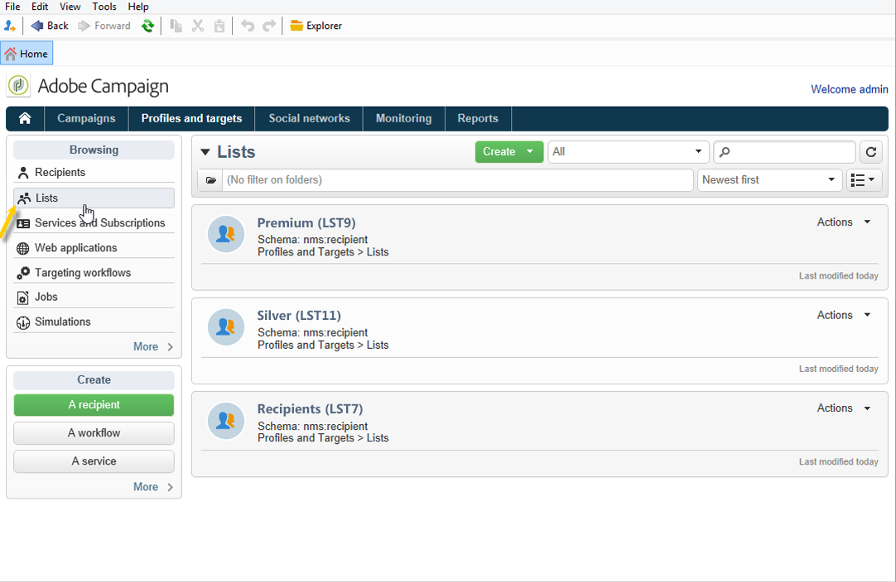

# Skapa och hantera listor{#creating-and-managing-lists}

## Om listor i Adobe Campaign {#about-lists-in-adobe-campaign}

En lista är en statisk uppsättning profiler som kan användas för leveransåtgärder eller uppdateras under importåtgärder eller under arbetsflödeskörning. En population som har extraherats från databasen via en fråga kan till exempel innehålla en lista.

Leveranser (via e-post, SMS eller andra kanaler) som är avsedda för dessa listor kan sedan ställas in i enlighet med de professionella etiska reglerna för tillståndsmarknadsföring.

Listor skapas och hanteras via **[!UICONTROL Lists]** länken på **[!UICONTROL Profiles and targets]** fliken.

Det finns två typer av listor i Adobe Campaign:

* **[!UICONTROL Group]** typ: Typlistorna tillhör en **[!UICONTROL Group]** statisk **** lista med personer som har valts enligt specifika kriterier. Listan är som en ögonblicksbild av en uppsättning profiler. Observera att den inte uppdateras automatiskt om profiler läggs till i databasen.

   Mer information om hur du skapar en **[!UICONTROL Group]** typlista finns på den här [sidan](#creating-a-profile-list-from-a-group).

* **[!UICONTROL List]** typ: Med **[!UICONTROL List]** typlistorna kan du använda arbetsflöden för att skapa och hantera listor. De här listorna är specifika från dataimport som kan uppdateras via den dedikerade **[!UICONTROL List update]** arbetsflödesaktiviteten.

   Till skillnad från **[!UICONTROL Group]** typlistan kan typlistan uppdateras automatiskt med en **[!UICONTROL Scheduler]** aktivitet. Observera att ett exempel på hur du skapar **[!UICONTROL List]** typlistor finns på [den här sidan](../../workflow/using/list-update.md).

## Skapa en profillista från en grupp {#creating-a-profile-list-from-a-group}

**[!UICONTROL Group]** typlistor som skapas via **[!UICONTROL Profiles and targets]** länken måste baseras på Adobe Campaign-standardprofiltabellen (nms:mottagare).

>[!NOTE]
>
>Om du vill skapa listor som innehåller andra typer av data måste du köra ett arbetsflöde. Om du till exempel använder en fråga i besökstabellen och sedan uppdaterar listan, kan du skapa en besökslista. Mer information om arbetsflöden finns i [det här avsnittet](../../workflow/using/about-workflows.md).

Så här skapar du en ny **[!UICONTROL Group]** typlista:

1. Klicka på **[!UICONTROL Create]** knappen och välj **[!UICONTROL New list]**.

   

1. Ange informationen på fliken **[!UICONTROL Edit]** i fönstret där listan skapas.

   * Ange listnamnet i **[!UICONTROL Label]** fältet och ändra vid behov det interna namnet.
   * Lägg till en beskrivning av den här listan.
   * Du kan ange ett förfallodatum: när det här datumet har nåtts rensas listan och tas automatiskt bort.

      

1. Klicka på **[!UICONTROL Content]** fliken **[!UICONTROL Add]** för att markera de profiler som hör till listan.

   

1. Klicka **[!UICONTROL Save]** för att spara listan. Sedan läggs den till i översikten över listor.

Du kan skapa nya profiler direkt från fönstret Lägg till profiler genom att klicka på **[!UICONTROL Create]**. Profilen läggs till i databasen.

Profillistan kan konfigureras precis som andra listor. Se [Konfigurera listor](../../platform/using/adobe-campaign-workspace.md#configuring-lists).

## Länka data till en lista {#linking-data-to-a-list}

>[!NOTE]
>
>Det går bara att länka data till en lista med en **[!UICONTROL Group]** typlista.

Profilerna för en uppsättning profiler kan filtreras och länkas till en lista. Leveransåtgärder kan sedan skickas till den här listan, till målprofiler. Så här grupperar du profiler:

1. Välj profiler och högerklicka.
1. Välj **[!UICONTROL Actions > Associate selection with a list...]**.

   

1. Välj önskad lista eller skapa en ny lista med **[!UICONTROL Create]** knappen och klicka sedan på **[!UICONTROL Next]**.

   

1. Klicka på **[!UICONTROL Start]** knappen.

   

Alternativet **[!UICONTROL Recreate the list]** tar bort det tidigare innehållet från listan. Det här läget är optimerat eftersom ingen fråga behövs för att kontrollera om profilerna redan är länkade till listan.

Om du avmarkerar **[!UICONTROL No trace of this job is saved in the database]** alternativet kan du markera (eller skapa) körningsmappen där den information som är länkad till processen lagras.

I fönstrets övre del kan du övervaka körningen. Med knappen **[!UICONTROL Stop]** kan du stoppa processen. Kontakter som redan har bearbetats länkas till listan.

Du kan övervaka processen via fliken **[!UICONTROL Lists]** för de profiler som berörs av den här åtgärden:

Du kan även redigera listan via hemsidan för Adobe Campaign: klicka på **[!UICONTROL Profiles and Targets > Lists]** menyn och välj den berörda listan. På fliken **[!UICONTROL Content]** visas de profiler som är länkade till den här listan.

## Ta bort en profil från en lista {#removing-a-profile-from-a-list}

Om du vill ta bort en profil från en lista kan du:

* Redigera listan, markera profilen på **[!UICONTROL Content]** fliken och klicka sedan på **[!UICONTROL Delete]** -ikonen.

   

* Redigera profilen, klicka på **[!UICONTROL List]** fliken och sedan på **[!UICONTROL Delete]** ikonen .

   

## Ta bort en lista med profiler {#deleting-a-list-of-profiles}

Du kan ta bort en eller flera listor från grupplistan i Adobe Campaign-trädet. Om du vill göra det redigerar du trädet via **[!UICONTROL Advanced > Explorer]** länken på startsidan för Adobe Campaign. Markera gruppen/grupperna och högerklicka. Välj **[!UICONTROL Delete]**. Ett varningsmeddelande ber dig bekräfta borttagningen.

>[!NOTE]
>
>När du tar bort en lista påverkas inte profilerna i listan, men data i deras profil uppdateras.

