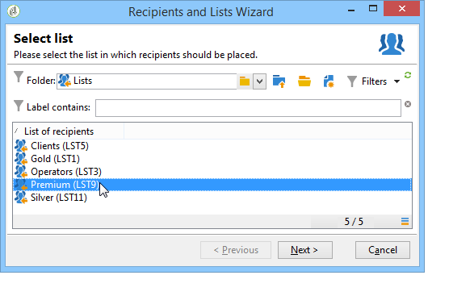
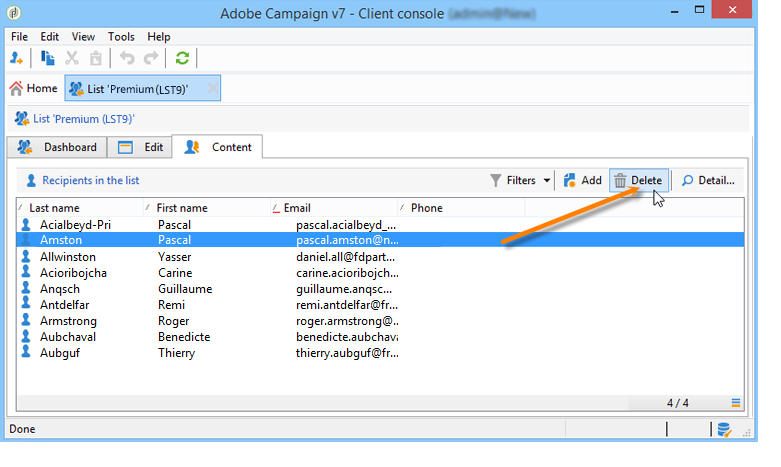

# Skapa och hantera listor{#creating-and-managing-lists}

## Vad är en lista? {#about-lists-in-adobe-campaign}

En lista är en statisk uppsättning profiler som kan användas för leveransåtgärder eller uppdateras under importåtgärder eller under arbetsflödeskörning. En grupp som har extraherats från databasen via en fråga kan till exempel innehålla en lista.

Listor skapas och hanteras via **[!UICONTROL Lists]** i **[!UICONTROL Profiles and targets]** -fliken.

Det finns två typer av listor i Adobe Campaign:

* **[!UICONTROL Group]** type: **[!UICONTROL Group]** typlistor tillhör en **static** lista över personer som valts enligt specifika kriterier. Listan är som en ögonblicksbild av en uppsättning profiler. Observera att den inte uppdateras automatiskt om profiler läggs till i databasen.

  Mer information om hur du skapar en **[!UICONTROL Group]** typlista, se denna [page](#creating-a-profile-list-from-a-group).

* **[!UICONTROL List]** type: **[!UICONTROL List]** typlistor gör att du kan använda arbetsflöden för att skapa och hantera listor. De här listorna är specifika från dataimport som kan uppdateras via den dedikerade **[!UICONTROL List update]** arbetsflödesaktivitet.

  Till skillnad från **[!UICONTROL Group]** typlista kan den här typlistan uppdateras automatiskt med en **[!UICONTROL Scheduler]** aktivitet. Observera att som ett exempel på hur du skapar **[!UICONTROL List]** typlistor, se [den här sidan](../../workflow/using/list-update.md).

 [Upptäck den här funktionen i en video](#create-list-video)

## Skapa en profillista från en grupp {#creating-a-profile-list-from-a-group}

**[!UICONTROL Group]** typlistor som skapas via **[!UICONTROL Profiles and targets]** länken måste baseras på Adobe Campaign standardprofiltabell (nms:mottagare).

>[!NOTE]
>
>Om du vill skapa listor som innehåller andra typer av data måste du köra ett arbetsflöde. Om du till exempel använder en fråga i besökstabellen och sedan uppdaterar listan, kan du skapa en besökslista. Mer information om arbetsflöden finns i [det här avsnittet](../../workflow/using/about-workflows.md).

Så här skapar du en ny **[!UICONTROL Group]** använd följande steg i typlistan:

1. Klicka på **[!UICONTROL Create]** knapp och markera **[!UICONTROL New list]**.

   

1. Ange informationen i dialogrutan **[!UICONTROL Edit]** -fliken i fönstret där listan skapades.

   * Ange listnamnet i dialogrutan **[!UICONTROL Label]** och vid behov ändra det interna namnet.
   * Lägg till en beskrivning av den här listan.
   * Du kan ange ett förfallodatum: när det här datumet nås rensas listan och tas automatiskt bort.

     

1. I **[!UICONTROL Content]** flik, klicka **[!UICONTROL Add]** för att välja de profiler som tillhör listan.

   

1. Klicka **[!UICONTROL Save]** för att spara listan. Sedan läggs den till i översikten över listor.

Du kan skapa nya profiler direkt från fönstret Lägg till profiler genom att klicka på **[!UICONTROL Create]**. Profilen läggs till i databasen.

Profillistan kan konfigureras precis som andra listor. Se [det här avsnittet](../../platform/using/adobe-campaign-workspace.md#configuring-lists).

## Länka data till en lista {#linking-data-to-a-list}

>[!NOTE]
>
>Det går bara att länka data till en lista med en **[!UICONTROL Group]** typlista.

Profilerna för en uppsättning profiler kan filtreras och länkas till en lista. Leveransåtgärder kan sedan skickas till den här listan, till målprofiler. Så här grupperar du profiler:

1. Välj profiler och högerklicka.
1. Välj **[!UICONTROL Actions > Associate selection with a list...]**.

   

1. Välj önskad lista eller skapa en ny lista med **[!UICONTROL Create]** knapp och sedan klicka **[!UICONTROL Next]**.

   

1. Klicka på knappen **[!UICONTROL Start]**.

   

The **[!UICONTROL Recreate the list]** tar bort det tidigare innehållet från listan. Det här läget är optimerat eftersom ingen fråga behövs för att kontrollera om profilerna redan är länkade till listan.

Om du avmarkerar **[!UICONTROL No trace of this job is saved in the database]** kan du välja (eller skapa) den körningsmapp där den information som är länkad till processen ska lagras.

I fönstrets övre del kan du övervaka körningen. The **[!UICONTROL Stop]** kan du stoppa processen. Kontakter som redan har bearbetats länkas till listan.

Du kan övervaka processen via **[!UICONTROL Lists]** fliken för de profiler som berörs av den här åtgärden:

Du kan även redigera listan via Adobe Campaign hemsida: klicka på **[!UICONTROL Profiles and Targets > Lists]** och välj den berörda listan. The **[!UICONTROL Content]** visas de profiler som är länkade till den här listan.

## Ta bort en profil från en lista {#removing-a-profile-from-a-list}

Om du vill ta bort en profil från en lista kan du:

* Redigera listan, välj profilen i dialogrutan **[!UICONTROL Content]** klickar du på **[!UICONTROL Delete]** -ikon.

  

* Redigera profilen, klicka på knappen **[!UICONTROL List]** klickar du på **[!UICONTROL Delete]** -ikon.

  

## Ta bort en lista med profiler {#deleting-a-list-of-profiles}

Du kan ta bort en eller flera listor från grupplistan i Adobe Campaign-trädet. Om du vill göra det redigerar du trädet via **[!UICONTROL Advanced > Explorer]** på Adobe Campaign hemsida. Markera gruppen/grupperna och högerklicka. Välj **[!UICONTROL Delete]**.  Ett varningsmeddelande ber dig bekräfta borttagningen.

>[!NOTE]
>
>När du tar bort en lista påverkas inte profilerna i listan, men data i deras profil uppdateras.

## Självstudievideo {#create-list-video}

### Skapa en lista med mottagare

En lista är en statisk uppsättning mottagare som kan användas för leveransåtgärder och som uppdateras i och med importer eller medan arbetsflödet körs. En lista över mottagare kallas även för en målgrupp.

Lär dig hur du skapar en målgrupp genom att konfigurera en lista med mottagare från Utforskaren.

>[!VIDEO](https://video.tv.adobe.com/v/25602/quality=12)

### Så här skapar du en lista med mottagare i ett arbetsflöde {#create-list-in-a-wf-video}

Lär dig hur du skapar ett arbetsflöde för att rikta in dig på mottagare och hur du gör det återkommande innan du använder listan i ett e-postmål.

>[!VIDEO](https://video.tv.adobe.com/v/25603?quality=12)

Det finns fler videor med Campaign Classic om hur man gör [här](https://experienceleague.adobe.com/docs/campaign-classic-learn/tutorials/overview.html?lang=sv).
